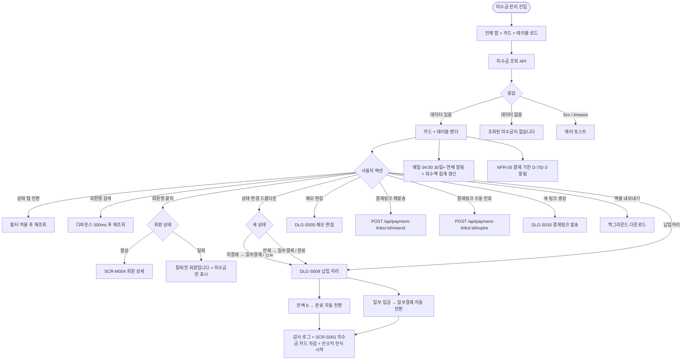

# SCR-S008 미수금 관리 페이지

## 1. 화면 메타 정보

이 문서는 미수금 관리 페이지에 대한 자기완결형 요구사항 정의서입니다. 다른 문서를 함께 보지 않아도 이 문서 한 장만으로 미수금 관리 페이지에 들어가는 모든 영역, 모든 버튼, 모든 모달, 모든 권한, 모든 예외 처리, 그리고 이 화면을 지탱하는 운영 정책까지 전부 이해하고 구현할 수 있도록 작성합니다.

| 항목 | 값 |
|---|---|
| 작성일 | 2026-05-22 |
| 버전 | v1.0 |
| 상태 | 최신 통합본 반영 (정합화 완료) |
| 도메인 | D03 매출관리 |
| 화면 ID | SCR-S008 |
| 화면명 | 미수금 관리 |
| 화면 유형 | 추적·후속 처리 화면 (Receivables) |
| 라우트 (URL) | `/unpaid` |
| 플랫폼 | 데스크톱(기본), 태블릿 |
| 우선순위 | P0 (출시 필수) |
| 기능코드 | PAY-03 (미수금 관리 / 추적 + 후속 처리) |
| 계약코드 | PAY-03 |
| 계약 상태 | 계약 범위 본기능 |
| 부모 기능 prefix | PAY |
| Lv1 코드 | PAY-03 |
| Lv2 / Lv3 세분화 | PAY-03-01 ~ PAY-03-08 (요약 지표 4종, 상태 탭 5종, 회원명 검색, 미수금 목록 12 컬럼, 상태 변경, 메모 편집, 결제링크 후속, 엑셀 내보내기) |
| 연계 화면 | SCR-S001 매출현황, SCR-S009 할부결제관리, SCR-S012 결제취소-부분환불, SCR-S016 결제링크, SCR-M004 회원상세, SCR-097 감사로그 |
| 호출 다이얼로그 | DLG-S005 메모편집, DLG-S008 납입처리 |

## 2. 화면 개요와 목적

미수금 관리 페이지는 회원이 결제를 완료하지 못한 미수금을 추적하고 관리하는 화면입니다. 미결제·일부결제·연체·완료 상태를 탭으로 구분해 현황을 파악하고, 납입이 이루어지면 상태를 직접 변경합니다. 계약금 잔액, 결제링크 미결제, 수기 분할, 정기 할부 미납을 한 원장으로 묶어 관리하며, 연체 30일 이상 건을 별도로 집계해 독촉이 필요한 회원을 빠르게 파악할 수 있습니다.

운영 맥락은 다양합니다. 카운터 매니저는 매일 출근 후 연체 탭을 확인하고 회원에게 연락한 뒤 DLG-S008 납입처리로 회수합니다. FC는 본인 담당 회원의 미수금을 회원명 검색으로 추적해 발생 유형에 따라 직접 결제 권유 또는 링크 재발송을 진행합니다. Owner(지점장)은 월말 미수 점검 시 30일 이상 연체 건을 운영팀에 회수 위임하고, 본사 슈퍼관리자는 통합 모드에서 지점별 회수율을 모니터링합니다.

미수금 최초 생성은 이 화면에서 직접 하지 않습니다. PAY-01 결제 처리(계약금 등록·잔액 발생), PAY-06 결제링크(미결제), SAL-EXT-01 할부 관리(회차 미납) 이벤트에서 자동 등록되며, 본 화면은 납입처리·상태 변경·메모 관리·결제링크 후속 액션을 수행합니다. "수기 분할"은 PAY-01 계약금 등록 시 잔액을 정기 할부 계획 없이 운영자가 직접 회수하기로 선택한 단일 미수 건이며, 회차 정보 없이 메모에 기록합니다.

연체 30일 이상 건은 별도 집계 카드와 빨강 강조로 즉시 식별됩니다. NFR-05 만료 알림 배치가 결제 기한 D-7/D-3에 회원·운영자 알림을 발송하며, 매일 04:00 크론이 30일 이상 연체를 운영자에게 일괄 알림합니다.

## 3. 진입 경로와 인접 화면

미수금 관리 페이지에 진입하는 경로는 다음과 같습니다.

첫 번째 경로는 사이드바입니다. 좌측 사이드바의 "매출관리" 메뉴 아래 "미수금 관리" 항목을 클릭하면 진입합니다. URL은 `/unpaid`이며, 상태 탭은 "전체"가 기본 활성화됩니다.

두 번째 경로는 매출 현황(SCR-S001)의 미수금 카드 또는 미납 탭 배지 클릭입니다. 미수금 카드를 누르면 미수금 관리로 이동하고, 미납 탭 빨강 배지를 누르면 같은 기간이 필터로 적용됩니다.

세 번째 경로는 결제 처리(SCR-S003) 계약금 등록 완료 후 "잔액 미수금 보기" 링크 또는 SAL-EXT-01 할부 관리(SCR-S009)에서 회차 미납 발생 시 "미수금 관리로 이동" 링크를 누를 때입니다.

네 번째 경로는 매일 04:00 30일+ 연체 알림 또는 NFR-05 D-7/D-3 알림에서 회원 또는 운영자가 알림을 클릭할 때입니다.

이 화면에서 빠져나가는 인접 화면으로는, 회원명 클릭으로 진입하는 회원 상세(SCR-M004), 잔액 결제 진입 시 SCR-S003 결제 처리, 할부 회차 미납 상세는 SCR-S009 할부 관리, 결제링크 후속은 SCR-S016, 환불 진입은 SCR-S012, 그리고 모든 상태 변경·납입처리·메모 편집이 기록되는 감사 로그(SCR-097)가 있습니다.

## 4. 레이아웃과 UI 구성

미수금 관리 페이지는 위에서 아래로 차곡차곡 쌓이는 세로형 단일 컬럼 레이아웃을 기본으로 합니다.

가장 위에는 페이지 헤더가 있습니다. 헤더 좌측에는 "미수금 관리"라는 페이지 타이틀과 지점 컨텍스트 배지가 표시됩니다. 헤더 우측에는 "엑셀 내보내기" 버튼이 매니저+ 권한자에게 표시됩니다.

페이지 헤더 아래에는 요약 지표 카드 4개가 가로로 배치됩니다. 첫 번째 카드는 "미수금 총액"으로 현재 미수 합계를 표시합니다. 두 번째 카드는 "미수금 건수"로 미수 건의 수를 표시합니다. 세 번째 카드는 "연체(30일 이상) 건수"로 결제 기한이 30일 이상 경과한 미수 건수를 표시하며, 빨강 경고 강조 테두리가 적용됩니다. 네 번째 카드는 "이번 달 회수액"으로 매일 04:00 집계되어 이번 달 회수된 미수 합계를 표시합니다.

요약 카드 아래에는 상태 탭 5개가 있습니다. 전체 / 미결제 / 일부결제 / 연체 / 완료로 펼쳐지며, 각 탭에 해당 건수 배지가 표시됩니다. 연체 탭의 배지는 빨강 강조이며, 완료 탭은 회색 톤으로 표시됩니다.

상태 탭 아래에는 회원명 검색 입력창이 있습니다. 디바운스 300ms가 적용되어 실시간으로 미수금 목록이 좁혀집니다.

검색 입력 아래에는 미수금 목록 테이블이 있습니다. 컬럼은 좌측부터 No / 회원명 / 상품명 / 발생 유형 / 원결제ID / 미수금액 / 결제 기한 / 상태 / 링크 상태 / 메모 / 등록일 / 액션 순서입니다.

미수금액은 빨강 강조로 표시되고, 결제 기한 컬럼은 연체된 건의 날짜가 빨강 굵은 글씨로 표시됩니다. 상태 배지는 완료(초록)·연체(빨강)·일부결제(노랑)·미결제(기본) 색상으로 즉시 구분됩니다. 발생 유형은 "계약금 잔액", "결제링크 미결제", "수기 분할", "정기 할부 미납" 중 하나를 작은 라벨로 표시합니다. 링크 상태 컬럼은 결제링크 미결제 건의 링크 상태(SENT/OPENED/EXPIRED/CANCELED)를 배지로 표시합니다.

액션 컬럼에는 상태 변경 드롭다운, 메모 편집 버튼, 결제링크 후속 액션 버튼(재발송/만료/새 링크)이 표시됩니다. 상태 변경 드롭다운은 현재 상태에 따라 전환 가능한 다음 상태만 노출됩니다. 메모 편집 버튼을 누르면 DLG-S005 메모 편집 모달이 열리고, 납입 처리는 액션 컬럼의 [납입처리] 버튼으로 DLG-S008 납입 처리 모달이 호출됩니다.

본사 통합 모드에서는 테이블에 "지점" 컬럼이 추가됩니다.

테이블 우측 상단에는 정렬 옵션 드롭다운이 있어 결제 기한 가까운 순/연체 일수 큰 순/미수금액 큰 순/등록일 최신 순 중 선택할 수 있습니다. 페이지 가장 아래에는 페이지네이션이 배치됩니다.

페이지 헤더 영역에는 "미수금 신규 생성은 결제 처리에서 자동 등록됩니다"라는 안내 텍스트가 작게 표시되어, 운영자가 이 화면에서 미수금을 직접 생성하지 않음을 인지할 수 있도록 합니다.

## 5. 탭 구성과 탭별 동작

이 화면은 상태 탭 5개를 가집니다. 전체 / 미결제 / 일부결제 / 연체 / 완료로 펼쳐집니다.

전체 탭은 모든 상태의 미수금을 표시합니다. 미결제 탭은 결제가 한 번도 이루어지지 않은 건, 일부결제 탭은 일부만 입금된 건, 연체 탭은 결제 기한이 30일 이상 경과한 건, 완료 탭은 회수가 완료된 건을 표시합니다.

탭 전환 시 다른 필터(검색·정렬)는 유지됩니다. 연체 탭은 30일 이상 경과한 건만 표시하며, 결제 기한 가까운 순 정렬이 기본 적용됩니다.

각 탭의 우측에는 건수 배지가 표시되어, 운영자가 한눈에 상태별 분포를 파악할 수 있습니다.

## 6. 버튼·아이콘·링크 액션 전체 정의

이 화면에 등장하는 모든 클릭 가능한 요소를 빠짐없이 정의합니다.

요약 지표 카드 4개는 클릭 가능합니다. 미수금 총액 카드는 전체 탭으로, 미수금 건수 카드는 전체 탭으로, 연체 카드는 연체 탭으로, 이번 달 회수액 카드는 완료 탭(이번 달 회수만 필터)으로 자동 라우팅됩니다.

상태 탭 5개는 누르면 즉시 데이터 fetch와 함께 표시됩니다.

회원명 검색은 디바운스 300ms 후 자동 검색됩니다. 최소 2자 이상 입력 시 시작됩니다.

테이블의 회원명 클릭은 회원 상세(SCR-M004)로 이동시킵니다. 다만 탈퇴 회원은 "탈퇴한 회원입니다" 안내와 함께 회원 카드 진입이 차단되고 미수금 정보만 표시됩니다. 상품명 클릭은 상품 상세(SCR-P003)로 이동시킵니다. 원결제ID 옆 작은 링크 아이콘은 매출 현황의 DLG-S001 매출 상세를 엽니다.

액션 컬럼의 상태 변경 드롭다운은 현재 상태에 따라 전환 가능한 옵션만 표시됩니다. 미결제 → 일부결제·완료 / 일부결제 → 완료 / 연체 → 일부결제·완료 / 완료 → 변경 불가입니다. 옵션 선택 시 즉시 상태가 변경되고 감사 로그가 기록되며, 완료 또는 일부결제로 변경 시 자동으로 DLG-S008 납입 처리 모달이 호출됩니다.

[메모] 버튼은 DLG-S005 메모 편집 모달을 엽니다. 메모를 입력·저장하면 즉시 반영되고 변경 이력이 감사 로그에 기록됩니다.

[납입처리] 버튼은 DLG-S008 납입 처리 모달을 엽니다. 입금일·입금액·결제수단을 입력하고 처리 확인 시 상태가 자동 갱신됩니다.

결제링크 후속 액션은 발생 유형이 "결제링크 미결제"인 건에만 표시됩니다. 활성 링크(SENT/OPENED) 행에는 [재발송] 버튼이, 만료(EXPIRED) 또는 취소(CANCELED) 행에는 [새 링크 생성] 버튼이 표시됩니다. 활성 링크에 [수동 만료] 버튼도 함께 표시되어 강제 만료가 가능합니다. 새 링크 생성은 DLG-S016 결제링크 발송 모달을 호출합니다.

페이지 헤더의 [엑셀 내보내기] 버튼은 현재 탭·검색이 적용된 미수금 목록을 엑셀로 다운로드합니다. 30,000건 초과 시 백그라운드 다운로드로 분기됩니다.

테이블 우측 상단의 정렬 옵션 드롭다운은 즉시 재정렬을 수행합니다.

페이지네이션의 페이지당 건수(20·50·100), 페이지 번호 이동은 일반적인 동작입니다.

모든 버튼은 클릭 후 응답이 돌아오기 전까지 자동으로 비활성화됩니다.

## 7. 호출되는 모달 동작

이 화면에서 호출되는 모달은 두 가지입니다.

### 7-1. DLG-S005 메모 편집 모달

메모 편집 모달은 특정 미수금 건에 관리자 메모를 추가하거나 수정하는 모달입니다. 미수금 행의 [메모] 버튼을 누르면 열립니다.

모달에는 대상 미수금 정보(회원명·상품·금액·기한)가 읽기 전용으로 표시되고, 자유 형식 텍스트 입력창이 있습니다. 입력창에는 글자 수 표시(현재/최대)가 함께 표시됩니다. [저장] 버튼은 메모를 즉시 저장하고 부모 화면에 반영하며, 변경 이력은 SCR-097 감사 로그에 기록됩니다. [취소] 버튼은 변경 없이 모달을 닫습니다.

메모는 30자 단위로 자동 줄바꿈되며, 전체 보기 옵션이 제공됩니다. 메모 변경 이력은 감사 로그에서 추적 가능합니다.

### 7-2. DLG-S008 납입 처리 모달

납입 처리 모달은 미수금 건에 대해 납입 처리를 확인하고 완료하는 모달입니다. 미수금 행의 [납입처리] 버튼을 누르거나 상태 변경 드롭다운에서 일부결제·완료를 선택했을 때 열립니다.

모달에는 납입 대상 정보(회원·상품·해당 회차)가 표시되고, 납입 금액(이번 회차 예정 금액), 실수령 금액 입력(기본값: 납입 예정 금액), 수령 일시(기본값: 현재 시각), 결제 수단 선택(카드·현금·계좌이체)을 입력합니다. [처리 확인] 버튼은 납입을 완료하고 상태를 자동 갱신하며, 잔액이 0이 되면 상태가 "완료"로, 잔액이 남으면 "일부결제"로 변경됩니다. SAL-EXT-01 할부 회차 미납 건의 경우 양쪽이 자동 동기화됩니다.

[취소] 버튼은 처리 없이 모달을 닫습니다. 입금액이 미수금을 초과하면 "입금액이 미수금을 초과합니다" 인라인 에러와 정정 안내가 표시됩니다. 입금액 0원이면 처리가 차단됩니다.

처리 완료 후 모달이 닫히고 부모 화면(미수금 관리 목록 또는 할부 상세)으로 돌아가며 납입 상태가 갱신됩니다. SCR-S001 매출 현황의 미수금 카드도 5초 이내 자동 차감됩니다.

## 8. 토스트와 확인 팝업과 알럿

미수금 관리 페이지에서 발생하는 모든 알림성 UI는 다음과 같은 패턴으로 동작합니다.

성공 토스트는 우측 상단에 녹색 계열로 5초 동안 표시되며, "납입처리가 완료되었어요", "메모를 저장했어요", "결제링크를 재발송했어요" 같은 짧은 문구로 결과를 알려줍니다.

실패 토스트는 우측 상단에 빨강 계열로 표시되며, "납입처리에 실패했어요", "권한이 없어요", "입금액이 미수금을 초과합니다", "활성 링크가 이미 있습니다" 같은 문구와 함께 보조 액션이 따라옵니다.

연체 30일+ 알림은 매일 04:00 크론으로 운영자에게 NFR-19 알림 센터로 일괄 발송됩니다. "30일 이상 연체 N건"이라는 안내와 함께 미수금 관리로 이동하는 버튼이 제공됩니다.

만료 D-7/D-3 알림은 NFR-05 만료 알림 배치로 회원과 운영자에게 발송됩니다. "결제 기한이 N일 남았습니다" 안내와 함께 결제 진입 또는 미수금 확인 안내가 함께 발송됩니다.

반복 미수 회원 알림은 동일 회원이 3회 이상 미수 발생 시 회원명 옆에 "주의" 라벨이 표시되고 운영자에게 NFR-19 알림이 발송됩니다.

회수액 집계 배치 실패 알림은 매일 04:00 회수액 일별 집계가 실패하면 카드에 "집계 중" 표시가 노출되고 04:00 재시도가 안내됩니다.

할부 미납 자동 동기화 실패 알림은 SAL-EXT-01 할부 회차 미납이 PAY-03에 자동 동기화되지 않으면 "동기화 오류" 토스트가 표시되고 자동 재시도가 일어납니다.

권한 알럿은 트레이너·스태프가 상태 변경·납입처리 등 처리 액션 시도 시 차단되고 조회만 가능함을 안내합니다.

## 9. 데이터 흐름과 외부 연동

이 화면은 여러 데이터 소스와 외부 연동에 의존합니다.

화면 진입 시점에는 미수금 목록 조회 API(`GET /api/unpaid`)가 호출됩니다. 요청에는 현재 활성 탭, 회원명 검색, 정렬 옵션, 페이지 번호, 페이지당 건수, 지점(통합 모드)이 쿼리 파라미터로 들어갑니다. 응답으로는 미수금 배열, 4개 요약 카드 합계, 페이지 정보가 함께 내려옵니다.

미수금 최초 생성은 본 화면에서 직접 수행하지 않습니다. PAY-01 결제 처리에서 계약금 등록 + 잔액 발생 + 수기 분할 선택 시 자동 INSERT되고, PAY-06 결제링크 미결제 시점에 자동 INSERT되며, SAL-EXT-01 할부 회차 미납 시 자동 INSERT됩니다.

상태 변경은 `PUT /api/unpaid/:id/status`로 처리됩니다. 현재 상태에 따라 전환 가능한 옵션만 백엔드에서 검증됩니다.

납입 처리는 `POST /api/unpaid/:id/payment`로 처리됩니다. 입금일·입금액·결제수단이 함께 전송되며, 잔액 0 도달 시 자동 "완료" 전환됩니다. row-level lock으로 동시 납입처리 충돌이 직렬화됩니다.

결제링크 재발송은 `POST /api/payment-links/:id/resend`로, 강제 만료는 `POST /api/payment-links/:id/expire`로 처리됩니다. 새 링크 생성은 DLG-S016에서 처리됩니다.

엑셀 내보내기는 `GET /api/unpaid/export`로 처리되며 30,000건 초과 시 백그라운드 다운로드로 분기됩니다.

SAL-EXT-01 할부 회차 미납은 미수금에 자동 INSERT되며, 한쪽 회수 시 양쪽이 자동 갱신됩니다. 미납 자동 감지 크론(매일 00:01)이 예정일+1일 경과 회차를 "미납"으로 자동 갱신하고 PAY-03 미수금에 자동 등록합니다.

NFR-05 만료 알림 배치는 결제 기한 D-7/D-3에 회원과 운영자에게 알림을 발송합니다. 30일+ 연체 일별 알림은 매일 04:00 크론으로 운영자에게 일괄 알림합니다. 회수액 일별 집계 배치는 매일 04:00에 이번 달 회수액 카드를 갱신합니다.

PAY-06 결제링크 webhook은 회원 자가 결제 완료 시 미수금을 자동 차감하고 상태를 "완료"로 자동 갱신합니다. SCR-S001 매출 현황의 미수금 카드도 5초 이내 자동 갱신됩니다.

회원 연락처 변경 이벤트는 회원 카드 수정 시 미발송 링크를 새 연락처로 자동 갱신합니다. 발송된 링크는 별도 재발송이 필요합니다.

SAL-04 선수익금은 회수 완료(회원권/PT) 시 선수익 인식을 시작합니다.

미수금 데이터 보관은 5년이며, 5년 경과 후 PII 마스킹 배치가 회원명·연락처를 익명화합니다.

감사 로그는 상태 변경·납입처리·메모 편집을 모두 SCR-097에 비동기로 기록합니다. 기록 필드는 `actor_id`, `unpaid_id`, `status`, `amount`, `timestamp`입니다.

화면에서 호출하는 주요 API 엔드포인트는 다음과 같습니다. 미수금 조회 `GET /api/unpaid`, 상태 변경 `PUT /api/unpaid/:id/status`, 납입처리 `POST /api/unpaid/:id/payment`, 결제링크 재발송 `POST /api/payment-links/:id/resend`, 결제링크 만료 `POST /api/payment-links/:id/expire`, 엑셀 내보내기 `GET /api/unpaid/export`.

## 10. 화면 상태와 예외 처리

미수금 관리 페이지는 다음 상태들을 가질 수 있습니다.

로딩 중 상태에서는 카드와 테이블 영역에 스켈레톤이 표시됩니다.

정상 표시 상태는 미수금 데이터가 있을 때 카드와 테이블이 함께 표시되는 일반적인 상태입니다.

데이터 없음 상태는 "조회된 미수금이 없습니다" 안내와 탭/조건 변경 안내가 표시됩니다.

연체 강조 상태에서는 연체 카드가 빨강 테두리로 강조되고, 30일+ 연체 행의 결제 기한이 빨강 굵은 글씨로 표시됩니다.

처리 중 상태는 납입처리 또는 상태 변경 처리 중으로, 액션 버튼이 로딩 표시됩니다.

권한 미달 상태에서는 액션 버튼(상태 변경·메모 편집·결제링크 후속·엑셀)이 hidden 처리됩니다.

오류 상태는 서버 5xx 또는 네트워크 타임아웃 시 토스트와 재시도 버튼이 표시되는 상태입니다.

예외 케이스별 처리는 다음과 같이 정의됩니다. 데이터 없음 시 "조회된 미수금이 없습니다" 안내, 입금액 > 미수금 시 "입금액이 미수금을 초과합니다" 정정 안내, 입금액 0원 시 "입금액을 입력해주세요" 정정 안내, 활성 링크 있는데 새 링크 시도 시 "기존 링크 만료 필요" 모달 + 만료 후 생성 또는 취소, 만료된 링크 재발송 시도 시 "만료된 링크입니다" + 새 링크 생성 안내, 권한 부족 시 액션 버튼 hidden, 동시 납입처리 충돌 시 "잠시 후 다시 시도해주세요" 자동 재시도, 회원 탈퇴 시 회원 카드 진입은 "탈퇴한 회원입니다" 안내 + 미수금만 표시, 30일+ 연체 알림 운영자 일괄, 만료 D-7/D-3 알림 발송 실패 시 운영자 재시도 알림, 본사 통합 모드 권한 미달 시 토글 hidden, 엑셀 다운로드 한도 초과 시 백그라운드 다운로드, 반복 미수 회원 3회+ 시 "주의" 라벨 + 운영자 알림, 결제 기한 연장 권한 부족 시 연장 버튼 hidden + Owner(지점장) 요청 안내, 미결제 링크 환불 시도 시 "환불 아닌 링크 취소" + SCR-S016 안내, 회원 연락처 무효 시 "연락처 확인 필요" 토스트 + 회원 정보 수정 안내, 수기 분할 회차 메모 누락 시 회차 미상 표시 + 메모 입력 권장, SAL-EXT-01 할부 동기화 실패 시 "동기화 오류" 토스트 + 자동 재시도, 회수액 집계 배치 실패 시 카드 "집계 중" 표시 + 04:00 재시도, 메모 30자 초과 시 자동 줄바꿈 + 전체 보기 등이 있습니다.

## 11. 권한별 처리

슈퍼관리자(superAdmin)와 본사 최고관리자(primary)는 상태 변경, 메모 편집, 결제링크 후속(재발송/만료/새 링크), 엑셀 내보내기, 본사 통합 모드, 결제 기한 연장까지 모두 가능합니다.

Owner(지점장)과 매니저(manager)는 자기 지점의 상태 변경, 메모 편집, 결제링크 후속, 엑셀 내보내기가 가능합니다. 본사 통합 모드는 표시되지 않으며, 결제 기한 연장은 Owner(지점장) 이상만 가능합니다.

FC(피트니스 코치, fc)는 담당 회원의 상태 변경, 메모 편집, 결제링크 후속이 가능합니다. 엑셀 내보내기, 결제 기한 연장은 차단됩니다. 회원 검색은 RLS로 본인 담당 회원만 결과에 포함됩니다.

트레이너(trainer)와 스태프(staff)는 조회만 가능하며 상태 변경·메모 편집·결제링크 후속이 차단됩니다.

읽기 전용(readonly)은 화면 자체에 접근할 수 없습니다.

권한 차단 시 버튼 hidden 또는 비활성, 403 응답 시 "권한이 없어요" 토스트, 모든 권한 차단 이벤트는 감사 로그에 기록됩니다.

## 12. 메인 흐름



## 13. 에러와 예외 흐름

```mermaid
flowchart TD
    A([액션 트리거]) --> B{서버 응답 / 상태}
    B -->|5xx / timeout| C[자동 재시도 1회]
    C --> D{재시도 성공?}
    D -->|성공| E[정상 흐름 복귀]
    D -->|실패| F[다시 시도 버튼]
    B -->|입금액 > 미수금| G["입금액이 미수금을 초과합니다" + 정정]
    B -->|입금액 0원| H["입금액을 입력해주세요"]
    B -->|활성 링크 + 새 링크 시도| I["기존 링크 만료 필요" + 만료 후 생성 / 취소]
    B -->|만료된 링크 재발송| J["만료된 링크입니다" + 새 링크 생성]
    B -->|권한 부족| K[액션 버튼 hidden]
    B -->|동시 납입처리 충돌| L["잠시 후 다시 시도" + 자동 재시도]
    B -->|회원 탈퇴 진입 시| M["탈퇴한 회원입니다" + 미수금만]
    B -->|30일+ 연체 (매일 04:00)| N[운영자 NFR-19 일괄 알림]
    B -->|만료 D-7/D-3 알림 실패| O[운영자 재시도 알림 + 재발송]
    B -->|통합 모드 권한 미달| P[통합 토글 hidden]
    B -->|엑셀 30,000건 초과| Q[백그라운드 다운로드 + 완료 알림]
    B -->|반복 미수 3회+| R["주의" 라벨 + 운영자 알림]
    B -->|결제 기한 연장 권한 부족| S[연장 버튼 hidden + Owner(지점장) 요청]
    B -->|미결제 링크 환불 시도| T["환불 아닌 링크 취소" + SCR-S016]
    B -->|회원 연락처 무효| U["연락처 확인 필요" + 회원 정보 수정]
    B -->|수기 분할 회차 메모 누락| V[회차 미상 표시 + 메모 입력 권장]
    B -->|SAL-EXT-01 동기화 실패| W["동기화 오류" + 자동 재시도]
    B -->|회수액 집계 배치 실패| X[카드 "집계 중" + 04:00 재시도]
    B -->|메모 30자 초과| Y[자동 줄바꿈 + 전체 보기]
```

## 14. 핵심 디자인 요청사항

이 화면의 핵심은 연체 회원의 즉시 식별과 후속 액션의 직관적 배치입니다. 요약 지표 카드 4개에서 연체(30일 이상) 카드는 빨강 경고 테두리로 표시되어 다른 카드와 시각적으로 분리됩니다. 연체 건수가 1 이상이면 카드 우측에 펄스 애니메이션이 적용되어 운영자의 즉시 주목을 끕니다.

상태 탭의 연체 탭 배지는 빨강 강조이며, 건수가 많을수록 배지 크기가 살짝 커집니다. 일부결제 탭 배지는 노랑, 완료 탭 배지는 회색 톤으로 일관됩니다.

테이블에서 결제 기한 컬럼은 연체된 행에서 빨강 굵은 글씨로 표시되고, 경과 일수가 함께 표시됩니다(예: "2026-04-15 (37일 경과)"). 미수금액은 빨강 강조로 표시되어 매출 차감 규모를 즉시 인지할 수 있도록 합니다.

상태 배지는 완료(초록)·연체(빨강·펄스)·일부결제(노랑)·미결제(회색) 색상으로 구분되며, 발생 유형(계약금 잔액·결제링크 미결제·수기 분할·정기 할부 미납)은 작은 회색 라벨로 표시되어 시각적 혼동이 없도록 합니다.

링크 상태 컬럼(SENT/OPENED/EXPIRED/CANCELED)은 결제링크 미결제 발생 유형 행에만 표시되며, 활성 링크(SENT/OPENED)는 파랑 톤, 만료(EXPIRED)는 회색, 취소(CANCELED)는 빨강 톤으로 구분됩니다.

액션 컬럼의 [납입처리] 버튼은 강조 색상으로 표시되어 핵심 액션임을 알리며, 메모 버튼은 보조 색상으로 표시됩니다. 결제링크 후속 액션 버튼(재발송·만료·새 링크)은 발생 유형에 따라 조건부로 노출됩니다.

반복 미수 회원 "주의" 라벨은 회원명 옆에 빨강 작은 배지로 표시되며, 호버 시 미수 횟수와 마지막 미수 발생일이 툴팁으로 보입니다.

DLG-S008 납입 처리 모달은 입금 금액 입력이 가장 강조되도록 큰 입력 필드로 표시되며, 실수령 금액과 미수금 잔액이 함께 표시되어 운영자가 차액을 즉시 인지할 수 있습니다. 잔액 0이 되면 "완료 전환됩니다" 안내가 자동 노출됩니다.

DLG-S005 메모 편집 모달은 텍스트 입력창이 충분히 크고, 글자 수 표시가 우측 하단에 작게 배치됩니다.

페이지 헤더의 "미수금 신규 생성은 결제 처리에서 자동 등록됩니다" 안내는 작은 회색 텍스트로 표시되어 운영자가 이 화면의 책임 범위를 인지하도록 합니다.

진행 스피너와 로딩 스켈레톤은 매출관리 전체에서 동일한 톤으로 통일됩니다.

## 15. 운영 정책 (이 화면에 연결된 부분)

이 화면은 미수금 추적과 후속 처리의 운영 정책이 그대로 반영된 도구입니다.

발생 유형 4종 통합 관리 정책은 계약금 잔액 / 결제링크 미결제 / 수기 분할 / 정기 할부 미납을 한 원장으로 통합 관리합니다.

신규 생성 위치 정책은 PAY-03(SCR-S008)이 미수금 신규 등록 화면이 아니며, 최초 생성은 PAY-01 계약금 등록·잔액 발생, PAY-06 결제링크 미결제, SAL-EXT-01 할부 회차 미납 이벤트에서만 자동 등록됨을 명시합니다.

수기 분할 정의 정책은 `수기 분할`이 PAY-01에서 잔액을 정기 할부 계획 없이 직접 회수하기로 선택했을 때 생성되는 단일 미수 건임을 명시합니다. 회차는 별도 엔티티로 만들지 않고 메모에 기록합니다.

연체 정의 정책은 결제 기한이 30일 이상 경과한 미수금을 연체로 정의합니다. 별도 집계 카드와 경고 강조가 적용됩니다.

상태 전환 규칙 정책은 미결제 → 일부결제·완료 / 일부결제 → 완료 / 연체 → 일부결제·완료 / 완료 → 변경 불가로 명확히 정의됩니다.

납입처리 입금액 검증 정책은 입금액이 미수금 잔액 이내여야 하며, 초과 시 차단됩니다.

부분 입금 시 상태 정책은 미수금 일부 입금 시 "일부결제"로 자동 전환되고 잔액 미수금이 유지됩니다.

결제링크 활성 1개 제한 정책은 동일 원결제 기준 활성 링크가 1개만 유지되도록 보장합니다.

만료 D-7/D-3 자동 알림 정책은 NFR-05 만료 알림 배치를 통해 결제 기한 7일/3일 전 회원과 운영자에게 알림을 발송합니다.

30일+ 연체 일별 알림 정책은 매일 04:00 크론으로 운영자에게 30일 이상 연체 건을 일괄 알림합니다.

할부 미납 동기화 정책은 SAL-EXT-01 할부 회차 미납 시 PAY-03에 자동 INSERT하고, 한쪽 회수 시 양쪽이 자동 갱신되도록 보장합니다.

메모 변경 이력 정책은 메모 변경 이력을 감사 로그(SCR-097)에 기록합니다.

권한별 가시성 정책은 매니저+ 모든 액션 가능, FC는 담당 회원만 RLS 조회 및 처리, 트레이너·스태프는 조회만, readonly는 접근 차단입니다.

본사 통합 모드 정책은 본사 슈퍼관리자만 전 지점 통합 조회가 가능합니다.

회원 탈퇴 후 미수 정책은 탈퇴 회원도 미수금이 유지되어 회수 추진 가능하며, 회원 카드 진입만 차단됩니다.

납입처리 동시성 락 정책은 동일 미수 건에 대한 동시 납입처리를 row-level lock으로 직렬화합니다.

회수액 카드 갱신 정책은 이번 달 회수액이 매일 04:00 집계되며, 실시간 회수 시 즉시 추가됩니다.

결제링크 재발송 유효성 정책은 활성 링크(SENT/OPENED) 재발송이 만료일시 갱신 없이 동일 링크 재전송을 수행합니다.

새 링크 생성 시 기존 만료 정책은 새 링크 생성 시 기존 활성 링크를 자동 만료시켜 동시 활성 1개를 보장합니다.

엑셀 다운로드 정책은 현재 탭/검색 조건 기준 전체 데이터, 30,000건 초과 시 비동기 백그라운드 다운로드입니다.

감사 로그 정책은 상태 변경·납입처리·메모 편집을 모두 SCR-097에 비동기로 기록합니다. 기록 필드는 `actor_id`, `unpaid_id`, `status`, `amount`, `timestamp`입니다.

반복 미수 회원 알림 정책은 동일 회원 3회 이상 미수 발생 시 운영자에게 알림이 발송됩니다.

수기 분할 회차 입력 정책은 수기 분할이 회차 정보 없이 단일 미수 건으로 관리되며 메모에 회차를 기록합니다.

회원 연락처 변경 시 링크 재발송 정책은 회원 연락처 변경 후 미발송 링크가 새 연락처로 자동 갱신됨을 보장합니다.

결제 기한 변경 정책은 결제 기한 연장이 운영자(Owner(지점장)+) 권한이며, 변경 이력이 감사 로그에 기록됩니다.

미수금 데이터 보관은 5년이며, 5년 경과 후 PII 마스킹 배치가 회원명·연락처를 익명화합니다.

이상의 모든 정책은 이 화면을 구현하고 운영하는 사람이 별도 문서 없이 이 한 장만 보면 이해할 수 있도록 풀어 적었습니다. 정책이 바뀌면 이 문서가 함께 갱신되어야 하며, 코드 변경과 정책 변경은 항상 짝지어 진행됩니다.
