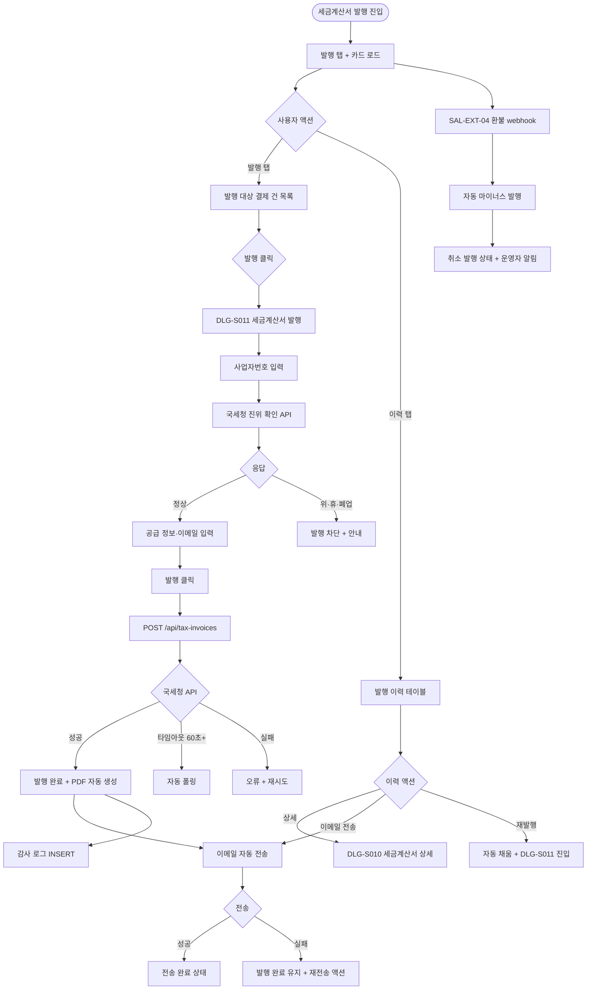

# SCR-S010 세금계산서 발행 페이지

## 1. 화면 메타 정보

이 문서는 세금계산서 발행 페이지에 대한 자기완결형 요구사항 정의서입니다. 다른 문서를 함께 보지 않아도 이 문서 한 장만으로 세금계산서 발행 페이지에 들어가는 모든 영역, 모든 버튼, 모든 모달, 모든 권한, 모든 예외 처리, 그리고 이 화면을 지탱하는 운영 정책까지 전부 이해하고 구현할 수 있도록 작성합니다.

| 항목 | 값 |
|---|---|
| 작성일 | 2026-05-22 |
| 버전 | v1.0 |
| 상태 | 최신 통합본 반영 (정합화 완료) |
| 도메인 | D03 매출관리 |
| 화면 ID | SCR-S010 |
| 화면명 | 세금계산서 발행 |
| 화면 유형 | 회계 컴플라이언스 화면 (Tax Invoice) |
| 라우트 (URL) | `/sales/invoice` |
| 플랫폼 | 데스크톱(기본), 태블릿 |
| 우선순위 | P0 (출시 필수) |
| 기능코드 | SAL-EXT-02 (세금계산서 발행 / 법인·사업자 회원 대상) |
| 계약코드 | SAL-EXT-02 |
| 계약 상태 | 계약 범위 본기능 (퍼블리싱 완료 / 데이터 미연동) |
| 부모 기능 prefix | SAL |
| Lv1 코드 | SAL-EXT-02 |
| Lv2 / Lv3 세분화 | SAL-EXT-02-01 ~ SAL-EXT-02-08 (요약 지표 카드, 발행/이력 탭, 발행 대상 조회, 발행 폼, 발행 처리, 발행 이력, 이메일 전송, 엑셀 다운로드) |
| 연계 화면 | SCR-S001 매출현황, SCR-S003 결제처리, SCR-S007 환불관리, SCR-M004 회원상세, SCR-097 감사로그 |
| 호출 다이얼로그 | DLG-S010 세금계산서상세, DLG-S011 세금계산서발행 |

## 2. 화면 개요와 목적

세금계산서 발행 페이지는 법인 회원 또는 사업자 회원에게 세금계산서를 발행하고, 발행 이력을 조회·관리하는 회계 컴플라이언스 화면입니다. 세금계산서 발행이 필요한 결제 건을 선택해 공급받는 자 정보·품목 내역을 확정한 뒤 발행 처리하고, 발행된 세금계산서의 상태(발행 완료·전송 완료·오류)를 추적합니다. 회계 마감과 세무 신고에 필요한 발행 이력을 한 곳에서 관리할 수 있습니다.

운영 맥락은 다양합니다. 회계 담당자는 월말 일괄 발행 시 발행 탭의 미발행 결제 건을 일괄 발행 후 이메일 자동 전송을 진행하고, 본사 슈퍼관리자는 통합 모드에서 지점별 발행 이력을 점검합니다. 세무 담당자는 이력 탭의 분기별 발행 합계로 부가세 신고 자료를 작성하고, 법인 영업 담당자는 B2B 결제 직후 발행 → 즉시 이메일 전송을 진행합니다. 사업자번호 입력 시 국세청 API로 위·휴·폐업 진위 확인이 자동 수행됩니다.

발행 후 수정은 불가하며, 잘못 발행한 건은 마이너스 세금계산서로 취소 발행합니다. SAL-EXT-04 환불 webhook 도착 시 자동 마이너스 세금계산서가 발행되며, 발행 이력은 국세 기본법에 따라 5년간 보관됩니다.

## 3. 진입 경로와 인접 화면

세금계산서 발행 페이지에 진입하는 경로는 다음과 같습니다.

첫 번째 경로는 사이드바입니다. 좌측 사이드바의 "매출관리" 메뉴 아래 "세금계산서 발행" 항목을 클릭하면 진입합니다. URL은 `/sales/invoice`이며, 발행 탭이 기본 활성화됩니다.

두 번째 경로는 결제 처리(SCR-S003) 법인 회원 결제 완료 후 "세금계산서 발행" 알림에서 진입하거나, DLG-S001 매출 상세에서 "세금계산서 발행" 버튼을 누를 때입니다.

세 번째 경로는 환불 관리(SCR-S007)에서 법인 환불 발생 시 "마이너스 세금계산서 발행 필요" 알림을 누를 때입니다.

네 번째 경로는 CFO 월별 보고서 알림 또는 회계 마감 자동 알림을 누를 때입니다.

이 화면에서 빠져나가는 인접 화면으로는, 매출 현황(SCR-S001), 결제 처리(SCR-S003), 환불 관리(SCR-S007), 회원 상세(SCR-M004), 그리고 모든 발행·재발행·이메일 전송·마이너스 발행이 기록되는 감사 로그(SCR-097)가 있습니다.

## 4. 레이아웃과 UI 구성

세금계산서 발행 페이지는 위에서 아래로 차곡차곡 쌓이는 세로형 단일 컬럼 레이아웃을 기본으로 합니다.

가장 위에는 페이지 헤더가 있습니다. 헤더 좌측에는 "세금계산서 발행"이라는 페이지 타이틀과 지점 컨텍스트 배지가 표시됩니다. 헤더 우측에는 [엑셀 내보내기] 버튼이 매니저+ 권한자에게 표시됩니다.

페이지 헤더 아래에는 요약 지표 카드 3개가 가로로 배치됩니다. 첫 번째 카드는 "이번 달 발행 건수"로 status=issued 카운트를 표시합니다. 두 번째 카드는 "이번 달 발행 총액"으로 합계금액 합산을 표시합니다. 세 번째 카드는 "미발행 대기 건수"로 발행 가능한 미발행 결제 건수를 표시하며, 빨강 강조 배지가 적용됩니다.

요약 카드 아래에는 발행 탭과 이력 탭의 2개 탭이 있습니다. 발행 탭은 세금계산서 발행이 필요한 결제 건을 조회·발행하는 영역이고, 이력 탭은 기발행 세금계산서 목록을 조회·관리하는 영역입니다.

발행 탭에는 발행 대상 조회 필터(기간 / 상태(미발행/발행 가능) / 사업자 회원만 토글)와 발행 대상 결제 건 목록이 표시됩니다. 각 행에는 [발행] 버튼이 있어 DLG-S011 세금계산서 발행 모달을 호출합니다.

이력 탭에는 발행 이력 테이블이 표시됩니다. 컬럼은 좌측부터 발행일 / 공급받는 자(상호 + 사업자번호) / 공급가액 / 부가세 / 합계 / 상태 배지 / 액션 순서입니다. 상태 배지는 발행 완료(초록) / 전송 완료(파랑) / 오류(빨강) / 취소 발행(주황) 색상으로 즉시 구분됩니다. 액션 컬럼에는 [상세] / [이메일 전송] / [재발행] 버튼이 표시됩니다.

[상세] 버튼은 DLG-S010 세금계산서 상세 모달을 호출하고, [이메일 전송] 버튼은 공급받는 자 이메일로 PDF 첨부 전송을 수행하며, [재발행] 버튼은 오류 건의 자동 채움 + 재발행 흐름을 시작합니다.

본사 통합 모드에서는 테이블에 "지점" 컬럼이 추가됩니다.

페이지 가장 아래에는 페이지네이션이 배치됩니다.

## 5. 탭 구성과 탭별 동작

이 화면은 발행 탭과 이력 탭의 2개 탭을 가집니다.

발행 탭은 세금계산서 발행이 필요한 결제 건을 조회하고 발행하는 영역입니다. 기간 필터로 결제일 기준 범위를 설정하고, 상태 필터(미발행 / 발행 가능)로 대상을 좁히며, 사업자 회원만 토글로 법인/사업자 회원의 결제만 표시할 수 있습니다.

이력 탭은 기발행 세금계산서 목록을 조회하는 영역입니다. 발행일·공급받는 자·공급가액·부가세·합계·상태가 한 행으로 표시되며, 상태별 필터로 발행 완료·전송 완료·오류·취소 발행을 구분할 수 있습니다.

탭 전환 시 다른 필터(기간·통합 모드)는 유지됩니다.

## 6. 버튼·아이콘·링크 액션 전체 정의

요약 지표 카드 3개는 클릭 가능합니다. 발행 건수 카드는 이력 탭(이번 달 발행 완료 필터), 발행 총액 카드도 이력 탭으로, 미발행 대기 카드는 발행 탭(미발행 필터)으로 자동 라우팅됩니다.

발행 탭과 이력 탭은 누르면 즉시 데이터 fetch와 탭 전환이 일어납니다.

발행 탭의 발행 대상 결제 건 목록 행에는 [발행] 버튼이 있어 DLG-S011 세금계산서 발행 모달을 호출합니다. 일괄 발행을 위해 체크박스로 다중 선택 후 [일괄 발행] 버튼을 누를 수도 있습니다.

이력 탭의 [상세] 버튼은 DLG-S010 세금계산서 상세 모달을 엽니다. [이메일 전송] 버튼은 공급받는 자 이메일로 PDF 첨부 전송을 수행하며, 전송 성공 시 상태가 "전송 완료"로 자동 갱신됩니다. [재발행] 버튼은 오류 건의 발행 폼 자동 채움 + 재발행 흐름을 시작하며, DLG-S011이 자동 채움 상태로 열립니다.

공급받는 자 상호를 클릭하면 회원 상세(SCR-M004)로 이동시킵니다(법인 회원 카드 진입).

페이지 헤더의 [엑셀 내보내기] 버튼은 발행 이력을 엑셀로 다운로드합니다. 파일명은 `yyyymm_지점_세금계산서이력.xlsx` 규칙이며, 30,000건 초과 시 백그라운드 다운로드로 분기됩니다.

모든 버튼은 클릭 후 응답이 돌아오기 전까지 자동으로 비활성화됩니다.

## 7. 호출되는 모달 동작

이 화면에서 호출되는 모달은 두 가지입니다.

### 7-1. DLG-S010 세금계산서 상세 모달

세금계산서 상세 모달은 발행된 세금계산서의 상세 내용을 조회하는 모달입니다. 이력 탭의 [상세] 버튼을 누르면 열립니다.

모달에는 세금계산서 번호, 발행 일시, 발행 상태(발행 완료/전송 완료/취소 등), 공급자 정보(자사 사업자번호·상호·대표자·주소), 공급받는 자 정보(거래처 사업자번호·상호·담당자·이메일), 공급 내역(상품명·수량·단가·공급가액), 공급가액 합계, 부가세액, 합계 금액이 표시됩니다.

모달 하단에는 [재발송] 버튼과 [닫기] 버튼이 있습니다. 재발송 버튼은 등록된 이메일로 세금계산서 PDF를 재전송하며, 닫기 버튼은 이력 탭으로 복귀합니다.

### 7-2. DLG-S011 세금계산서 발행 모달

세금계산서 발행 모달은 특정 매출 건에 대한 세금계산서를 발행하는 모달입니다. 발행 탭의 [발행] 버튼이나 매출 상세의 세금계산서 발행 버튼을 누르면 열립니다.

모달에는 원 매출 정보(읽기 전용: 매출 번호·결제일·금액), 공급받는 자 사업자번호 입력(10자리 자동 포맷 `xxx-xx-xxxxx` + 국세청 진위 확인), 공급받는 자 상호(필수), 대표자명, 업태·업종, 이메일 주소(RFC 5322 형식 검증), 발행 일자(기본값: 오늘), 공급가액(자동 계산), 부가세액(공급가액의 10% 자동), 합계(공급가액 + 부가세 자동)가 표시됩니다.

사업자번호 입력 시 국세청 진위 확인 API가 자동 호출됩니다. 위·휴·폐업 응답 시 발행이 차단되고 안내가 표시됩니다. 공급 품목은 결제 건의 상품 정보로 자동 채워지며, 면세 품목은 부가세 0원으로 처리됩니다.

[발행] 버튼은 입력 내용으로 세금계산서를 발행하고 이메일을 자동 전송합니다. 처리 중에는 버튼이 로딩 표시되고 60초 타임아웃이 적용됩니다. 발행 완료 후 DLG-S010 세금계산서 상세가 자동 표시되며, PDF가 자동 생성되어 이메일에 첨부됩니다.

[취소] 버튼은 발행을 중단하고 이전 화면으로 복귀합니다.

발행 후 수정은 불가하며, 잘못 발행한 건은 마이너스 발행으로만 취소 가능합니다.

## 8. 토스트와 확인 팝업과 알럿

성공 토스트는 우측 상단에 녹색 계열로 5초 동안 표시되며, "세금계산서가 발행되었어요", "이메일이 전송되었어요", "재발행이 완료되었어요" 같은 짧은 문구로 결과를 알려줍니다.

실패 토스트는 우측 상단에 빨강 계열로 표시되며, "발행에 실패했어요", "이메일 전송에 실패했어요", "사업자번호가 위/휴/폐업 사업자입니다", "발행 한도 초과" 같은 문구와 함께 보조 액션이 따라옵니다.

국세청 API 응답 지연 안내(60초 타임아웃)는 처리 중 표시와 함께 자동 폴링이 실행되며, 60초 초과 시 운영자에게 재시도 안내가 표시됩니다.

마이너스 세금계산서 자동 발행 안내는 SAL-EXT-04 환불 webhook 도착 시 자동 발행이 시작되며, 운영자에게 NFR-19 알림이 발송됩니다.

발행 한도 초과 안내(일별 1000건)는 국세청 API 처리량 제한에 도달하면 발행이 차단되고 다음 날 재시도가 안내됩니다.

webhook 보안 알림은 국세청 webhook 서명 검증 실패 시 webhook이 차단되고 보안 알림이 발송됩니다.

권한 알럿은 FC가 발행 시도 시 차단되고 매니저 요청이 안내됩니다.

## 9. 데이터 흐름과 외부 연동

화면 진입 시점에는 세금계산서 조회 API(`GET /api/tax-invoices`)가 호출됩니다. 응답으로는 발행 배열, 3개 요약 카드 합계, 페이지 정보가 함께 내려옵니다.

발행 처리는 `POST /api/tax-invoices`로 처리되며, 공급받는 자 정보·공급 품목·공급가액·부가세·합계가 함께 전송됩니다.

사업자번호 검증은 `POST /api/tax-invoices/verify-business-no`로 처리됩니다. 국세청 진위 확인 API가 호출되어 위/휴/폐업 응답을 받으며, 위·휴·폐업 시 발행이 차단됩니다.

이메일 재전송은 `POST /api/tax-invoices/:id/email`로 처리됩니다.

마이너스 발행(취소 발행)은 `POST /api/tax-invoices/:id/cancel`로 처리되며, SAL-EXT-04 환불 webhook 자동 트리거 시에도 동일 API가 호출됩니다.

국세청 webhook 콜백은 `POST /api/tax-invoices/webhook`으로 수신됩니다. HMAC 서명 검증과 idempotency-key로 위변조와 중복 처리를 차단합니다.

엑셀 내보내기는 `GET /api/tax-invoices/export`로 처리되며, 30,000건 초과 시 백그라운드 다운로드로 분기됩니다.

국세청 전자세금계산서 API는 발행 시 실시간 전송과 webhook 응답 처리를 수행합니다. 응답 지연(60초+) 시 처리 중 표시와 자동 폴링이 실행됩니다.

발행 한도는 일별 1000건이며, 한도 초과 시 발행이 차단되고 다음 날 재시도가 안내됩니다.

PAY-01 결제 webhook은 법인 회원 결제 완료 시 발행 가능 큐에 자동 INSERT합니다. SAL-EXT-04 환불 webhook은 환불 완료 시 자동 마이너스 발행을 트리거합니다.

PDF 자동 생성은 발행 완료 후 PDF 생성과 이메일 첨부를 자동으로 수행합니다.

발행 이력 보관은 5년이며(국세 기본법 준수), 5년 경과 후 PII 마스킹 배치(매월 1회)가 회원명·연락처를 익명화합니다. 단 사업자 정보(사업자번호·상호·대표자)는 보존됩니다.

CFO 월별 보고서는 매월 1일 06:00에 자동 생성되며 운영자가 다운로드할 수 있습니다.

다지점 RLS는 지점별 발행 이력을 격리하며, 본사 통합 모드만 전 지점에 접근 가능합니다.

감사 로그는 발행·재발행·이메일 전송·마이너스 발행을 모두 SCR-097에 비동기로 기록합니다. 기록 필드는 `actor_id`, `invoice_id`, `action`, `result`, `timestamp`입니다.

화면에서 호출하는 주요 API 엔드포인트는 다음과 같습니다. 세금계산서 조회 `GET /api/tax-invoices`, 발행 `POST /api/tax-invoices`, 이메일 재전송 `POST /api/tax-invoices/:id/email`, 마이너스 발행 `POST /api/tax-invoices/:id/cancel`, 사업자번호 검증 `POST /api/tax-invoices/verify-business-no`, 엑셀 내보내기 `GET /api/tax-invoices/export`, 국세청 webhook 콜백 `POST /api/tax-invoices/webhook`.

## 10. 화면 상태와 예외 처리

세금계산서 발행 페이지는 다음 상태들을 가질 수 있습니다.

로딩 중 상태에서는 카드와 테이블 영역에 스켈레톤이 표시됩니다.

발행 대기 상태는 발행 가능한 결제 건이 있을 때 발행 탭에 목록이 표시되는 상태입니다.

발행 완료 상태는 상태 배지가 "발행 완료" 초록으로 표시되는 상태입니다.

전송 완료 상태는 이메일 전송까지 완료된 건의 상태가 "전송 완료" 파랑으로 표시되는 상태입니다.

오류 상태는 발행 또는 전송 중 오류 발생 시 "오류" 빨강 배지와 오류 안내가 표시되는 상태입니다.

마이너스 발행 상태는 환불 webhook으로 자동 발행된 취소 건이 "취소 발행" 주황 배지로 표시되는 상태입니다.

데이터 없음 상태에서는 빈 상태 안내가 표시됩니다.

처리 중 상태는 발행 버튼 클릭 후 서버 처리 중으로, 버튼이 "처리 중..."으로 표시되고 60초 타임아웃이 적용됩니다.

국세청 API 응답 대기 상태에서는 처리 중 표시와 타임아웃 카운터가 표시됩니다.

국세청 진위 실패 상태(위/휴/폐업)에서는 발행이 차단되고 안내가 표시됩니다.

권한 미달 상태에서는 발행 버튼이 hidden 처리됩니다.

본사 통합 모드 상태에서는 테이블에 "지점" 컬럼이 추가됩니다.

예외 케이스별 처리는 다음과 같이 정의됩니다. 사업자번호 형식 오류(10자리 미만) 시 인라인 에러 + 재입력 안내, 사업자번호 위/휴/폐업 시 발행 차단 + 안내, 국세청 API 응답 지연(60초+) 시 처리 중 + 재시도 자동 폴링, 국세청 API 통신 장애 시 "처리 실패" 토스트 + 재시도, 이메일 형식 오류 시 인라인 에러 + 재입력, 발행 후 수정 시도 시 "발행 후 수정 불가" + 마이너스 발행 안내, 이메일 전송 실패 시 상태 "발행 완료" 유지 + 재전송 액션, 발행 한도 초과(일별 1000건+) 시 "한도 초과" + 다음 날 재시도, 본사 통합 모드 권한 미달 시 토글 hidden, 권한 부족(FC) 시 발행 버튼 hidden + 매니저 요청, 마이너스 발행 자동 실패 시 운영자 알림 + 수동 마이너스 발행, PDF 생성 실패 시 "PDF 생성 실패" 토스트 + 재시도, 엑셀 30,000건+ 시 백그라운드 다운로드, 5년 경과 데이터는 익명화 표시(사업자 보존), 재발행 자동 채움 실패 시 수동 입력 안내, 국세청 webhook 서명 실패 시 차단 + 보안 알림, webhook 중복 수신 시 idempotency 차단, 다지점 RLS 누수 시 보안 이벤트 즉시 차단, 면세 품목 부가세 0 시 "면세" 표시, 사업자 정보 누락 시 "사업자 정보 입력 필요" 안내 등이 있습니다.

## 11. 권한별 처리

superAdmin와 primary는 발행, 이메일 전송, 재발행, 엑셀 내보내기, 본사 통합 모드까지 모두 가능합니다.

Owner(지점장)은 자기 지점의 발행, 이메일 전송, 재발행, 엑셀 내보내기가 가능합니다.

매니저(manager)는 발행, 이메일, 엑셀 내보내기가 가능하며 재발행은 Owner(지점장) 이상 권한이 필요합니다.

FC(피트니스 코치, fc)는 담당 회원 결제 건의 이력 조회만 가능합니다. 발행·재발행·이메일 전송은 차단됩니다.

트레이너(trainer)와 스태프(staff)는 이력 조회만 가능합니다.

읽기 전용(readonly)은 화면 자체에 접근할 수 없습니다.

권한 차단 시 버튼 hidden 또는 비활성, 403 응답 시 "권한이 없어요" 토스트, 모든 권한 차단 이벤트는 감사 로그에 기록됩니다.

## 12. 메인 흐름



## 13. 에러와 예외 흐름

```mermaid
flowchart TD
    A([액션 트리거]) --> B{검증 / 응답}
    B -->|사업자번호 형식 오류| C[인라인 에러 + 재입력]
    B -->|위·휴·폐업| D[발행 차단 + 안내]
    B -->|국세청 API 응답 지연 60초+| E[처리 중 + 자동 폴링]
    B -->|국세청 API 통신 장애| F["처리 실패" + 재시도]
    B -->|이메일 형식 오류| G[인라인 에러 + 재입력]
    B -->|발행 후 수정 시도| H["발행 후 수정 불가" + 마이너스 발행 안내]
    B -->|이메일 전송 실패| I["발행 완료" 유지 + 재전송 액션]
    B -->|발행 한도 초과 (일별 1000건+)| J["한도 초과" + 다음 날 재시도]
    B -->|통합 모드 권한 미달| K[토글 hidden]
    B -->|권한 부족 (FC)| L[발행 버튼 hidden + 매니저 요청]
    B -->|마이너스 발행 자동 실패| M[운영자 알림 + 수동 마이너스 발행]
    B -->|PDF 생성 실패| N["PDF 생성 실패" + 재시도]
    B -->|엑셀 30,000건+| O[백그라운드 다운로드 + 완료 알림]
    B -->|5년 경과 데이터| P[익명화 표시 + 사업자 보존]
    B -->|재발행 자동 채움 실패| Q[수동 입력 안내]
    B -->|국세청 webhook 서명 실패| R[차단 + 보안 알림]
    B -->|webhook 중복 수신| S[idempotency 차단]
    B -->|다지점 RLS 누수| T[보안 이벤트 즉시 차단]
    B -->|면세 품목 부가세 0| U["면세" 표시]
    B -->|사업자 정보 누락| V["사업자 정보 입력 필요"]
```

## 14. 핵심 디자인 요청사항

요약 지표 카드 3개는 동일 크기 그리드로 배치되며, 미발행 대기 카드는 빨강 강조 배지로 발행이 필요한 건수를 즉시 알립니다.

발행 탭과 이력 탭은 카드형 토글로 분리되고, 활성 탭은 강조 색상으로 표시됩니다. 발행 탭에서는 미발행 결제 건이 카드형 리스트로 표시되어 운영자가 발행 대상을 빠르게 식별할 수 있습니다.

이력 탭의 테이블에서 상태 배지는 발행 완료(초록)·전송 완료(파랑)·오류(빨강)·취소 발행(주황) 네 가지 색상으로 즉시 구분됩니다. 오류 상태는 행 옆에 [재발행] 강조 버튼이 표시됩니다.

DLG-S011 세금계산서 발행 모달은 사업자번호 입력 시 국세청 진위 확인 결과가 옆에 작은 배지(정상·위/휴/폐업)로 즉시 표시됩니다. 위/휴/폐업 시 빨강 배지와 발행 차단 안내가 표시됩니다.

DLG-S010 세금계산서 상세 모달은 공급자·공급받는 자 정보를 좌·우 두 컬럼으로 배치하고, 공급 내역과 합계를 하단에 명확히 표시합니다.

국세청 API 응답 대기 중에는 처리 중 표시와 함께 타임아웃 카운터(60초)가 시각적으로 표시되어 운영자가 대기 시간을 인지할 수 있습니다.

마이너스 발행(취소 발행)은 일반 발행과 시각적으로 구분되도록 주황 톤과 "취소 발행" 라벨로 표시됩니다.

PDF 첨부 이메일 전송 결과는 토스트 메시지 외에도 행의 상태 배지가 "전송 완료"로 자동 갱신되어 운영자가 결과를 즉시 확인할 수 있습니다.

진행 스피너와 로딩 스켈레톤은 매출관리 전체에서 동일한 톤으로 통일됩니다.

## 15. 운영 정책 (이 화면에 연결된 부분)

국세청 진위 확인 정책은 사업자번호가 국세청 진위 확인 API로 검증된 후 발행이 허용됨을 명시합니다. 위·휴·폐업 응답 시 발행이 차단됩니다.

부가세 자동 계산 정책은 부가세를 공급가액의 10%로 자동 계산하며, 면세 품목은 별도 처리됩니다.

발행 후 수정 차단 정책은 발행 후 수정이 불가하며, 잘못 발행한 건은 마이너스 발행으로 취소만 가능함을 명시합니다.

발행 이력 5년 보관 정책은 국세 기본법을 준수하며, 감사 로그(SCR-097)에 기록됩니다.

이메일 전송 실패 처리 정책은 상태 "발행 완료"를 유지하고 별도 재전송 액션을 제공합니다.

국세청 API 연동 정책은 실시간 전송과 webhook 응답 처리를 수행합니다.

마이너스 발행 정책은 SAL-EXT-04 환불 webhook 도착 시 자동 마이너스 세금계산서 발행을 트리거합니다.

권한별 발행 정책은 매니저+ 만 발행 가능하며 FC는 이력 조회만 가능합니다.

본사 통합 모드 정책은 본사 슈퍼관리자만 활성화됩니다.

위/휴/폐업 차단 정책은 국세청 API 위/휴/폐업 응답 시 발행을 차단합니다.

발행 한도 정책은 일별 1000건 제한(국세청 API 처리량)이며, 초과 시 다음 날 재시도가 안내됩니다.

익명화 정책은 5년 경과 후 PII 마스킹이 적용되지만 사업자 정보(사업자번호·상호·대표자)는 보존됩니다.

PDF 첨부 자동 정책은 발행 완료 후 PDF 자동 생성과 이메일 첨부를 수행합니다.

사업자번호 자동 포맷 정책은 10자리 입력을 `xxx-xx-xxxxx` 형식으로 자동 포맷합니다.

공급 품목 자동 채움 정책은 결제 건의 상품 정보를 자동 채웁니다.

공급가액·부가세·합계 자동 계산 정책은 입력 시 자동 계산됩니다.

이메일 형식 검증 정책은 RFC 5322 기준을 따릅니다.

재발행 정책은 오류 건의 자동 채움과 재발행을 수행하며 새 발행 ID를 부여합니다.

상태 배지 정책은 발행 완료(초록) / 전송 완료(파랑) / 오류(빨강) / 취소 발행(주황) 네 가지로 정의됩니다.

엑셀 다운로드 정책은 발행 이력 30,000건 초과 시 비동기 백그라운드 다운로드입니다.

감사 로그 정책은 발행·재발행·이메일 전송·마이너스 발행을 모두 SCR-097에 기록합니다.

CFO 보고서 정책은 월별 발행 합계 자동 보고서를 매월 1일 06:00에 생성합니다.

다지점 RLS 정책은 지점별 발행 이력을 격리합니다.

국세청 webhook 보안 정책은 HMAC 서명 검증과 idempotency-key로 위변조와 중복 처리를 차단합니다.

이상의 모든 정책은 이 화면을 구현하고 운영하는 사람이 별도 문서 없이 이 한 장만 보면 이해할 수 있도록 풀어 적었습니다. 정책이 바뀌면 이 문서가 함께 갱신되어야 하며, 코드 변경과 정책 변경은 항상 짝지어 진행됩니다.
