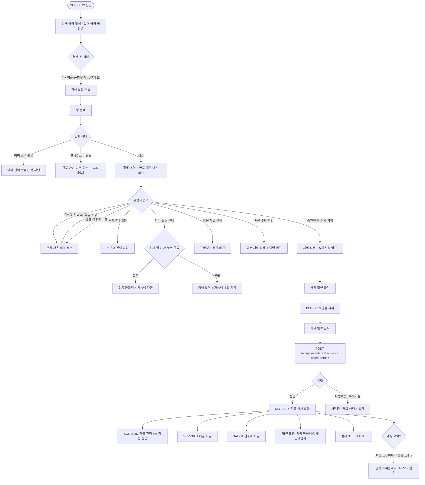

# SCR-S012 결제 취소 / 부분 환불 페이지

## 1. 화면 메타 정보

이 문서는 결제 취소 / 부분 환불 페이지에 대한 자기완결형 요구사항 정의서입니다. 다른 문서를 함께 보지 않아도 이 문서 한 장만으로 결제 취소 / 부분 환불 페이지에 들어가는 모든 영역, 모든 버튼, 모든 모달, 모든 권한, 모든 예외 처리, 그리고 이 화면을 지탱하는 운영 정책까지 전부 이해하고 구현할 수 있도록 작성합니다.

| 항목 | 값 |
|---|---|
| 작성일 | 2026-05-22 |
| 버전 | v1.0 |
| 상태 | 최신 통합본 반영 (정합화 완료) |
| 도메인 | D03 매출관리 |
| 화면 ID | SCR-S012 |
| 화면명 | 결제 취소 / 부분 환불 |
| 화면 유형 | 트랜잭션 처리 화면 (Refund Engine) |
| 라우트 (URL) | `/sales/cancel-refund` |
| 플랫폼 | 데스크톱(기본), 태블릿 |
| 우선순위 | P0 (출시 필수) |
| 기능코드 | SAL-EXT-04 (결제 취소 / 부분 환불 처리) |
| 계약코드 | SAL-EXT-04 |
| 계약 상태 | 계약 범위 본기능 (퍼블리싱 보강 완료 / 1차 Supabase 연동) |
| 부모 기능 prefix | SAL |
| Lv1 코드 | SAL-EXT-04 |
| Lv2 / Lv3 세분화 | SAL-EXT-04-01 ~ SAL-EXT-04-10 (결제 건 검색, 결제 내역 확인, 환불 계산 박스, 혼합결제 환불 분해표, 처리 유형 선택, 환불 사유 입력, 환불 수단 확인, 처리 확인 모달, 처리 완료 안내, 처리 이력, 예외 처리) |
| 연계 화면 | SCR-S007 환불관리, SCR-S001 매출현황, SCR-S016 결제링크, SCR-S008 미수금관리, SCR-S009 할부관리, SCR-S010 세금계산서, SCR-097 감사로그 |
| 호출 다이얼로그 | DLG-S013 환불처리, DLG-S014 환불상세결과, DLG-S015 환불요청 |

## 2. 화면 개요와 목적

결제 취소 / 부분 환불 페이지는 완료된 결제 건에 대해 전체 취소 또는 일부 금액 환불을 처리하는 트랜잭션 화면입니다. 단순 변심·결제 오류·서비스 불만 등의 사유로 환불 요청이 들어왔을 때 담당자가 해당 결제 건을 조회하고 전체 취소 또는 부분 환불 금액을 지정해 처리합니다. 현장 영수증 첨부 등록 건은 외부 POS/현금 환불을 먼저 완료한 뒤 CRM에 환불 기록을 남기고, 결제링크 완료 건은 PG 환불/webhook 흐름으로 처리합니다. 처리된 내역은 SCR-S007 환불 관리 화면에 자동 반영되며 감사 로그에 기록됩니다.

운영 맥락은 다양합니다. 카운터 매니저는 당일 결제 직후 회원 변심 시 결제 ID 검색 → 외부 POS/현금 환불 완료 → CRM 전체 취소 기록을 수행하고, FC는 휴원·이사 환불 요청 시 사용한 회차/일수 차감 + 위약금 적용 후 부분 환불을 처리합니다. 센터장은 분쟁 환불 시 DLG-S015 환불 요청 검토 후 위약금 면제 권한을 사용해 처리하고, 고객센터는 결제 오류(중복·금액 오류) 시 결제 ID 직접 입력으로 전체 취소합니다.

이 화면은 클라이언트 정책이 확정되지 않은 항목을 자동 계산으로 단정하지 않고 수기 입력값과 조정 사유로 우선 처리합니다. 정책 확정 후에는 configurable policy 또는 정책 테이블 기반 자동 계산으로 대체됩니다. 환불 처리 담당자는 운영 판단에 따라 기사용 차감금·위약금·이번 환불 가능액을 조정할 수 있으며 조정 사유를 반드시 기록합니다.

## 3. 진입 경로와 인접 화면

결제 취소 / 부분 환불 페이지에 진입하는 경로는 다음과 같습니다.

첫 번째 경로는 사이드바입니다. 좌측 사이드바의 "매출관리" 메뉴 아래 "결제 취소 / 부분 환불" 항목을 클릭하면 진입합니다. URL은 `/sales/cancel-refund`이며, 검색 영역만 활성화된 초기 상태로 시작합니다.

두 번째 경로는 환불 관리(SCR-S007)에서 새 환불 요청 [처리하기] 버튼 또는 매출 현황(SCR-S001)에서 DLG-S001 매출 상세의 [환불] 버튼을 누를 때입니다. 해당 결제 건이 자동 선택된 상태로 진입합니다.

세 번째 경로는 회원 상세(SCR-M004)의 결제 이력에서 특정 결제의 [환불 처리] 버튼을 누를 때입니다.

네 번째 경로는 DLG-S015 환불 요청 모달에서 회원 요청 접수 후 담당자 검토 단계에서 진입할 때입니다.

이 화면에서 빠져나가는 인접 화면으로는, 처리 완료 후 환불 관리(SCR-S007), 미결제 링크 환불 시도 시 SCR-S016 결제링크 취소, 할부 진행 중 환불 시 SCR-S009 할부 관리, 미수금 상계 시 SCR-S008 미수금 관리, 법인 환불 시 SCR-S010 세금계산서 마이너스 발행, 매출 현황(SCR-S001) 매출 차감, 그리고 모든 환불 처리·취소·조정이 기록되는 감사 로그(SCR-097)가 있습니다.

## 4. 레이아웃과 UI 구성

결제 취소 / 부분 환불 페이지는 좌·우 2단 구성을 기본으로 합니다. 좌측은 결제 건 검색과 결제 내역 확인(약 40%), 우측은 환불 계산·입력 영역(약 60%)으로 나뉩니다.

가장 위에는 페이지 헤더가 있습니다. 헤더 좌측에는 "결제 취소 / 부분 환불"이라는 페이지 타이틀과 지점 컨텍스트 배지가 표시됩니다. 헤더 우측에는 "환불 관리로 이동" 링크가 있어 SCR-S007로 즉시 이동할 수 있습니다.

좌측 패널의 최상단에는 결제 건 검색 영역이 있습니다. 회원명(디바운스 300ms), 상품명, 결제일 기간, 결제 ID 직접 입력의 4가지 검색 조건을 제공합니다. 결제 ID 직접 입력은 고객센터의 결제 오류 환불에 특히 유용합니다. 검색 결과 목록이 펼쳐지고 행을 선택하면 우측 영역이 활성화됩니다.

좌측 패널의 중단에는 결제 내역 확인 영역이 있습니다. 선택한 결제 건의 결제일·상품명·결제 금액·결제 수단·결제자(회원명 + 담당자) 정보가 카드형으로 표시되고, 결제경로(POS / LINK / MANUAL) 배지가 함께 표시됩니다.

좌측 패널의 하단에는 처리 이력 영역이 있습니다. 해당 결제 건에 대해 이전에 처리된 부분 환불 이력이 시간순으로 표시되어, 추가 부분 환불 시 누적 추적이 가능합니다.

우측 패널의 최상단에는 환불 계산 박스가 있습니다. 원결제 금액 / 기사용 차감금 / 위약금 / 기환불 누계 / 이번 환불 가능액 / 최종 환불액이 한 행씩 표시됩니다. 정책 미확정 시 기사용 차감금·위약금·기환불 누계·환불 가능액 조정·조정 사유를 운영자가 수기 입력할 수 있습니다. 자동 정책이 확정되면 동일 필드가 자동 계산 결과로 대체됩니다.

환불 계산 박스 아래에는 혼합결제 환불 분해표가 있습니다. 카드/현금/계좌이체/포인트별 원수납액·기환불액·이번 환불 배분액·잔여 환불 가능액이 행 단위로 표시되어, 운영자가 수단별 잔액을 추적할 수 있습니다. 수단별 자동 분해 정책 확정 전에는 환불 수단과 배분 메모를 수기로 기록합니다.

혼합결제 분해표 아래에는 처리 유형 선택 영역이 있습니다. "전체 취소"와 "부분 환불" 라디오 버튼이며, 전체 취소는 이번 환불 가능액 전액을, 부분 환불은 직접 입력 금액을 처리합니다. 부분 환불은 가능액 초과 시 경고가 표시되고 버튼이 비활성화됩니다.

처리 유형 아래에는 환불 사유 입력 영역이 있습니다. 프리셋 5종(단순 변심 / 결제 오류 / 회원 요청 / 서비스 불만 / 기타) 카테고리와 추가 의견 텍스트 박스가 있습니다. 조정 사유는 환불 가능액 조정 시 필수로 입력합니다.

환불 사유 아래에는 환불 수단 확인 영역이 있습니다. 원결제 수단별 환불 방법이 안내되며(현장 카드: 외부 POS 환불 완료 후 CRM 기록, 결제링크 카드: PG 환불 후 webhook 상태 갱신, 현금: 현금/계좌 환불, 계좌이체: 계좌 이체, 포인트: 즉시 회복), 외부 처리 상태와 POS/PG 승인번호 또는 증빙 메모를 수기 기록합니다.

환불 수단 아래에는 승인/귀속 수기 기록 영역이 있습니다. 처리 상태(요청 / 승인대기 / 완료), 승인 메모, 결제지점·이용지점·매출 귀속 지점·정산 지점·인센티브 귀속자를 입력합니다. 다중 귀속 정책 확정 전에는 각 항목을 수기 메모로 남깁니다.

가장 아래에는 [처리 확인] 버튼이 있어 DLG-S013 환불 처리 모달을 호출합니다. 위약금 면제 토글은 슈퍼관리자·센터장에게만 노출되며, 매니저는 hidden 처리됩니다.

## 5. 탭 구성과 탭별 동작

이 화면은 탭이 없습니다. 단일 트랜잭션 화면이며, 처리 유형 라디오(전체 취소 / 부분 환불)가 우측 입력 영역의 동작을 분기합니다.

전체 취소 선택 시 이번 환불 가능액이 자동으로 최종 환불액에 입력되고, 부분 환불 입력 필드는 비활성화됩니다. 부분 환불 선택 시 환불 금액 입력 필드가 활성화되고, 입력 금액이 가능액을 초과하면 경고와 함께 [처리 확인] 버튼이 비활성화됩니다.

## 6. 버튼·아이콘·링크 액션 전체 정의

결제 건 검색 영역의 검색 입력 4가지(회원명·상품명·결제일·결제 ID)는 디바운스 300ms 후 자동 검색됩니다. 결과 목록에서 행을 선택하면 우측 입력 영역이 활성화됩니다.

결제 내역 확인 카드의 회원명은 클릭 시 회원 상세(SCR-M004)로, 상품명은 상품 상세(SCR-P003)로 이동시킵니다. 단 이미 환불 처리 중인 상태에서는 다른 페이지 이동이 차단됩니다.

환불 계산 박스의 기사용 차감금·위약금·기환불 누계·환불 가능액 조정 입력 필드는 정책 미확정 상태에서 수기 입력 가능합니다. 입력 시 조정 사유 입력 필드가 활성화됩니다.

혼합결제 환불 분해표는 각 수단별 행의 "이번 환불 배분액" 입력 필드가 수정 가능하며, 합계는 자동으로 최종 환불액과 일치하도록 검증됩니다.

처리 유형 라디오(전체 취소 / 부분 환불)는 선택 시 우측 입력 동작을 즉시 전환합니다.

환불 사유 프리셋 5개 카테고리는 토글로 작동하며, 추가 의견 텍스트 박스는 자유 입력입니다.

환불 수단 확인 영역의 외부 처리 상태·승인 메모·POS/PG 승인번호·증빙 메모는 수기 입력 가능합니다.

승인/귀속 수기 기록 영역의 처리 상태(요청/승인대기/완료) 라디오와 결제지점·이용지점·매출 귀속 지점·정산 지점·인센티브 귀속자 입력 필드는 자유 입력 또는 드롭다운 선택입니다.

위약금 면제 토글은 슈퍼관리자·센터장에게만 노출됩니다. 면제 시 사유 입력 필드가 추가로 활성화됩니다.

[처리 확인] 버튼은 환불 금액·사유·수단·필수 입력값을 검증한 뒤 DLG-S013 환불 처리 모달을 호출합니다. 처리 중에는 버튼이 비활성화됩니다.

페이지 헤더의 "환불 관리로 이동" 링크는 SCR-S007로 이동시킵니다.

모든 버튼은 클릭 후 응답이 돌아오기 전까지 자동으로 비활성화됩니다.

## 7. 호출되는 모달 동작

이 화면에서 호출되는 모달은 세 가지입니다.

### 7-1. DLG-S013 환불 처리 모달

환불 처리 모달은 [처리 확인] 버튼 클릭 시 열리는 최종 확인 모달입니다. 원 매출 정보, 환불 계산 요약(기사용 차감금·위약금·기환불 누계·환불 가능액), 환불 가능액 조정, 환불 유형(전체/부분), 환불 금액, 환불 사유, 환불 수단, 처리 상태(요청/승인대기/완료)가 표시됩니다.

직원은 모든 입력값을 마지막으로 검토합니다. [처리 완료] 버튼은 환불 처리를 실행하고 DLG-S014 환불 상세 결과 모달을 자동으로 표시합니다. 처리 중에는 버튼이 비활성화되며, 60초 타임아웃이 적용됩니다. [취소] 버튼은 모달을 닫고 결제 취소 / 부분 환불 화면으로 복귀합니다.

위약금 면제 토글은 슈퍼관리자·센터장에게만 노출됩니다. 매니저는 면제 토글이 hidden 처리됩니다.

### 7-2. DLG-S014 환불 상세 결과 모달

환불 상세 결과 모달은 DLG-S013 처리 완료 직후 자동으로 표시되는 결과 확인 모달입니다. "환불 처리가 완료되었습니다" 성공 메시지와 함께 환불 번호, 환불 금액(크게 강조), 환불 수단, 처리 일시, 처리 담당자, 원 매출 정보가 표시됩니다.

[확인] 버튼은 모달을 닫고 환불 관리 목록(SCR-S007) 또는 매출 현황(SCR-S001)으로 복귀합니다.

### 7-3. DLG-S015 환불 요청 모달

환불 요청 모달은 회원 또는 직원이 환불을 요청하는 첫 단계 팝업입니다. 회원이 앱 또는 키오스크에서 환불 요청 버튼을 누르거나, 직원이 SCR-S007에서 새 환불 요청 등록 또는 DLG-S001 매출 상세에서 환불 요청을 누를 때 열립니다.

환불 대상 매출, 요청자 구분(회원/직원), 환불 요청 금액(전체/부분), 환불 요청 사유, 추가 요청 사항을 입력합니다. [요청 접수] 버튼은 시스템에 환불 요청을 등록하며, SCR-S007 환불 관리 목록에 미처리 상태로 등록됩니다. 담당자 검토 후 SCR-S012에서 DLG-S013으로 실제 환불을 진행합니다.

## 8. 토스트와 확인 팝업과 알럿

성공 토스트는 우측 상단에 녹색 계열로 5초 동안 표시되며, "환불 처리가 완료되었어요" 같은 짧은 문구로 결과를 알려줍니다.

실패 토스트는 우측 상단에 빨강 계열로 표시되며, "이미 전액 환불된 건입니다", "환불 가능액을 초과합니다", "권한이 없어요" 같은 문구와 함께 보조 액션이 따라옵니다.

이미 전액 환불 안내는 결제 건 선택 시 이미 전체 환불된 건이면 "이미 전액 환불된 결제 건입니다" 안내가 표시되고 처리가 차단됩니다.

결제링크 미완료 환불 시도 안내는 "환불 아닌 링크 취소로 처리" 안내와 함께 SCR-S016 결제링크 안내로 라우팅됩니다.

부분 환불 가능액 초과 안내는 "환불 가능액을 초과합니다" 빨강 인라인 안내와 정정 안내가 표시됩니다.

조정 사유 미입력 안내는 환불 가능액을 조정했는데 사유를 입력하지 않으면 "조정 사유는 필수입니다" 인라인 안내가 표시됩니다.

결제링크 PG 응답 타임아웃 안내는 60초+ 응답 지연 시 "처리중" 상태가 유지되고 자동 폴링이 실행됩니다.

대량/고액 환불 알림은 단일 환불 100만원 이상 또는 일별 10건 이상 시 본사 슈퍼관리자에게 NFR-19 알림이 발송됩니다.

법인 회원 환불 안내는 법인 회원 환불 시 "마이너스 세금계산서 발행 필요" 안내가 표시되고 SAL-EXT-02 진입 가능 버튼이 제공됩니다.

권한 알럿은 위약금 면제 권한 부족 시 면제 토글이 hidden 처리되고 센터장 요청이 안내됩니다.

## 9. 데이터 흐름과 외부 연동

화면 진입 시점에는 결제 건 검색 결과만 비어 있고, 검색 입력 시 결제 검색 API가 호출됩니다. 결제 건 선택 시 환불 계산 정보가 `GET /api/payments/:id/refund-calc`로 호출되어 환불 가능액 자동 계산 결과가 내려옵니다(또는 정책 미확정 상태에서는 수기 입력값으로 처리).

전체 취소 처리는 `POST /api/payments/:id/cancel`로, 부분 환불은 `POST /api/payments/:id/partial-refund`로 처리됩니다. idempotency-key로 중복 처리가 차단됩니다.

환불 계산 기준 조정은 `POST /api/payments/:id/adjust-refund-base`로 처리됩니다. 기사용 차감금·위약금·기환불 누계 조정 시 조정 사유가 함께 저장됩니다.

결제링크 PG 환불 webhook은 `POST /api/payments/refund-webhook`으로 수신됩니다. HMAC 서명 검증과 idempotency-key로 위변조와 중복 처리를 차단합니다.

위약금 정책(기본)은 7일 이내 0% / 30일 이내 30% / 30일 초과 50%(정책 세트 기준)입니다. 환불 처리 시점에 적용된 정책 세트 ID가 스냅샷으로 저장됩니다.

처리 결과는 SCR-S007 환불 관리에 5초 이내 자동 반영됩니다. SCR-S001 매출 현황도 자동 갱신되며, SAL-04 선수익금은 환불 완료 시 인식 차감을 수행하고, SAL-EXT-02 세금계산서는 법인 환불 시 자동 마이너스 발행 트리거가 됩니다.

PAY-03 미수금은 미수 상계 시 자동 차감되며, SAL-EXT-01 할부는 할부 환불 시 잔여 회차가 일괄 취소됩니다.

포인트 회복은 포인트 환불 시 회원 잔액에 즉시 INSERT되며, row-level lock으로 동시성을 보장합니다.

NFR-19 알림 센터는 100만원+ 환불 또는 일별 10건+ 비정상 패턴 감지 시 본사 슈퍼관리자에게 알림을 발송합니다.

결제링크 미완료 환불은 SCR-S016에서 링크 취소로 분기됩니다.

결제링크 PG 환불은 영업일 3~5일이 소요되며 webhook 비동기 갱신이 수행됩니다.

환불 이력 5년 보관 정책에 따라 5년 경과 후 PII 마스킹 배치가 회원명·연락처를 익명화합니다.

감사 로그는 환불 처리·취소·조정을 모두 SCR-097에 비동기로 기록합니다. 기록 필드는 `actor_id`, `payment_id`, `refund_amount`, `reason`, `timestamp`입니다.

화면에서 호출하는 주요 API 엔드포인트는 다음과 같습니다. 결제 취소 `POST /api/payments/:id/cancel`, 부분 환불 `POST /api/payments/:id/partial-refund`, 환불 계산 `GET /api/payments/:id/refund-calc`, 환불 기준 조정 `POST /api/payments/:id/adjust-refund-base`, 결제링크 webhook 콜백 `POST /api/payments/refund-webhook`.

## 10. 화면 상태와 예외 처리

결제 취소 / 부분 환불 페이지는 다음 상태들을 가질 수 있습니다.

초기 상태는 검색만 활성, 우측 입력 영역 비활성 상태입니다.

결제 건 선택됨 상태는 처리 유형·사유 영역이 활성화된 상태입니다.

전체 취소 선택 상태는 최종 환불액 = 가능액 자동 입력 상태입니다.

부분 환불 선택 상태는 금액 입력 활성 + 초과 경고 상태입니다.

처리 확인 모달 상태는 DLG-S013이 열린 상태로 버튼이 비활성화됩니다.

처리 중 상태는 로딩과 백 비활성 상태입니다.

처리 완료 상태는 성공 메시지와 이동 CTA가 표시되는 상태입니다.

결제링크 PG webhook 대기 상태는 "처리중" 상태와 폴링 상태입니다.

결제링크 PG 환불 거절 상태는 "거절" 배지와 알림 상태입니다.

이미 취소 상태는 "이미 전액 환불된 건" 안내 상태입니다.

결제링크 미완료 상태는 링크 취소 안내 상태입니다.

권한 미달 상태에서는 처리 버튼이 hidden 처리됩니다.

오류 상태는 토스트와 재시도 버튼 상태입니다.

예외 케이스별 처리는 다음과 같이 정의됩니다. 결제 건 검색 0건 시 "검색 결과가 없습니다" 안내, 이미 전액 환불 시 처리 차단, 결제링크 미완료 환불 시도 시 "환불 아닌 링크 취소" + SCR-S016 안내, 부분 환불 가능액 초과 시 "환불 가능액을 초과합니다" 빨강 정정, 부분 환불 가능액 0원 시 "더 이상 환불할 금액이 없습니다" 차단, 조정 사유 미입력 시 "조정 사유는 필수입니다" 인라인, 위약금 면제 권한 부족 시 면제 토글 hidden + 센터장 요청, 현장 환불 증빙 누락 시 "환불 증빙이 필요합니다" 외부 POS/현금 환불 완료 확인, 결제링크 PG 환불 거절 webhook 시 "거절" 배지 + 알림 + 사유 확인 + 재시도, 결제링크 PG 응답 타임아웃(60초+) 시 "처리중" 유지 + 자동 폴링, 포인트 잔액 락 충돌 시 "잠시 후 다시 시도" 자동 재시도, 환불 계좌 정보 누락 시 "환불 계좌가 필요합니다" 회원 정보 입력 안내, 할부 진행 중 환불 시 자동 미수 상계 안내 + 사용자 확인, 환불 권한 부족 시 처리 버튼 hidden, idempotency 중복 요청 시 "이미 처리된 요청" 안내, 동시 환불 처리 충돌 시 "처리 중인 환불이 있습니다" 자동 재시도, 법인 회원 환불 시 "마이너스 세금계산서 발행 필요" + SAL-EXT-02 진입 안내, 회원 탈퇴 + 계좌 누락 시 "환불 계좌 입력 필요" 회원 정보 수정, 100만원+ 환불 / 10건+ 일별 시 본사 슈퍼관리자 알림 + 감사 로그 검토, 사유 카테고리 미선택 시 "사유를 선택해주세요" 안내 등이 있습니다.

## 11. 권한별 처리

슈퍼관리자(superAdmin)와 본사 최고관리자(primary)는 전체 지점 결제 건의 전체 취소·부분 환불·조정·위약금 면제까지 모두 가능합니다.

센터장(owner)은 자기 지점의 전체 취소·부분 환불·조정·위약금 면제가 가능합니다.

매니저(manager)는 자기 지점의 전체 취소·부분 환불·조정이 가능하며, 위약금 면제는 차단됩니다.

FC(피트니스 코치, fc)는 담당 회원 결제 건의 전체 취소·부분 환불·가능액 조정이 가능하며, 위약금 면제는 차단됩니다.

트레이너(trainer)와 스태프(staff)는 매출 조회만 가능하며 환불 처리가 차단됩니다.

읽기 전용(readonly)은 화면 자체에 접근할 수 없습니다.

권한 차단 시 버튼 hidden 또는 비활성, 403 응답 시 "권한이 없어요" 토스트, 모든 권한 차단 이벤트는 감사 로그에 기록됩니다.

## 12. 메인 흐름

## 13. 에러와 예외 흐름

```mermaid
flowchart TD
    A([액션 트리거]) --> B{검증 / 응답}
    B -->|검색 0건| C["검색 결과가 없습니다"]
    B -->|이미 전액 환불| D[처리 차단]
    B -->|결제링크 미완료| E["환불 아닌 링크 취소" + SCR-S016]
    B -->|부분 환불 가능액 초과| F["환불 가능액을 초과합니다" + 정정]
    B -->|부분 환불 가능액 0원| G["더 이상 환불할 금액이 없습니다" 차단]
    B -->|조정 사유 미입력| H["조정 사유는 필수입니다"]
    B -->|위약금 면제 권한 부족| I[면제 토글 hidden + 센터장 요청]
    B -->|현장 환불 증빙 누락| J["환불 증빙이 필요합니다"]
    B -->|결제링크 PG 환불 거절 webhook| K["거절" 배지 + 알림 + 사유 + 재시도]
    B -->|결제링크 PG 응답 타임아웃 60초+| L["처리중" + 자동 폴링]
    B -->|포인트 잔액 락 충돌| M["잠시 후 다시 시도" + 자동 재시도]
    B -->|환불 계좌 정보 누락| N["환불 계좌가 필요합니다"]
    B -->|할부 진행 중 환불| O[자동 미수 상계 + 사용자 확인]
    B -->|환불 권한 부족| P[처리 버튼 hidden]
    B -->|idempotency 중복| Q["이미 처리된 요청"]
    B -->|동시 환불 처리 충돌| R["처리 중인 환불이 있습니다" + 재시도]
    B -->|법인 회원 환불| S["마이너스 세금계산서 발행 필요" + SAL-EXT-02]
    B -->|회원 탈퇴 + 계좌 누락| T["환불 계좌 입력 필요"]
    B -->|100만원+ / 10건+ 일별| U[본사 슈퍼관리자 알림]
    B -->|사유 카테고리 미선택| V["사유를 선택해주세요"]
```

## 14. 핵심 디자인 요청사항

좌·우 2단 레이아웃은 명확한 분리 라인으로 구분됩니다. 좌측은 검색·조회 컨텍스트, 우측은 환불 계산·입력·검증 영역으로 시각적 역할이 분리됩니다.

환불 계산 박스는 회계 의미가 명확히 전달되도록 라벨과 값이 한 줄씩 배치되며, 정책 미확정 항목은 입력 필드로, 자동 계산 항목은 읽기 전용 값으로 시각적으로 구분됩니다. 최종 환불액은 페이지 전체에서 가장 큰 폰트로 강조됩니다.

혼합결제 환불 분해표는 수단별 행에 컬러 인디케이터(카드 파랑·현금 초록·계좌이체 보라·포인트 노랑)가 표시되어 한눈에 수단을 구분할 수 있습니다. 잔여 가능액은 빨강 강조로 표시됩니다.

처리 유형 라디오(전체 취소 / 부분 환불)는 큰 카드형 토글로 표시되어 선택이 명확합니다.

환불 사유 프리셋 5개 카테고리는 작은 카드형 토글로 표시되며, 추가 의견 텍스트 박스가 함께 배치됩니다.

[처리 확인] 버튼은 화면 우측 하단에 페이지 전체에서 가장 큰 컬러 버튼으로 배치됩니다. 검증 실패 시 회색 톤(비활성), 활성 시 강조 색상으로 표시됩니다.

위약금 면제 토글은 권한이 있을 때만 표시되며, 면제 활성 시 빨강 경고 톤으로 표시되어 비정상 처리임을 시각적으로 알립니다.

DLG-S013 환불 처리 모달은 모달 상단에 환불 금액을 페이지 전체에서 가장 큰 폰트로 빨강 강조 표시해 처리의 무게감을 전달합니다.

DLG-S014 환불 상세 결과 모달은 성공 화면처럼 큰 체크 아이콘과 환불 금액 강조로 처리 완료를 명확히 알립니다.

결제링크 PG webhook 폴링 중에는 "처리중" 배지에 펄스 애니메이션이 적용되어 비동기 처리를 사용자에게 안내합니다.

진행 스피너와 로딩 스켈레톤은 매출관리 전체에서 동일한 톤으로 통일됩니다.

## 15. 운영 정책 (이 화면에 연결된 부분)

환불 계산 항목 정책은 `기사용 차감금`, `위약금`, `기환불 누계`가 환불 상태가 아니라 환불 계산 항목임을 명시합니다.

할부/미수 상계 우선 정책은 할부/미수 진행 중 결제가 남은 미수금과 먼저 상계된 뒤 실제 환불액이 계산됩니다.

결제링크 미완료 정책은 결제 미완료 링크가 환불이 아닌 링크 취소(SCR-S016)로 처리됩니다.

조정 권한 + 사유 기록 정책은 담당자가 기사용 차감금·위약금·이번 환불 가능액을 조정할 수 있으며 조정 사유를 반드시 기록합니다.

최종 환불액 한도 정책은 최종 환불액이 확정된 환불 가능액을 초과할 수 없으며 초과 시 차단됩니다.

자동 반영 정책은 처리 결과가 SCR-S007 환불 관리에 5초 이내 자동 반영되고 감사 로그가 append-only로 기록됨을 보장합니다.

결제경로별 환불 처리 정책은 현장 카드/현금이 외부 POS/현금 환불 완료 후 CRM 기록, 결제링크 카드가 PG 환불(영업일 3~5일)과 webhook 비동기 갱신임을 명시합니다.

포인트 환불 정책은 즉시 포인트 잔액 회복과 row-level lock 동시성 보장입니다.

현금/계좌 환불 정책은 계좌 이체로 환불되며, 회원 환불 계좌 정보가 필수입니다.

부분 환불 누적 정책은 같은 결제 건의 부분 환불을 누적 추적하며, 가능액 = 원결제 - 기환불 누계 - 위약금 - 기사용입니다.

혼합결제 행 단위 잔액 관리 정책은 카드/현금/계좌이체/포인트별 잔여 환불 가능액을 별도로 관리합니다.

환불 귀속 유지 정책은 원결제의 `paymentBranchId`, `usageBranchId`, `salesAttributionBranchId`, `settlementBranchId`, `incentiveOwnerId`를 상속해 정산·KPI·인센티브 차감을 계산합니다.

이미 전액 환불 차단 정책은 이미 전액 환불 건의 추가 환불을 차단합니다.

위약금 정책(기본) 정책은 7일 이내 0% / 30일 이내 30% / 30일 초과 50%(정책 세트 기준)입니다.

위약금 면제 권한 정책은 슈퍼관리자·센터장만 면제 가능하며 면제 사유가 필수입니다.

결제링크 PG 환불 거절 처리 정책은 webhook 거절 응답 시 "거절" 상태와 운영자 알림이 발송되며 익영업일 재시도가 안내됩니다.

할부 환불 연계 정책은 할부 환불 시 SAL-EXT-01 잔여 회차가 일괄 취소됩니다.

법인 회원 환불 정책은 마이너스 세금계산서 발행 안내(SAL-EXT-02 연계)가 제공됩니다.

권한별 가능 범위 정책은 FC도 환불 처리 가능, 매니저 위약금 면제 ❌입니다.

idempotency 정책은 환불 요청에 idempotency-key를 적용해 중복 처리를 차단합니다.

사유 카테고리 정책은 단순 변심·결제 오류·회원 요청·서비스 불만·기타 5종입니다.

부분 환불 최소 금액 정책은 1원 이상입니다.

선수익금 환불 영향 정책은 환불 시 SAL-04 선수익금 인식 차감을 수행합니다.

환불 이력 보관 정책은 5년이며, 5년 경과 후 익명화됩니다.

대량/고액 환불 알림 정책은 단일 환불 100만원 이상 또는 일별 10건 이상 시 본사 슈퍼관리자에게 알림을 발송합니다.

회원 탈퇴 후 환불 정책은 탈퇴 회원도 환불 가능(회수 추진)하며 환불 계좌가 필수입니다.

수기 입력 정책은 클라이언트 정책이 확정되지 않은 항목(사용분 차감 기준·위약금 산식·혼합결제 환불 순서·승인 조건·귀속 차감 기준)을 자동 계산으로 단정하지 않고 수기 입력값과 메모로 기록합니다. 정책 확정 후 자동 계산 결과로 대체됩니다.

이상의 모든 정책은 이 화면을 구현하고 운영하는 사람이 별도 문서 없이 이 한 장만 보면 이해할 수 있도록 풀어 적었습니다. 정책이 바뀌면 이 문서가 함께 갱신되어야 하며, 코드 변경과 정책 변경은 항상 짝지어 진행됩니다.
