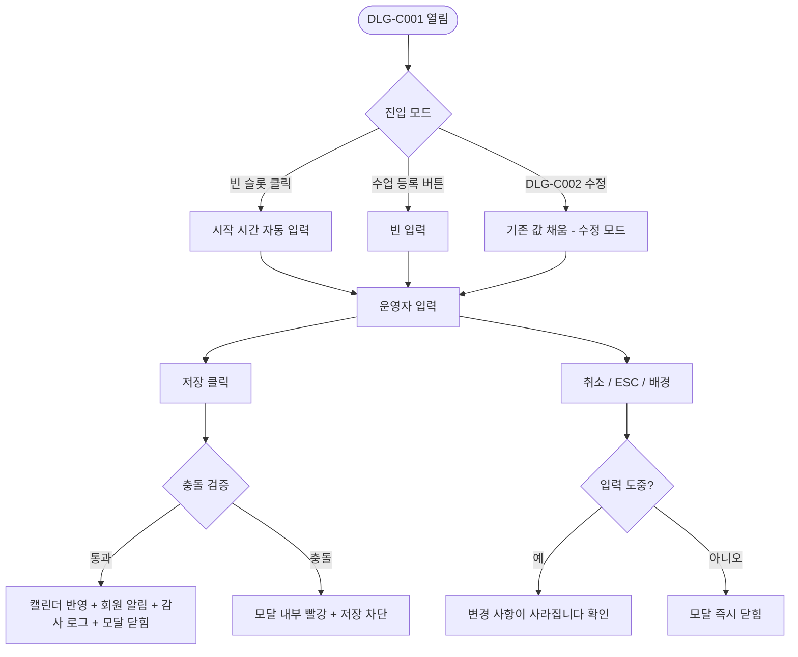
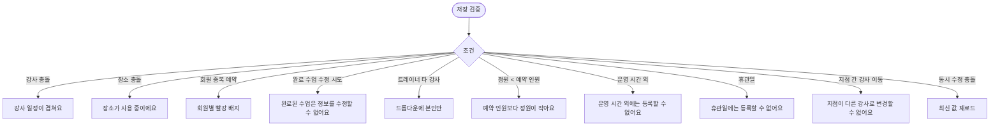

# DLG-C001 수업 등록/수정 (캘린더) 다이얼로그

## 1. 다이얼로그 메타 정보

| 항목 | 값 |
|---|---|
| 작성일 | 2026-05-22 |
| 버전 | v1.0 |
| 상태 | 정합화 완료 |
| 도메인 | D04 수업관리 |
| 다이얼로그 ID | DLG-C001 |
| 다이얼로그명 | 수업 등록/수정 (캘린더) |
| 부모 화면 | SCR-C001 수업캘린더 |
| 호출 트리거 | 빈 시간 슬롯 클릭 / "수업 등록" 버튼 / DLG-C002 "수정" 버튼 |
| 기능코드 | CLS-01 |
| 계약코드 | CLS-01 |
| 인접 다이얼로그 | DLG-C002 일정상세, DLG-C004 일괄변경 |

## 2. 다이얼로그 개요와 목적

캘린더에서 새 수업 일정을 등록하거나 기존 일정을 수정하는 단일 진입점 모달입니다. 시간 충돌·강사 중복·장소 중복·회원 중복을 한 화면에서 검증하고 통과 시 캘린더에 즉시 반영합니다. KPI 대상 수업이면 강습 세션 유형 4종(PT·필라테스·스트레칭·테라피)을 필수로 받아 강습세션수 집계의 원천 데이터를 보장합니다.

## 3. 호출 트리거와 진입 시 초기값

빈 슬롯 클릭으로 열리면 시작 일시가 클릭한 시간으로 자동 입력되어 있고 종료 일시는 선택된 수업 템플릿 기본 길이만큼 자동 계산됩니다. 상단 "수업 등록" 버튼으로 열리면 모든 입력이 비어 있는 상태로 시작합니다. DLG-C002에서 "수정" 버튼으로 열리면 기존 수업의 모든 값이 미리 채워진 수정 모드로 시작되며 모달 헤더가 "수업 수정"으로 바뀝니다.

## 4. 레이아웃과 입력 항목

모달 헤더에는 "수업 등록" 또는 "수업 수정" 제목과 닫기 X 버튼이 있습니다.

본문 입력 항목은 다음과 같습니다. 수업 선택 드롭다운(SCR-C004에 등록된 활성 템플릿 - 선택 시 수업명·정원·세션 유형·색상 자동 완성), 일정 분류 단일 선택(상담·OT·체성분·방문·수업·PT·기타), 강습 세션 유형 단일 선택(PT·필라테스·스트레칭·테라피 - KPI 집계 대상 수업일 때 필수), 대상 유형(회원·비회원·직원 - 비회원 선택 시 이름·연락처 직접 입력), 시작 일시(날짜 + 30분 단위 시간), 종료 일시(시작 시간 + 수업 길이로 자동 계산 + 직접 수정 가능), 강사 드롭다운(트레이너 계정은 본인만 선택 가능), 장소 드롭다운, 정원, 색상 6종 팔레트, 메모 textarea(선택), 반복 일정 토글(반복 시 요일·종료일 추가 설정)입니다.

모달 하단에는 [저장] 버튼과 [취소] 버튼이 있습니다.

## 5. 액션과 검증

[저장] 버튼은 클릭 시 강사·장소·회원 충돌이 백엔드에서 검증됩니다. 통과되면 캘린더에 새 블록이 즉시 추가되거나 기존 블록이 갱신되고, 예약된 회원이 있으면 자동 알림이 발송되며 감사 로그에 기록됩니다. 충돌이 감지되면 모달 내부에 빨강 안내가 표시되고 저장이 차단됩니다.

[취소] 버튼은 변경 없이 모달을 닫지만 입력 도중이면 "변경 사항이 사라집니다. 닫으시겠습니까?" 확인을 한 번 더 묻습니다. ESC 키와 배경 클릭도 같은 동작입니다.

미승인 정책이 활성된 테넌트에서는 신규 등록 시 수업 상태가 "미승인"으로 시작되고 미승인 배너 카운트가 +1 됩니다.

## 6. 화면 상태와 예외 처리

기본 표시 상태는 부모 화면에서 받은 최신 값으로 시작합니다. 입력/수정 중 상태는 필수값 누락·형식 오류·권한 제한을 인라인 메시지로 표시합니다. 저장/처리 중 상태에서는 주요 버튼이 비활성화되어 중복 요청을 막습니다. 완료 상태에서는 성공 토스트와 함께 모달이 닫히고 부모 화면이 갱신됩니다. 실패 상태에서는 실패 사유가 토스트 또는 인라인으로 안내되고 입력값은 유지됩니다.

예외 케이스로 강사 충돌·장소 충돌·회원 중복 예약·완료 수업 수정 시도·트레이너 타 강사 수정·정원 < 예약 인원·운영 시간 외·휴관일·지점 간 강사 이동·동시 수정 충돌(낙관적 락)이 있으며 각각 모달 내부 빨강 안내 + 저장 차단 또는 read-only 처리됩니다.

## 7. 권한별 동작

owner / manager는 모든 입력이 가능합니다. trainer는 강사 드롭다운에 본인만 표시되며 본인 담당 수업만 등록·수정 가능합니다. fc / staff / readonly는 진입 자체가 차단되어 부모 화면에서 권한 안내가 표시됩니다. 본사 통합 모드에서 일반 지점 사용자가 다른 지점 강사를 선택하려 하면 차단됩니다.

## 8. 부모 화면과의 상호작용

저장 성공 시 모달이 닫히고 SCR-C001 캘린더에 새 블록이 즉시 렌더되거나 기존 블록이 갱신됩니다. 신규 등록 시 미승인 정책 활성 테넌트에서는 미승인 배너 카운트가 갱신됩니다. 우측 패널의 수업 카드도 함께 갱신됩니다. 변경된 예약 회원에게는 NFR-19 알림으로 자동 알림이 발송됩니다.

## 9. 데이터 흐름과 외부 연동

API는 신규 등록 `POST /api/lessons`, 수정 `PUT /api/lessons/:id`, 충돌 검증 `GET /api/lessons/conflicts`입니다. 충돌 검증은 저장 직전 백엔드에서 다시 호출되어 사용자 의도와 데이터 일관성을 보장합니다. 강습 세션 유형 4종은 SCR-D003 KPI 대시보드의 강습세션수 원천이며 KPI 대상 수업일 때 필수 입력으로 검증됩니다.

모든 등록·수정은 SCR-097 감사 로그에 actor·lesson_id·before·after·timestamp로 비동기 INSERT됩니다.

## 10. 메인 흐름

## 11. 에러와 예외 흐름

## 12. 디자인 요청사항

수업 템플릿 선택은 가장 위에 배치되어 선택 시 다른 필드가 자동 채워지는 흐름이 자연스럽게 이어져야 합니다. 시작/종료 일시는 큰 시각적 영역으로 표현되어 사용자가 시간 범위를 직관적으로 인지할 수 있게 합니다. 충돌 검증 빨강 안내는 모달 상단에 고정 표시되어 사용자가 어디를 고쳐야 할지 즉시 알 수 있어야 합니다. 강습 세션 유형은 KPI 대상일 때 필수 라벨이 명확히 표시되어 누락을 방지합니다.

## 13. 운영 정책

수업 유형(운영 분류)과 강습 세션 유형(KPI 산출용 4종 고정값)은 별도 값으로 관리되며 절대 섞이지 않습니다. 강습 세션 유형 4종(PT·필라테스·스트레칭·테라피)은 본사 KPI 대시보드 강습세션수의 공식 원천이며 화면 표시는 P.T·필라로 축약 가능하지만 저장값은 고정 4종입니다.

수업 길이는 최소 30분, 최대 240분이며 시간 입력은 30분 단위로 제한됩니다. 강사·장소·회원 중복은 모두 사전 차단되며 정원 < 예약 인원도 변경 시 차단됩니다. 미승인 정책 활성 테넌트에서는 신규 등록이 "미승인" 상태로 시작되어 owner 이상 승인이 필요합니다. 본사 통합 모드에서는 지점 간 강사 이동이 차단되어 데이터 무결성이 보장됩니다.

모든 등록·수정은 감사 로그에 actor·lesson_id·before·after로 기록되어 5초 안에 SCR-097에서 조회 가능해야 합니다. 권한 부족 계정의 모달 진입은 부모 화면에서 차단되며, 백엔드 403 응답은 권한 안내 토스트로 안내됩니다.
