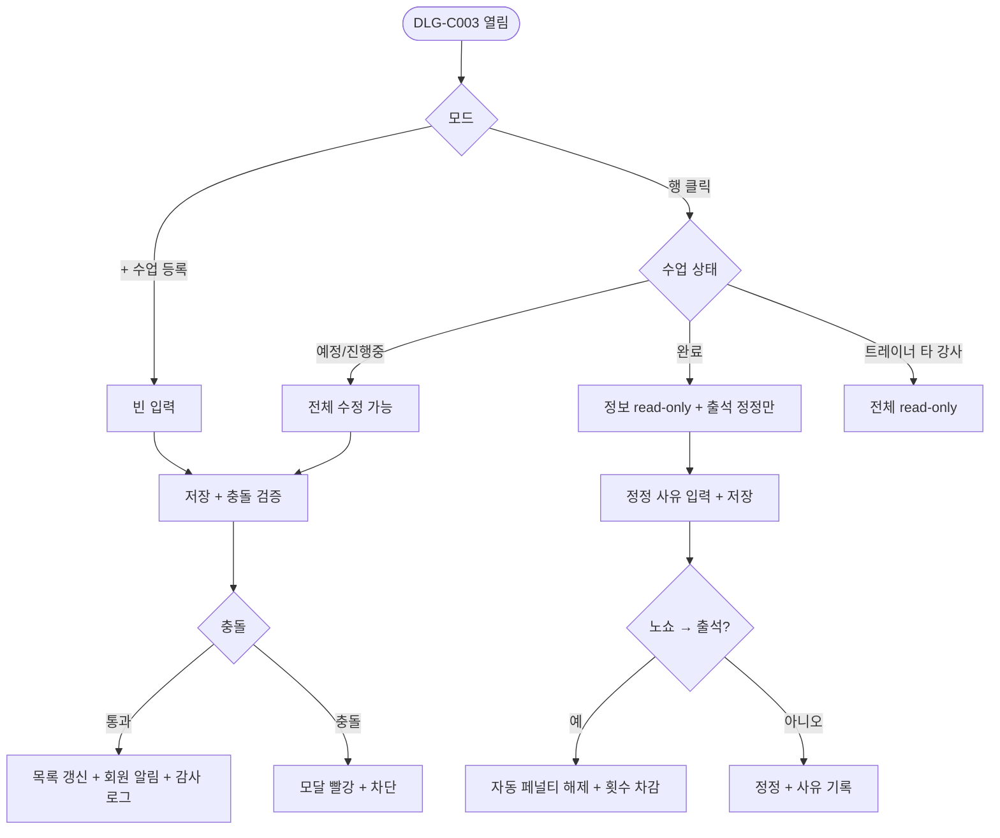

# DLG-C003 수업 등록/수정 (관리) 다이얼로그

## 1. 다이얼로그 메타 정보

| 항목 | 값 |
|---|---|
| 작성일 | 2026-05-22 |
| 버전 | v1.0 |
| 상태 | 정합화 완료 |
| 도메인 | D04 수업관리 |
| 다이얼로그 ID | DLG-C003 |
| 다이얼로그명 | 수업 등록/수정 (관리) |
| 부모 화면 | SCR-C002 수업관리 |
| 호출 트리거 | 행 클릭 / [+ 수업 등록] 버튼 |
| 기능코드 | CLS-02 |
| 계약코드 | CLS-02 |
| 인접 다이얼로그 | DLG-C005 수업기록상세, DLG-C006 서명 |

## 2. 다이얼로그 개요와 목적

SCR-C002 수업 관리 화면에서 행을 클릭하거나 [+ 수업 등록] 버튼을 누르면 열리는 모달입니다. DLG-C001과 입력 항목이 동일하지만, 진입 경로가 목록 화면이라는 점과 완료 상태 수업의 정보 수정이 차단되고 출석 정정만 허용되는 행 단위 정밀 관리에 최적화되어 있다는 점이 다릅니다. 트레이너가 타 강사 행을 클릭하면 read-only 모드로 열립니다.

## 3. 호출 트리거와 진입 시 초기값

행 클릭으로 열리면 기존 수업의 모든 값이 미리 채워진 수정 모드로 시작되며 모달 헤더가 "수업 수정"으로 표시됩니다. [+ 수업 등록] 버튼으로 열리면 모든 입력이 비어 있는 신규 등록 모드입니다. 완료 상태 행을 클릭하면 정보 수정은 차단되고 출석 정정 + 사유 입력만 활성화됩니다.

## 4. 레이아웃과 입력 항목

입력 항목은 DLG-C001과 동일합니다. 수업 템플릿, 일정 분류, 강습 세션 유형 4종, 대상 유형, 시작/종료 일시, 강사, 장소, 정원, 색상, 메모, 반복 일정 토글입니다. 완료 상태에서는 정보 입력이 read-only로 잠기고 출석 정정 영역(회원별 출석/노쇼 변경 + 사유 입력)이 추가로 노출됩니다.

모달 하단에는 [저장] / [취소] 버튼이 있습니다.

## 5. 액션과 검증

[저장]은 강사·장소·회원 충돌을 백엔드에서 검증하고 통과 시 목록을 갱신합니다. 동시 수정 충돌(낙관적 락) 감지 시 "다른 사용자가 먼저 수정했어요" 안내 후 최신 값이 재로드됩니다. 완료 상태의 출석 정정은 사유 필수(최소 5자)이며 노쇼 → 출석 정정 시 자동 페널티 자동 해제 + 횟수 자동 차감이 일어납니다.

[취소]는 모달을 닫고 변경값을 버립니다.

## 6. 화면 상태와 예외 처리

기본 표시는 부모 행의 최신 값으로 시작합니다. 트레이너 타 강사 수정 시도는 read-only 모드, 완료 수업 정보 수정 시도는 "완료된 수업은 정보를 수정할 수 없어요" 안내로 차단되고 출석 정정만 허용됩니다. 동시 수정 충돌은 낙관적 락 재로드로 처리됩니다.

## 7. 권한별 동작

owner / manager는 모든 입력과 정정이 가능합니다. trainer는 본인 담당 수업만 수정·정정 가능하며 타 강사는 read-only입니다. fc / staff / readonly는 진입 차단입니다.

## 8. 부모 화면과의 상호작용

저장 성공 시 SCR-C002 목록 테이블의 해당 행이 즉시 갱신됩니다. 완료 상태에서 정정이 발생하면 출석/노쇼 카운트와 페널티 상태가 함께 갱신됩니다. 모든 변경은 감사 로그에 기록되고 회원 알림이 발송됩니다.

## 9. 데이터 흐름과 외부 연동

API는 등록 `POST /api/lessons`, 수정 `PUT /api/lessons/:id`, 출석 정정 `POST /api/lessons/:id/attendance`입니다. 정정 시 CLS-07 횟수 자동 차감/복구, CLS-08 자동 페널티 해제, NFR-19 알림, SCR-097 감사 로그가 함께 트리거됩니다.

## 10. 메인 흐름



## 11. 에러와 예외 흐름

```mermaid
flowchart TD
    A([검증]) --> B{조건}
    B -->|취소 사유 5자 미만| C[인라인 에러]
    B -->|트레이너 타 강사| D[전체 read-only]
    B -->|완료 수업 정보 수정| E[출석 정정만 허용]
    B -->|정원 < 예약 인원| F[차단]
    B -->|동시 수정 충돌| G[최신 값 재로드]
    B -->|PT 차감 실패 (이용권 만료)| H[토스트 + 횟수 조정 안내]
    B -->|결제 미완 취소| I[SCR-S007 환불 안내]
    B -->|노쇼 → 출석 정정 (페널티 적용)| J[자동 해제 + 알림]
    B -->|서명 미수령 PT 완료| K[노랑 배지 + DLG-C006 안내]
```

## 12. 디자인 요청사항

완료 상태에서 read-only로 잠긴 영역은 회색 톤 + 잠금 아이콘으로 시각적으로 구분되고, 출석 정정 영역만 활성화 되어 운영자가 정정 가능한 영역을 즉시 알 수 있어야 합니다. 정정 사유 입력은 5자 미만 시 인라인 카운트로 부족한 글자수를 보여줘 입력을 유도합니다. 충돌 검증 빨강 안내는 모달 상단에 고정 표시됩니다.

## 13. 운영 정책

완료 수업의 정보 수정은 차단되며 출석 정정만 허용됩니다. 이는 데이터 무결성과 분쟁 대응을 위한 정책입니다. 출석 정정 사유 최소 5자가 필수이며 모든 정정은 감사 로그에 기록됩니다. 노쇼 → 출석 정정 시 자동 페널티 자동 해제 + 횟수 자동 차감, 출석 → 노쇼 정정 시 자동 페널티 부과가 자동 흐름입니다.

트레이너는 본인 담당 수업만 수정 가능하고 타 강사는 read-only입니다. 동시 수정은 낙관적 락 + last-write-wins으로 처리되며 충돌 시 최신 값이 재로드됩니다. 결제 완료 1회권 수업 취소는 SCR-S007 환불 화면 안내가 함께 표시되며 서명 미수령 PT 완료는 노랑 배지 + DLG-C006 재시도 안내가 동반됩니다.
