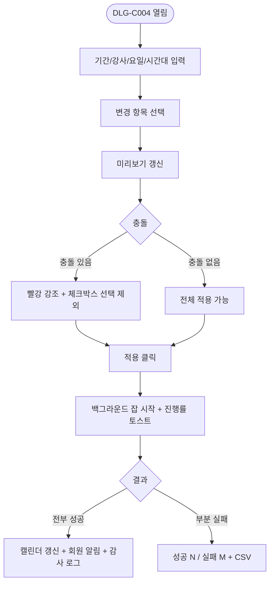
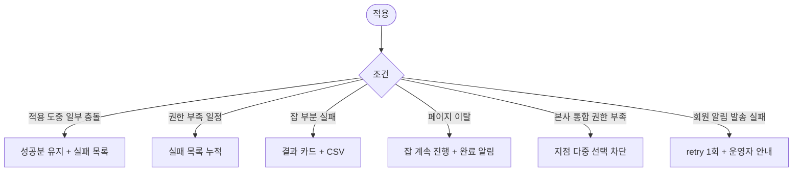

# DLG-C004 일괄 변경 다이얼로그

## 1. 다이얼로그 메타 정보

| 항목 | 값 |
|---|---|
| 작성일 | 2026-05-22 |
| 버전 | v1.0 |
| 상태 | 정합화 완료 |
| 도메인 | D04 수업관리 |
| 다이얼로그 ID | DLG-C004 |
| 다이얼로그명 | 일괄 변경 |
| 부모 화면 | SCR-C001 수업캘린더 |
| 호출 트리거 | 상단 "스케줄 일괄 변경" 버튼 |
| 기능코드 | CLS-01 |
| 계약코드 | CLS-01 |
| 인접 다이얼로그 | DLG-C001 수업등록수정_캘린더 |

## 2. 다이얼로그 개요와 목적

기간·강사·요일·시간대 조건으로 다수 일정을 한 번에 변경(강사 교체·시간 이동·장소 변경·일괄 취소)하는 모달입니다. 강사 결근으로 인한 대체 강사 일괄 배정, 공휴일 휴관 일괄 취소, 분기 시간표 개편 같은 작업을 수동으로 행 단위로 처리하는 부담을 줄입니다. 비동기 백그라운드 잡으로 처리되어 일부 실패해도 성공분은 유지되며 batch_id 단위로 감사 로그에 기록됩니다.

## 3. 호출 트리거와 진입 시 초기값

SCR-C001 캘린더 페이지 헤더의 "스케줄 일괄 변경" 버튼을 누르면 빈 입력 상태로 열립니다. 매니저 이상에게만 접근이 허용되며 FC·트레이너·스태프·readonly는 버튼이 보이지 않습니다.

## 4. 레이아웃과 입력 항목

모달은 좌측 입력 약 50% / 우측 미리보기 약 50% 구성입니다.

좌측 입력 항목은 기간(시작일~종료일), 강사(드롭다운), 요일(월~일 다중), 시간대(시작~종료), 변경 항목(강사 교체·시간 이동·장소 변경·일괄 취소 중 하나 선택), 새 값(선택한 변경 항목에 따라 강사 또는 시간 또는 장소 또는 취소 사유 입력)입니다.

우측 미리보기는 조건에 부합하는 일정 N건이 리스트로 표시되며 충돌이 예상되는 행은 빨강 강조 + 체크박스로 선택 제외 가능합니다. 모달 하단에는 [적용] / [취소] 버튼이 있습니다.

## 5. 액션과 검증

[적용]은 백그라운드 잡을 시작하고 진행률 토스트가 화면 우상단에 표시됩니다. 일부 실패해도 성공분은 유지되며 완료 후 "성공 N건 / 실패 M건" 결과 카드 + 실패 목록 CSV 다운로드 링크가 제공됩니다. 변경된 일정의 예약 회원에게는 자동 알림이 발송됩니다.

공휴일·휴관일 사유의 일괄 취소 적용 시 이벤트 메타에 "휴관" 태그가 함께 기록됩니다. 본사 통합 모드에서 본사 권한자는 여러 지점을 동시에 묶을 수 있지만 일반 지점 권한자는 자기 지점에 한정됩니다.

[취소]는 모달을 닫고 변경 없이 종료합니다.

## 6. 화면 상태와 예외 처리

기본 표시는 빈 입력 + 미리보기 비어 있음입니다. 미리보기 갱신 상태에서는 조건이 채워질 때마다 우측 카운트와 일정 목록이 실시간 갱신됩니다. 충돌 경고 상태에서는 빨강 행 + 체크박스로 선택적 제외가 가능합니다. 처리 중 상태에서는 진행률 토스트가 떠 있고 모달 버튼이 비활성화됩니다.

예외로 적용 도중 일부 충돌은 트랜잭션 분리(성공분 유지), 적용 도중 일부 권한 실패는 실패 목록에 누적, 적용 잡 부분 실패는 결과 카드 + 실패 CSV로 처리됩니다.

## 7. 권한별 동작

매니저 이상만 모달 진입이 가능합니다. 본사 통합 모드에서 본사 권한자(슈퍼관리자·primary)는 지점 다중 선택이 가능하고 일반 지점 권한자는 자기 지점만 적용됩니다. FC·트레이너·스태프·readonly는 진입 차단됩니다.

## 8. 부모 화면과의 상호작용

[적용] 후 모달은 즉시 닫히고 진행률 토스트가 화면에 떠 있습니다. 완료 시 SCR-C001 캘린더가 자동 갱신되며 변경된 블록이 즉시 반영됩니다. 일괄 변경된 일정의 예약 회원에게는 NFR-19 알림으로 자동 알림이 발송됩니다. batch_id 단위로 묶여 SCR-097 감사 로그에 기록됩니다.

## 9. 데이터 흐름과 외부 연동

API는 일괄 변경 `POST /api/lessons/bulk-update`, 미리보기 충돌 검증 `GET /api/lessons/conflicts`입니다. 백그라운드 잡 진행률은 폴링 또는 WebSocket으로 전달되며 페이지를 떠나도 잡은 계속 진행되어 완료 시 알림 센터에 결과가 푸시됩니다.

## 10. 메인 흐름

## 11. 에러와 예외 흐름

## 12. 디자인 요청사항

좌측 입력과 우측 미리보기가 같은 시선 흐름에 있어야 하고 입력값 변경 시 우측 카운트와 목록이 부드럽게 갱신되어야 합니다. 충돌 행의 빨강 배경 + 체크박스는 명확히 보여 사용자가 무엇을 빼는지 인지할 수 있게 합니다. 진행률 토스트는 클릭 시 결과 카드로 이동해 부분 실패 목록을 확인할 수 있게 합니다.

## 13. 운영 정책

일괄 변경은 비동기 백그라운드 잡으로 처리되며 부분 실패 시에도 성공분은 유지됩니다(전체 롤백 아님). batch_id로 묶여 감사 로그에 기록되어 사후 추적이 가능합니다. 공휴일·휴관일 사유는 이벤트 메타에 "휴관" 태그가 함께 기록되어 분석 자료가 됩니다.

변경된 일정의 예약 회원에게는 NFR-19 알림으로 자동 알림이 발송됩니다. 매니저 이상만 접근 가능하며 본사 권한자는 지점 다중 선택이 가능합니다. 페이지를 떠나도 잡은 계속 진행되어 완료 시 알림 센터에 결과가 푸시되므로 운영자가 큰 작업을 시작하고 다른 업무로 넘어갈 수 있습니다.
