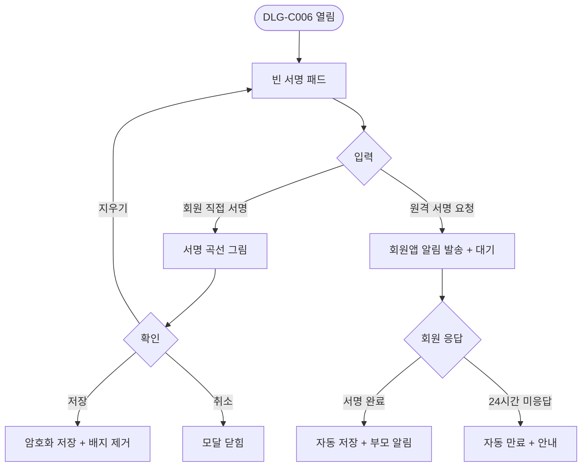
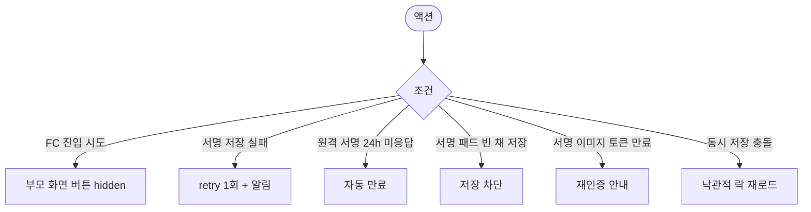

# DLG-C006 서명 다이얼로그

## 1. 다이얼로그 메타 정보

| 항목 | 값 |
|---|---|
| 작성일 | 2026-05-22 |
| 버전 | v1.0 |
| 상태 | 정합화 완료 |
| 도메인 | D04 수업관리 |
| 다이얼로그 ID | DLG-C006 |
| 다이얼로그명 | 서명 |
| 부모 화면 | SCR-C002 수업관리, SCR-C011 유효 수업 |
| 호출 트리거 | PT 수업 완료 후 [서명] 버튼 / 서명 미수령 노랑 배지 클릭 |
| 기능코드 | CLS-02, CLS-11 |
| 계약코드 | CLS-02 |
| 인접 다이얼로그 | DLG-C005 수업기록상세 |

## 2. 다이얼로그 개요와 목적

PT 수업 완료 시 회원의 디지털 서명을 받는 모달입니다. 태블릿 또는 회원 디바이스에서 서명 패드를 표시해 회원이 직접 서명하고, 저장 시 서명 이미지가 암호화되어 보관됩니다. 분쟁 대응 시 DLG-C005에서 통합 조회되며 5년 이상 보관됩니다. 골프 레슨은 강사 + 회원 쌍방서명을 지원하고 일반 PT는 강사 서명 중심으로 간소화됩니다.

## 3. 호출 트리거와 진입 시 초기값

SCR-C002 수업관리 또는 SCR-C011 유효 수업의 완료 상태 행에서 [서명] 버튼을 누르면 빈 서명 패드로 열립니다. 서명 미수령 노랑 배지를 클릭해도 같은 모달이 열리며 운영자가 회원에게 다시 서명을 요청할 수 있습니다.

## 4. 레이아웃과 입력 항목

모달 상단에는 수업명·강사·일시·회원명이 표시됩니다. 본문 중앙에는 큰 서명 패드 영역이 있어 손가락 또는 스타일러스로 서명을 받습니다. 서명 패드 아래에는 [지우기] 버튼이 있어 다시 그릴 수 있게 합니다.

골프 레슨 등 양방향 서명 정책 활성 수업에서는 강사 서명 패드와 회원 서명 패드가 동시에 노출되며 두 영역 모두 입력 후 저장 가능합니다.

회원 부재 시 원격 후속 서명 옵션이 있어, 운영자가 [원격 서명 요청]을 누르면 회원앱에 서명 요청 알림이 발송되고 회원이 본인 디바이스에서 서명 후 자동 저장됩니다.

모달 하단에는 [저장] / [취소] / [원격 서명 요청] 버튼이 있습니다.

## 5. 액션과 검증

[저장]은 서명 이미지를 암호화해 클라우드에 저장하고 부모 화면의 서명 미수령 배지를 제거합니다. 저장 직전 미리보기가 표시되어 운영자가 의도한 서명인지 확인할 수 있습니다. [지우기]는 서명 패드를 비우고 다시 그릴 수 있게 합니다. [취소]는 변경 없이 모달을 닫습니다. [원격 서명 요청]은 회원앱에 서명 요청 알림을 발송하고 모달이 대기 상태로 전환되며 회원이 서명하면 자동 저장 후 알림이 부모 화면에 전달됩니다.

## 6. 화면 상태와 예외 처리

기본 표시는 빈 서명 패드입니다. 서명 입력 중 상태는 실시간으로 곡선이 그려집니다. 저장 직전 미리보기 상태에서는 서명 이미지가 축소 표시되고 확인을 받습니다. 원격 서명 대기 상태에서는 "회원 응답을 기다리는 중..." 안내와 함께 모달이 대기합니다. 저장 실패 상태에서는 retry 1회 후 실패 시 운영자에게 알림이 표시됩니다.

예외로 FC의 서명 시도는 버튼 자체가 부모 화면에서 숨겨져 진입 차단, 서명 이미지 저장 실패는 retry 1회 + 알림, 원격 서명 요청 후 회원 미응답 24시간 경과는 자동 만료 처리됩니다.

## 7. 권한별 동작

owner / manager / trainer가 본인 담당 PT 수업의 서명 요청을 처리할 수 있습니다. fc / staff는 서명 권한이 없어 부모 화면에서 [서명] 버튼이 보이지 않습니다. readonly는 진입 차단됩니다.

## 8. 부모 화면과의 상호작용

저장 성공 시 모달이 닫히고 부모 행의 서명 미수령 노랑 배지가 즉시 제거됩니다. DLG-C005 수업 기록 상세에서도 서명 이미지가 즉시 표시 가능합니다. 원격 서명 요청 시 부모 행에 "원격 서명 대기 중" 라벨이 추가되고 회원 응답 시 자동 해제됩니다.

## 9. 데이터 흐름과 외부 연동

API는 서명 저장 `POST /api/lessons/:id/signature`, 원격 서명 요청 `POST /api/lessons/:id/signature/remote-request`입니다. 서명 이미지는 클라이언트에서 PNG/SVG로 인코딩 후 서버에 전송되며 서버는 암호화 저장 + 토큰 기반 권한 검증을 통해서만 노출합니다.

회원앱은 webhook으로 원격 서명 요청을 받아 회원에게 푸시 알림을 발송하고, 회원이 본인 디바이스에서 서명하면 자동 동기화됩니다. 모든 서명 저장은 SCR-097 감사 로그에 기록됩니다.

## 10. 메인 흐름

## 11. 에러와 예외 흐름

## 12. 디자인 요청사항

서명 패드는 모달 중앙에서 큰 영역으로 표현되어 회원이 자연스럽게 서명할 수 있어야 합니다. 모바일·태블릿 모두에서 매끄러운 곡선 입력이 보장되어야 합니다. [지우기] 버튼은 패드 우상단에 작게 배치되어 우발적 클릭이 적게 일어나야 합니다. 저장 직전 미리보기는 큰 미리보기 + [확인] / [다시 그리기] 두 버튼으로 명확한 선택을 요구합니다.

원격 서명 대기 상태는 부드러운 로딩 애니메이션 + "회원이 서명 중입니다" 안내로 운영자가 다른 업무를 할 수 있게 합니다. 양방향 서명(골프 레슨)은 강사·회원 영역이 좌우로 명확히 분리되어 누가 어디에 서명해야 하는지 즉시 알 수 있어야 합니다.

## 13. 운영 정책

PT 수업 완료 시 회원 서명이 필수이며 미수령 시 노랑 배지로 표시됩니다(테넌트 정책에 따라 GX는 선택). 서명 이미지는 암호화 저장 + 권한 검증 후 노출되며 5년 보관됩니다.

골프 레슨은 양방향 서명(강사 + 회원 쌍방)을 지원하고 일반 PT는 강사 서명 중심으로 간소화됩니다. 회원 부재 시 원격 후속 서명 플로우(회원앱 알림 + 회원 디바이스 서명)가 지원되며 24시간 미응답 시 자동 만료됩니다.

서명 권한은 트레이너·매니저+에 한정되며 FC·스태프·readonly는 부모 화면에서 [서명] 버튼이 보이지 않습니다. 모든 서명 저장·실패·재시도는 감사 로그에 기록됩니다. 서명 이미지는 클라이언트→서버 전송 시 HTTPS + 토큰 기반 인증으로 보호되며 외부 공유는 허용되지 않습니다.
