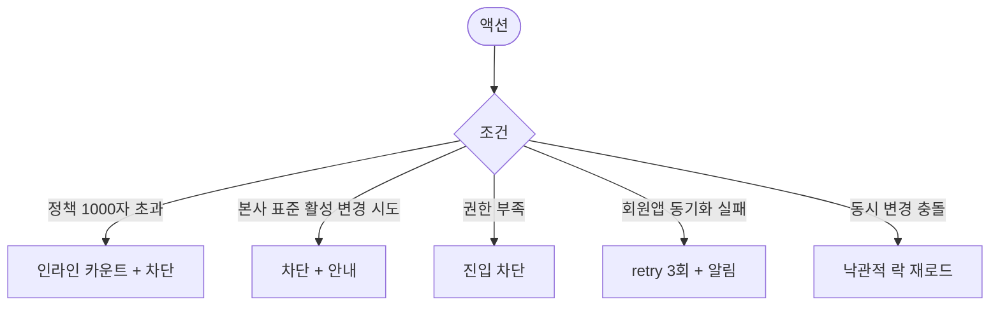

# DLG-C007 노쇼/취소 정책 다이얼로그

## 1. 다이얼로그 메타 정보

| 항목 | 값 |
|---|---|
| 작성일 | 2026-05-22 |
| 버전 | v1.0 |
| 상태 | 정합화 완료 |
| 도메인 | D04 수업관리 |
| 다이얼로그 ID | DLG-C007 |
| 다이얼로그명 | 노쇼/취소 정책 |
| 부모 화면 | SCR-C008 페널티관리, SCR-C009 일정요청처리 |
| 호출 트리거 | 페널티 정책 설정 탭 [노쇼/취소 정책] / 일정 요청 처리 시 정책 참조 |
| 기능코드 | CLS-08 |
| 계약코드 | CLS-08 |
| 인접 다이얼로그 | DLG-C015 자동페널티정책 |

## 2. 다이얼로그 개요와 목적

회원이 회원앱 마이페이지·예약 화면에서 사전 인지할 수 있도록 운영자가 노쇼·취소 정책 텍스트를 정의하는 모달입니다. 늦은 취소 기준 시간(예: 수업 시작 2시간 전)과 페널티 내용을 함께 명시해 분쟁 발생률을 줄입니다. SCR-C009 일정 요청 처리 화면에서는 본 정책의 늦은 취소 기준을 기준으로 자동 거절 추천을 수행합니다.

## 3. 호출 트리거와 진입 시 초기값

SCR-C008 페널티 정책 설정 탭의 [노쇼/취소 정책] 버튼으로 진입하며 기존 정책 텍스트와 늦은 취소 기준 시간이 미리 채워진 상태로 열립니다. SCR-C009에서는 정책 참조 용도로 별도 열리지 않으며, 자동 거절 추천 시 정책 문구가 토스트로 인용됩니다.

## 4. 레이아웃과 입력 항목

모달 상단에는 "노쇼/취소 정책" 제목이 표시됩니다. 본문 입력 항목은 정책 텍스트(textarea, 최대 1000자, 회원앱에 그대로 노출), 늦은 취소 기준 시간(드롭다운: 1시간/2시간/4시간/6시간/24시간), 노쇼 시 페널티 내용 요약, 늦은 취소 시 페널티 내용 요약입니다.

수업 유형별 차등 정책이 활성된 테넌트에서는 PT·GX·필라테스 등 유형별 정책을 별도 탭으로 입력할 수 있습니다.

모달 하단에는 [저장] / [취소] / [회원앱 미리보기] 버튼이 있습니다.

## 5. 액션과 검증

[저장]은 정책 텍스트를 저장하고 회원앱에 즉시 자동 노출됩니다. [회원앱 미리보기]는 회원앱에 실제로 표시될 모습을 모달 내부 미리보기 영역에 띄워 운영자가 확인할 수 있게 합니다. [취소]는 변경 없이 모달을 닫습니다. 본사 예외 정책이 활성된 테넌트에서는 변경이 차단되고 안내가 표시됩니다.

## 6. 화면 상태와 예외 처리

기본 표시는 기존 정책 + 늦은 취소 기준이 채워진 상태입니다. 본사 표준 활성 상태에서는 모든 입력이 잠금 처리되고 "본사 예외 정책" 안내가 표시됩니다. 처리 중에는 [저장] 버튼이 비활성화됩니다.

예외로 정책 텍스트 1000자 초과는 인라인 카운트로 차단, 권한 부족(FC/스태프/readonly)은 진입 차단, 본사 표준 변경 시도는 차단됩니다.

## 7. 권한별 동작

owner / manager가 정책을 변경할 수 있습니다. trainer / fc / staff / readonly는 진입 차단됩니다. 본사 예외 정책 활성 시 슈퍼관리자·primary만 변경 가능합니다.

## 8. 부모 화면과의 상호작용

[저장] 시 SCR-C008 정책 설정 탭의 표시 값이 즉시 갱신되고 회원앱 자동 노출이 트리거됩니다. SCR-C009 일정 요청 처리에서 정책 위반 판정 기준도 본 모달의 설정값을 따릅니다.

## 9. 데이터 흐름과 외부 연동

API는 정책 조회 `GET /api/penalties/policy`, 변경 `PUT /api/penalties/policy`입니다. 회원앱은 정책 변경 webhook을 받아 정책 화면을 갱신하고, SCR-C009 자동 거절 추천 로직은 늦은 취소 기준 시간을 실시간 참조합니다. 변경은 SCR-097 감사 로그에 기록됩니다.

## 10. 메인 흐름

```mermaid
flowchart TD
    A([DLG-C007 열림]) --> B[기존 정책 + 기준 시간 표시]
    B --> C{사용자 액션}
    C -->|정책 텍스트 수정| D[1000자 검증]
    C -->|기준 시간 변경| E[드롭다운 선택]
    C -->|[회원앱 미리보기]| F[미리보기 영역 표시]
    C -->|[저장]| G[저장 + 회원앱 webhook]
    C -->|[취소]| H[모달 닫힘]
    G --> I[SCR-C008 갱신 + SCR-C009 정책 반영]
    G --> J[회원앱 자동 노출]
```

## 11. 에러와 예외 흐름



## 12. 디자인 요청사항

정책 텍스트 영역은 markdown 또는 줄바꿈 지원 textarea로 회원앱에서 가독성 있게 표시되도록 합니다. 회원앱 미리보기는 모달 내부에 작은 핸드폰 프레임 형태로 표시되어 실제 노출 모습을 직관적으로 확인할 수 있게 합니다. 본사 표준 활성 상태는 잠금 아이콘 + 안내 텍스트로 명확히 표시됩니다.

## 13. 운영 정책

노쇼/취소 정책은 회원앱에 자동 노출되어 사전 인지를 통한 분쟁 감소를 돕습니다. 늦은 취소 기준 시간 기본값은 수업 시작 2시간 전이며 수업별 차등 설정이 가능합니다. 본사 예외 정책 활성 시 지점 변경이 차단되어 표준화가 보장됩니다.

정책 변경은 매니저+ 권한이며 모든 변경은 감사 로그에 기록됩니다. SCR-C009 일정 요청 처리에서 정책 위반(예: 시작 2시간 전 이내 취소 요청) 판정 기준은 본 모달의 설정값을 실시간 참조합니다. 회원앱 동기화 실패 시 retry 3회 후 운영자에게 알림이 발송되어 누락을 방지합니다.
