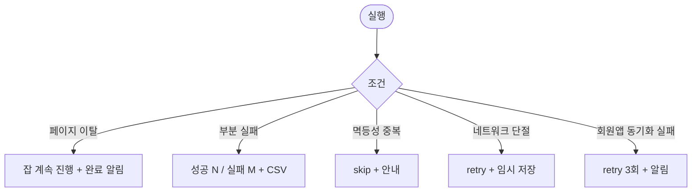

# DLG-C008 일괄 생성 확인 다이얼로그

## 1. 다이얼로그 메타 정보

| 항목 | 값 |
|---|---|
| 작성일 | 2026-05-22 |
| 버전 | v1.0 |
| 상태 | 정합화 완료 |
| 도메인 | D04 수업관리 |
| 다이얼로그 ID | DLG-C008 |
| 다이얼로그명 | 일괄 생성 확인 |
| 부모 화면 | SCR-C003 시간표일괄등록 |
| 호출 트리거 | 페이지 하단 [일괄 생성] 버튼 |
| 기능코드 | CLS-03 |
| 계약코드 | CLS-03 |

## 2. 다이얼로그 개요와 목적

시간표 일괄 등록 화면에서 [일괄 생성] 버튼을 누르면 열리는 최종 확인 모달입니다. 운영자가 의도와 다르게 대량의 일정을 생성하는 사고를 막기 위해 총 생성 건수, 제외 건수, 충돌 건수를 카드 형태로 명확히 보여주고 [확인] 후에야 백그라운드 잡이 시작됩니다.

## 3. 호출 트리거와 진입 시 초기값

SCR-C003 페이지 하단의 [일괄 생성] 버튼을 누르면 미리보기 결과(총 N건, 제외 M건, 충돌 K건)가 자동 채워진 상태로 열립니다.

## 4. 레이아웃과 표시 항목

모달 상단에는 "총 N건의 일정을 생성하시겠습니까?" 제목이 표시됩니다. 본문에는 카드 3개가 나란히 배치됩니다.

총 생성 건수 카드: 백그라운드 잡으로 실제 생성될 일정 수
제외 건수 카드: 사용자 제외 + 공휴일 자동 제외 + 멱등성 중복 skip 합계
충돌 건수 카드: 미리보기에서 사용자가 체크 해제한 충돌 일정 수

각 카드는 큰 숫자로 표시되어 운영자가 한눈에 비율을 비교할 수 있습니다. 모달 하단에는 [확인] / [취소] 버튼이 있습니다.

## 5. 액션과 검증

[확인]을 누르면 백그라운드 잡이 시작되고 모달이 닫힙니다. 진행률 토스트가 화면 우상단에 표시되며 100건 초과는 비동기 잡으로 처리됩니다. [취소]는 변경 없이 모달을 닫고 입력값은 SCR-C003에서 그대로 유지됩니다.

## 6. 화면 상태와 예외 처리

기본 표시는 미리보기 결과가 채워진 상태입니다. 처리 중 상태에서는 모달이 즉시 닫히고 부모 화면에 진행률 토스트가 떠 있습니다. 완료 상태에서는 SCR-C001 캘린더로 자동 이동하며 성공 토스트가 표시됩니다. 부분 실패 상태는 결과 카드 + 실패 리포트 CSV가 제공됩니다.

예외로 백그라운드 잡 시작 직후 페이지 이탈 시 잡은 계속 진행되어 완료 시 알림 센터에 결과가 푸시됩니다. 멱등성 중복은 자동 skip 처리되고 안내가 표시됩니다.

## 7. 권한별 동작

매니저 이상이 [확인]을 누를 수 있습니다. 트레이너는 본인 담당 시간표만 가능하며 본인 강사 선택이 강제됩니다. FC·스태프·readonly는 SCR-C003 진입이 차단되므로 본 모달에 도달하지 않습니다.

## 8. 부모 화면과의 상호작용

[확인] 후 모달이 즉시 닫히고 SCR-C003 페이지에 진행률 토스트가 떠 있습니다. 완료 시 SCR-C001 캘린더로 자동 이동하며 새로 생성된 일정이 캘린더에 표시됩니다. 부분 실패 시 결과 카드 + 실패 CSV가 SCR-C003에 표시되어 실패 건만 재시도할 수 있게 합니다.

## 9. 데이터 흐름과 외부 연동

API는 일괄 등록 실행 `POST /api/lessons/bulk-create`입니다. 백그라운드 잡 진행률은 폴링 또는 WebSocket으로 전달되며 결과는 batch_id 단위로 묶여 SCR-097 감사 로그에 기록됩니다. 등록 즉시 회원앱 노출 webhook이 발사되어 신규 슬롯이 예약 가능 상태로 노출됩니다. 미승인 정책 활성 테넌트는 신규 등록이 "미승인"으로 시작되고 Owner(지점장) 알림이 발송됩니다.

## 10. 메인 흐름

```mermaid
flowchart TD
    A([DLG-C008 열림]) --> B[3개 카드 표시]
    B --> C{사용자 액션}
    C -->|[확인]| D[백그라운드 잡 시작 + 진행률 토스트]
    C -->|[취소]| E[모달 닫힘 + 입력값 유지]
    D --> F{결과}
    F -->|전부 성공| G[SCR-C001 이동 + 성공 토스트]
    F -->|부분 실패| H[결과 카드 + 실패 CSV]
    F -->|멱등성 중복| I[skip + 안내]
```

## 11. 에러와 예외 흐름



## 12. 디자인 요청사항

3개 카드는 동일 크기 + 큰 숫자 + 색상 구분(녹·노·빨)으로 운영자가 한눈에 결과를 인지할 수 있어야 합니다. 충돌 건수가 0보다 크면 강조 색상으로 시선을 끌어 운영자가 의도를 다시 한번 확인하게 합니다. [확인] 버튼은 큰 주 액션 색상으로, [취소]는 보조 색상으로 명확히 구분되어 잘못 클릭하지 않게 합니다.

## 13. 운영 정책

100건 초과 일괄 등록은 백그라운드 비동기 잡으로 처리되며 페이지를 떠나도 잡은 계속 진행됩니다. 동일 조건(강사·시간·장소·날짜) 중복은 멱등성 키로 skip 처리되어 중복 등록이 방지됩니다. 부분 실패 시 성공분 유지 + 실패 목록 별도 표시 방식으로 운영자가 같은 작업을 처음부터 다시 하지 않게 합니다.

등록 후 30분 이내에는 SCR-C003의 [전체 취소] 버튼으로 batch_id 기준 일괄 롤백이 가능합니다. 모든 등록 결과는 batch_id로 묶여 감사 로그에 기록되어 사후 추적이 가능합니다. 미승인 정책 활성 테넌트는 신규 등록이 "미승인" 상태로 시작되어 owner 이상 승인이 필요합니다.
