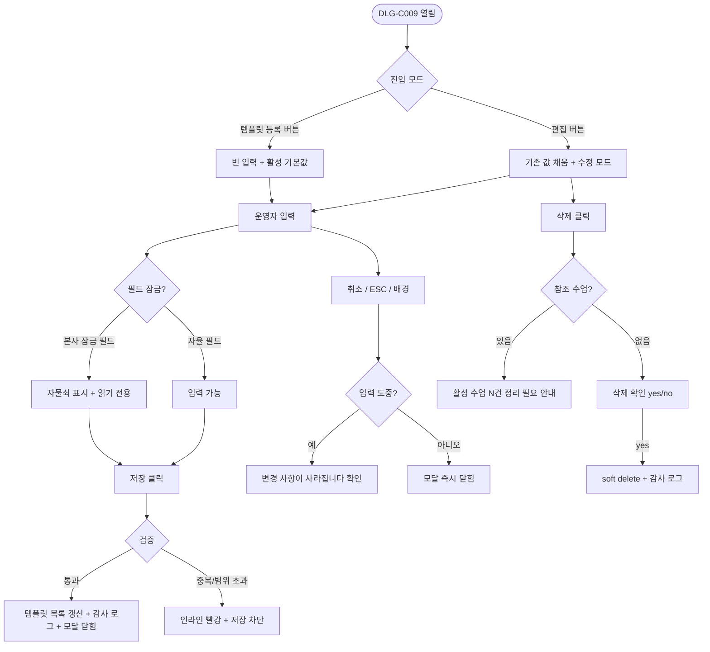

# DLG-C009 템플릿 등록/수정 다이얼로그

## 1. 다이얼로그 메타 정보

| 항목 | 값 |
|---|---|
| 작성일 | 2026-05-22 |
| 버전 | v1.0 |
| 상태 | 정합화 완료 |
| 도메인 | D04 수업관리 |
| 다이얼로그 ID | DLG-C009 |
| 다이얼로그명 | 그룹 수업 템플릿 등록/수정 |
| 부모 화면 | SCR-C004 그룹수업템플릿 |
| 호출 트리거 | "템플릿 등록" 버튼 / 템플릿 행의 [편집] 버튼 |
| 기능코드 | CLS-04 |
| 계약코드 | CLS-04 |
| 인접 다이얼로그 | DLG-C001 수업등록수정_캘린더, DLG-C003 수업등록수정_관리 |

## 2. 다이얼로그 개요와 목적

그룹 수업 템플릿을 새로 만들거나 기존 템플릿의 기본값을 수정하는 단일 모달입니다. 템플릿은 캘린더(SCR-C001)나 시간표 일괄 등록(SCR-C003)에서 새 수업을 만들 때 수업명·정원·장소·길이·색상·강습 세션 유형 같은 반복 입력을 한 번에 자동 채워 주는 출처가 되므로, 이 모달의 입력값은 곧 센터 운영자가 실제로 수업을 등록할 때 보는 기본값이 됩니다. 한 번 잘 만들어 둔 템플릿은 수십·수백 번 재사용되므로, 작은 오기 하나가 운영 전반에 누적된다는 점을 고려해 필수값 검증과 활성/비활성 토글이 신중하게 다뤄집니다.

## 3. 호출 트리거와 진입 시 초기값

상단의 "템플릿 등록" 버튼으로 열리면 모든 입력이 비어 있는 신규 모드로 시작하고, 활성 여부 토글의 기본값은 "활성"입니다. 템플릿 목록의 [편집] 버튼으로 열리면 기존 템플릿의 모든 값이 미리 채워진 수정 모드로 시작되며, 모달 헤더가 "템플릿 수정"으로 바뀝니다. 수정 모드에서는 템플릿 ID가 내부적으로 보존되어 저장 시 PUT 호출로 매핑되고, 신규 모드에서는 POST 호출로 새 ID가 발급됩니다. 수정 모드에서 활성 → 비활성으로 토글이 바뀌었을 때는 모달 하단에 "비활성 후에는 새 수업 등록 시 이 템플릿이 보이지 않아요"라는 작은 안내가 노출됩니다.

## 4. 레이아웃과 입력 항목

모달 헤더에는 "템플릿 등록" 또는 "템플릿 수정" 제목과 닫기 X 버튼이 있습니다.

본문 입력 항목은 다음과 같습니다. 수업명(필수, 텍스트 1~40자), 수업 유형 단일 선택(GX·스피닝·필라테스·기구필라테스·기타 - 기타 선택 시 자유 입력 보조 필드 활성), 강습 세션 유형 단일 선택(PT·필라테스·스트레칭·테라피 - KPI 집계 대상 수업일 때 필수, 비대상이면 "선택 안 함"), 기본 정원(필수, 1~100 정수), 기본 장소 드롭다운(SCR-080 센터 설정에 등록된 장소만 노출, 권한 부족 시 비활성), 기본 수업 시간(필수, 30~240분 30분 단위), 색상 6종 팔레트 단일 선택(기본값은 자동 배정), 활성 여부 토글(활성/비활성), 설명 textarea(선택, 0~200자)입니다.

모달 하단에는 [저장] 버튼과 [취소] 버튼이 있습니다. 수정 모드에서는 [저장] 좌측에 [삭제] 버튼이 추가로 노출되며, 누르면 별도의 yes/no 확인 후 템플릿을 삭제합니다.

## 5. 액션과 검증

[저장] 버튼은 클릭 시 백엔드에서 수업명 중복(같은 지점 내 활성 템플릿), 강습 세션 유형 누락(KPI 대상일 때), 정원·시간 범위가 검증됩니다. 통과되면 템플릿 목록에 즉시 반영되고 모달이 닫히면서 "템플릿이 저장되었어요" 성공 토스트가 표시됩니다. 검증 실패 시에는 모달 내부의 해당 필드 옆에 빨강 인라인 메시지가 표시되고 [저장] 버튼은 비활성 상태로 유지됩니다.

[삭제] 버튼(수정 모드 한정)은 클릭 시 "이 템플릿을 삭제하시겠습니까?" yes/no 확인 후, 이미 생성된 수업과의 연결은 끊지 않으면서(과거 수업의 강습 세션 유형 라벨은 그대로 보존) 신규 수업 등록 시 더 이상 보이지 않도록 soft delete 처리합니다. 활성 수업이 이 템플릿을 참조하고 있으면 삭제는 차단되고 "이 템플릿을 사용 중인 활성 수업이 N건 있어요. 먼저 정리해 주세요"라는 안내가 표시됩니다.

[취소] 버튼은 변경 없이 모달을 닫지만 입력 도중이면 "변경 사항이 사라집니다. 닫으시겠습니까?" 확인을 한 번 더 묻습니다. ESC 키와 배경 클릭도 같은 동작입니다.

## 6. 화면 상태와 예외 처리

기본 표시 상태는 부모 화면에서 받은 최신 값으로 시작합니다. 입력/수정 중 상태는 필수값 누락·형식 오류·권한 제한을 인라인 메시지로 표시합니다. 저장/처리 중 상태에서는 주요 버튼이 비활성화되어 중복 요청을 막습니다. 완료 상태에서는 성공 토스트와 함께 모달이 닫히고 부모 화면이 갱신됩니다. 실패 상태에서는 실패 사유가 토스트 또는 인라인으로 안내되고 입력값은 유지됩니다.

예외 케이스로 수업명 중복·정원 범위 초과·시간 범위 초과·강습 세션 유형 누락·활성 수업이 참조 중인 템플릿 삭제 시도·동시 편집 충돌(낙관적 락)·장소 권한 부족이 있으며 각각 인라인 빨강 안내와 함께 저장 또는 삭제가 차단됩니다. 본사 표준 템플릿이 적용된 테넌트에서는 일부 필드(수업명·강습 세션 유형)가 본사에 의해 잠겨 있어 지점 사용자는 변경할 수 없으며, 잠긴 필드 옆에는 자물쇠 아이콘과 "본사 표준 정책으로 잠긴 필드입니다"라는 툴팁이 표시됩니다.

## 7. 권한별 동작

owner / manager는 모든 입력과 활성/비활성 토글, 삭제까지 수행할 수 있습니다. 본사 표준 정책이 적용된 테넌트에서도 지점 자율 필드(정원·기본 장소·기본 시간·색상·설명)는 수정할 수 있고, 본사 잠금 필드(수업명·강습 세션 유형)는 잠금 상태로 노출됩니다. trainer / fc / staff는 조회만 가능하며 [저장]과 [삭제] 버튼이 비활성화 또는 숨김 처리되고, 입력 필드도 read-only로 표시됩니다. readonly는 진입 자체가 차단되어 부모 화면에서 권한 안내가 표시됩니다. 슈퍼관리자와 본사 최고관리자는 본사 표준 템플릿의 잠금 필드까지 모두 수정할 수 있습니다.

## 8. 부모 화면과의 상호작용

저장 성공 시 모달이 닫히고 SCR-C004 템플릿 목록 테이블의 해당 행이 즉시 갱신되거나 새 행이 맨 위에 추가됩니다. 비활성으로 토글된 템플릿은 캘린더(SCR-C001)와 일괄 등록(SCR-C003)의 템플릿 드롭다운에서 자동으로 숨겨지며, 새로 만든 활성 템플릿은 즉시 드롭다운에 노출됩니다. 삭제 성공 시에는 부모 행이 사라지면서 "템플릿을 삭제했어요" 토스트가 표시됩니다.

## 9. 데이터 흐름과 외부 연동

API는 신규 등록 `POST /api/class-templates`, 수정 `PUT /api/class-templates/:id`, 삭제 `DELETE /api/class-templates/:id`, 참조 수업 카운트 `GET /api/class-templates/:id/reference-count`입니다. 삭제 직전에 참조 카운트가 다시 호출되어 활성 수업과의 연결이 재확인됩니다. 모든 등록·수정·삭제는 SCR-097 감사 로그에 `actor`·`template_id`·`before`·`after`·`timestamp`로 비동기 INSERT됩니다. 강습 세션 유형 4종은 SCR-D003 KPI 대시보드의 강습세션수 집계 원천 중 하나이며, 템플릿 단계에서 KPI 대상 수업의 세션 유형을 미리 정의해 두면 캘린더에서 등록할 때 자동으로 채워져 누락이 방지됩니다.

## 10. 메인 흐름



## 11. 에러와 예외 흐름

```mermaid
flowchart TD
    A([저장 검증]) --> B{조건}
    B -->|수업명 중복| C["이미 같은 이름의 활성 템플릿이 있어요"]
    B -->|정원 범위 초과| D["1~100 사이로 입력해 주세요"]
    B -->|수업 시간 범위 초과| E["30~240분 사이 30분 단위로 입력해 주세요"]
    B -->|강습 세션 유형 누락 (KPI 대상)| F["KPI 집계 대상은 강습 세션 유형이 필수예요"]
    B -->|본사 잠금 필드 변경 시도| G[자물쇠 안내 + 변경 차단]
    B -->|장소 권한 부족| H[드롭다운 비활성]
    B -->|동시 편집 충돌| I[최신 값 재로드 안내]
    B -->|삭제 시 참조 수업 존재| J["활성 수업 N건 정리 필요"]
```

## 12. 디자인 요청사항

수업명과 수업 유형은 모달 상단에 가장 큰 시각적 영역으로 배치되어 사용자가 먼저 입력하게 유도합니다. 강습 세션 유형 필드는 KPI 집계 대상 안내 툴팁과 함께 표시되어, KPI를 의도한 운영자가 누락 없이 입력할 수 있어야 합니다. 색상 팔레트 6종은 캘린더에서 보이는 실제 색상으로 미리보기를 함께 표시해, 선택 직후 실제 캘린더에서 어떻게 보일지 직관적으로 알 수 있게 합니다. 활성/비활성 토글은 비활성으로 변경하는 순간 작은 안내 문구가 즉시 노출되어 사용자가 의도를 한 번 더 확인하게 합니다. 본사 잠금 필드는 자물쇠 아이콘과 회색 톤 배경으로 시각적으로 명확히 구분되어, 지점 사용자가 잘못 누르지 않도록 표현됩니다.

## 13. 운영 정책

수업 유형(GX·스피닝·필라테스·기구필라테스·기타)과 강습 세션 유형(PT·필라테스·스트레칭·테라피)은 별도 축으로 관리되며 절대 섞지 않습니다. 수업 유형은 상품/매출/장소 분류 축이고, 강습 세션 유형은 KPI 산출용 4종 고정값입니다. 본사 표준 템플릿이 적용된 테넌트에서는 수업명과 강습 세션 유형이 본사에 의해 잠겨 있어 지점 변경이 차단되며, 이는 본사 KPI 집계의 일관성을 보장하기 위한 정책입니다. 정원과 기본 장소·시간·색상·설명은 지점 자율 영역으로 유지됩니다.

비활성 처리된 템플릿은 신규 수업 등록 시 드롭다운에서 숨겨지지만, 과거 수업과의 연결은 끊지 않습니다. 이는 과거 수업의 강습 세션 유형 라벨이 사라져 KPI 집계가 왜곡되는 것을 막기 위한 정책입니다. 삭제(soft delete)도 같은 원칙으로 동작하며, 활성 수업이 이 템플릿을 참조 중이면 삭제가 차단되어 데이터 무결성을 유지합니다.

모든 등록·수정·삭제는 감사 로그에 5초 안에 기록되어 SCR-097에서 조회 가능해야 하며, 권한 부족 계정의 모달 진입은 부모 화면에서 차단됩니다. 백엔드 403 응답은 권한 안내 토스트로 안내되어, 우회 시도가 사후에 추적 가능합니다.
