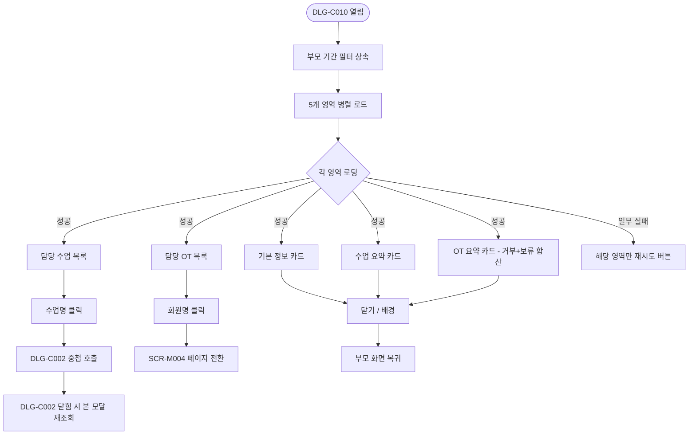
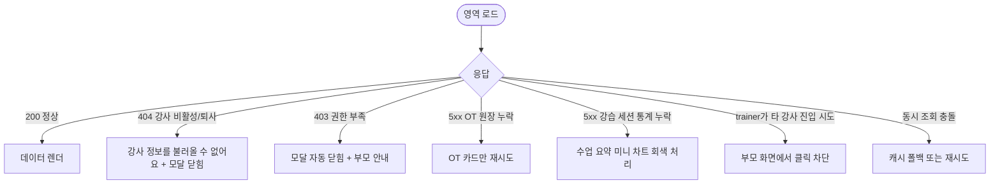

# DLG-C010 강사 상세 다이얼로그

## 1. 다이얼로그 메타 정보

| 항목 | 값 |
|---|---|
| 작성일 | 2026-05-22 |
| 버전 | v1.0 |
| 상태 | 정합화 완료 |
| 도메인 | D04 수업관리 |
| 다이얼로그 ID | DLG-C010 |
| 다이얼로그명 | 강사 상세 (근무 현황 + OT 진행) |
| 부모 화면 | SCR-C006 강사근무현황 |
| 호출 트리거 | SCR-C006 강사 행 클릭 |
| 기능코드 | CLS-06 |
| 계약코드 | CLS-06, KPI-OT |
| 인접 다이얼로그 | DLG-C002 일정상세, DLG-C005 수업기록상세 |

## 2. 다이얼로그 개요와 목적

특정 강사의 기본 정보와 함께, 선택된 기간 동안의 담당 수업 요약과 OT 배정·진행 요약을 한 화면에서 빠르게 확인하는 조회 전용 모달입니다. 별도의 강사 상세 페이지로 이동하지 않고도 매니저가 "이 강사가 이번 주 몇 건의 수업을 진행했고, OT는 어디까지 와 있는지"를 즉시 파악할 수 있도록 설계되어 있습니다. OT 1·2차 진행 상태와 거부+보류 합산, OT 이월 건은 04/29 운영 기준에 따라 강사 단위로 분리되어 표시되며, 강습 세션 유형 4종(PT·필라테스·스트레칭·테라피)별 분포도 함께 보여 트레이너별 KPI 기여도를 직관적으로 비교할 수 있게 합니다.

## 3. 호출 트리거와 진입 시 초기값

SCR-C006 강사 근무 현황 화면에서 강사 행의 빈 영역 또는 강사명을 클릭하면 모달이 열립니다. 모달이 열릴 때는 부모 화면의 기간 필터(기본: 이번 주)가 그대로 상속되어, 같은 기간 기준의 강사 요약이 즉시 표시됩니다. 부모 화면에서 강습 세션 유형 필터가 적용되어 있더라도, 모달 안에서는 4종 분포를 모두 보여 주어 트레이너 한 명의 전체 분포를 한눈에 비교할 수 있게 합니다. 진입 시점에 강사 기본 정보 카드·기간 내 수업 요약·OT 요약·담당 수업 목록·담당 OT 목록 다섯 영역이 병렬로 로드되며, 한 영역에서 로딩이 실패해도 다른 영역은 정상 표시됩니다.

## 4. 레이아웃과 입력 항목

모달 헤더에는 강사 이름과 역할(트레이너 / GX 강사 등)이 큰 글씨로 표시되고, 우측에 닫기 X 버튼이 있습니다.

본문 영역은 위에서 아래로 다섯 개의 카드 섹션이 쌓입니다. 첫 번째는 강사 기본 정보 카드로 프로필 사진, 이름, 역할, 연락처(마지막 4자리 마스킹 옵션), 담당 수업 유형 태그(PT·GX·필라테스 등)가 표시됩니다. 두 번째는 기간 내 수업 요약 카드로 총 수업 건수, 총 근무 시간, 수업 유형별 분포(PT N건 · GX N건 · 필라테스 N건 · 기타 N건), 강습 세션 유형별 분포(PT · 필라테스 · 스트레칭 · 테라피 각각의 완료 수업수)가 미니 차트와 함께 표시됩니다. 세 번째는 기간 내 OT 요약 카드로 O.T 배정 합계, O.T 1 완료, O.T 2 완료, O.T 1·2 예정, OT 거절(거부+보류 합산), OT 이월 건이 각각의 숫자 배지로 표시됩니다. 네 번째는 담당 수업 목록 테이블로 수업명·날짜·시간·장소·예약 현황·출석 처리 상태가 최근순으로 정렬됩니다. 다섯 번째는 담당 OT 목록 테이블로 회원명·등록일·구분(강습/골프)·OT 1 일자와 진행 상태·OT 2 일자와 진행 상태·등록 여부가 한 행으로 표시됩니다.

모달 하단에는 [닫기] 버튼만 있으며, 별도의 [저장]이나 변경 액션 버튼은 없습니다. 다만 담당 수업 목록의 행은 클릭 가능하여 DLG-C002 일정상세를 호출할 수 있고, 담당 OT 목록의 회원명은 클릭 시 SCR-M004 회원 상세로 이동합니다.

## 5. 액션과 검증

이 모달은 조회 전용이므로 변경 검증이 없습니다. 클릭 가능한 보조 동작은 다음과 같습니다. 담당 수업 목록의 수업명 클릭은 DLG-C002 일정상세를 모달 위에 중첩으로 호출하며, DLG-C002를 닫으면 본 모달로 되돌아옵니다. 담당 OT 목록의 회원명 클릭은 SCR-M004 회원 상세 페이지로 페이지 자체가 전환되며, 본 모달은 자동으로 닫힙니다. 닫기 X 또는 배경 클릭은 즉시 모달을 닫고 부모 화면으로 복귀합니다.

## 6. 화면 상태와 예외 처리

기본 표시 상태는 부모 화면에서 받은 기간 필터로 다섯 영역을 동시에 로드합니다. 로딩 중 상태는 각 카드 자리에 스켈레톤이 표시되며, 영역별로 독립 로딩이 일어납니다. 부분 실패 상태는 한 영역(예: OT 요약)이 로드 실패한 경우 해당 영역에 "데이터를 불러오지 못했어요" 안내와 [재시도] 버튼이 노출되고 다른 영역은 정상 표시됩니다. 완료 상태에서는 모든 영역이 정상 데이터를 보여 줍니다. 실패 상태는 권한 부족(403) 또는 강사 비활성·퇴사 처리 등으로 모달 진입이 차단된 경우이며, "이 강사의 정보를 불러올 수 없어요" 안내와 함께 자동으로 모달이 닫힙니다.

예외 케이스로 강사 비활성/퇴사·OT 데이터 원장 누락·강습 세션 유형 통계 누락·동시 조회 충돌이 있으며 각각 해당 영역에서 빈 상태 또는 부분 실패 표시로 안내됩니다. 트레이너가 본인 이외 강사의 모달을 강제로 열려고 하면 백엔드 403이 반환되어 자동으로 닫힙니다.

## 7. 권한별 동작

owner / manager / superAdmin / primary는 모든 영역을 조회할 수 있습니다. 본사 통합 모드에서는 본사 권한자가 모든 지점의 강사 모달을 열 수 있고, 일반 매니저는 자기 지점 강사만 열 수 있습니다. trainer는 본인 본인 모달에 한해 조회 가능하며, 다른 강사의 모달은 진입 자체가 차단됩니다(부모 화면에서 다른 강사 행이 클릭 차단). fc / staff는 조회만 가능하고 OT 요약 카드의 일부 민감 필드(매출 환산 등이 추가될 경우)는 숨김 처리됩니다. readonly는 진입 자체가 차단되며 부모 화면에서 권한 안내가 표시됩니다.

## 8. 부모 화면과의 상호작용

본 모달은 SCR-C006 강사 근무 현황의 기간 필터를 그대로 상속해서 같은 시점의 강사 요약을 보여 줍니다. 모달을 닫으면 부모 화면이 그대로 유지되며, 부모 화면의 강사 목록·필터·선택 상태는 변하지 않습니다. 모달 안에서 DLG-C002 일정상세를 중첩으로 열고 거기서 일정을 수정한 경우(권한 있는 사용자), DLG-C002를 닫으면 본 모달도 자동으로 데이터 재조회를 트리거해 최신 수업 카운트가 반영됩니다. 회원명 클릭으로 SCR-M004로 이동한 경우에는 페이지 자체가 전환되므로 부모 화면도 함께 사라지고, 브라우저 뒤로가기로 돌아오면 강사 근무 현황 화면의 기존 상태로 복귀합니다.

## 9. 데이터 흐름과 외부 연동

API는 강사 기본 정보 `GET /api/staff/:id`, 기간 내 수업 요약 `GET /api/staff/:id/lessons-summary?from=&to=`, OT 요약 `GET /api/staff/:id/ot-summary?from=&to=`, 담당 수업 목록 `GET /api/staff/:id/lessons?from=&to=`, 담당 OT 목록 `GET /api/staff/:id/ot-list?from=&to=`입니다. 다섯 개 API가 병렬로 호출되어 영역별 독립 로딩을 보장합니다.

데이터 원천은 다음과 같이 분리됩니다. O.T 배정 합계 / O.T 1 / O.T 2는 `[강습업무보고]` 주간보고 E:G열 트레이너별 행 기준입니다. 담당 OT 진행 상태(1차 진행·2차 진행·등록 여부)는 `[OT관리-강습]` OT현황 J/Q/T/V열입니다. OT 거절은 `[OT관리-강습]` OT현황 V열에서 `거부+보류`를 함께 집계합니다. 강습 세션 유형별 수업수는 수업/출석/일정 원장의 강습 세션 유형 필드를 기준으로 PT·필라테스·스트레칭·테라피별 완료 수업수를 집계합니다.

모달 조회는 SCR-097 감사 로그에 별도로 기록되지 않으며(조회 전용), 다만 본사 권한자가 다른 지점 강사 모달을 열었을 때만 감사 로그에 `actor_id`·`viewed_staff_id`·`timestamp`로 기록되어 본사 모드 접근 패턴이 추적됩니다.

## 10. 메인 흐름

## 11. 에러와 예외 흐름

## 12. 디자인 요청사항

강사 기본 정보 카드는 모달 상단에 큰 시각적 영역으로 배치되며, 프로필 사진이 시선의 출발점이 되어야 합니다. 기간 내 수업 요약과 OT 요약은 같은 줄에 좌우로 배치되어 "수업"과 "OT"라는 두 운영 트랙을 한눈에 비교할 수 있게 합니다. OT 요약 카드의 거부+보류 합산은 작은 툴팁으로 "거부와 보류를 합산한 값입니다(04/29 기준)"라는 설명이 따라붙어, 매니저가 숫자의 의미를 오해하지 않게 합니다. OT 이월 건은 별도 배지로 강조되어 부담 편중 판단을 돕습니다.

강습 세션 유형 4종 분포는 미니 막대 또는 도넛 차트로 표현되어, PT·필라테스·스트레칭·테라피가 시각적으로 어떤 비중을 차지하는지 즉시 인지되어야 합니다. 담당 수업 목록과 담당 OT 목록은 두 개의 별도 테이블로 구분되어, 하나의 영역으로 합쳐 보여 트레이너가 혼란을 겪지 않도록 합니다. 부분 실패 영역은 회색 톤의 친화적 안내와 [재시도] 버튼이 함께 표시되어, 전체 모달을 다시 열지 않아도 해당 영역만 복구할 수 있게 합니다.

## 13. 운영 정책

OT는 정규 PT 세션과 분리된 영업 파이프라인으로 관리되며, OT 등록 전환율은 일반 PT 완료율과 합산하지 않습니다(04/29 운영 기준). OT 거부율의 거절 건은 `거부+보류`를 함께 집계해 운영자가 단일 지표로 부담 편중을 판단할 수 있게 합니다. OT 이월률의 분모는 OT 배정 인원으로 표시하되, `OT 진행` 기준과의 구분이 필요한 산식이므로 본 모달에서도 동일한 정책으로 표현되어야 합니다.

강습 세션 유형 4종(PT·필라테스·스트레칭·테라피)은 본사 KPI 강습세션수의 공식 원천이며, GX 세부 종목 6종은 상품/매출 분류 축으로 본 카드와 섞지 않습니다. 트레이너 개인 현황에는 OT 배정 합계와 OT 1·2차 완료·예정이 함께 보여, 본사·매니저가 강사별 업무 부하 편중을 한눈에 판단할 수 있도록 보장합니다.

trainer 권한자는 본인 모달만 조회 가능하며, 본사 통합 모드의 본사 권한자가 다른 지점 강사 모달을 연 경우에만 감사 로그에 조회 이벤트가 기록됩니다. 이는 본사 모드의 조회 패턴을 사후에 추적하기 위한 보안 정책입니다.
