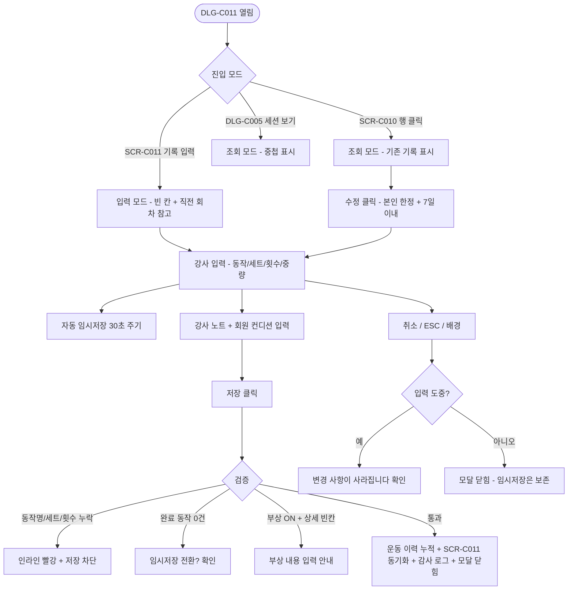
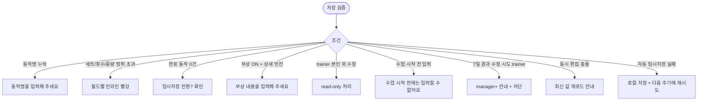

# DLG-C011 세션 상세 다이얼로그

## 1. 다이얼로그 메타 정보

| 항목 | 값 |
|---|---|
| 작성일 | 2026-05-22 |
| 버전 | v1.0 |
| 상태 | 정합화 완료 |
| 도메인 | D04 수업관리 |
| 다이얼로그 ID | DLG-C011 |
| 다이얼로그명 | PT 세션 상세 (운동 기록 + 강사 노트) |
| 부모 화면 | SCR-C010 운동프로그램관리 |
| 호출 트리거 | SCR-C010 세션 행 클릭 / DLG-C005 수업기록상세 "세션 기록 보기" / SCR-C011 유효 수업 "세션 기록 입력" |
| 기능코드 | CLS-10 |
| 계약코드 | CLS-10, CLS-11 |
| 인접 다이얼로그 | DLG-C005 수업기록상세, DLG-C006 서명 |

## 2. 다이얼로그 개요와 목적

개별 PT 세션에서 진행된 운동 내용과 강사 노트를 상세하게 기록하고 조회하는 모달입니다. 세션별로 어떤 동작을 몇 세트·몇 회·몇 kg으로 진행했는지, 회원 컨디션은 어땠는지, 부상이나 통증이 있었는지, 다음 세션에 무엇을 제안할지를 한 화면에서 입력하고 저장해 두면, 회원의 운동 이력이 누적되어 다음 세션 계획과 회원 피드백에 그대로 활용됩니다. 입력 모드(세션 직후 작성)와 조회 모드(과거 기록 확인)가 같은 모달 안에서 분기되며, 입력 모드에서 저장하면 즉시 회원의 운동 이력에 누적되고 SCR-C011 유효 수업 목록에 "기록 완료" 상태로 동기화됩니다.

## 3. 호출 트리거와 진입 시 초기값

SCR-C010 운동 프로그램 관리에서 특정 세션 기록 행을 클릭하면 조회 모드로 열리며, 기존 기록이 모두 미리 채워진 상태입니다. DLG-C005 수업기록상세에서 "세션 기록 보기" 버튼을 누르면 같은 조회 모드로 열리고, 부모 모달 위에 중첩으로 노출됩니다. SCR-C011 유효 수업 목록에서 수업 완료 후 "세션 기록 입력" 버튼을 누르면 입력 모드로 열리며, 운동 프로그램(SCR-C010에서 회원에게 사전 배정된 프로그램)이 자동으로 불러와져 동작 목록이 빈 칸 상태로 미리 정렬되어 있습니다. 입력 모드 진입 시점에 회원의 직전 세션 기록이 회색 톤의 보조 표시로 동작 옆에 노출되어, 강사가 직전 회차의 무게·횟수를 참고하면서 이번 세션 값을 채울 수 있게 합니다.

## 4. 레이아웃과 입력 항목

모달 헤더에는 회원명·세션 회차(예: "김지훈님 / 3회차")·날짜와 시간이 표시되고, 우측에 닫기 X 버튼이 있습니다.

본문 영역은 위에서 아래로 다섯 개의 섹션이 쌓입니다. 첫 번째는 세션 기본 정보 카드로 수업명(회원명 포함), 날짜와 시간, 담당 강사가 읽기 전용으로 표시됩니다. 두 번째는 운동 프로그램 영역으로 해당 세션에 배정된 프로그램명과 프로그램 설명이 보입니다. 세 번째는 운동 기록 목록 테이블로, 동작명(필수)·세트 수(1~99)·반복 횟수 또는 시간(횟수는 1~999, 시간은 분 단위 1~180)·중량(0~999kg, 0은 맨몸 운동)·완료 여부 체크박스·동작별 메모(0~100자) 컬럼이 한 행으로 배치됩니다. 동작 행은 [+ 동작 추가] 버튼으로 자유롭게 늘릴 수 있고, 행 우측의 X 버튼으로 제거할 수 있습니다. 네 번째는 강사 노트 영역으로 세션 전체 코멘트와 다음 세션 제안을 자유롭게 입력하는 textarea(0~500자)가 있습니다. 다섯 번째는 회원 컨디션 기록 영역으로 당일 컨디션 단일 선택(좋음·보통·나쁨), 부상·통증 여부 토글, 부상 상세 textarea(부상 토글이 ON일 때만 노출)가 있습니다.

모달 하단에는 입력 모드일 때 [저장] 버튼과 [임시저장] 버튼과 [취소] 버튼이 있고, 조회 모드일 때는 [닫기] 버튼만 있습니다. 입력 모드에서 작성자(담당 강사) 본인이 다시 열면 [수정] 버튼이 노출되어 조회 → 입력 모드로 전환할 수 있습니다.

## 5. 액션과 검증

[저장] 버튼은 클릭 시 동작 목록의 행 중 하나라도 동작명·세트·횟수가 비어 있으면 인라인 에러가 표시되고 저장이 차단됩니다. 완료 체크박스가 하나도 켜져 있지 않은 상태에서 저장하려고 하면 "완료한 동작이 하나도 없어요. 임시저장으로 전환할까요?"라는 확인 팝업이 뜨고, 사용자는 임시저장 또는 일반 저장을 선택할 수 있습니다. 저장 성공 시 모달이 닫히고 부모 화면의 세션 행이 "기록 완료" 상태로 갱신되며, "세션 기록을 저장했어요" 성공 토스트가 표시됩니다. 동시에 SCR-C011 유효 수업 목록의 해당 수업 행도 자동으로 "기록 완료"로 동기화됩니다.

[임시저장] 버튼은 검증 없이 현재 입력값을 그대로 저장하며, 모달은 닫히지 않고 헤더 우측에 "임시저장됨 HH:mm" 인디케이터가 표시됩니다. 임시저장된 기록은 운동 이력에는 누적되지 않고, 강사 본인이 같은 세션을 다시 열었을 때 입력값이 그대로 복원됩니다. 자동 임시저장은 30초마다 백그라운드로 실행되어, 강사가 명시적으로 [저장]을 누르지 않아도 데이터 손실이 최소화됩니다.

[취소] 버튼은 변경 없이 모달을 닫지만 입력 도중이면 "변경 사항이 사라집니다. 닫으시겠습니까?" 확인을 한 번 더 묻습니다. 임시저장된 데이터는 취소해도 보존됩니다. ESC 키와 배경 클릭도 같은 동작입니다.

## 6. 화면 상태와 예외 처리

기본 표시 상태는 부모 화면에서 받은 세션 ID로 기록을 불러옵니다. 입력/수정 중 상태는 필수값 누락·범위 초과·권한 제한을 인라인 메시지로 표시합니다. 저장/처리 중 상태에서는 주요 버튼이 비활성화되어 중복 요청을 막습니다. 완료 상태에서는 성공 토스트와 함께 모달이 닫히고 부모 화면이 갱신됩니다. 실패 상태에서는 실패 사유가 토스트 또는 인라인으로 안내되고 입력값은 유지됩니다.

예외 케이스로 동작명 누락·세트/횟수/중량 범위 초과·완료 동작 0건 저장 시도·강사 본인 아닌 사용자의 수정 시도·세션 시작 전 입력 시도·동시 편집 충돌(낙관적 락)이 있으며 각각 인라인 빨강 안내 또는 read-only 처리됩니다. 회원이 부상·통증을 ON으로 표시했는데 부상 상세 textarea가 비어 있으면 저장이 차단되고 "부상 내용을 입력해 주세요"라는 안내가 표시됩니다.

## 7. 권한별 동작

담당 강사(trainer)는 본인이 진행한 세션에 한해 입력·수정·저장을 모두 수행할 수 있습니다. owner / manager는 모든 강사의 세션 기록을 조회할 수 있고, 트레이너 퇴사 등 운영 예외 상황에서는 manager+ 권한으로 사후 수정도 가능합니다. fc / staff는 조회만 가능하며 입력 필드가 read-only로 표시됩니다. readonly는 진입 자체가 차단됩니다. 회원 자신(회원앱)이 본인 세션 기록을 조회하는 것은 별도의 회원앱 화면에서 처리되며, 본 모달은 운영자용입니다.

세션 시작 시각 이전에 강사가 입력 모드로 진입하려고 하면 "수업 시작 전에는 기록을 입력할 수 없어요"라는 안내와 함께 차단되며, 수업 종료 후 7일 이상 경과한 기록은 trainer가 수정할 수 없고 manager+ 권한자만 수정 가능합니다(현장 기록 책임 강화 정책).

## 8. 부모 화면과의 상호작용

저장 성공 시 모달이 닫히고 부모 화면(SCR-C010 또는 DLG-C005 또는 SCR-C011)의 해당 세션 행이 "기록 완료" 상태로 즉시 갱신됩니다. 동시에 SCR-C011 유효 수업 목록의 동일 수업 행도 "기록 완료"로 동기화되어, 매니저가 어느 수업의 기록이 누락되었는지 한눈에 추적할 수 있게 합니다. DLG-C005에서 "세션 기록 보기"로 진입한 경우에는 본 모달이 DLG-C005 위에 중첩되며, 본 모달을 닫으면 DLG-C005로 되돌아갑니다. 임시저장만 된 상태로 모달을 닫으면 부모 화면 행은 "임시저장" 회색 배지로 표시되며 강사가 나중에 다시 열어 완료할 수 있게 합니다.

## 9. 데이터 흐름과 외부 연동

API는 세션 조회 `GET /api/sessions/:id`, 신규 기록 `POST /api/sessions/:id/record`, 기록 수정 `PUT /api/sessions/:id/record`, 임시저장 `POST /api/sessions/:id/draft`, 직전 세션 조회 `GET /api/sessions/:id/previous`입니다. 자동 임시저장은 30초 주기로 백그라운드 호출되며, 사용자가 명시적으로 저장하지 않더라도 데이터 손실이 최소화됩니다.

운동 프로그램 정보는 SCR-C010에서 사전 배정된 프로그램 ID를 통해 동작 목록 템플릿이 자동 로드됩니다. 저장된 기록은 회원 운동 이력 원장(`workout_history` 또는 동등 테이블)에 누적되며, 회원앱의 운동 이력 화면에서 회원이 직접 조회할 수 있습니다. SCR-C011 유효 수업 목록은 본 모달의 저장 이벤트를 webhook으로 받아 즉시 상태를 동기화합니다. 모든 입력·수정·임시저장은 SCR-097 감사 로그에 `actor`·`session_id`·`before`·`after`·`timestamp`로 비동기 INSERT됩니다.

## 10. 메인 흐름

## 11. 에러와 예외 흐름

## 12. 디자인 요청사항

운동 기록 목록 테이블은 모달의 가장 큰 시각적 영역을 차지하며, 동작 행이 충분히 넓게 표시되어 강사가 운동 중에도 한 손으로 빠르게 입력할 수 있어야 합니다. 직전 회차의 무게·횟수는 동작 옆에 회색 톤의 작은 보조 텍스트로 표시되어 현재 입력 영역과 시각적으로 분리되며, 강사가 참고하되 헷갈리지 않도록 합니다. 완료 체크박스는 행 좌측 끝에 충분히 큰 크기로 배치되어 운동 중 빠른 터치가 가능해야 합니다.

회원 컨디션 카드의 좋음·보통·나쁨은 색상으로 구분되되 너무 자극적이지 않은 톤(녹색·노랑·연한 빨강)을 사용해 회원에게 노출되어도 부담이 적도록 합니다. 부상·통증 토글이 ON으로 켜지는 순간 부상 상세 textarea가 부드러운 슬라이드 인 애니메이션으로 등장하여, 강사가 추가 입력이 필요함을 자연스럽게 인지하게 합니다.

자동 임시저장 인디케이터는 헤더 우측에 작은 글씨로 "임시저장됨 HH:mm"으로 표시되며, 데이터 손실이 없다는 안정감을 제공합니다. 모달 하단의 [저장]과 [임시저장] 버튼은 시각적으로 구분되어, 강사가 의도와 다르게 임시저장을 정식 저장으로 오인하지 않도록 합니다.

## 13. 운영 정책

세션 기록은 회원의 운동 이력과 직접 연결되어 다음 세션 계획과 회원 피드백의 원천 데이터가 되므로, 동작명·세트·횟수는 모두 필수 입력이며 자유 텍스트 누락이 허용되지 않습니다. 임시저장은 강사가 수업 도중 부분 입력 후 빠져나갈 수 있도록 보장하는 안전망이며, 운동 이력에 누적되지는 않습니다. 완료 동작 0건 저장은 사용자 의도 확인을 거쳐 임시저장으로 전환되거나 강제 저장됩니다.

trainer는 본인 세션에 한해 입력·수정 가능하며, 수업 종료 후 7일 이상 경과한 기록은 trainer가 수정할 수 없고 manager+ 권한자만 수정 가능합니다. 이는 현장 기록의 즉시성을 보장하고 사후 임의 수정으로 인한 회원 분쟁을 예방하기 위한 정책입니다. 회원의 부상·통증이 기록된 세션은 회원 상세(SCR-M004)의 건강 정보에도 자동 반영되어, 다음 세션 담당자가 사전에 위험 요소를 인지할 수 있게 합니다.

모든 입력·수정·임시저장은 감사 로그에 5초 안에 기록되어 SCR-097에서 조회 가능해야 하며, 권한 부족 계정의 모달 진입은 부모 화면에서 차단됩니다. 자동 임시저장 실패 시 로컬 스토리지에 백업되어 네트워크 복구 후 일괄 동기화되며, 멱등성 키(`session_id + draft_seq`)로 중복이 차단됩니다.
