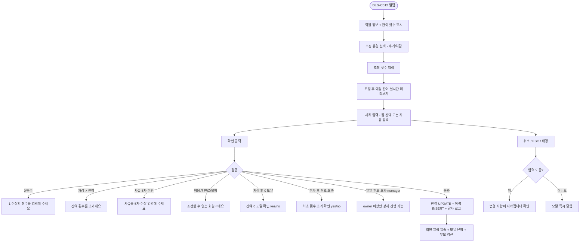
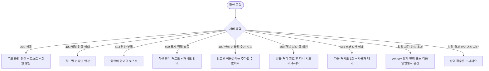

# DLG-C012 횟수 조정 다이얼로그

## 1. 다이얼로그 메타 정보

| 항목 | 값 |
|---|---|
| 작성일 | 2026-05-22 |
| 버전 | v1.0 |
| 상태 | 정합화 완료 |
| 도메인 | D04 수업관리 |
| 다이얼로그 ID | DLG-C012 |
| 다이얼로그명 | PT 횟수 수동 조정 |
| 부모 화면 | SCR-C007 횟수관리 |
| 호출 트리거 | 횟수관리 회원 행의 [조정] 버튼 |
| 기능코드 | CLS-07 |
| 계약코드 | CLS-07 |
| 인접 다이얼로그 | DLG-C013 차감이력 |

## 2. 다이얼로그 개요와 목적

회원의 PT 잔여 횟수를 관리자가 수동으로 추가하거나 차감하는 모달입니다. 수업이 자동으로 차감되지 않았거나(시스템 오류·예약 없는 출석), 환불 처리에 따라 사용분만큼 되돌려야 하거나, 이벤트 보상으로 추가 횟수를 지급해야 하거나, 잘못 차감된 횟수를 정정해야 할 때 사용합니다. 조정 한 건마다 사유 입력이 필수이며 모든 조정 이력은 DLG-C013 차감 이력에서 시간순으로 추적되므로, 본 모달의 입력값은 곧 운영 책임의 추적 증거가 됩니다.

## 3. 호출 트리거와 진입 시 초기값

SCR-C007 횟수 관리 화면의 회원 행에서 [조정] 버튼을 클릭하면 모달이 열립니다. 모달이 열릴 때 회원명, 이용권명, 현재 잔여 횟수가 자동으로 채워져 읽기 전용으로 상단에 표시되고, 조정 유형은 "추가"로 기본 선택되어 있으며, 조정 횟수 입력 필드는 빈 상태로 시작합니다. 사유 텍스트 박스 옆에는 사전 정의된 사유 칩(수업 취소 보상, 오류 정정, 이벤트 추가, 환불 정산, 기타) 5개가 노출되어 운영자가 빠르게 선택할 수 있게 합니다. 칩을 누르면 사유 텍스트 박스에 칩의 라벨이 자동 입력되고, "기타"를 선택한 경우에는 사유 입력 필드가 필수로 잠금 해제됩니다.

## 4. 레이아웃과 입력 항목

모달 헤더에는 "횟수 조정" 제목과 닫기 X 버튼이 있습니다.

본문 영역은 위에서 아래로 다섯 개의 섹션이 쌓입니다. 첫 번째는 회원 정보 카드로 회원명, 이용권명, 현재 잔여 횟수가 큰 글씨로 읽기 전용 표시됩니다. 두 번째는 조정 유형 선택으로 "추가"와 "차감" 라디오 버튼이 가로로 나란히 배치됩니다. 세 번째는 조정 횟수 입력으로 1 이상의 양의 정수만 입력 가능한 숫자 필드이며, 차감 모드에서는 현재 잔여 횟수를 초과한 값이 입력되면 인라인 빨강 안내가 즉시 표시됩니다. 네 번째는 조정 후 예상 잔여 횟수 카드로, 입력값이 바뀔 때마다 실시간 미리보기(예: "현재 8회 → 조정 후 10회")가 갱신됩니다. 다섯 번째는 조정 사유 영역으로 사전 정의 사유 칩 5개와 자유 입력 textarea(필수, 5~200자)가 함께 배치됩니다.

모달 하단에는 [확인] 버튼과 [취소] 버튼이 있습니다. [확인] 버튼은 모든 검증을 통과해야만 활성화됩니다.

## 5. 액션과 검증

[확인] 버튼은 클릭 시 다음 검증이 수행됩니다. 첫째, 조정 횟수가 1 이상의 양의 정수인지 확인합니다. 둘째, 차감 모드에서 조정 횟수가 현재 잔여 횟수를 초과하지 않는지 확인합니다(예: 잔여 3회에서 5회 차감 시도 시 차단). 셋째, 사유 텍스트가 최소 5자 이상인지 확인합니다. 넷째, 동시 편집 충돌이 있는지(다른 운영자가 같은 회원의 횟수를 동시에 조정 중인지) 낙관적 락으로 확인합니다. 다섯 가지 검증을 모두 통과하면 즉시 회원의 잔여 횟수가 갱신되고, 조정 이력에 `actor`·`member_id`·`type`(추가/차감)·`amount`·`reason`·`timestamp`로 INSERT되며, "횟수를 조정했어요" 성공 토스트가 표시되면서 모달이 닫힙니다.

차감 모드에서 조정 결과가 0이 되는 경우, 모달 하단에 "조정 후 잔여 횟수가 0이 됩니다. 진행하시겠습니까?"라는 추가 확인이 한 번 더 표시됩니다. 추가 모드에서 조정 결과가 이용권 상품의 최초 횟수보다 커지는 경우(예: 10회권에서 12회 보유 상태가 되는 경우), 모달에 "최초 구매 횟수를 초과하는 추가입니다. 정말 진행하시겠습니까?"라는 안내가 표시되어 운영자가 의도를 한 번 더 확인하게 합니다.

[취소] 버튼은 변경 없이 모달을 닫지만 입력 도중이면 "변경 사항이 사라집니다. 닫으시겠습니까?" 확인을 한 번 더 묻습니다. ESC 키와 배경 클릭도 같은 동작입니다.

## 6. 화면 상태와 예외 처리

기본 표시 상태는 부모 화면에서 받은 회원의 최신 잔여 횟수로 시작합니다. 입력/수정 중 상태는 필수값 누락·범위 초과·권한 제한을 인라인 메시지로 표시합니다. 저장/처리 중 상태에서는 주요 버튼이 비활성화되어 중복 요청을 막습니다. 완료 상태에서는 성공 토스트와 함께 모달이 닫히고 부모 화면이 갱신됩니다. 실패 상태에서는 실패 사유가 토스트 또는 인라인으로 안내되고 입력값은 유지됩니다.

예외 케이스로 조정 횟수 0 또는 음수 입력·차감 시 잔여 초과·사유 5자 미만·이용권 만료/탈퇴 회원 조정 시도·동시 편집 충돌(낙관적 락)·만료 이용권의 횟수 추가 시도·환불 처리 중 회원 조정 시도가 있으며 각각 인라인 빨강 안내와 함께 저장이 차단됩니다.

## 7. 권한별 동작

owner / manager / superAdmin / primary는 추가·차감 모두 수행 가능합니다. 본사 통합 모드의 본사 권한자는 모든 지점 회원의 횟수를 조정할 수 있고, 일반 매니저는 자기 지점 회원만 조정할 수 있습니다. fc / staff는 모달 진입 자체가 차단되며 부모 화면의 [조정] 버튼이 보이지 않습니다. trainer는 본인 담당 회원에 한해 모달을 열 수 있지만 [확인] 버튼은 manager+ 승인이 필요한 흐름으로 동작하여(승인 요청 모드), 트레이너가 단독으로 횟수를 변경할 수 없게 합니다. readonly는 진입 자체가 차단됩니다.

차감 모드에서 일일 차감 한도(센터별 정책 설정에서 정의)를 초과하면 manager 권한자도 차단되며, owner 이상만 강제 진행할 수 있습니다. 이는 운영자의 실수로 회원 횟수가 대량 차감되는 사고를 막기 위한 정책입니다.

## 8. 부모 화면과의 상호작용

저장 성공 시 모달이 닫히고 SCR-C007 횟수 관리의 해당 회원 행이 즉시 새로운 잔여 횟수로 갱신됩니다. 동시에 DLG-C013 차감 이력에 새 이력 행이 추가되며, 운영자가 바로 [이력] 버튼으로 확인할 수 있습니다. 회원 상세(SCR-M004)의 이용권 카드에서도 잔여 횟수가 자동 갱신되며, 환불 정산이 필요한 차감의 경우 SCR-S007 결제 화면에 환불 안내가 함께 표시됩니다. 회원에게는 NFR-19 알림 센터를 통해 "PT 횟수가 N회 조정되었어요" 알림이 자동 발송됩니다(센터 정책에 따라 발송 여부 설정 가능).

## 9. 데이터 흐름과 외부 연동

API는 조정 처리 `POST /api/members/:id/punches/adjust`, 동시 편집 검증 `GET /api/members/:id/punches/lock-check`입니다. 조정 처리 요청 본문에는 `type`(add/subtract), `amount`, `reason`, `actor_id`, `version`(낙관적 락용 버전 토큰)이 포함됩니다. 조정 결과는 트랜잭션 안에서 잔여 횟수 UPDATE와 차감 이력 INSERT가 동시에 수행되어, 한쪽만 반영되는 부분 실패가 발생하지 않습니다.

조정 이벤트는 SCR-097 감사 로그에 `actor`·`member_id`·`action=PUNCH_ADJUST`·`type`·`amount`·`before`·`after`·`reason`·`timestamp`로 비동기 INSERT되며, 5초 안에 SCR-097에서 조회 가능합니다. 회원 알림은 NFR-19 알림 센터를 통해 회원앱 푸시 또는 SMS로 발송되며, 발송 여부와 채널은 센터 설정(SCR-080)에서 사전 정의됩니다. 환불 정산이 필요한 경우 결제 도메인(SCR-S007)으로 환불 안내 webhook이 전달되어, 운영자가 후속 환불 처리를 끊김 없이 이어갈 수 있게 합니다.

## 10. 메인 흐름

## 11. 에러와 예외 흐름

## 12. 디자인 요청사항

회원 정보 카드는 모달 상단에 큰 시각적 영역으로 배치되어 운영자가 "지금 누구의 횟수를 조정하고 있는지"를 즉시 인지할 수 있어야 합니다. 조정 유형 라디오는 추가는 녹색 톤, 차감은 빨강 톤으로 색상이 분기되어 시각적으로 명확히 구분됩니다. 조정 후 예상 잔여 횟수 카드는 입력값 변경 시 부드러운 숫자 카운트 애니메이션으로 갱신되어, 운영자가 결과를 직관적으로 확인할 수 있게 합니다.

사유 칩 5개는 가장 자주 쓰이는 사유부터 순서대로 배치되어 빠른 선택을 돕고, "기타" 칩을 누르면 자유 입력 textarea로 시선이 자동 이동되어 키 입력 가능 상태가 되어야 합니다. 추가 확인 yes/no 팝업은 조정 결과의 운영 위험도가 높을 때(잔여 0 도달, 최초 횟수 초과, 일일 한도 초과)에만 노출되어, 일반 조정 흐름에서는 클릭 한 번으로 완료되도록 마찰을 최소화합니다.

## 13. 운영 정책

PT 횟수의 자동 차감은 출석 처리(CLS-14, RSV-01)에서 멱등성 키로 수행되며, 본 모달의 수동 조정은 어디까지나 자동 차감이 실패한 경우의 사후 정정이나 운영 보상·환불 정산을 위한 예외적 도구입니다. 따라서 본 모달의 사용 빈도가 높은 센터는 출석/예약 흐름에 문제가 있다고 봐야 하며, 본사가 사후에 사용 패턴을 모니터링합니다.

차감 모드에서 결과가 음수가 되는 조정은 절대 허용되지 않으며, 추가 모드에서 최초 구매 횟수를 초과하는 조정은 owner 이상의 의도 확인을 받습니다. 일일 차감 한도는 센터 정책 설정에서 정의되며 manager는 한도 내에서만 차감이 가능하고, 초과 시 owner 이상의 강제 진행 또는 다음 영업일로 분산이 필요합니다. 이는 운영자의 실수로 회원 횟수가 한꺼번에 대량 차감되어 분쟁이 발생하는 것을 막기 위한 정책입니다.

조정 사유는 모든 케이스에서 필수이며 최소 5자 이상이어야 합니다. 사유 누락 또는 부실 사유("ㅇ", "오류" 등)는 사후 회원 분쟁 시 운영 책임을 추적하기 어렵게 만들므로, 본사는 사유 텍스트 품질을 정기적으로 모니터링합니다. 모든 조정은 감사 로그에 5초 안에 기록되고, 회원에게는 NFR-19 알림이 자동 발송되어 회원이 본인의 횟수 변동을 즉시 인지할 수 있도록 보장합니다.
