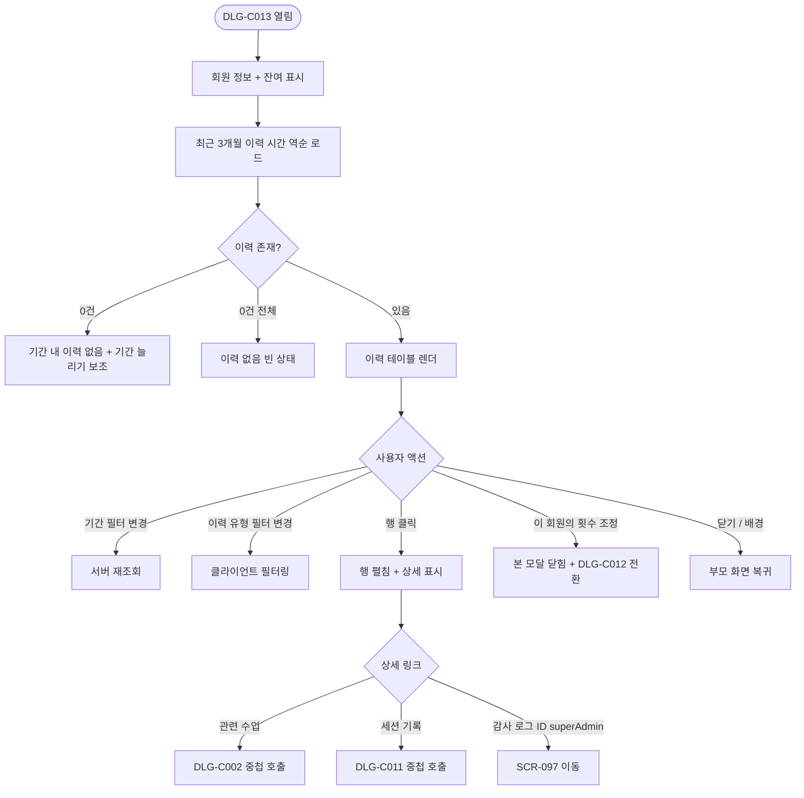
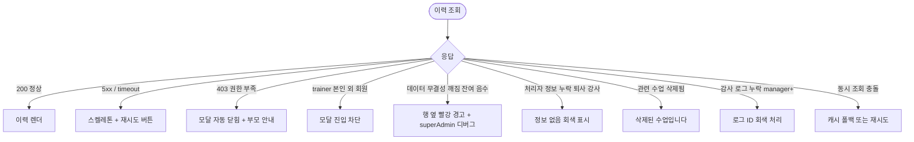

# DLG-C013 차감 이력 다이얼로그

## 1. 다이얼로그 메타 정보

| 항목 | 값 |
|---|---|
| 작성일 | 2026-05-22 |
| 버전 | v1.0 |
| 상태 | 정합화 완료 |
| 도메인 | D04 수업관리 |
| 다이얼로그 ID | DLG-C013 |
| 다이얼로그명 | PT 횟수 차감/조정 이력 |
| 부모 화면 | SCR-C007 횟수관리 |
| 호출 트리거 | 횟수관리 회원 행의 [이력] 버튼 |
| 기능코드 | CLS-07 |
| 계약코드 | CLS-07 |
| 인접 다이얼로그 | DLG-C012 횟수조정 |

## 2. 다이얼로그 개요와 목적

특정 회원의 PT 횟수가 어떤 수업에서 언제 차감되었는지, 또는 관리자가 수동으로 추가·차감 조정한 이력이 어떻게 누적되었는지를 시간순으로 조회하는 모달입니다. 회원이 "왜 횟수가 이렇게 줄었나요?"라고 이의를 제기하거나, 매니저가 잔여 횟수가 예상과 다른 원인을 추적할 때, 또는 환불 정산 시 출석 처리 vs 수동 조정의 비율을 확인할 때 사용합니다. 모든 이력은 영구 보관되어 분쟁 대응의 증거가 되며, 본 모달은 그 영구 보관 데이터를 가장 사용자 친화적인 방식으로 보여 주는 창입니다.

## 3. 호출 트리거와 진입 시 초기값

SCR-C007 횟수 관리 화면의 회원 행에서 [이력] 버튼을 클릭하면 모달이 열립니다. 모달이 열릴 때 회원명, 이용권명, 현재 잔여 횟수가 자동으로 채워져 읽기 전용으로 상단에 표시되고, 이력 목록 테이블에는 가장 최근 이력부터 시간 역순으로 최근 90일 분이 기본 로드됩니다. 기간 필터의 기본값은 "최근 3개월"이며, 사용자가 직접 기간을 늘리거나 줄여 더 과거 또는 더 좁은 범위를 조회할 수 있습니다. 이력이 한 건도 없는 신규 가입 회원의 경우 "아직 차감·조정 이력이 없어요"라는 빈 상태 안내가 표시되며, 이용권 구매 이력만 보이는 가장 첫 행이 단독으로 표시됩니다.

## 4. 레이아웃과 입력 항목

모달 헤더에는 "PT 횟수 이력" 제목과 회원명·이용권명, 우측에 닫기 X 버튼이 있습니다.

본문 영역은 위에서 아래로 세 개의 섹션이 쌓입니다. 첫 번째는 회원 정보 카드로 회원명, 이용권명, 현재 잔여 횟수, 최초 구매 횟수, 만료일이 한 줄로 표시됩니다. 두 번째는 기간 필터와 이력 유형 필터 바입니다. 기간 필터는 최근 1주 / 1개월 / 3개월(기본) / 6개월 / 전체 중 선택할 수 있는 칩 형태이며, 이력 유형 필터는 전체 / 수업 차감 / 수동 추가 / 수동 차감 / 구매 중 다중 선택 가능합니다. 세 번째는 이력 목록 테이블로, 컬럼은 좌측부터 날짜·시간(YYYY-MM-DD HH:mm), 이력 유형 배지(수업 차감/수동 추가/수동 차감/구매), 관련 수업명(수업 차감인 경우만), 변동 횟수(+N 또는 -N), 처리 후 잔여 횟수, 처리자(강사명 또는 관리자명), 사유(수동 조정인 경우만) 순서로 배치됩니다. 이력 한 행은 클릭으로 펼쳐져 추가 상세(세션 기록 링크·환불 정산 ID·감사 로그 ID)를 표시하며, 다시 클릭하면 접힙니다.

모달 하단에는 [닫기] 버튼만 있으며, 별도의 변경 액션은 없습니다. 다만 권한이 있는 사용자에게는 "이 회원의 횟수 조정" 보조 링크가 함께 노출되어, 누르면 본 모달을 닫고 DLG-C012 횟수 조정으로 전환됩니다.

## 5. 액션과 검증

이 모달은 조회 전용이므로 변경 검증이 없습니다. 클릭 가능한 보조 동작은 다음과 같습니다. 이력 행을 클릭하면 행이 펼쳐져 상세가 노출됩니다. 펼쳐진 상세 안의 관련 수업명 링크는 누르면 DLG-C002 일정상세를 중첩으로 호출하며, 세션 기록 링크는 DLG-C011 세션 상세를 호출합니다. 감사 로그 ID는 슈퍼관리자에게만 표시되며 누르면 SCR-097 감사 로그의 해당 ID로 직접 이동합니다. 기간 필터 칩을 누르면 즉시 재조회가 트리거되고, 이력 유형 필터를 변경하면 클라이언트 사이드 필터링으로 즉시 결과가 갱신됩니다(서버 재호출 없음).

[이 회원의 횟수 조정] 보조 링크는 권한이 있는 사용자(manager 이상)에게만 노출되며, 누르면 본 모달이 닫히면서 DLG-C012가 같은 회원의 컨텍스트로 즉시 열립니다.

## 6. 화면 상태와 예외 처리

기본 표시 상태는 최근 3개월 이력이 시간 역순으로 로드된 상태입니다. 로딩 중 상태는 테이블 자리에 행 모양의 스켈레톤이 표시됩니다. 빈 상태는 선택된 기간 내 이력이 0건일 때 "이 기간에는 이력이 없어요"와 [기간 늘리기] 보조 버튼이 표시됩니다. 완전 빈 상태는 회원에게 이력이 단 한 건도 없을 때 "아직 차감·조정 이력이 없어요" 안내가 표시됩니다. 오류 상태는 5xx 또는 timeout 시 [재시도] 버튼이 노출됩니다.

예외 케이스로 데이터 무결성 깨짐(처리 후 잔여 횟수가 음수)·처리자 정보 누락(퇴사한 강사·관리자)·관련 수업 삭제됨·감사 로그 누락이 있으며 각각 회색 톤의 "정보 없음" 안내 또는 "삭제된 수업입니다"로 표시됩니다. 데이터 무결성 깨짐이 감지되면 행 옆에 빨강 경고 아이콘이 표시되고, 슈퍼관리자에게만 디버그 정보가 노출됩니다.

## 7. 권한별 동작

owner / manager / superAdmin / primary는 모든 이력을 조회할 수 있고, "이 회원의 횟수 조정" 보조 링크가 노출됩니다. 본사 통합 모드에서 본사 권한자는 모든 지점 회원의 이력을 조회할 수 있고, 일반 매니저는 자기 지점 회원만 조회 가능합니다. trainer는 본인 담당 회원의 이력만 조회할 수 있고, 다른 강사가 담당한 수업 차감 이력의 처리자명은 마스킹되어 표시됩니다. fc / staff는 조회만 가능하며 보조 링크가 보이지 않습니다. readonly는 진입 자체가 차단되어 부모 화면에서 권한 안내가 표시됩니다.

감사 로그 ID는 슈퍼관리자에게만 노출되며, 일반 매니저에게는 행 펼침에서 해당 영역이 숨겨집니다. 이는 감사 로그 화면 자체가 슈퍼관리자 전용 영역이므로, ID를 알아도 일반 매니저는 접근할 수 없기 때문입니다.

## 8. 부모 화면과의 상호작용

본 모달은 조회 전용이므로 부모 화면(SCR-C007 횟수 관리)의 데이터를 변경하지 않습니다. 모달을 닫으면 부모 화면이 그대로 유지되며, 부모의 회원 목록·필터·선택 상태는 변하지 않습니다. "이 회원의 횟수 조정" 링크를 통해 DLG-C012로 전환된 경우에는 DLG-C012의 저장 결과가 부모 화면에 반영되며, DLG-C012가 닫힌 후 사용자가 다시 [이력] 버튼을 누르면 새로 추가된 조정 이력이 맨 위 행으로 표시됩니다.

DLG-C002 일정상세나 DLG-C011 세션 상세를 중첩으로 호출한 경우, 중첩 모달을 닫으면 본 모달의 같은 스크롤 위치로 정확히 되돌아갑니다. 사용자가 긴 이력 목록을 스크롤하다가 특정 행을 클릭해 상세를 확인한 후 본 모달로 돌아왔을 때 처음부터 다시 스크롤할 필요가 없도록 보장됩니다.

## 9. 데이터 흐름과 외부 연동

API는 이력 조회 `GET /api/members/:id/punches/history?from=&to=`, 잔여 횟수 조회 `GET /api/members/:id/punches/balance`입니다. 이력 조회는 처리 후 잔여 횟수를 함께 반환하므로, 클라이언트가 별도로 매 행에서 합산할 필요 없이 응답값을 그대로 표시합니다.

이력 데이터의 원천은 두 가지로 분리됩니다. 자동 차감 이력은 출석 처리(CLS-14 QR 체크인 / RSV-01 예약 출석 처리)의 멱등성 키 기반 차감 이벤트가 누적된 결과이며, 수동 조정 이력은 DLG-C012를 통해 발생한 추가·차감 이벤트입니다. 두 소스가 같은 타임라인에 합쳐져 표시되며, 이력 유형 배지로 시각적으로 구분됩니다. 구매 이력은 결제 도메인(SCR-S007)의 결제 완료 이벤트가 webhook으로 동기화된 결과입니다.

본 모달의 조회 자체는 감사 로그에 기록되지 않지만(조회 전용), 슈퍼관리자가 다른 지점 회원의 이력을 본사 통합 모드로 조회한 경우에만 SCR-097에 `actor`·`viewed_member_id`·`action=PUNCH_HISTORY_VIEW`·`timestamp`로 기록되어 본사 모드 접근 패턴이 추적됩니다.

## 10. 메인 흐름

## 11. 에러와 예외 흐름

## 12. 디자인 요청사항

이력 테이블은 모달의 가장 큰 시각적 영역을 차지하며, 행 간격이 충분히 넓어 운영자가 회원과 함께 모니터를 보면서도 쉽게 읽을 수 있어야 합니다. 이력 유형 배지는 4종(수업 차감·수동 추가·수동 차감·구매)이 색상으로 명확히 구분되어, 한눈에 "자동 차감이 많은지 수동 조정이 많은지"를 인지할 수 있게 합니다. 수업 차감은 차분한 회색 톤, 수동 차감은 빨강 톤, 수동 추가는 녹색 톤, 구매는 파랑 톤으로 시각화됩니다.

변동 횟수 컬럼은 +N과 -N이 색상과 부호로 동시에 표현되어, 색맹 운영자에게도 부호만으로 증감 방향을 알 수 있게 합니다. 처리 후 잔여 횟수 컬럼은 큰 폰트로 강조되어 운영자가 "그 시점에 회원이 몇 회를 가지고 있었는지"를 한눈에 추적할 수 있어야 합니다.

기간 필터는 칩 형태로 자주 쓰이는 기간이 미리 노출되어 빠른 선택을 돕고, 이력 유형 필터는 다중 선택 가능한 체크박스로 운영자가 "수동 조정만 보기" 같은 패턴을 즉시 적용할 수 있게 합니다. 데이터 무결성 깨짐 경고는 행 옆에 작은 빨강 아이콘으로만 표시되어, 일반 운영자에게는 시각적으로 자극적이지 않게 처리합니다.

## 13. 운영 정책

PT 횟수 이력은 영구 보관됩니다. 회원의 분쟁 대응과 운영 책임 추적을 위해 회원이 탈퇴하더라도 PII 마스킹 외에는 이력 자체가 삭제되지 않으며, 본 모달은 그 영구 데이터를 가장 사용자 친화적인 방식으로 보여 줍니다. 영구 보관 정책은 PII 마스킹 정책(탈퇴 90일 경과 시 이름·연락처 마스킹)과 별개로 동작합니다.

자동 차감과 수동 조정은 같은 타임라인에 합쳐 표시되지만, 운영 의미는 다릅니다. 자동 차감은 출석 흐름의 정상 결과이고, 수동 조정은 예외 흐름의 결과이므로, 본사가 사후에 회원별 자동 vs 수동 비율을 모니터링하여 출석 처리 흐름의 문제를 조기에 발견합니다. 수동 조정 비율이 일정 수준 이상으로 높은 회원은 본사 디버그 리스트에 자동 등록되어 운영 점검 대상이 됩니다.

trainer는 본인 담당 회원에 한해 이력을 조회할 수 있지만, 다른 강사가 담당한 수업 차감의 처리자명은 마스킹되어 표시됩니다. 이는 강사 간 민감 정보(누가 어느 회원을 얼마나 담당하는지)의 우회 추적을 막기 위한 정책입니다. 본사 통합 모드의 다른 지점 회원 이력 조회는 감사 로그에 기록되어 본사 모드의 접근 패턴이 사후에 추적됩니다.

조회 기간의 기본값은 최근 3개월이며, 사용자가 명시적으로 "전체"를 선택하지 않으면 더 과거 이력은 로드되지 않습니다. 이는 회원 한 명당 누적 이력이 수천 건에 달하는 장기 이용 회원의 응답 지연을 막기 위한 정책이며, 분쟁 대응 시에만 "전체"가 명시적으로 사용됩니다.
