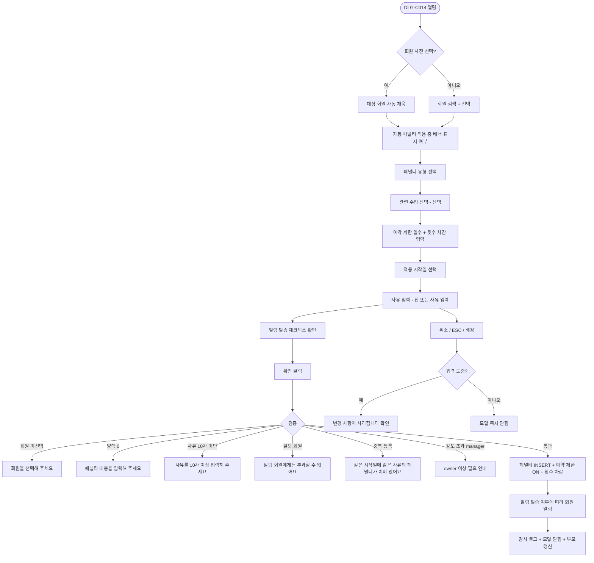

# DLG-C014 페널티 등록 다이얼로그

## 1. 다이얼로그 메타 정보

| 항목 | 값 |
|---|---|
| 작성일 | 2026-05-22 |
| 버전 | v1.0 |
| 상태 | 정합화 완료 |
| 도메인 | D04 수업관리 |
| 다이얼로그 ID | DLG-C014 |
| 다이얼로그명 | 페널티 수동 등록 |
| 부모 화면 | SCR-C008 페널티관리 |
| 호출 트리거 | 페널티 현황 탭의 [페널티 등록] 버튼 |
| 기능코드 | CLS-08 |
| 계약코드 | CLS-08 |
| 인접 다이얼로그 | DLG-C007 노쇼취소정책, DLG-C015 자동페널티정책 |

## 2. 다이얼로그 개요와 목적

자동 페널티 정책(DLG-C015)으로 포착되지 않는 특수 상황에서, 관리자가 특정 회원에게 직접 페널티를 부과하는 모달입니다. 예를 들어 회원이 시설을 훼손했거나, 다른 회원에게 피해를 끼쳤거나, 강사에게 부적절한 행동을 했거나, 본사 정책상 별도 페널티가 필요한 케이스에 사용됩니다. 페널티 내용은 예약 제한 일수와 횟수 차감 두 가지를 병행 또는 단독으로 적용할 수 있으며, 사유 입력은 필수이고 모든 등록은 감사 로그에 기록되어 사후 분쟁 시 운영 책임의 증거가 됩니다. 노쇼·늦은 취소처럼 자동 정책으로 처리 가능한 케이스는 본 모달이 아닌 DLG-C015에서 정책 자체를 조정해야 하며, 본 모달은 어디까지나 예외적 도구입니다.

## 3. 호출 트리거와 진입 시 초기값

SCR-C008 페널티 관리 화면의 페널티 현황 탭에서 [페널티 등록] 버튼을 클릭하면 모달이 열립니다. 모달이 열릴 때 모든 입력 필드는 비어 있는 신규 모드로 시작하며, 적용 시작일은 오늘 날짜로 기본 설정됩니다. 페널티 유형은 "노쇼" 라디오가 기본 선택되어 있으며, 자동 정책으로 이미 부과된 페널티가 있는 회원에 대해 추가 수동 부과는 가능하되 모달 상단에 "이 회원에게는 자동 페널티가 N일 동안 적용 중이에요"라는 안내 배너가 노출됩니다. 페널티 관리 화면에서 특정 회원 행을 선택한 후 [페널티 등록]을 누른 경우에는 대상 회원이 자동으로 채워져 있고, 일반 [페널티 등록] 버튼으로 진입한 경우에는 대상 회원이 비어 있어 검색해서 선택해야 합니다.

## 4. 레이아웃과 입력 항목

모달 헤더에는 "페널티 등록" 제목과 닫기 X 버튼이 있습니다.

본문 영역은 위에서 아래로 일곱 개의 섹션이 쌓입니다. 첫 번째는 자동 페널티 적용 안내 배너로, 대상 회원에게 이미 적용 중인 자동 페널티가 있을 때만 노랑 톤으로 노출됩니다. 두 번째는 대상 회원 선택 필드로, 회원명 또는 연락처로 검색 가능한 자동완성 드롭다운입니다. 검색은 300ms 디바운스가 적용되고 최소 2자 이상 입력해야 결과가 나타나며, 결과 행에는 회원명·연락처(마스킹)·현재 상태가 표시됩니다. 부모 화면에서 회원이 사전 선택된 경우 이 필드는 자동 채워져 있습니다. 세 번째는 페널티 유형 선택으로 "노쇼", "늦은 취소", "기타" 라디오 버튼이 가로로 배치됩니다. 네 번째는 관련 수업 선택으로(선택 항목), 페널티 사유가 된 수업을 드롭다운에서 선택할 수 있으며, 회원의 최근 7일 수업 목록이 자동 노출됩니다. 다섯 번째는 페널티 내용 카드로 예약 제한 일수 입력(0~90일, 0은 미적용)과 횟수 차감 입력(0~99회, 0은 미적용)이 한 줄에 나란히 배치됩니다. 두 값이 모두 0이면 저장이 차단됩니다. 여섯 번째는 적용 시작일 날짜 피커로 기본값은 오늘이며, 과거 날짜는 선택 불가합니다(미래 1년 이내만 허용). 일곱 번째는 사유 입력 textarea(필수, 10~500자)와 사전 정의 사유 칩(노쇼-단순/노쇼-반복/시설 훼손/타인 피해/직원 부적절 행위/기타) 6개가 함께 배치됩니다.

모달 하단에는 [확인] 버튼과 [취소] 버튼이 있고, [확인] 우측에 작은 체크박스로 "회원에게 알림 발송"이 기본 ON 상태로 노출됩니다.

## 5. 액션과 검증

[확인] 버튼은 클릭 시 다음 검증이 순서대로 수행됩니다. 첫째, 대상 회원이 선택되었는지 확인합니다. 둘째, 페널티 내용(예약 제한 또는 횟수 차감)이 최소 한 가지 이상 0보다 큰 값으로 입력되었는지 확인합니다. 셋째, 적용 시작일이 오늘 이후인지 확인합니다. 넷째, 사유가 10자 이상인지 확인합니다. 다섯째, 회원의 현재 상태가 페널티 부과 가능한 상태(활성·홀딩)인지 확인합니다(탈퇴 회원에게는 부과 불가). 여섯째, 동일 회원에게 동일 사유의 페널티가 같은 시작일에 이미 등록되어 있지 않은지(중복 부과 방지) 확인합니다.

모든 검증을 통과하면 즉시 페널티가 등록되고, 회원의 예약 제한 플래그가 활성화되며(예약 제한 일수 > 0일 때), 횟수 차감이 적용됩니다(횟수 차감 > 0일 때). "회원에게 알림 발송" 체크박스가 ON이면 NFR-19 알림 센터를 통해 회원앱 푸시 또는 SMS로 "OOO 사유로 페널티가 부과되었어요" 알림이 자동 발송됩니다. 검증 실패 시에는 모달 내부의 해당 필드 옆에 빨강 인라인 메시지가 표시되고 [확인] 버튼은 비활성 상태로 유지됩니다.

[취소] 버튼은 변경 없이 모달을 닫지만 입력 도중이면 "변경 사항이 사라집니다. 닫으시겠습니까?" 확인을 한 번 더 묻습니다. ESC 키와 배경 클릭도 같은 동작입니다.

## 6. 화면 상태와 예외 처리

기본 표시 상태는 부모 화면에서 받은 회원 컨텍스트(사전 선택된 회원이 있으면) 또는 빈 입력 상태로 시작합니다. 입력/수정 중 상태는 필수값 누락·범위 초과·권한 제한을 인라인 메시지로 표시합니다. 저장/처리 중 상태에서는 주요 버튼이 비활성화되어 중복 요청을 막습니다. 완료 상태에서는 성공 토스트와 함께 모달이 닫히고 부모 화면이 갱신됩니다. 실패 상태에서는 실패 사유가 토스트 또는 인라인으로 안내되고 입력값은 유지됩니다.

예외 케이스로 회원 미선택·페널티 내용 양쪽 0·사유 10자 미만·과거 시작일·탈퇴 회원 부과 시도·중복 페널티 부과·자동 페널티와 수동 페널티의 동시 적용 충돌·예약 제한 일수 90일 초과·횟수 차감이 회원 잔여보다 큼이 있으며 각각 인라인 빨강 안내와 함께 저장이 차단됩니다.

## 7. 권한별 동작

owner / manager / superAdmin / primary는 모든 페널티 유형과 내용을 등록할 수 있습니다. 본사 통합 모드의 본사 권한자는 모든 지점 회원에게 페널티를 부과할 수 있고, 일반 매니저는 자기 지점 회원에게만 부과할 수 있습니다. trainer / fc / staff는 페널티 등록 권한이 없어 모달 진입 자체가 차단되며 부모 화면의 [페널티 등록] 버튼이 보이지 않습니다. readonly는 진입 자체가 차단됩니다.

페널티 내용 중 예약 제한 30일 초과 또는 횟수 차감 10회 초과 같은 강한 페널티는 owner 이상만 등록할 수 있으며, manager가 시도하면 "이 강도의 페널티는 owner 이상이 등록할 수 있어요"라는 안내가 표시되고 [확인] 버튼이 비활성됩니다. 이는 운영자의 단독 판단으로 회원에게 과도한 페널티가 부과되는 사고를 막기 위한 정책입니다.

## 8. 부모 화면과의 상호작용

저장 성공 시 모달이 닫히고 SCR-C008 페널티 관리의 페널티 현황 탭에 새 페널티 행이 맨 위에 추가됩니다. 페널티가 부과된 회원의 다른 화면(회원 상세 SCR-M004, 횟수 관리 SCR-C007, 캘린더 SCR-C001의 예약 시도)에서도 예약 제한 배지가 즉시 노출되며, 그 회원이 페널티 기간 동안 예약을 시도하면 출석 QR 체크인(SCR-C014)에서 "예약 제한 중입니다" 안내와 함께 차단됩니다. 횟수 차감이 적용된 경우 SCR-C007 횟수 관리의 잔여 횟수가 즉시 감소하고 DLG-C013 차감 이력에 "수동 차감(페널티)" 행이 추가됩니다.

회원에게 알림이 발송된 경우 회원앱의 알림 영역에 "페널티 부과" 알림이 즉시 표시되고, 회원은 회원앱에서 페널티 해제 일자와 사유를 확인할 수 있습니다. 알림 발송을 꺼 둔 경우에도 페널티 자체는 정상 적용되며, 회원이 다음 예약 시도 시점에서 차단으로 인지하게 됩니다.

## 9. 데이터 흐름과 외부 연동

API는 페널티 등록 `POST /api/penalties`, 회원 페널티 조회 `GET /api/members/:id/penalties`, 회원 검색 `GET /api/members/search?q=`입니다. 페널티 등록 요청 본문에는 `memberId`, `type`(noshow/late_cancel/etc), `lessonId`(선택), `reservationLimitDays`, `punchSubtract`, `startDate`, `reason`, `notifyMember`(boolean), `actorId`가 포함됩니다.

페널티 등록은 트랜잭션 안에서 페널티 레코드 INSERT, 회원 예약 제한 플래그 UPDATE, 횟수 차감 이벤트 발행(차감 적용 시), 감사 로그 INSERT, 알림 큐 적재(발송 ON 시)가 동시에 수행됩니다. 한쪽만 반영되는 부분 실패가 발생하지 않도록 보장되며, 트랜잭션 실패 시 모든 변경이 롤백됩니다.

모든 등록은 SCR-097 감사 로그에 `actor`·`member_id`·`action=PENALTY_REGISTER`·`type`·`reservation_limit_days`·`punch_subtract`·`start_date`·`reason`·`timestamp`로 비동기 INSERT됩니다. 자동 페널티 정책(DLG-C015)으로 부과된 페널티와의 충돌이 발생하면(동일 사유·동일 시점) 본 모달의 수동 등록이 우선되며, 자동 페널티는 별도로 적용되지 않도록 자동 페널티 엔진이 본 모달의 등록 이벤트를 webhook으로 받아 자동 부과를 건너뜁니다.

## 10. 메인 흐름



## 11. 에러와 예외 흐름

```mermaid
flowchart TD
    A([확인 클릭]) --> B{서버 응답}
    B -->|200 성공| C[부모 화면 갱신 + 토스트 + 알림]
    B -->|400 검증 실패| D[필드별 인라인 빨강]
    B -->|403 권한 부족| E["권한이 없어요" 토스트]
    B -->|403 manager 강도 초과| F["owner 이상 필요"]
    B -->|409 중복 페널티| G["이미 등록된 페널티예요"]
    B -->|409 자동 페널티 충돌| H[수동 우선 + 자동 건너뜀]
    B -->|409 횟수 차감 > 잔여| I["잔여 횟수를 초과해요"]
    B -->|410 탈퇴 회원| J["탈퇴 회원에게는 부과할 수 없어요"]
    B -->|5xx 트랜잭션 실패| K[전체 롤백 + 재시도 안내]
    B -->|알림 발송 실패| L[페널티는 적용 + "알림 발송 실패" 보조 토스트]
```

## 12. 디자인 요청사항

자동 페널티 적용 중 배너는 모달 최상단에 노랑 톤으로 노출되어 운영자가 "이미 자동 페널티가 있는데 수동까지 추가하는 것이 맞는지" 한 번 더 생각하게 만들어야 합니다. 페널티 내용 카드의 예약 제한 일수와 횟수 차감은 두 입력 필드가 시각적으로 동등하게 배치되어, 운영자가 어느 한쪽만 적용하는 것도 자연스럽게 선택할 수 있어야 합니다. 두 값이 모두 0인 상태에서는 [확인] 버튼 옆에 작은 안내 텍스트로 "페널티 내용을 한 가지 이상 입력해 주세요"가 표시되어 즉각적인 피드백을 줍니다.

사유 칩 6개는 가장 자주 쓰이는 사유부터 순서대로 배치되어 빠른 선택을 돕고, 강한 페널티(시설 훼손·타인 피해·직원 부적절 행위)에 해당하는 칩은 빨강 톤 배경으로 시각적으로 강조됩니다. 알림 발송 체크박스는 [확인] 버튼 옆에 배치되어 운영자가 페널티 결정과 알림 결정을 같은 시야에서 함께 판단할 수 있게 합니다.

회원 검색 결과 행에는 현재 상태(활성·홀딩·탈퇴) 배지가 함께 표시되어, 탈퇴 회원을 선택하려는 시도가 검색 단계에서 시각적으로 식별되도록 합니다. 페널티 강도가 manager 권한 한도를 초과하는 입력값(예약 제한 30일 초과 또는 횟수 차감 10회 초과)이 들어오면 해당 필드 옆에 빨강 안내가 즉시 표시되어 권한 한도가 미리 인지되어야 합니다.

## 13. 운영 정책

수동 페널티 등록은 자동 페널티 정책(DLG-C015)으로 처리 가능한 케이스에는 사용되지 않으며, 본사가 사후에 수동 등록 패턴을 모니터링해 자동 정책 보강의 입력으로 활용합니다. 따라서 노쇼·늦은 취소 같은 자동 처리 가능 케이스가 본 모달로 자주 등록된다면, 자동 정책 설정에 누락이 있다는 신호로 해석됩니다.

페널티 부과 시 사유는 필수이며 10자 이상이어야 합니다. 부실 사유("ㅇ", "노쇼" 같은 한 단어)는 회원 분쟁 시 운영 책임을 추적하기 어렵게 만들므로, 본사는 사유 텍스트 품질을 정기적으로 모니터링합니다. 시설 훼손·타인 피해·직원 부적절 행위 같은 강한 사유는 별도의 감사 로그 태그가 자동 부여되어 사후 조회가 용이하게 됩니다.

예약 제한 30일 초과 또는 횟수 차감 10회 초과 같은 강한 페널티는 owner 이상만 등록할 수 있으며, 이는 운영자의 단독 판단으로 과도한 페널티가 부과되는 것을 막기 위한 정책입니다. 적용 시작일은 오늘 또는 미래 1년 이내만 허용되며, 과거 날짜에 페널티를 소급 적용하는 것은 차단됩니다. 회원이 이미 페널티 기간을 지나간 사후 처리는 불가능하며, 사후 조정이 필요한 경우 별도의 페널티 해제 흐름을 거쳐야 합니다.

회원 알림 발송은 기본 ON이지만 운영자가 명시적으로 OFF로 끌 수 있습니다. 알림 OFF로 부과된 페널티는 회원이 다음 예약 시도 시점에서야 인지하게 되므로, 본사는 알림 OFF 사용 비율도 모니터링합니다. 모든 수동 페널티 등록은 감사 로그에 5초 안에 기록되어 SCR-097에서 조회 가능하며, 자동 페널티와의 충돌은 수동 우선 정책으로 일관되게 해결됩니다.
