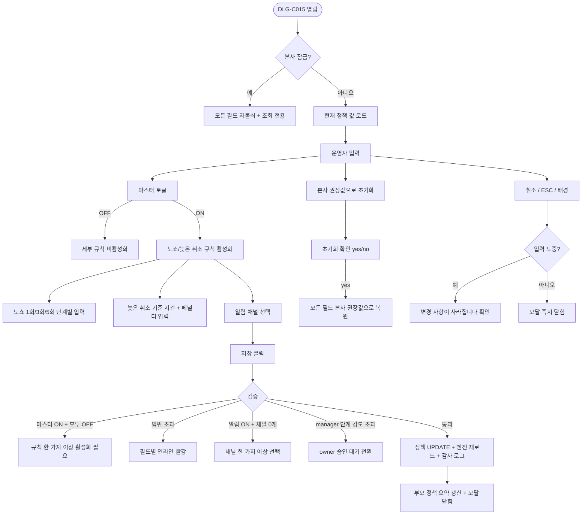

# DLG-C015 자동 페널티 정책 다이얼로그

## 1. 다이얼로그 메타 정보

| 항목 | 값 |
|---|---|
| 작성일 | 2026-05-22 |
| 버전 | v1.0 |
| 상태 | 정합화 완료 |
| 도메인 | D04 수업관리 |
| 다이얼로그 ID | DLG-C015 |
| 다이얼로그명 | 자동 페널티 정책 설정 |
| 부모 화면 | SCR-C008 페널티관리 |
| 호출 트리거 | 페널티 관리의 정책 설정 탭에서 [자동 페널티 정책 설정] 버튼 |
| 기능코드 | CLS-08 |
| 계약코드 | CLS-08 |
| 인접 다이얼로그 | DLG-C007 노쇼취소정책, DLG-C014 페널티등록 |

## 2. 다이얼로그 개요와 목적

노쇼와 늦은 취소가 발생할 때 페널티를 자동으로 부과하는 규칙을 한 번 설정해 두면, 이후 동일 조건이 충족될 때마다 운영자의 수동 개입 없이 즉시 페널티가 적용되도록 정책을 정의하는 모달입니다. 본 모달에서 저장한 정책은 본 다이얼로그를 닫는 순간부터 발생하는 모든 노쇼·늦은 취소에 즉시 적용되며, 이미 처리된 과거 케이스에는 소급되지 않습니다. 노쇼는 누적 횟수(1회·3회·5회)에 따라 다른 페널티를 단계별로 적용할 수 있고, 늦은 취소는 기준 시간(수업 시작 N시간 전 이내)을 정의해 그 안에 취소된 건만 페널티 대상으로 삼습니다. 본사 표준 정책이 적용된 테넌트에서는 지점 사용자가 값을 조회만 할 수 있고 수정할 수 없습니다.

## 3. 호출 트리거와 진입 시 초기값

SCR-C008 페널티 관리 화면의 정책 설정 탭에서 [자동 페널티 정책 설정] 버튼을 클릭하면 모달이 열립니다. 모달이 열릴 때 현재 적용 중인 정책 값이 자동으로 채워져 표시됩니다. 처음 설정하는 테넌트는 본사 권장값(전체 활성화 ON · 노쇼 7일/1회 차감 · 늦은 취소 2시간 전 이내 7일/1회 차감 · 알림 ON)이 기본값으로 미리 채워져 있고, 운영자는 그 값을 그대로 저장하거나 자유롭게 수정할 수 있습니다. 본사 표준 정책이 적용된 테넌트에서는 모든 필드가 자물쇠 아이콘과 함께 회색 톤으로 표시되어, 지점 사용자는 값을 확인만 할 수 있고 수정·저장이 차단됩니다.

## 4. 레이아웃과 입력 항목

모달 헤더에는 "자동 페널티 정책 설정" 제목과 닫기 X 버튼이 있습니다.

본문 영역은 위에서 아래로 네 개의 섹션이 쌓입니다. 첫 번째는 자동 페널티 활성화 토글 카드로, 전체 자동 페널티 기능을 ON/OFF하는 마스터 스위치입니다. 토글이 OFF이면 아래의 모든 세부 규칙 입력 필드가 회색으로 비활성화되고, 자동 부과는 발생하지 않습니다(수동 등록 DLG-C014만 허용). 두 번째는 노쇼 자동 페널티 규칙 카드로 적용 여부 토글과 함께 세 단계 입력이 배치됩니다. 1회 노쇼(기본 7일 예약 제한 + 1회 차감), 누적 3회 노쇼(기본 14일 + 2회 차감), 누적 5회 노쇼(기본 30일 + 3회 차감)에 각각 예약 제한 일수와 횟수 차감 수가 별도로 입력 가능하며, 누적 카운트의 기준 기간(기본 90일)도 함께 설정합니다. 세 번째는 늦은 취소 자동 페널티 규칙 카드로 적용 여부 토글과 함께 늦은 취소 기준 시간 입력(기본 수업 시작 2시간 전 이내, 1~24시간 범위), 페널티 내용(예약 제한 일수 + 횟수 차감)이 한 줄로 배치됩니다. 네 번째는 자동 알림 설정 카드로 페널티 부과 시 회원에게 자동 알림 발송 여부 토글과 알림 채널 선택(회원앱 푸시·SMS·알림톡 중 다중 선택)이 배치됩니다.

모달 하단에는 [저장] 버튼과 [취소] 버튼이 있고, [저장] 좌측에 작은 보조 링크 [본사 권장값으로 초기화]가 노출되어 누르면 모든 값이 본사 권장값으로 되돌아갑니다.

## 5. 액션과 검증

[저장] 버튼은 클릭 시 다음 검증이 수행됩니다. 첫째, 마스터 토글이 ON일 때 노쇼와 늦은 취소 규칙 중 적어도 하나 이상이 ON이어야 합니다(둘 다 OFF이면 마스터 토글의 의미가 없으므로 인라인 안내가 표시됩니다). 둘째, 노쇼 단계별 입력값(1회/3회/5회)이 각각 예약 제한 0~90일, 횟수 차감 0~99회 범위 안에 있어야 합니다. 셋째, 늦은 취소 기준 시간이 1~24시간 범위 안에 있어야 합니다. 넷째, 알림 발송이 ON일 때 최소 한 개 이상의 알림 채널이 선택되어야 합니다.

모든 검증을 통과하면 정책이 즉시 저장되고, "정책을 저장했어요" 성공 토스트가 표시되면서 모달이 닫힙니다. 본 모달이 닫히는 순간부터 발생하는 노쇼·늦은 취소에는 새 정책이 즉시 적용되며, 이미 처리된 과거 케이스에는 소급되지 않습니다. 검증 실패 시에는 모달 내부의 해당 필드 옆에 빨강 인라인 메시지가 표시되고 [저장] 버튼은 비활성 상태로 유지됩니다.

[본사 권장값으로 초기화] 링크는 클릭 시 "모든 값을 본사 권장값으로 되돌리시겠습니까?" yes/no 확인 후 모든 필드가 본사 권장값으로 즉시 복원됩니다. 본사 권장값은 본사 정책 세트에서 정의되며 분기마다 갱신될 수 있습니다.

[취소] 버튼은 변경 없이 모달을 닫지만 입력 도중이면 "변경 사항이 사라집니다. 닫으시겠습니까?" 확인을 한 번 더 묻습니다. ESC 키와 배경 클릭도 같은 동작입니다.

## 6. 화면 상태와 예외 처리

정책 OFF 상태는 마스터 토글이 OFF인 상태로, 자동 부과가 실행되지 않고 수동 페널티 등록(DLG-C014)만 허용됩니다. 정책 ON 상태는 마스터 토글이 ON이고 노쇼·늦은 취소 규칙이 활성화된 상태입니다. 저장 중 상태에서는 [저장] 버튼이 비활성화되어 중복 반영을 막습니다. 본사 표준 정책 적용 상태는 본사가 강제로 적용한 정책이 있는 테넌트에서 노출되며, 지점 사용자는 모든 필드가 자물쇠로 잠겨 있어 수정할 수 없습니다.

예외 케이스로 마스터 ON + 모든 세부 규칙 OFF·범위 초과 입력·알림 ON + 채널 0개·동시 편집 충돌(낙관적 락)·본사 표준 정책 변경 시도·자동 페널티 엔진 일시 정지 상태가 있으며 각각 인라인 빨강 안내와 함께 저장이 차단됩니다. 자동 페널티 엔진이 본사 차원에서 일시 정지된 상태에서는 모달 상단에 "본사 차원에서 자동 페널티가 일시 정지되어 있어요. 변경은 가능하지만 즉시 적용되지 않습니다"라는 노랑 톤 안내가 표시됩니다.

## 7. 권한별 동작

owner / manager / superAdmin / primary는 자동 페널티 정책을 조회·수정할 수 있습니다. 단, 본사 표준 정책이 적용된 테넌트에서는 owner와 manager도 조회만 가능하며 슈퍼관리자와 본사 최고관리자만 수정할 수 있습니다. trainer / fc / staff는 조회만 가능하고 [저장] 버튼이 보이지 않으며 입력 필드가 read-only로 표시됩니다. readonly는 진입 자체가 차단되어 부모 화면에서 권한 안내가 표시됩니다.

수정 권한이 있는 사용자라도 한 번에 변경할 수 있는 범위에는 제한이 있습니다. manager가 한 번에 노쇼 1회 페널티의 예약 제한 일수를 14일 이상 증가시키려고 하면 owner 이상 승인 요청 흐름으로 자동 전환되며, 즉시 적용되지 않고 owner 승인 대기 상태로 보류됩니다. 이는 매니저의 단독 판단으로 회원 전체에게 적용되는 정책이 급변하는 것을 막기 위한 정책입니다.

## 8. 부모 화면과의 상호작용

저장 성공 시 모달이 닫히고 SCR-C008 페널티 관리의 정책 설정 탭에 현재 정책 요약 카드가 즉시 갱신됩니다(노쇼 단계별 페널티 / 늦은 취소 기준 / 알림 설정). 정책 ON으로 전환된 직후부터 발생하는 모든 노쇼·늦은 취소 이벤트는 자동 페널티 엔진을 통해 즉시 적용되며, SCR-C008 페널티 현황 탭에 새 페널티 행이 자동 생성됩니다. 정책 OFF로 전환된 경우 이미 적용 중인 페널티는 그대로 유지되며, 새로운 자동 부과만 중단됩니다.

본 모달의 변경은 출석 QR 체크인(SCR-C014)과 예약 목록(SCR-C016)의 노쇼/늦은 취소 처리 흐름에도 즉시 반영됩니다. 두 화면에서 자동 노쇼 처리(A05 크론)나 늦은 취소 감지(취소 이벤트 발생 시)가 일어날 때마다 본 모달의 정책을 조회해서 적용 여부와 강도를 결정합니다.

## 9. 데이터 흐름과 외부 연동

API는 정책 조회 `GET /api/penalty-policy`, 정책 저장 `PUT /api/penalty-policy`, 본사 권장값 조회 `GET /api/penalty-policy/recommended`, 본사 잠금 상태 조회 `GET /api/penalty-policy/lock-status`입니다. 정책 저장 요청 본문에는 `enabled`(boolean), `noShowRules`(1회·3회·5회 단계별 객체 배열 + 누적 기준 기간), `lateCancelRule`(기준 시간 + 페널티 내용), `notification`(enabled + channels[])이 포함됩니다.

정책 저장은 트랜잭션 안에서 정책 레코드 UPDATE와 자동 페널티 엔진 재로드, 감사 로그 INSERT가 동시에 수행됩니다. 엔진은 정책 변경을 webhook으로 받아 즉시 새 정책을 메모리에 반영하므로, 모달을 닫은 직후 발생하는 노쇼·늦은 취소에 새 정책이 적용됩니다.

모든 정책 변경은 SCR-097 감사 로그에 `actor`·`action=PENALTY_POLICY_UPDATE`·`before`·`after`(JSON 형태로 전체 정책 객체)·`timestamp`로 비동기 INSERT됩니다. 본사 표준 정책 적용 테넌트에서 슈퍼관리자가 변경한 경우 본사 권한자에게 추가로 알림이 발송되어, 정책 변경이 본사 차원에서 인지 가능하게 합니다.

## 10. 메인 흐름



## 11. 에러와 예외 흐름

```mermaid
flowchart TD
    A([저장 클릭]) --> B{서버 응답}
    B -->|200 성공| C[엔진 재로드 + 부모 갱신 + 토스트]
    B -->|400 검증 실패| D[필드별 인라인 빨강]
    B -->|403 본사 잠금| E["본사 표준 정책으로 잠긴 항목입니다"]
    B -->|403 manager 강도 초과| F[owner 승인 대기 전환]
    B -->|409 동시 편집 충돌| G[최신 정책 재로드 + 재시도 안내]
    B -->|409 본사 차원 일시 정지| H[저장은 가능 + "즉시 적용되지 않음" 안내]
    B -->|5xx 트랜잭션 실패| I[전체 롤백 + 재시도 안내]
    B -->|엔진 재로드 실패| J[정책은 저장 + "다음 부과 시점에 반영" 보조 토스트]
```

## 12. 디자인 요청사항

마스터 토글은 모달 최상단에 가장 큰 시각적 영역으로 배치되어, 운영자가 "자동 부과를 켤지 끌지"를 먼저 결정하게 유도합니다. 마스터 OFF로 전환되는 순간 아래의 모든 세부 규칙 카드가 회색 톤으로 비활성화되는 부드러운 페이드 애니메이션이 일어나, 운영자가 "전체 기능이 꺼졌다"는 사실을 시각적으로 인지하게 합니다.

노쇼 규칙 카드의 세 단계(1회·3회·5회)는 가로로 나란히 배치되어 단계별 페널티 강도의 증가가 한눈에 비교 가능해야 합니다. 각 단계의 예약 제한 일수와 횟수 차감이 같은 그리드 위치에 정렬되어, 사용자가 단계별 차이를 직관적으로 파악할 수 있게 합니다. 1회·3회·5회 카드 상단에는 작은 가이드 텍스트로 "단순 노쇼 / 반복 노쇼 / 상습 노쇼"라는 라벨이 표시되어 운영 의미를 보강합니다.

늦은 취소 기준 시간 입력 필드 옆에는 작은 미리보기로 "수업 시작 2시간 전 이내 = 14:00 수업이면 12:00 이후 취소"라는 예시 텍스트가 표시되어, 운영자가 기준 시간의 의미를 즉시 이해할 수 있게 합니다. 알림 채널 선택은 다중 선택 체크박스로 배치되며, 각 채널 옆에 발송 비용 안내(예: "SMS는 건당 X원의 비용이 발생해요")가 작은 텍스트로 노출됩니다.

본사 잠금 표시는 자물쇠 아이콘과 회색 톤 배경으로 시각적으로 명확히 구분되어, 지점 사용자가 잘못 누르지 않도록 합니다. 본사 권장값으로 초기화 링크는 [저장] 버튼과 시각적으로 분리된 위치에 작게 배치되어 실수 클릭이 일어나지 않도록 합니다.

## 13. 운영 정책

자동 페널티 정책은 본사 표준 + 지점 자율 구조로 관리됩니다. 본사 표준이 적용된 테넌트에서는 지점 사용자가 값을 조회만 할 수 있고 수정·저장이 차단되며, 슈퍼관리자와 본사 최고관리자만 수정할 수 있습니다. 본사 표준이 적용되지 않은 테넌트에서는 owner와 manager가 자율적으로 수정할 수 있되, manager가 한 단계의 페널티 강도를 크게 증가시키려 하면 owner 이상 승인이 필요합니다. 이는 매니저의 단독 판단으로 회원 전체에 적용되는 정책이 급변하는 것을 막기 위한 정책입니다.

노쇼는 누적 카운트 기반의 단계별 페널티를 적용하며, 누적 기준 기간(기본 90일) 안의 노쇼 횟수를 합산해서 단계(1회·3회·5회)를 결정합니다. 누적 기준 기간이 지난 노쇼는 카운트에서 제외되어, 회원이 장기간 노쇼 없이 운영에 협조하면 카운트가 자연 감소합니다. 늦은 취소는 누적 없이 매 건마다 같은 강도로 적용되며, 늦은 취소 기준 시간(기본 2시간 전 이내) 안에 발생한 취소만 페널티 대상이 됩니다.

본 모달의 변경은 본 모달을 닫는 순간부터 적용되며, 이미 처리된 과거 케이스에는 소급되지 않습니다. 이는 사후 정책 변경으로 과거 회원에게 추가 페널티가 부과되는 불공정을 막기 위한 정책입니다. 정책 OFF로 전환된 경우에도 이미 적용 중인 페널티는 만료일까지 유지되며, OFF는 새로운 자동 부과만 중단합니다.

수동 페널티 등록(DLG-C014)이 자동 부과와 충돌하는 경우(동일 사유·동일 시점)에는 수동이 우선되고, 자동 페널티 엔진은 본 모달의 변경 이벤트를 webhook으로 받아 중복 부과를 건너뜁니다. 모든 정책 변경은 감사 로그에 5초 안에 기록되어 SCR-097에서 조회 가능하며, 본사 표준 적용 테넌트의 슈퍼관리자 변경은 본사 권한자에게 추가 알림이 자동 발송되어 본사 차원의 인지가 보장됩니다.
