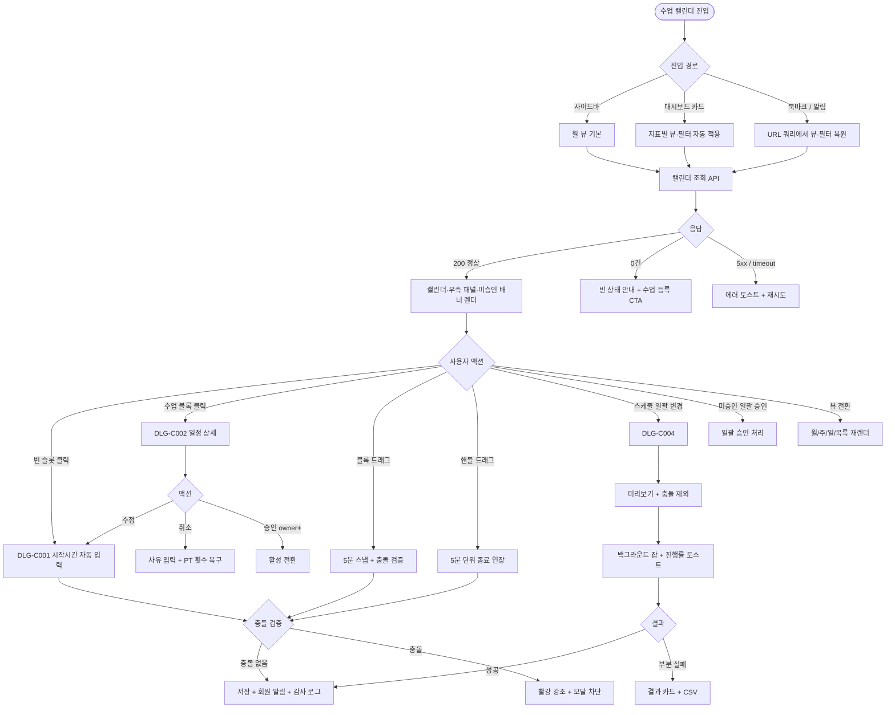
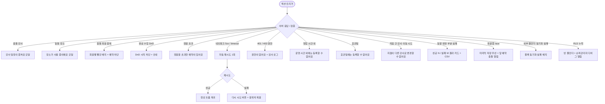

# SCR-C001 수업 캘린더 페이지

## 1. 화면 메타 정보

이 문서는 수업 캘린더 페이지에 대한 자기완결형 요구사항 정의서입니다. 다른 문서를 함께 보지 않아도 이 한 장만으로 수업 캘린더 페이지에 들어가는 모든 영역, 모든 버튼, 모든 모달, 모든 권한, 모든 예외 처리, 그리고 이 화면을 지탱하는 운영 정책까지 전부 이해하고 구현할 수 있도록 작성합니다.

| 항목 | 값 |
|---|---|
| 작성일 | 2026-05-22 |
| 버전 | v1.0 |
| 상태 | 최신 통합본 반영 (정합화 완료) |
| 도메인 | D04 수업관리 |
| 화면 ID | SCR-C001 |
| 화면명 | 수업 캘린더 |
| 화면 유형 | 허브 화면 (Hub Screen) |
| 라우트 (URL) | `/calendar` |
| 플랫폼 | 데스크톱(기본), 태블릿, 모바일(풀스크린 진입) |
| 우선순위 | P0 (출시 필수) |
| 기능코드 | CLS-01 (수업 캘린더) |
| 계약코드 | CLS-01 |
| 계약 상태 | 계약 범위 본기능 |
| 부모 기능 prefix | CLS |
| Lv1 코드 | CLS-01 |
| Lv2 / Lv3 세분화 | CLS-01-01 ~ CLS-01-08 (뷰 전환, 필터 바, 캘린더 인터랙션, 우측 패널, 색상 범례, 일괄 변경, 미승인 일정, 탭 내비게이션) |
| 연계 화면 | SCR-C002 수업관리, SCR-C003 시간표일괄등록, SCR-C004 그룹수업템플릿, SCR-C005 그룹수업현황, SCR-C006 강사근무현황, SCR-C007 횟수관리, SCR-C008 페널티관리, SCR-C009 일정요청처리, SCR-C011 유효수업목록, SCR-C012 대기열관리, SCR-D003 KPI 대시보드 |
| 호출 다이얼로그 | DLG-C001 수업등록수정_캘린더, DLG-C002 일정상세, DLG-C004 일괄변경 |

## 2. 화면 개요와 목적

수업 캘린더 페이지는 센터에서 운영되는 모든 수업 일정을 시간 축 위에 시각화해 한 번에 파악하고, 빈 시간 슬롯을 눌러 바로 수업을 만들고, 기존 수업 블록을 끌어다 옮겨 시간을 변경하며, 미승인 일정을 일괄 승인하고, 강사·룸 충돌을 사전에 감지하고 차단하는 D04 수업관리 도메인의 메인 허브 화면입니다. 사이드바의 "수업관리" 메뉴를 누르거나 대시보드의 "오늘의 수업" 카드를 누르면 가장 먼저 진입하는 화면이며, 수업관리 도메인의 다른 모든 화면(수업관리·횟수관리·페널티관리·유효수업목록)은 이 화면 상단의 탭 내비게이션을 통해 서로 연결됩니다.

이 화면이 다루는 운영 흐름은 매우 다양합니다. 센터장은 출근 직후 일 뷰로 당일 강사·룸 충돌·미승인 일정·OT 신규 배정을 5분 안에 일괄 점검하고 즉시 재배정을 결정합니다. 매니저는 주 뷰에서 강사별 색상으로 부하 편중을 식별하고, 빈 시간대에 인기 GX를 추가 개설하거나 한산한 시간대를 통합 또는 취소 검토합니다. 트레이너는 회원 요청에 따른 시간 변경을 드래그&드롭으로 즉시 반영하고, 충돌이 발생하면 즉시 빨간 경고로 잘못된 약속을 사전에 차단합니다. FC는 신규 회원의 OT 1차 슬롯을 빈 시간대에서 찾아 등록하고, 본사 슈퍼관리자는 통합 모드로 전 지점의 강습세션수 KPI 원천 데이터를 검증합니다. 휴관일·공휴일에는 일괄 변경 다이얼로그로 해당 일자의 모든 수업을 일괄 취소·이동 처리하며, 강사가 결근·휴가에 들어가면 미승인 배너와 일괄 변경을 조합해 대체 강사를 일괄 배정합니다. 회원앱에서 들어온 예약이 강사·룸 충돌을 만들면 캘린더에 즉시 빨간 경고가 표시되어 운영자가 조정합니다. 이 모든 업무가 같은 화면에서 권한별로 다르게 작동해야 합니다.

따라서 이 화면은 단순한 달력 위젯이 아니라, 충돌 검증·드래그 인터랙션·일괄 변경·미승인 승인·강습세션수 KPI 원천 보장까지 모두 통합된 시각형 운영 허브로 동작해야 합니다.

## 3. 진입 경로와 인접 화면

수업 캘린더 페이지에 진입하는 경로는 다음과 같이 여러 가지가 있고, 각 경로마다 진입 직후 화면의 초기 상태가 조금씩 달라집니다.

첫 번째 경로는 사이드바입니다. 좌측 사이드바의 "수업관리" 메뉴 아래 "수업/캘린더" 항목을 클릭하면 진입합니다. 이 경우 URL은 단순히 `/calendar`가 되고, 화면은 기본 상태(이번 달 월 뷰, 강사 필터 없음, 정원 상태 전체, 분류·세션 유형 멀티필터 전체 선택, 색상 우선순위 "강사별")로 시작합니다.

두 번째 경로는 대시보드의 수업 지표 카드 클릭입니다. 대시보드의 "오늘의 수업 수", "미승인 일정 수", "강사 충돌 건수", "마감 임박 그룹 수업" 같은 지표 카드를 클릭하면 캘린더 페이지로 이동하면서, 그 지표에 대응하는 뷰·필터가 URL 쿼리 파라미터로 자동 적용된 상태로 진입합니다. 예를 들어 "오늘의 수업 수" 카드를 누르면 `/calendar?view=day&date=오늘`로 일 뷰가 오늘 날짜로 열리고, "미승인 일정 수"를 누르면 일 뷰에 미승인 배너가 강조된 상태로 진입합니다.

세 번째 경로는 글로벌 검색이나 알림 센터의 캘린더 관련 알림 클릭입니다. "강사 충돌 발생", "미승인 일정 N건", "공휴일 휴관 처리 안내" 같은 알림은 캘린더 페이지로 이동하면서 해당 일자·강사 필터가 자동 적용됩니다.

네 번째 경로는 외부 도구에서 공유받은 북마크·딥링크입니다. URL 쿼리 파라미터로 뷰 모드(`view=month/week/day/list`)·날짜(`date=YYYY-MM-DD`)·강사 필터·수업명 필터·정원 상태·분류·세션 유형 필터가 모두 보존되므로, 운영자가 "이번 주 PT 트레이너 김지수 + 정원 마감 임박" 같은 자주 쓰는 조합을 북마크해 두고 매일 같은 URL로 진입할 수 있습니다.

다섯 번째 경로는 D04 도메인 내부의 탭 내비게이션입니다. 같은 도메인의 다른 화면(SCR-C002 수업관리, SCR-C007 횟수관리, SCR-C008 페널티관리, SCR-C011 유효수업목록)에 있다가 상단 탭 "일정표"를 클릭하면 다시 이 화면으로 돌아옵니다.

이 화면에서 다시 빠져나가는 인접 화면으로는, 수업 블록 클릭 후 "수정" 버튼으로 진입하는 DLG-C001 수업등록수정, 수업 블록 클릭 자체로 열리는 DLG-C002 일정상세, 상단 "스케줄 일괄 변경" 버튼으로 열리는 DLG-C004 일괄변경, 우측 패널의 회원 이름 클릭으로 진입하는 SCR-M004 회원 상세, 그리고 탭 내비게이션을 통한 SCR-C002 수업관리, SCR-C007 횟수관리, SCR-C008 페널티관리(미승인 건수 배지 포함), SCR-C011 유효수업목록이 있습니다.

## 4. 레이아웃과 UI 구성

수업 캘린더 페이지는 위에서 아래로 영역이 쌓이는 세로형 단일 컬럼 레이아웃을 기본으로 하되, 캘린더 영역의 우측에는 선택 날짜의 수업 카드를 보여주는 고정 패널이 자리잡습니다. 데스크톱에서는 좌측 캘린더 약 75% / 우측 패널 약 25%의 비율로 배치되고, 태블릿에서는 우측 패널이 접힌 상태에서 사용자가 패널 토글을 누르면 슬라이드 인 합니다. 모바일에서는 우측 패널이 캘린더 아래로 내려와 세로 적층 구조로 표시됩니다.

가장 위에는 페이지 헤더가 있습니다. 헤더 좌측에는 "수업 캘린더"라는 페이지 타이틀과 함께, 현재 조회 중인 지점이 "전체 지점(통합)"인지 특정 지점인지를 알려주는 지점 컨텍스트 배지가 따라옵니다. 헤더 우측에는 두 개의 액션 버튼이 일렬로 배치되는데, 왼쪽은 "스케줄 일괄 변경" 버튼이고 오른쪽은 "수업 등록" 버튼입니다. "스케줄 일괄 변경"은 누르면 DLG-C004 일괄 변경 다이얼로그가 열리며 기간·강사·요일을 묶어 일정을 한 번에 변경합니다. "수업 등록"은 누르면 DLG-C001 수업 등록 다이얼로그가 빈 입력 상태로 열립니다.

페이지 헤더 바로 아래에는 D04 도메인 공통 탭 내비게이션이 있습니다. 탭은 좌에서 우로 "일정표", "수업 관리", "횟수 관리", "페널티 관리", "유효 수업 목록"의 5개이며, "페널티 관리" 탭 우측에는 적용 중 페널티 건수가 빨강 배지로 표시됩니다. 현재 화면은 "일정표" 탭이 활성화된 상태로 진입하며, 다른 탭을 클릭하면 해당 화면(SCR-C002·C007·C008·C011)으로 페이지가 전환됩니다.

탭 내비게이션 아래에는 미승인 일정 알림 배너가 있습니다. 미승인 일정 정책이 활성화된 테넌트에서 미승인 일정이 1건 이상 존재할 때 배너가 표시되며, 주황 배경에 "미승인 일정이 N건 있어요"라는 문구와 함께 "일괄 승인" 또는 "목록 보기" 버튼이 따라옵니다. 미승인 일정이 0건이면 배너 영역 자체가 사라지고 그만큼 캘린더가 위로 올라옵니다.

미승인 배너 아래에는 뷰 전환 탭 + 날짜 네비게이터 + 필터 바가 한 줄에 묶입니다. 뷰 전환 탭은 좌측 끝에 월 / 주 / 일 / 목록(list)의 4개 버튼이 토글 형식으로 배치되며, 현재 뷰가 강조 표시됩니다. 그 우측에는 이전·다음 기간 이동 화살표와 "오늘" 버튼이 있고, 화살표 사이에 현재 보고 있는 기간이 텍스트로 표시됩니다(예: "2026년 5월", "2026년 5월 18일~24일", "2026년 5월 22일 금요일"). 그 우측에 필터 바가 있는데, 강사 단일 드롭다운, 수업명 단일 드롭다운, 정원 상태 토글(전체 / 여유 / 마감), 분류 멀티필터(상담·OT·체성분·방문·수업·PT·기타), 강습 세션 유형 멀티필터(PT·필라테스·스트레칭·테라피)가 차례로 배치됩니다. 적용된 필터는 필터 바 아래에 칩 형태로 나란히 표시되며, 칩의 X 버튼으로 해당 필터만 제거하거나 "전체 해제"로 한 번에 초기화할 수 있습니다. 모든 필터·뷰 상태는 URL 쿼리스트링에 보존됩니다.

필터 바 아래가 본문 메인 영역이며, 좌측의 캘린더 영역과 우측의 수업 카드 패널로 나뉩니다.

캘린더 영역은 선택된 뷰에 따라 표시 밀도가 달라집니다. 월 뷰에서는 한 칸이 하루를 의미하며 일자별로 최대 3건의 수업 블록과 "+N 더보기" 링크가 표시됩니다. 주 뷰는 7일 가로 헤더 × 시간 그리드(05:00~23:00, 1시간 단위)로 구성되어 수업 블록의 위치와 길이가 시간을 그대로 시각화합니다. 일 뷰는 한 날짜 전체를 30분 단위 그리드로 보여줘 시간 충돌과 빈 슬롯을 가장 정밀하게 식별할 수 있고, 운영자가 가장 많이 사용하는 뷰입니다. 목록 뷰는 표 형태로 시작 시간 오름차순으로 정렬된 수업 행을 보여주며 컬럼 클릭으로 정렬을 바꿀 수 있습니다.

수업 블록은 강사·수업 유형·강습 세션 유형·분류의 4가지 색상 우선순위 중 사용자가 선택한 기준에 따라 색이 적용됩니다. 기본 우선순위는 "강사별"이며 화면 하단의 색상 범례 토글로 변경할 수 있습니다. 블록 내부에는 시작~종료 시간, 수업명, 강사명, 정원/예약 현황이 압축 표시됩니다. 마감(예약=정원) 블록은 채도가 진하게, 정원 미달 블록은 채도가 옅게 표현되어 빈자리 여부가 한눈에 들어옵니다. 미승인 상태 블록은 점선 테두리로 일반 블록과 구분됩니다. 충돌이 감지된 블록은 빨강 외곽선과 경고 아이콘이 함께 표시됩니다. 완료된 수업은 회색 톤으로 처리되어 더 이상 변경할 수 없음을 시각적으로 알립니다.

빈 시간 슬롯을 클릭하면 DLG-C001 수업 등록 다이얼로그가 열리면서 클릭한 날짜·시간이 시작 시간에 자동 입력됩니다. 수업 블록을 한 번 클릭하면 DLG-C002 일정 상세 다이얼로그가 열리고, 그 안에서 수정 버튼을 누르면 DLG-C001이 수정 모드로 다시 열립니다. 수업 블록을 드래그하면 5분 단위로 스냅되며 임시 위치 피드백이 반투명으로 표시되고, 드롭 직전에 강사·장소·회원 충돌을 검증합니다. 블록 하단의 작은 핸들을 잡아 아래로 드래그하면 종료 시간이 5분 단위로 연장됩니다. 4px 미만의 마우스 이동은 클릭으로 처리되어 DnD 오작동을 막습니다.

우측 패널은 캘린더에서 선택된 날짜(기본은 오늘)의 수업 목록을 카드 형태로 보여줍니다. 각 카드에는 수업명, 강사, 시작~종료 시간, 예약 인원/정원, 정원 진행 바(녹·주황·빨강)가 표시되고 카드 클릭 시 DLG-C002 일정 상세가 열립니다. 카드 안의 예약 회원명 영역을 펼치면 회원 이름 리스트가 표시되고 회원명을 누르면 SCR-M004 회원 상세 페이지로 이동합니다.

화면 하단에는 색상 범례 영역이 가로로 펼쳐집니다. 범례는 4개 그룹(강사별·수업 유형별·강습 세션 유형별·분류별)으로 묶이며 각 칩에는 색상과 라벨이 함께 표시됩니다. 그룹 헤더의 토글을 누르면 색상 우선순위가 그 그룹으로 바뀌고 캘린더 블록의 색이 즉시 재적용됩니다. 필터를 통해 제외된 그룹은 범례에서도 흐려져 표시됩니다.

## 5. 탭 구성과 탭별 동작

이 화면 자체에는 1차 탭(D04 도메인 공통)과 뷰 전환 탭(2차)이 있습니다. 1차 탭은 화면 간 이동이고 2차 탭은 같은 화면 안에서의 표시 밀도 변경입니다.

1차 도메인 탭은 "일정표(현재 화면)", "수업 관리(SCR-C002)", "횟수 관리(SCR-C007)", "페널티 관리(SCR-C008)", "유효 수업 목록(SCR-C011)"의 5개입니다. 페널티 관리 탭에는 적용 중 페널티 건수가 빨강 배지로 표시되어 운영자에게 항상 보입니다. 다른 탭을 누르면 그 화면으로 페이지 전환되며 캘린더에서 잡고 있던 필터·뷰 상태는 일정표 탭으로 돌아올 때 URL 쿼리에서 복원됩니다.

2차 뷰 전환 탭은 월·주·일·목록의 4개이며 같은 데이터에 대한 다른 시각화입니다. 월 뷰는 일자당 3건 표시 + 더보기 링크로 큰 그림을 보여주고, 주 뷰는 7일 × 시간 그리드로 1주일 운영을 한눈에, 일 뷰는 30분 단위 그리드로 충돌과 빈 시간을 정밀하게, 목록 뷰는 표 형태로 정렬·검색을 강화한 형식입니다. 뷰를 바꿔도 강사·수업명·정원 상태·분류·세션 유형 필터는 모두 유지되고, 표시 영역만 다시 그려집니다. 어떤 뷰가 선택되었는지는 URL 쿼리 파라미터 `view`로 보존되어 새로고침이나 북마크 공유 후에도 같은 뷰가 유지됩니다.

## 6. 버튼·아이콘·링크 액션 전체 정의

이 화면에 등장하는 모든 클릭 가능한 요소를 빠짐없이 정의합니다.

페이지 헤더의 "스케줄 일괄 변경" 버튼은 누르면 DLG-C004 일괄 변경 다이얼로그가 열립니다. 권한이 매니저 미만이면 이 버튼은 비활성화되거나 화면에서 사라집니다. "수업 등록" 버튼은 누르면 DLG-C001이 빈 상태로 열리며, 빈 슬롯 클릭과 달리 시작 시간이 미입력 상태입니다. FC·트레이너·readonly 권한에서는 이 버튼이 보이지 않습니다.

도메인 탭의 각 탭은 누르면 해당 화면으로 페이지 자체가 전환되며, 페널티 관리 탭의 빨강 배지는 SCR-C008로 들어가면 자동으로 갱신됩니다.

미승인 일정 알림 배너의 "일괄 승인" 버튼은 권한이 owner 이상일 때만 노출되며, 누르면 모든 미승인 일정이 한 번에 활성화되고 감사 로그에 actor·lesson_ids·timestamp가 기록됩니다. "목록 보기" 버튼은 미승인 일정만 필터링된 목록 뷰로 화면을 전환합니다.

뷰 전환 탭의 월·주·일·목록 버튼은 각각 같은 데이터를 다른 밀도로 렌더링합니다. 이전·다음 화살표는 현재 뷰의 단위(월 단위·주 단위·일 단위)로 시간을 이동시키고, "오늘" 버튼은 즉시 오늘 날짜로 점프합니다.

필터 바의 강사 드롭다운, 수업명 드롭다운, 정원 상태 토글, 분류 멀티필터, 강습 세션 유형 멀티필터는 각각 선택값이 바뀌는 즉시 캘린더가 재조회되며, 본사 통합 모드에서는 추가로 지점 컬럼이 노출됩니다. 트레이너 계정에서는 강사 드롭다운에 본인 이름이 기본 선택된 상태로 진입하며, 다른 강사로 바꿀 수는 있지만 다른 강사의 수업 블록은 회색 처리되어 편집할 수 없습니다.

캘린더 영역의 빈 시간 슬롯 클릭은 DLG-C001을 시작 시간 자동 입력 상태로 엽니다. 권한이 없는 계정(FC·트레이너 제외 사용자가 자기 영역이 아닌 곳)에서는 이 동작이 차단됩니다. 영업 시간 외 시간 슬롯을 누르면 "운영 시간 외에는 등록할 수 없어요" 안내가 표시되고, 휴관일에는 "휴관일에는 등록할 수 없어요"가 표시됩니다.

수업 블록 클릭은 DLG-C002 일정 상세를 엽니다. 미승인 상태 블록을 권한자가 클릭하면 DLG-C002 안에 "승인" 또는 "거절" 버튼이 추가로 노출됩니다.

수업 블록 드래그는 위치 이동을 의미합니다. 드래그 중에는 5분 단위로 스냅되고 임시 위치가 반투명으로 표시되며, 드롭 직전에 강사·장소·회원 충돌이 검증됩니다. 충돌이 있으면 "강사 일정이 겹쳐요" 또는 "장소가 사용 중이에요" 모달이 뜨며 저장이 차단되고, 블록은 원위치로 자동 복원됩니다. 통과되면 변경이 즉시 저장되고 예약 회원에게 자동 알림이 발송됩니다. 완료(attended) 또는 취소(cancelled) 상태 블록은 드래그가 시작되지 않습니다.

수업 블록 하단의 핸들 드래그는 종료 시간 연장입니다. 5분 단위로 스냅되며 30분(최소) ~ 240분(최대) 범위 안에서만 연장 가능하고, 다음 수업과 겹치면 빨강 강조와 함께 저장이 차단됩니다.

우측 패널의 수업 카드 클릭은 DLG-C002를 엽니다. 카드 안의 회원명 클릭은 SCR-M004 회원 상세로 페이지 전환됩니다.

색상 범례의 그룹 헤더 토글은 색상 우선순위를 바꿉니다. 강사별 → 세션 유형별 → 분류별 → 수업 유형별 순으로 토글되며 캘린더 블록 색이 즉시 재적용됩니다. 사용자 선택값은 사용자 단위로 저장되어 다른 운영자에게는 영향을 주지 않습니다.

모든 버튼은 클릭 후 응답이 돌아오기 전까지 자동으로 비활성화되어 더블클릭 중복 요청이 차단됩니다. 일괄 변경·일괄 승인은 진행률 스피너가 표시되고 다른 일괄 작업 버튼은 모두 잠깁니다.

## 7. 호출되는 모달 동작

이 화면에서 호출되는 모달은 세 가지이며, 각각 어떤 트리거로 열리고, 어떤 입력을 받고, 확인/취소를 누르면 부모 화면에서 어떤 변화가 일어나는지가 모두 달라집니다.

### 7-1. DLG-C001 수업 등록/수정 다이얼로그

DLG-C001은 캘린더에서 새 수업을 등록하거나 기존 수업을 수정할 때 진입하는 모달입니다. 빈 시간 슬롯 클릭, 상단 "수업 등록" 버튼, DLG-C002에서 "수정" 버튼의 세 가지 트리거 중 어떤 것으로 열렸느냐에 따라 초기 입력값이 다릅니다.

빈 슬롯 클릭으로 열리면 시작 일시가 클릭한 시간으로 자동 입력되어 있고, 종료 일시는 선택된 수업 템플릿의 기본 길이만큼 자동 계산됩니다. 상단 "수업 등록" 버튼으로 열리면 모든 입력이 비어 있는 상태로 시작되어 운영자가 직접 채워야 합니다. DLG-C002에서 "수정" 버튼으로 열리면 기존 수업의 모든 값이 미리 채워진 수정 모드로 시작되며, 모달 헤더가 "수업 수정"으로 바뀝니다.

모달의 입력 항목은 수업 템플릿 드롭다운(선택 시 수업명·정원·세션 유형 자동 완성), 일정 분류(상담·OT·체성분·방문·수업·PT·기타), 강습 세션 유형(PT·필라테스·스트레칭·테라피, KPI 집계 대상이면 필수), 대상 유형(회원·비회원·직원, 비회원이면 이름·연락처 직접 입력), 시작 일시(30분 단위), 종료 일시(자동 계산 + 수정 가능), 강사 드롭다운, 장소 드롭다운, 정원, 색상, 메모, 반복 일정 토글입니다.

저장 버튼을 누르면 강사·장소·회원 충돌이 다시 한번 백엔드에서 검증되고, 통과되면 캘린더에 새 블록이 즉시 추가되거나 기존 블록이 갱신됩니다. 회원이 이미 예약된 수업이라면 시간 변경 시 그 회원에게 자동 알림이 발송됩니다. 충돌이 있으면 모달 내부에 빨강 안내가 표시되고 저장이 차단됩니다. 취소 버튼은 변경 없이 모달을 닫지만 입력 도중이면 "변경 사항이 사라집니다. 닫으시겠습니까?" 확인을 한 번 더 묻습니다.

미승인 정책이 활성된 테넌트에서는 신규 등록 시 수업 상태가 "미승인"으로 시작되고, 미승인 배너 카운트가 +1 증가합니다.

권한별 동작은 다음과 같습니다. 매니저 이상은 모든 입력이 가능하고, 트레이너는 강사 드롭다운에 본인만 표시되며, FC·스태프·readonly는 이 모달에 진입조차 할 수 없습니다.

### 7-2. DLG-C002 일정 상세 다이얼로그

DLG-C002는 수업 블록을 클릭했을 때 그 수업의 상세 정보를 빠르게 보여주는 읽기 중심 모달입니다. 모달 상단에는 수업명과 수업 유형 배지, 강습 세션 유형 배지(있는 경우)가 표시되고, 그 아래에 일시·강사·장소·예약 현황(현재/정원)·잔여 자리·예약 회원 목록·출석 상태 요약(출석·결석·노쇼·미처리 건수)·일정 분류·승인 상태가 카드 형태로 정렬됩니다.

모달 하단에는 액션 버튼이 있습니다. "수정" 버튼을 누르면 DLG-C001이 수정 모드로 다시 열립니다. "취소" 버튼을 누르면 수업 취소 확인 하위 모달이 뜨고, 사유 입력 후 확인하면 수업 상태가 "취소"로 변경되며 예약 회원에게 자동 알림이 발송되고 PT 횟수는 자동 복구됩니다. "출석 처리" 버튼은 SCR-C011 유효 수업 목록으로 이동시켜 그 화면에서 출석/노쇼를 정밀하게 처리합니다. 미승인 일정이면 "승인"과 "거절" 버튼이 추가로 노출되며, owner 이상 권한자만 사용할 수 있습니다. 거절은 사유를 받아 미승인 상태에서 "취소"로 전환됩니다.

DLG-C002 자체에서는 데이터를 직접 편집하지 않으며, 변경이 필요하면 DLG-C001로 위임합니다. 읽기 전용 동작이라 권한 분기는 적게 적용되지만, readonly 계정은 액션 버튼이 전부 비활성화됩니다.

### 7-3. DLG-C004 일괄 변경 다이얼로그

DLG-C004는 상단 "스케줄 일괄 변경" 버튼을 누르면 열리는 일괄 작업 전용 모달입니다. 기간(시작일~종료일), 강사(드롭다운), 요일(월~일 다중), 시간대(시작~종료) 조건으로 대상 일정을 좁히고, 변경 항목(강사 교체·시간 이동·장소 변경·일괄 취소) 중 하나를 골라 적용합니다.

모달 중간에는 미리보기 영역이 있어, 조건에 부합하는 일정 N건이 리스트로 나타나며 충돌이 예상되는 행은 빨강으로 강조됩니다. 운영자는 충돌 행의 체크박스를 해제해 일부만 적용하거나, 전체를 그대로 적용할 수 있습니다.

적용 버튼을 누르면 변경 작업이 백그라운드 잡으로 시작되고 진행률 토스트가 화면 우상단에 떠 있습니다. 일부가 충돌·권한·정원 등으로 실패해도 성공분은 그대로 유지되며, 완료 후 결과 카드에 "성공 N건 / 실패 M건"과 실패 목록 CSV 다운로드 링크가 함께 제공됩니다. 모든 변경은 batch_id 단위로 묶여 감사 로그에 기록되고, 변경된 일정의 예약 회원에게는 자동 알림이 발송됩니다.

공휴일·휴관일 사유로 일괄 취소를 적용하면 이벤트 메타에 "휴관" 태그가 함께 기록되어 추후 휴관 분석 자료가 됩니다.

본사 통합 모드에서 본사 권한자가 사용하면 여러 지점을 동시에 묶어 일괄 처리할 수 있지만, 일반 지점 권한자는 자기 지점에만 적용됩니다. 매니저 이상에게만 노출되며 FC·트레이너·스태프·readonly는 진입 자체가 불가능합니다.

## 8. 토스트와 확인 팝업과 알럿

수업 캘린더에서 발생하는 모든 알림성 UI는 다음과 같은 패턴으로 동작합니다.

성공 토스트는 우측 상단에 녹색 계열로 5초 표시되며, "수업이 등록되었어요", "시간이 변경되었어요", "N건의 일정을 변경했어요", "미승인 N건을 승인했어요" 같은 짧은 문구로 결과를 알려줍니다. 일괄 작업 완료 토스트는 클릭 시 결과 카드로 이동해 부분 실패 목록을 확인할 수 있습니다.

실패 토스트는 우측 상단에 빨강 계열로 표시되며, "강사 일정이 겹쳐요", "장소가 사용 중이에요", "회원이 이미 같은 시간에 예약되어 있어요", "운영 시간 외에는 등록할 수 없어요", "휴관일에는 등록할 수 없어요" 같은 문구와 함께 "다시 시도" 또는 "원위치로 돌리기" 같은 보조 액션이 따라옵니다.

확인 팝업은 캘린더에서 자주 사용되는 단순 yes/no 형태로, 수업 취소·일괄 승인·일괄 변경 적용 직전에 짧게 한 번 더 묻습니다. ESC 또는 배경 클릭으로 모달을 닫으려고 할 때 입력 도중이면 "변경 사항이 사라집니다. 닫으시겠습니까?" 확인이 함께 뜹니다.

알럿은 시스템 수준 차단 안내로, 권한 없는 계정이 직접 URL로 접근했을 때 페이지 본문이 가려지고 "이 화면에 접근할 권한이 없습니다. 3초 후 대시보드로 이동합니다" 메시지가 표시된 후 자동 이동합니다. 본사 통합 모드 RLS가 누락된 데이터가 감지되면 빈 캘린더가 표시되는 보안 동작이 일어나며 슈퍼관리자에게만 디버그 알림이 전달됩니다.

## 9. 데이터 흐름과 외부 연동

화면 진입 시점에는 캘린더 조회 API `GET /api/lessons/calendar`가 호출됩니다. 요청에는 현재 활성화된 뷰 모드, 기준 날짜 범위, 강사·수업명·정원 상태·분류·세션 유형 필터, 본사 통합 모드 여부가 모두 쿼리 파라미터로 들어갑니다. 응답으로는 일정 배열(시작·종료·강사·장소·정원·예약·상태·승인 상태·분류·세션 유형 포함), 미승인 카운트, 색상 범례 데이터, 강사·장소 충돌 메타가 함께 내려옵니다.

신규 등록은 `POST /api/lessons`, 단일 수정은 `PUT /api/lessons/:id`, 일괄 변경은 `POST /api/lessons/bulk-update`, 충돌 검증은 `GET /api/lessons/conflicts`로 처리됩니다. 충돌 검증은 드래그 드롭 직전과 DLG-C001 저장 직전에 각각 호출되어 사용자의 의도와 백엔드 데이터의 일관성을 보장합니다.

수업 완료 시점에는 CLS-07 횟수 관리 webhook이 발사되어 PT 횟수가 자동 차감되고, 노쇼 자동 처리(A05 크론) 시점에는 CLS-08 페널티 정책에 따라 자동 페널티가 부과됩니다. 수업 취소·시간 변경·강사 변경 시에는 NFR-19 알림 센터를 거쳐 예약 회원에게 푸시·SMS·앱 인박스 알림이 발송됩니다.

본 화면에서 처리되는 강습 세션 유형 4종(PT·필라테스·스트레칭·테라피) 데이터는 SCR-D003 KPI 대시보드의 "강습세션수" 합산 원천이며 1:1로 매칭되어야 합니다. 따라서 DLG-C001에서 KPI 대상 수업을 저장할 때 강습 세션 유형 입력이 누락되지 않도록 화면 단에서 필수 검증됩니다. OT 1차 슬롯 등록 결과는 SCR-C006 강사 근무 현황의 OT 배정·1차·2차·거절(거부+보류 합산, 04/29 기준)·이월 지표와 연동되어 영업 파이프라인 추적의 원천이 되며, OT 등록 전환율은 정규 PT 완료율과 합산하지 않습니다.

회원앱 예약 시스템은 별도 webhook으로 본 화면과 동기화됩니다. 회원앱에서 예약이 생성되면 캘린더에 즉시 반영되고, 운영자 등록과 동시에 충돌하는 race condition은 마지막 저장 우선 정책으로 처리되며 앞 예약은 충돌 알림이 운영자에게 전달됩니다.

외부 캘린더 동기화(구글·아웃룩)는 등록·수정·삭제 webhook으로 연결되어 강사 개인 캘린더에도 일정이 자동 반영됩니다. 동기화 실패 시 일정 블록 우측에 작은 동기화 실패 배지가 표시됩니다.

모든 등록·수정·삭제·DnD·일괄·승인 액션은 SCR-097 감사 로그에 actor·lesson_id·before·after·reason·timestamp로 비동기 INSERT되며, 5초 안에 감사 로그 화면에서 조회 가능해야 합니다.

## 10. 화면 상태와 예외 처리

수업 캘린더는 다음 상태들을 가질 수 있고, 각 상태마다 사용자에게 보이는 모습이 달라집니다.

로딩 중 상태에서는 캘린더 영역에 시간 그리드 모양의 스켈레톤이 표시되고, 우측 패널 카드도 스켈레톤으로 대체됩니다. 헤더의 버튼과 필터 바는 미리 렌더되지만 상호작용은 잠시 막힙니다.

정상 표시 상태는 200 응답과 함께 일정이 한 건 이상 있을 때입니다. 수업 블록이 시간 위치에 그려지고 우측 패널에 카드가 채워집니다.

빈 일정 상태는 필터 적용 결과가 0건이거나 해당 기간 일정 자체가 0건일 때입니다. "이 기간에 수업이 없어요" 안내와 "수업 등록" CTA가 표시됩니다.

미승인 존재 상태에서는 화면 최상단에 주황 배너가 뜨고 미승인 블록은 점선 테두리로 표시됩니다.

드래그 중 상태에서는 블록이 반투명으로 따라다니며 5분 단위 스냅 가이드가 표시됩니다. 드롭 직전 충돌이 감지되면 빨강 강조와 모달 경고가 뜹니다.

권한 부족 상태(트레이너가 타 강사 영역 진입)에서는 해당 블록이 회색 처리되고 클릭 시 조회만 가능하며 DnD가 차단됩니다.

처리 중(일괄 변경) 상태에서는 진행률 토스트가 떠 있고 일괄 작업 버튼은 모두 잠깁니다. 사용자는 다른 영역을 탐색할 수 있습니다.

본사 통합 모드 상태에서는 지점 라벨이 블록과 카드에 추가되고 지점별 색상 보조가 적용됩니다.

예외 케이스별 처리는 다음과 같이 정의됩니다. 강사 충돌은 빨강 강조와 모달 "강사 일정이 겹쳐요"가 뜨며 저장이 차단됩니다. 장소 충돌도 동일 패턴으로 "장소가 사용 중이에요"가 뜨고 정원 0인 휴식 슬롯은 예외 처리됩니다. 회원 중복 예약은 회원별 빨강 배지로 표시되고 신규 예약이 차단됩니다. 완료된 수업 DnD는 시작되지 않으며 안내 토스트가 뜹니다. 정원 초과 시간 변경은 정원 조정 후 재시도 안내가 뜹니다. DnD 도중 네트워크 오류는 1회 자동 재시도 후 실패하면 원위치로 복원됩니다. 일괄 변경 부분 실패는 성공/실패 카운트와 실패 목록 모달로 표시되어 실패 건만 재시도할 수 있습니다. 빈 슬롯 영업 종료 시간 초과 클릭은 "운영 시간 외에는 등록할 수 없어요"로 차단되고, 휴관일 클릭은 "휴관일에는 등록할 수 없어요"로 차단됩니다. 본사 통합 모드에서 지점 간 강사 이동 시도는 차단되며, 회원앱 예약과 운영자 등록의 race는 마지막 저장 우선으로 처리됩니다. 외부 캘린더 동기화 오류는 블록 우측 작은 배지로 표시되고 동기화 화면으로 이동하는 링크가 제공됩니다.

## 11. 권한별 처리

슈퍼관리자(superAdmin)와 본사 최고관리자(primary)는 모든 기능을 사용합니다. 헤더에 지점 전환 드롭다운이 노출되어 전체 지점(통합)과 개별 지점을 자유롭게 전환할 수 있고, 통합 모드에서는 모든 지점의 일정이 합산 조회되어 블록과 카드에 지점 라벨이 함께 표시됩니다. 일괄 변경·일괄 승인·일괄 취소·강사 이관·본사 표준 정책 적용·외부 캘린더 동기화 관리까지 모두 가능합니다.

센터장(owner)은 자기 지점의 전체 강사 일정에 대해 등록·수정·삭제·일괄 변경·미승인 일정 승인을 수행할 수 있습니다. 본사 통합 모드 토글은 표시되지 않으며 자기 지점에 한정해서 작업합니다.

매니저(manager)는 owner와 같은 범위에서 등록·수정·일괄 변경을 수행하지만 미승인 일정 승인은 owner 이상으로 한정되므로 매니저의 일괄 승인 버튼은 비활성화 또는 숨김 처리됩니다.

트레이너(trainer)는 전체 일정 조회가 가능하지만 편집은 본인 담당 수업에 한정됩니다. 강사 드롭다운은 진입 시 본인 이름이 기본 선택되며, 다른 강사 블록은 회색으로 표시되고 DnD가 시작되지 않습니다. 본인 담당 블록에 한해 등록·수정·DnD가 가능합니다.

FC(피트니스 코치, fc)와 스태프(staff)는 전체 일정 조회만 가능합니다. 수업 등록 버튼·일괄 변경 버튼·미승인 승인 버튼이 모두 화면에서 사라지거나 비활성화됩니다.

읽기 전용(readonly)은 이 화면 자체에 접근할 수 없습니다. 사이드바에서 메뉴가 보이지 않고 직접 URL 접근 시 접근 제한 화면 후 대시보드로 자동 이동합니다.

본사 통합 모드(브랜드 단위)가 활성화된 경우 본사 권한자에 한해 통합 토글이 표시되고, 통합 모드에서만 지점 라벨이 노출됩니다. 통합 모드에서 지점 간 강사 이동을 시도하면 "지점이 다른 강사로 변경할 수 없어요"가 차단되어 데이터 무결성이 보장됩니다.

권한이 부족해서 액션이 차단된 경우의 사용자 경험은 일관됩니다. 1차 진입점(사이드바·헤더·탭)에서 메뉴 자체가 숨겨지고, 화면 내부 버튼은 비활성화 또는 숨김 처리되며, 백엔드 응답 403은 권한 없음 토스트로 안내되고 모든 차단 이벤트는 감사 로그에 기록됩니다.

## 12. 메인 흐름

## 13. 에러와 예외 흐름

## 14. 핵심 디자인 요청사항

수업 캘린더는 시간 축 위의 정보 밀도가 매우 높은 화면이므로 디자인이 가독성과 색 구분에 집중되어야 합니다.

수업 블록은 색상·채도·테두리의 3축으로 정보를 전달합니다. 색상은 강사/세션 유형/분류/수업 유형 중 사용자가 선택한 우선순위에 따라 결정되고, 채도는 정원 마감 여부(마감은 진하게, 여유는 옅게)로, 테두리는 승인 상태(미승인은 점선, 정상은 실선, 충돌은 빨강)로 구분됩니다. 색맹 운영자를 고려해 블록 내부에는 항상 텍스트 라벨(시간·수업명·강사)이 함께 표시됩니다.

월 뷰는 일자당 최대 3건 + "+N 더보기"로 밀도를 통제해 시야를 보호합니다. 주 뷰와 일 뷰는 시간 그리드가 30분 단위(일 뷰는 그대로, 주 뷰는 1시간 단위 라벨)로 명확히 구분되어 빈 슬롯과 점유 슬롯을 한눈에 알 수 있어야 합니다. 목록 뷰는 행 간격을 충분히 넓혀 가독성을 확보합니다.

드래그 중 임시 블록은 반투명(약 40% 알파)으로 표시되어 원본과 구분되고, 충돌 감지된 블록은 빨강 외곽선과 작은 경고 아이콘이 함께 떠올라 즉시 식별됩니다.

우측 패널의 수업 카드는 정원 진행 바를 가장 두드러지게 디자인해 잔여 자리 상태를 카드 한 줄로 알 수 있게 합니다. 정원 바 색상은 여유(녹)/임박(주황)/마감(빨강)으로 일관됩니다.

미승인 배너는 주황 배경 + 흰 글씨 + 큰 카운트 숫자로 헤더 영역에서 가장 먼저 시선이 가도록 설계되며, 미승인이 0이면 배너 자체가 사라져 화면이 깔끔해집니다.

모바일에서는 캘린더가 세로 적층 구조로 전환되어 일 뷰 또는 목록 뷰가 기본이 되고, 우측 패널은 캘린더 아래로 내려가 카드 리스트로 표시됩니다. 드래그 인터랙션은 모바일에서는 long-press + drag로 대체되며 4px 임계 대신 8px로 완화됩니다.

## 15. 운영 정책 (이 화면에 연결된 부분)

수업 캘린더는 운영 정책이 시각화된 도구이며, 다른 문서를 보지 않아도 이 화면을 구현·운영하는 사람이 알아야 할 정책을 모두 풀어 씁니다.

수업 상태는 운영 정의에 따라 명확히 분리됩니다. 예정은 정상 운영 예정이고, 마감은 정원이 다 찬 상태입니다. 진행중은 시작 시간이 도래하고 출석 1건 이상이 처리된 자동 전이 상태이며, 완료는 출석·노쇼 처리가 끝난 상태입니다. 취소는 운영 취소이며, 승인대기는 본사·지점 승인이 필요한 일정입니다.

강습 세션 유형은 PT / 필라테스 / 스트레칭 / 테라피 4종으로 고정됩니다. 화면 표시는 P.T·필라로 축약 가능하지만 저장·집계 기준값은 4종 고정값이며 본사 KPI 대시보드 강습세션수와 1:1로 매칭됩니다. GX 세부 종목 6종은 상품/매출 분류 축이고 강습 세션 유형 4종과 섞지 않습니다.

강사 충돌은 동일 강사가 동일 시간대(겹침 1초 이상)에 다른 수업에 배정될 때 발생하고 저장이 차단됩니다. 장소 충돌은 동일 룸·스튜디오에 동시간대 수업 2건 이상이 배정될 때 차단되며 정원 0인 휴식 슬롯은 예외입니다. 회원 중복 예약은 동일 회원이 동일 시간대 다른 수업에 예약된 경우 신규 예약이 차단됩니다.

DnD는 5분 단위 스냅이며, 4px 미만 마우스 이동은 클릭으로 처리됩니다. 완료·취소 상태 블록은 DnD가 시작되지 않고, 미승인 상태는 DnD가 가능합니다. 수업 최소 길이는 30분, 최대 길이는 240분이며 핸들 연장도 이 범위 내에서만 가능합니다.

미승인 일정은 테넌트 정책 활성 시 신규 등록이 "미승인" 상태로 시작되며 owner 이상이 승인해야 활성화됩니다. 미승인 카운트는 상단 배너로 항상 표시되어 누락을 막습니다.

일괄 변경은 비동기 백그라운드 잡으로 처리되며 일부 실패해도 성공분은 유지됩니다. 모든 일괄 변경은 batch_id로 묶여 감사 로그에 기록되고, 예약 회원에게는 자동 알림이 발송됩니다. 공휴일 사유로 일괄 취소되면 이벤트 메타에 "휴관" 태그가 함께 기록됩니다.

본사 통합 모드는 슈퍼관리자·본사 최고관리자에게만 활성화되어 보안 정책을 따릅니다. 통합 모드에서만 지점 라벨이 보이고, 일반 지점 사용자는 자기 지점 외 데이터에 접근할 수 없습니다.

회원 알림은 시간 변경·취소·강사 변경 시 NFR-19 알림 센터를 통해 자동 발송됩니다. 운영자가 수동 발송을 누르지 않아도 자동으로 동작하여 회원 누락을 방지합니다.

색상 우선순위는 강사별이 기본이며 운영자가 색상 범례 토글로 세션 유형별·분류별·수업 유형별로 변경할 수 있고 선택은 사용자 단위로 저장됩니다. 시각화 정책은 화면 가독성을 결정하는 핵심이므로 함부로 바뀌어선 안 됩니다.

뷰 상태 영속화는 새로고침·북마크 공유를 보장하기 위한 정책입니다. 뷰 모드·기준 날짜·필터값이 모두 URL 쿼리스트링에 보존되어, 운영자가 공유한 URL을 그대로 열어도 같은 화면이 재현됩니다.

감사 로그는 등록·수정·삭제·DnD·일괄 변경·승인 모두 비동기로 기록되며 5초 안에 SCR-097에서 조회 가능해야 합니다. 운영 행위의 추적성을 보장하기 위한 정책이며 actor·lesson_id·before·after·reason·timestamp가 모두 기록됩니다.

이상의 모든 정책은 이 화면을 구현·운영하는 사람이 별도 문서 없이 이 한 장만 보면 이해할 수 있도록 풀어 적었습니다. 정책이 바뀌면 이 문서가 함께 갱신되어야 하며, 코드 변경과 정책 변경은 항상 짝지어 진행됩니다.
