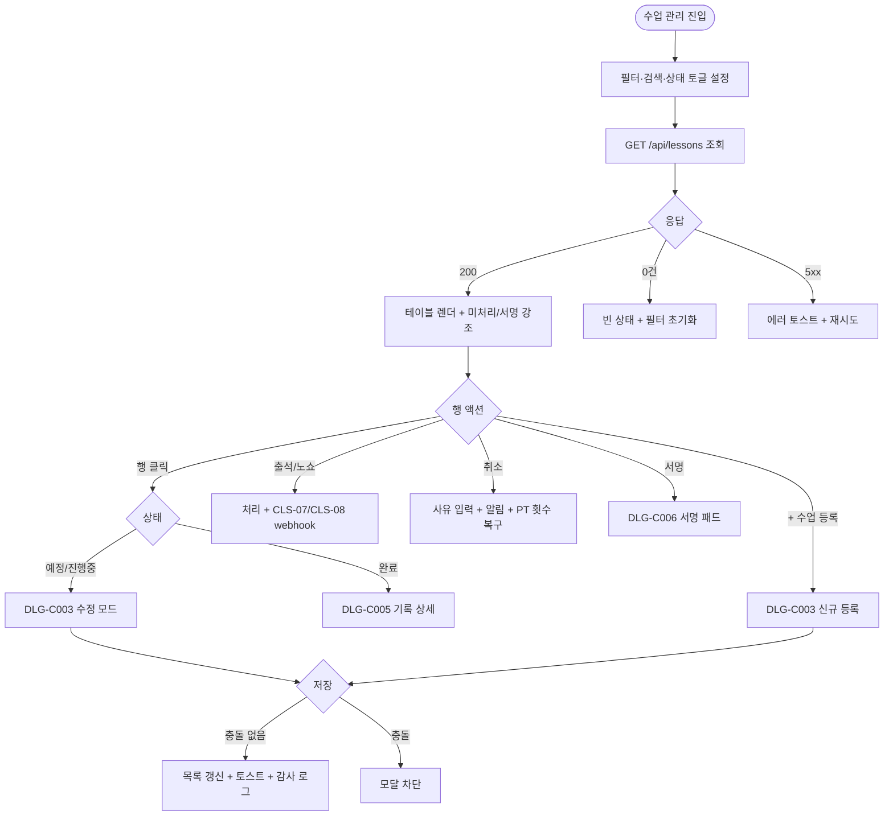
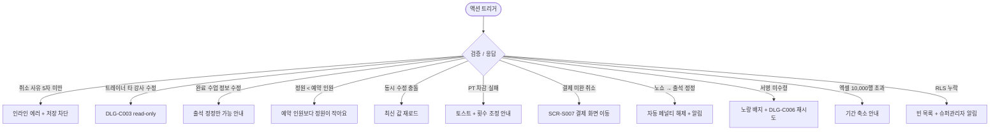

# SCR-C002 수업 관리 페이지

## 1. 화면 메타 정보

이 문서는 수업 관리 페이지(목록 기반 정밀 관리)에 대한 자기완결형 요구사항 정의서입니다. 다른 문서를 함께 보지 않아도 이 문서 한 장만으로 이 화면의 모든 영역·버튼·모달·권한·예외·운영 정책을 이해하고 구현할 수 있도록 작성합니다.

| 항목 | 값 |
|---|---|
| 작성일 | 2026-05-22 |
| 버전 | v1.0 |
| 상태 | 최신 통합본 반영 (정합화 완료) |
| 도메인 | D04 수업관리 |
| 화면 ID | SCR-C002 |
| 화면명 | 수업 관리 |
| 화면 유형 | 목록 화면 (List Screen) |
| 라우트 (URL) | `/lessons` |
| 플랫폼 | 데스크톱(기본), 태블릿 |
| 우선순위 | P0 |
| 기능코드 | CLS-02 (수업 관리) |
| 계약코드 | CLS-02, RSV-03 |
| 부모 기능 prefix | CLS |
| Lv1 코드 | CLS-02 |
| Lv2 / Lv3 세분화 | CLS-02-01 ~ CLS-02-08 (필터 바, 상태 필터, 수업 목록 테이블, 수업 등록, 수업 수정, 수업 취소, 출석 처리, 수업 기록 상세) |
| 연계 화면 | SCR-C001 수업캘린더, SCR-C007 횟수관리, SCR-C008 페널티관리, SCR-C011 유효수업목록, SCR-C013 수업평가피드백, SCR-S007 환불, SCR-097 감사로그 |
| 호출 다이얼로그 | DLG-C003 수업등록수정_관리, DLG-C005 수업기록상세, DLG-C006 서명 |

## 2. 화면 개요와 목적

수업 관리 페이지는 등록된 수업 전체를 목록으로 조회·필터링하고, 행 단위로 정밀한 정보 수정·취소·출석 처리·서명 확인을 수행하는 D04 수업관리 도메인의 보조 운영 화면입니다. 시간 축 위의 시각형 관리를 책임지는 SCR-C001 수업 캘린더와 달리 본 화면은 "한 줄에 한 수업"이라는 행 중심 구조로 검색·정렬·정정·기록 확인에 최적화되어 있습니다. 캘린더에서 드래그&드롭으로 시간을 옮기거나 빈 슬롯에서 새 수업을 만드는 것이 SCR-C001의 책임이라면, 이미 등록된 수업의 정보를 정밀하게 다듬고 출석/노쇼를 정정하고 분쟁 대응용 기록을 확인하는 것은 본 화면의 책임입니다.

운영 흐름을 보면 매니저는 일·주간 정산을 위해 완료 상태 필터로 특정 강사의 출석·노쇼 카운트를 확인해 급여 정산 자료를 만들고, 트레이너는 출석 누락이 발견되면 본 화면에서 행을 클릭해 DLG-C003에서 출석/노쇼를 정정하고 사유를 기록합니다. FC는 회원 문의 응대 중 회원 이름을 검색해 예약 이력을 추적하고, 센터장은 분쟁이 들어오면 DLG-C005 수업 기록 상세와 DLG-C006 서명 이미지를 확인해 증빙을 제시합니다. 본사 슈퍼관리자는 강습 세션 유형 4종(PT·필라테스·스트레칭·테라피) 필터로 KPI 원천 데이터의 정합성을 검증하고, 매니저는 행 단위 정밀 취소(사유 입력 + 회원 알림)와 노쇼 자동 페널티 검증을 수행합니다.

## 3. 진입 경로와 인접 화면

본 화면은 사이드바의 "수업관리 > 수업 관리" 또는 캘린더(SCR-C001) 상단 탭 내비게이션의 "수업 관리" 탭, 그리고 `/lessons` 직접 진입의 세 경로로 들어옵니다. 대시보드의 "오늘의 완료 수업", "출석 미처리", "노쇼 누적" 같은 지표 카드를 누르면 해당 필터가 자동 적용된 상태로 진입합니다.

탭 내비게이션은 캘린더와 동일한 5탭(일정표·수업 관리·횟수 관리·페널티 관리·유효 수업 목록)이며 현재 화면은 "수업 관리"가 활성입니다. 본 화면에서 빠져나가는 인접 화면은 DLG-C003·DLG-C005·DLG-C006, 그리고 회원명 클릭으로 진입하는 SCR-M004 회원 상세, 환불이 필요할 때 진입하는 SCR-S007 환불, 정정 이력이 기록되는 SCR-097 감사 로그입니다.

## 4. 레이아웃과 UI 구성

페이지 헤더 좌측에는 "수업 관리" 타이틀과 지점 컨텍스트 배지가 있고, 우측에는 "수업 등록" 버튼이 배치되어 클릭 시 DLG-C003이 빈 입력 상태로 열립니다. 헤더 아래에는 도메인 공통 5탭 내비게이션과 "수업 관리" 활성 표시가 따라옵니다.

탭 아래에는 필터 바가 있으며 좌측부터 강사 단일 드롭다운, 장소 단일 드롭다운, 강습 세션 유형 멀티 필터(PT·필라테스·스트레칭·테라피), 기간 범위(시작일~종료일), 회원명/연락처 검색 입력(디바운스 300ms)이 차례로 배치됩니다. 필터 바 아래에는 상태 필터 버튼이 가로로 펼쳐지며 전체 / 예정 / 진행중 / 완료 / 취소의 5개 버튼이 단일 토글로 동작하고 각 버튼 우측에 상태별 건수 배지가 표시됩니다.

상태 필터 아래는 수업 목록 테이블이며 좌측부터 수업명, 유형(PT/GX/개인레슨/기타), 강습 세션 유형(PT/필라테스/스트레칭/테라피), 강사, 장소, 날짜·시간, 예약 현황(현재/정원), 상태 배지, 출석/노쇼 카운트, 그리고 본사 통합 모드일 때만 추가되는 지점 컬럼이 표시됩니다. 행을 클릭하면 DLG-C003 수업 등록/수정이 열리고, 완료 상태 행을 클릭하면 DLG-C005 수업 기록 상세가 함께 사용됩니다.

테이블 하단에는 페이지네이션(20·50·100건 선택), 총 건수, "엑셀 다운로드" 버튼이 있습니다. 엑셀 다운로드는 현재 필터·검색을 적용한 결과만 받으며 최대 10,000행까지로 제한됩니다.

## 5. 탭 구성과 탭별 동작

본 화면은 1차 도메인 탭(일정표·수업 관리·횟수 관리·페널티 관리·유효 수업 목록) 위에 있고, 자체 2차 탭으로 상태 필터 버튼(전체·예정·진행중·완료·취소)을 사용합니다. 상태 필터를 바꿔도 강사·장소·세션 유형·기간·검색은 유지되며 테이블만 재조회됩니다. 종료 시간이 경과한 예정 상태 행은 주황 강조로 미처리 임박을 알려주고, 완료 + 서명 미수령 행은 노랑 배지가 추가됩니다.

## 6. 버튼·아이콘·링크 액션 전체 정의

"수업 등록" 버튼은 DLG-C003 신규 등록 모드를 엽니다. FC·트레이너·스태프·readonly에게는 보이지 않습니다.

행의 수업명 클릭은 DLG-C003을 수정 모드로 엽니다. 완료 상태이면 정보 수정은 차단되고 출석 정정 + 사유 입력만 허용됩니다. 트레이너가 타 강사 수업 행을 클릭하면 DLG-C003이 read-only 모드로 열립니다.

행 우측의 [출석] / [노쇼] 버튼은 권한자(트레이너 본인 담당·매니저 이상)에게만 노출됩니다. 출석은 PT 횟수 자동 차감(CLS-07)을 트리거하고, 노쇼는 자동 페널티 부과(CLS-08)를 트리거하며 동시에 회원 알림을 발송합니다.

행의 [취소] 버튼은 사유 입력(최소 5자) 후 확인하면 수업 상태를 취소로 바꾸고 예약 회원에게 자동 알림을 보내며 PT 횟수를 자동 복구합니다. 결제 완료된 1회권 수업이면 SCR-S007 환불 화면으로 이동 안내가 추가로 표시됩니다.

완료 상태 행의 [서명] 또는 [기록] 버튼은 각각 DLG-C006 서명 패드와 DLG-C005 수업 기록 상세를 엽니다. 회원명 클릭은 SCR-M004 회원 상세로 이동합니다.

엑셀 다운로드 버튼은 매니저 이상에게만 보이고, 10,000행 초과 시 "기간을 좁혀주세요" 안내로 차단됩니다.

## 7. 호출되는 모달 동작

### 7-1. DLG-C003 수업 등록/수정 다이얼로그
신규 등록 모드는 빈 입력으로 시작해 수업 유형·강습 세션 유형·강사·장소·시간·정원·메모를 입력받습니다. 수정 모드는 기존 값이 채워진 상태로 열리며, 완료 상태 수업은 정보 수정이 차단되고 출석 정정만 가능합니다. 저장 시 강사·장소 충돌이 백엔드에서 다시 검증되고, 통과되면 목록이 갱신되며 회원 알림이 발송됩니다. 동시 수정 충돌(낙관적 락)이 감지되면 "다른 사용자가 먼저 수정했어요" 안내 후 최신 값이 재로드됩니다.

### 7-2. DLG-C005 수업 기록 상세 다이얼로그
완료 수업의 출석·서명·메모·QR 체크인 로그를 한 화면에 모아 보여줍니다. 분쟁 대응을 위한 증빙 화면이며 5년 이상 보관됩니다. 매니저 이상은 정정 사유 입력 후 출석/노쇼를 다시 정정할 수 있고, 노쇼→출석 정정 시 자동 페널티가 자동 해제됩니다.

### 7-3. DLG-C006 서명 다이얼로그
PT 수업 종료 시 회원 서명을 받는 모달입니다. 태블릿 또는 회원 디바이스로 서명 패드가 표시되고, 저장 시 서명 이미지가 암호화되어 보관됩니다. PT 수업 미수령 시 행에 노랑 배지가 표시됩니다.

## 8. 토스트와 확인 팝업과 알럿

성공 토스트는 "수업이 등록되었어요", "출석을 처리했어요", "수업을 취소했어요" 같은 문구로 우상단에 5초 표시됩니다. 실패 토스트는 "다른 사용자가 먼저 수정했어요", "이용권이 만료되어 차감에 실패했어요", "예약 인원보다 정원이 작아요"처럼 사유를 명시하고 다시 시도 액션을 함께 제공합니다.

확인 팝업은 수업 취소 직전 단순 yes/no로, 사유가 5자 이상 입력되어야 활성화됩니다. 알럿은 권한 없는 계정의 직접 URL 접근 시 표시되고 3초 후 대시보드로 자동 이동합니다.

## 9. 데이터 흐름과 외부 연동

화면 진입 시 `GET /api/lessons`가 호출되어 필터·검색·페이지네이션이 반영된 목록을 가져옵니다. 단일 수정은 `PUT /api/lessons/:id`, 취소는 `POST /api/lessons/:id/cancel`, 출석 처리는 `POST /api/lessons/:id/attendance`, 기록 조회는 `GET /api/lessons/:id/record`로 처리됩니다.

출석 처리 webhook은 CLS-07 횟수 관리에 PT 횟수 차감 신호를 보내고(booking_id 우선 / 예약 없는 수동 체크인은 member_id+lesson_id 멱등성 키), 노쇼 처리 webhook은 CLS-08 페널티에 자동 부과 신호를 보냅니다. 시작 시간 도달 + 출석 1건 이상이면 매분 도는 자동 진행중 전이 잡이 상태를 "진행중"으로 바꾸고, 종료 시간 + 30분이 경과해도 미처리면 A05 노쇼 자동 처리 크론이 자동 노쇼로 마감합니다.

본 화면에서 발생하는 모든 등록·수정·취소·출석·서명·정정 액션은 SCR-097 감사 로그에 actor·lesson_id·before·after로 비동기 INSERT됩니다. 본사 통합 모드에서는 슈퍼관리자·primary가 지점 컬럼을 볼 수 있고 전 지점 합산으로 조회됩니다.

## 10. 화면 상태와 예외 처리

로딩 중에는 행 스켈레톤이 표시되고, 정상 표시 상태에서는 페이지네이션과 함께 목록이 렌더됩니다. 검색 결과 0건이면 "조건에 맞는 수업이 없어요"와 "필터 초기화" 안내가 표시됩니다. 출석 미처리 강조 상태는 종료 시간 경과 + 예정 상태인 행에 주황 배지를 붙이고, 정원 < 예약 인원 경고는 빨강 배지로 정원 조정이 필요함을 알립니다. 완료 + 서명 미수령은 노랑 배지 + 행 강조로 표시됩니다.

취소 사유 미입력은 인라인 에러로 차단됩니다. 트레이너의 타 강사 수정 시도는 DLG-C003 read-only로 처리됩니다. 완료 수업의 정보 수정 시도는 "완료된 수업은 정보를 수정할 수 없어요"로 차단되고 출석 정정만 허용됩니다. 동시 수정 충돌은 최신 값 재로드로 안내되며, PT 차감 실패는 토스트 + 운영자 횟수 조정 안내로 후속됩니다. 결제 미완 수업 취소는 결제 화면 이동 안내가 함께 표시됩니다. 노쇼 → 출석 정정 시 자동 페널티 자동 해제가 함께 일어납니다. 엑셀 10,000행 초과는 "기간을 좁혀주세요"로 차단됩니다.

## 11. 권한별 처리

슈퍼관리자·본사 최고관리자·센터장·매니저는 등록·수정·취소·출석·서명 검토를 모두 수행합니다. 트레이너는 본인 담당 수업만 수정·출석 처리가 가능하고 타 강사 수업은 조회만 됩니다. FC·스태프는 전체 수업 목록 조회만 가능하고 등록·수정 버튼이 보이지 않습니다. readonly는 화면 자체에 접근할 수 없습니다. 본사 통합 모드에서 지점 컬럼은 슈퍼관리자·primary에게만 노출됩니다.

권한이 부족한 경우 1차로 메뉴/버튼이 숨겨지고, 2차로 비활성화 표시되며, 3차로 백엔드 403 응답이 "권한이 없어요" 토스트로 안내되고 모든 차단 이벤트는 감사 로그에 기록됩니다.

## 12. 메인 흐름

## 13. 에러와 예외 흐름

## 14. 핵심 디자인 요청사항

수업 관리는 목록 기반이라 테이블 가독성이 가장 중요합니다. 컬럼 간격은 충분히 넓게, 상태 배지는 색상과 라벨을 함께 표시해 색맹 운영자도 식별 가능하게 합니다. 출석 미처리 강조(주황), 정원 부족 경고(빨강), 서명 미수령(노랑)은 한 행에 중복으로 나타날 수 있으므로 우선순위가 높은 색상이 행 좌측 인디케이터로 보이고 보조 정보는 우측 배지로 분리됩니다. 행 hover 시 취소 사유 툴팁이 부드럽게 나타나 운영자가 사유를 빠르게 확인할 수 있어야 합니다. 페이지네이션·총 건수·엑셀 다운로드 버튼은 화면 하단에 고정되어 스크롤 중에도 항상 보이게 합니다.

## 15. 운영 정책 (이 화면에 연결된 부분)

수업 유형(PT/GX/개인레슨/기타)은 화면 운영 분류이고, 강습 세션 유형은 KPI 산출용 4종 고정값(PT·필라테스·스트레칭·테라피)입니다. 두 축을 절대 섞지 않습니다.

수업 완료(출석 처리) 시 PT 횟수가 자동 차감되며 멱등성 키(booking_id 우선, 없으면 member_id+lesson_id)로 중복 차감이 차단됩니다. 취소 시 PT 횟수가 자동 복구되고 회원 알림이 발송됩니다. 모든 취소는 사유 텍스트 최소 5자가 필수이며 감사 로그에 기록됩니다. 노쇼 처리는 CLS-08 자동 페널티 정책에 연결되며, 노쇼 → 출석 정정 시 자동 페널티가 자동 해제됩니다.

출석 정정 권한은 매니저 이상은 전체 가능, 트레이너는 본인 담당만 가능합니다. PT 수업 완료 시 회원 서명이 필수이며 미수령 시 노랑 배지로 표시됩니다(테넌트 정책에 따라 GX는 선택). 서명 이미지는 암호화 저장되며 5년 보관됩니다.

자동 진행중 전이는 시작 시간 도달 + 출석 1건 이상이면 매분 도는 잡으로 처리되고, 종료 시간 + 30분 경과해도 미처리면 A05 자동 노쇼 처리 크론이 동작합니다. 상태 전이 정책은 예정 → 진행중(자동) → 완료(출석/노쇼 처리 시)이며, 취소는 모든 단계에서 가능하나 완료 후 취소는 운영자 권한이 필요합니다.

정원 검증은 정원 변경 시 예약 인원 < 새 정원이어야 하며, 위반 시 차단됩니다. 본사 통합 모드는 슈퍼관리자·primary만 사용 가능하고 지점 컬럼이 노출되며 엑셀 다운로드는 최대 10,000행으로 제한됩니다. 회원 마지막 방문일(last_visit_at)은 출석 처리 시 자동 갱신되어 SCR-M004 회원 상세에 반영됩니다.

수업 기록은 분쟁 대응을 위해 최소 5년 보관되며 DLG-C005에서 출석·서명·메모·QR 로그를 통합 조회할 수 있습니다. 감사 로그는 등록·수정·취소·출석·서명·정정 모두 actor·lesson_id·before·after로 비동기 기록되어 5초 안에 SCR-097에서 조회 가능해야 합니다.
