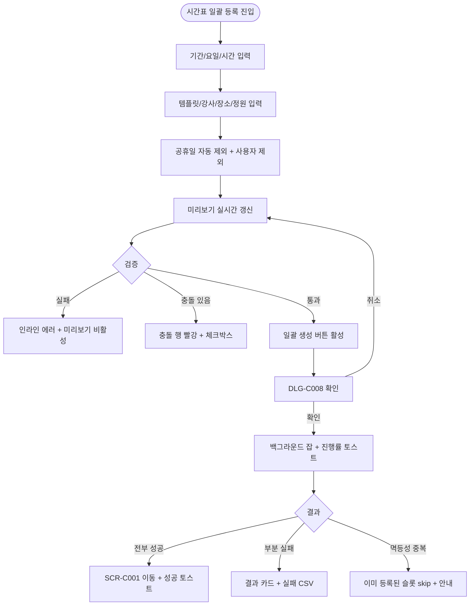
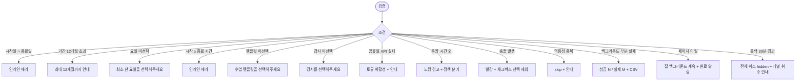

# SCR-C003 시간표 일괄 등록 페이지

## 1. 화면 메타 정보

이 문서는 시간표 일괄 등록 페이지(반복 일정 대량 생성)에 대한 자기완결형 요구사항 정의서입니다. 다른 문서를 함께 보지 않아도 이 문서 한 장만으로 화면을 이해하고 구현할 수 있도록 작성합니다.

| 항목 | 값 |
|---|---|
| 작성일 | 2026-05-22 |
| 버전 | v1.0 |
| 상태 | 정합화 완료 |
| 도메인 | D04 수업관리 |
| 화면 ID | SCR-C003 |
| 화면명 | 시간표 일괄 등록 |
| 화면 유형 | 작업 화면 (Wizard / Form) |
| 라우트 (URL) | `/class-schedule` |
| 플랫폼 | 데스크톱(기본) |
| 우선순위 | P1 |
| 기능코드 | CLS-03 |
| 계약코드 | CLS-03 |
| Lv1 코드 | CLS-03 |
| Lv2 / Lv3 세분화 | CLS-03-01 ~ CLS-03-09 (기간 설정, 요일 선택, 시간 설정, 수업 템플릿 선택, 강사·장소 배정, 정원 입력, 예외 날짜 제외, 미리보기, 일괄 생성) |
| 연계 화면 | SCR-C001 수업캘린더, SCR-C002 수업관리, SCR-C004 그룹수업템플릿 |
| 호출 다이얼로그 | DLG-C008 일괄생성확인 |

## 2. 화면 개요와 목적

시간표 일괄 등록 페이지는 매주 같은 요일·시간에 반복되는 그룹 수업이나 PT 일정을 한 번에 대량 생성하기 위한 전용 작업 화면입니다. 운영자가 기간·요일·시간·수업 템플릿·강사·장소·정원을 한 번만 입력하면, 그 조건이 적용되는 모든 날짜의 일정이 백그라운드 잡으로 자동 생성됩니다. 분기 시간표 개편, 신규 강사 입사 시 본인 시간표 등록, 폐강된 GX의 재개, 트레이너 신규 PT 슬롯 추가 같은 운영 흐름이 이 화면 하나로 처리됩니다.

분기 시작 전 매니저는 새 GX 라인업 3개월치를 한 번에 등록하고, 공휴일은 자동 제외 옵션으로 빼고, 운영자가 추가로 워크샵일을 사용자 제외 날짜로 등록할 수 있습니다. 신규 강사는 입사일~계약 종료일 사이 자기 시간표를 본인 강사로 한정해 등록합니다. 본 화면은 일괄 등록 전용이며, 등록 후 개별 수업의 수정·취소는 SCR-C001 또는 SCR-C002에서 수행합니다.

## 3. 진입 경로와 인접 화면

사이드바의 "수업관리 > 시간표 일괄 등록" 또는 SCR-C001 캘린더 상단의 "스케줄 일괄 등록" 메뉴 항목으로 진입합니다. 완료 후에는 SCR-C001로 자동 이동하여 새로 생성된 일정이 캘린더에 즉시 표시되는 것을 확인할 수 있습니다. 인접 화면은 SCR-C004 그룹수업템플릿(템플릿 부족 시 등록 화면으로 이동), SCR-C001 수업캘린더, SCR-C002 수업관리, 그리고 DLG-C008 일괄생성확인입니다.

## 4. 레이아웃과 UI 구성

페이지는 좌측 입력 폼 약 60% / 우측 미리보기 약 40%의 2단 구성입니다. 입력 폼은 위에서 아래로 기간 설정(시작일~종료일 캘린더 피커, 최대 12개월), 요일 선택(월·화·수·목·금·토·일 토글 다중 선택), 시간 설정(시작 시간·종료 시간 30분 단위 드롭다운), 수업 템플릿 선택(SCR-C004에서 등록된 활성 템플릿 드롭다운, 선택 시 수업명·정원·유형·세션 유형 자동 채움), 강사 드롭다운(트레이너 계정에서는 본인만 선택 가능), 장소 드롭다운, 정원 입력(템플릿 기본값 자동 채움 + 수정 가능), 예외 날짜 제외(공휴일 자동 제외 토글 + 사용자 추가 제외 날짜 입력)가 차례로 배치됩니다.

우측 미리보기 영역은 입력 폼의 값이 바뀔 때마다 실시간으로 갱신됩니다. 상단에 "총 N건의 일정이 생성됩니다" 카운트가 크게 표시되고, 그 아래에 생성될 모든 날짜 목록이 카드 또는 리스트 형태로 나열됩니다. 기존 일정과 충돌하는 날짜는 빨강 배경으로 강조되며 체크박스가 함께 노출되어 사용자가 선택적으로 제외할 수 있습니다. 운영 시간을 벗어난 슬롯은 노랑 경고로 표시됩니다.

페이지 하단에는 [일괄 생성] 버튼이 고정되어 있으며 누르면 DLG-C008 최종 확인 다이얼로그가 열립니다.

## 5. 탭 구성과 탭별 동작

본 화면은 탭 구조 없는 단일 작업 화면입니다. 입력 영역과 미리보기 영역이 동시에 표시되며 사용자의 입력에 따라 미리보기가 실시간으로 갱신됩니다.

## 6. 버튼·아이콘·링크 액션 전체 정의

기간·요일·시간·템플릿·강사·장소·정원·예외 날짜 입력은 변경 즉시 우측 미리보기를 재계산합니다. 시작일 > 종료일이면 인라인 에러가 뜨고 미리보기가 비활성됩니다. 요일 미선택, 시작 시간 ≥ 종료 시간, 템플릿/강사 미선택도 같은 방식으로 검증됩니다. 공휴일 자동 제외 토글은 정부 공휴일 API 데이터를 기준으로 동작하며, API 실패 시 토글이 비활성화되고 "공휴일 데이터를 가져올 수 없어요" 안내가 뜹니다.

미리보기의 충돌 행 체크박스는 해당 날짜를 등록 대상에서 제외합니다. [일괄 생성] 버튼은 DLG-C008을 열고, 확인을 누르면 백그라운드 잡이 시작되어 진행률 토스트가 화면 우상단에 뜹니다. 완료 후 SCR-C001로 자동 이동하며 성공 토스트("총 N건의 일정을 등록했어요")가 표시됩니다. 부분 실패가 발생하면 결과 카드에 "성공 N / 실패 M"이 표시되고 실패 목록 CSV가 다운로드 가능합니다.

등록 후 30분 이내에는 [전체 취소] 버튼이 노출되어 batch_id 기준으로 일괄 롤백할 수 있습니다. 30분 경과 후에는 개별 취소만 가능합니다.

## 7. 호출되는 모달 동작

### 7-1. DLG-C008 일괄 생성 확인 다이얼로그
모달 상단에 "총 N건의 일정을 생성하시겠습니까?"라는 제목이 표시되고, 그 아래에 카드 3개(총 생성 건수 / 제외 건수 / 충돌 건수)가 나란히 보입니다. 운영자가 [확인]을 누르면 백그라운드 잡이 시작되고 모달이 닫힙니다. [취소]는 변경 없이 모달을 닫고 입력값은 유지됩니다. 100건을 초과하는 일괄 등록은 비동기 잡으로 처리되며, 페이지를 떠나도 잡은 계속 진행되고 완료 시 알림 센터에 결과가 푸시됩니다.

## 8. 토스트와 확인 팝업과 알럿

성공 토스트는 "총 N건의 일정을 등록했어요" 또는 "이미 등록된 슬롯 N건은 제외되었어요"입니다. 실패 토스트는 "공휴일 데이터를 가져올 수 없어요", "이미 등록된 슬롯이 있어서 일부만 등록되었어요", "기간이 12개월을 초과해요" 같이 사유를 명시합니다. 진행률 토스트는 백그라운드 잡 진행 중에 화면 우상단에 떠 있고 클릭하면 결과 카드로 이동합니다. 부분 실패 결과 카드는 "성공 N / 실패 M" + 실패 리포트 CSV 다운로드 링크로 구성되어 운영자가 실패 건만 재시도할 수 있게 합니다.

## 9. 데이터 흐름과 외부 연동

화면에서 사용하는 API는 미리보기 산출 `POST /api/lessons/bulk-create/preview`, 일괄 등록 실행 `POST /api/lessons/bulk-create`, 기간 내 충돌 검증 `GET /api/lessons/conflicts/by-range`입니다. 공휴일 자동 제외는 외부 공휴일 API(정부 공휴일 데이터)와 연동되어 자동 제외 토글이 활성됩니다. 본 화면에서 사용하는 템플릿 데이터는 CLS-04 그룹수업 템플릿에서 활성으로 등록된 항목만 노출되며, 템플릿 선택 시 정원·유형·세션 유형·색상이 자동 채워집니다.

등록 결과는 batch_id 단위로 묶여 SCR-097 감사 로그에 기록됩니다. 미승인 정책이 활성된 테넌트에서는 신규 등록이 "미승인" 상태로 시작되고 센터장에게 승인 알림이 발송됩니다. 완료 후 회원앱 예약 화면은 webhook으로 갱신되어 신규 슬롯이 즉시 예약 가능 상태로 노출됩니다.

## 10. 화면 상태와 예외 처리

초기 상태에서는 기간·요일·시간이 미설정이며 미리보기가 비어 있습니다. 설정 진행 중 상태에서는 일부 필수 입력만 채워져 있어 미리보기가 부분 표시됩니다. 설정 완료 상태에서 미리보기에 총 건수와 날짜 목록이 모두 표시되고 [일괄 생성] 버튼이 활성화됩니다. 충돌 경고 상태에서는 충돌 행이 빨강 배경 + 체크박스로 표시되어 선택적 제외가 가능합니다. 운영시간 외 경고는 노랑으로 표시되며 정책에 따라 차단 또는 진행을 허용합니다. 생성 중 상태에서는 백그라운드 잡 진행률 토스트가 떠 있고, 완료 시 SCR-C001로 자동 이동합니다. 부분 실패 시 결과 카드 + 실패 리포트 CSV가 제공되어 실패 건만 재시도할 수 있습니다.

예외 케이스로 시작일 > 종료일, 기간 12개월 초과, 요일 미선택, 시작 ≥ 종료 시간, 템플릿/강사 미선택은 모두 인라인 에러로 차단됩니다. 동일 조건 중복 실행은 멱등성 키로 skip 처리되고 "이미 등록된 슬롯 N건은 제외됩니다" 안내가 표시됩니다. 트레이너가 타 강사를 선택하려 하면 드롭다운에 본인만 표시되어 차단됩니다. 권한 부족 계정의 직접 URL 진입은 접근 차단 화면이 표시됩니다.

## 11. 권한별 처리

슈퍼관리자·본사 최고관리자·센터장·매니저는 모든 옵션을 사용할 수 있습니다. 트레이너는 본인 이름만 강사로 선택 가능하며 본인 담당 시간표만 등록할 수 있습니다. FC·스태프·readonly는 본 화면에 접근할 수 없습니다. 본사 통합 모드 활성 시 슈퍼관리자·primary는 지점 다중 선택 일괄 등록이 가능합니다.

## 12. 메인 흐름

## 13. 에러와 예외 흐름

## 14. 핵심 디자인 요청사항

좌측 입력과 우측 미리보기가 같은 시선 흐름 안에 있어야 합니다. 입력값이 변할 때 우측 미리보기 카운트와 날짜 목록이 부드럽게 갱신되어 운영자가 즉시 결과를 확인할 수 있어야 합니다. 충돌 행은 강한 빨강 배경 + 체크박스를 사용해 무엇이 빠지는지 명확히 보여주며, 공휴일 자동 제외 결과는 별도의 회색 라벨("공휴일 자동 제외")로 표시합니다. [일괄 생성] 버튼은 화면 하단에 고정되어 스크롤 중에도 항상 보이게 합니다.

## 15. 운영 정책 (이 화면에 연결된 부분)

본 화면은 신규 슬롯 일괄 생성 전용이며, 기존 일정의 일괄 변경은 DLG-C004 일괄 변경(SCR-C001에서 호출)이 담당합니다. 두 화면의 역할은 절대 섞이지 않습니다.

기간 최대 12개월(365일) 제한, 시간 30분 단위, 수업 길이 30~240분 범위는 강제 정책입니다. 강습 세션 유형 4종 고정값(PT·필라테스·스트레칭·테라피)은 KPI 집계 원천이므로 템플릿 선택 시 자동으로 채워지지만 운영자가 변경할 수도 있습니다.

100건 초과 일괄 등록은 백그라운드 비동기 잡으로 처리되며 페이지를 떠나도 잡은 계속 진행됩니다. 멱등성 정책에 의해 동일 조건(강사·시간·장소·날짜) 중복 실행은 skip 처리되고 안내됩니다. 부분 실패는 성공분 유지 + 실패 목록 별도 표시 방식으로 처리되어 운영자가 같은 작업을 처음부터 다시 하지 않게 합니다. 롤백 정책은 등록 후 30분 이내 batch_id 기준 [전체 취소]가 가능하고, 그 이후는 개별 취소만 허용됩니다.

공휴일 자동 제외는 정부 공휴일 API에 의존하며 실패 시 토글이 비활성됩니다. 회원 알림은 본 화면에서 발송되지 않는데, 이는 신규 슬롯이라 예약 회원이 아직 없기 때문입니다. 회원앱 노출은 등록 즉시 활성이며 미승인 정책 활성 테넌트에서는 승인 후 노출입니다. 감사 로그는 batch_id·총 건수·성공·실패·제외가 모두 기록되어 SCR-097에서 조회 가능합니다.
