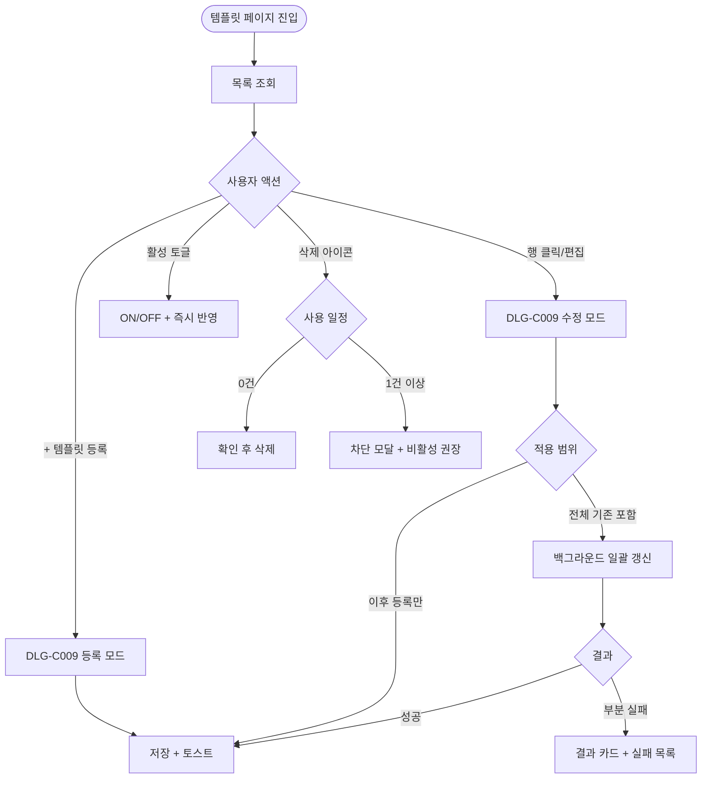

# SCR-C004 그룹 수업 템플릿 페이지

## 1. 화면 메타 정보

| 항목 | 값 |
|---|---|
| 작성일 | 2026-05-22 |
| 버전 | v1.0 |
| 상태 | 정합화 완료 |
| 도메인 | D04 수업관리 |
| 화면 ID | SCR-C004 |
| 화면명 | 그룹 수업 템플릿 |
| 화면 유형 | 마스터 데이터 관리 화면 |
| 라우트 (URL) | `/class-templates` |
| 플랫폼 | 데스크톱, 태블릿 |
| 우선순위 | P1 |
| 기능코드 | CLS-04 |
| 계약코드 | CLS-04 |
| Lv1 코드 | CLS-04 |
| Lv2 / Lv3 세분화 | CLS-04-01 ~ CLS-04-06 (템플릿 목록, 템플릿 등록, 템플릿 수정, 활성/비활성, 템플릿 삭제, 빈 상태) |
| 연계 화면 | SCR-C001 수업캘린더, SCR-C003 시간표일괄등록, SCR-C005 그룹수업현황 |
| 호출 다이얼로그 | DLG-C009 템플릿등록수정 |

## 2. 화면 개요와 목적

그룹 수업 템플릿 페이지는 GX·기구 필라테스·스피닝·매트 필라테스·요가 같은 그룹 수업의 기본 정보(수업명·유형·정원·기본 장소·색상·강습 세션 유형)를 사전에 정의해 두는 마스터 데이터 관리 화면입니다. 한번 만들어 둔 템플릿은 SCR-C003 시간표 일괄 등록과 SCR-C001 캘린더의 DLG-C001 수업 등록에서 드롭다운으로 선택할 수 있어, 반복되는 입력을 줄이고 표준화된 운영을 가능하게 합니다.

분기 수업 라인업 개편 시 매니저는 신규 GX 수업명·정원·색상을 템플릿에 추가하고, 인기 GX 정원을 12 → 16명으로 일괄 확대할 때는 적용 범위("이후 등록만" / "전체 기존 일정 포함")를 선택해 의도한 만큼만 영향을 줍니다. 계절 수업은 활성/비활성 토글로 신규 등록 목록에서 자동 숨김 처리되고, 사용 일정 0건인 템플릿은 삭제로 정돈할 수 있습니다.

## 3. 진입 경로와 인접 화면

사이드바의 "수업관리 > 그룹 수업 템플릿"으로 진입합니다. 인접 화면은 SCR-C003 시간표 일괄 등록(템플릿 즉시 사용), SCR-C001 캘린더(색상 적용 확인), SCR-C005 그룹수업현황입니다.

## 4. 레이아웃과 UI 구성

페이지 헤더 좌측에 "그룹 수업 템플릿" 타이틀과 지점 컨텍스트 배지, 우측에 "비활성 포함 보기" 토글과 [+ 템플릿 등록] 버튼이 있습니다. 템플릿 목록은 카드 또는 테이블 뷰로 표시되며 한 행에 수업명·유형·정원·기본 장소·강습 세션 유형·색상 칩·활성 토글·사용 일정 카운트·편집·삭제 아이콘이 함께 노출됩니다. 비활성 템플릿은 회색으로 흐려져 표시되며 "비활성 포함 보기" 토글이 꺼져 있으면 숨겨집니다.

빈 상태에서는 "등록된 템플릿이 없어요" 안내와 함께 [+ 템플릿 등록] CTA가 화면 중앙에 표시됩니다.

## 5. 탭 구성과 탭별 동작

본 화면에는 별도의 탭이 없고 단일 목록 + "비활성 포함 보기" 토글만 있습니다. 토글이 꺼지면 활성 템플릿만 표시되고, 켜지면 비활성도 함께 보입니다.

## 6. 버튼·아이콘·링크 액션 전체 정의

[+ 템플릿 등록]은 DLG-C009 등록 모드를 엽니다. 행의 수업명 클릭 또는 편집 아이콘 클릭은 DLG-C009 수정 모드를 엽니다. 활성 토글은 즉시 ON/OFF되며 비활성 시 신규 등록 목록에서 자동 숨김됩니다. 기존 일정은 영향받지 않습니다. 삭제 아이콘은 사용 일정 카운트를 확인하고, 0건이면 삭제 확인 후 처리하고, 1건 이상이면 차단 모달("사용 중 일정 N건이 있어요")이 뜨고 [일정 보기]·[비활성 권장] 버튼이 함께 제공됩니다.

각 권한별 버튼 노출은 매니저+ 등록·수정·활성, owner+ 삭제, 트레이너·FC·스태프는 조회만 가능합니다.

## 7. 호출되는 모달 동작

### 7-1. DLG-C009 템플릿 등록/수정 다이얼로그
입력 항목은 수업명(1~30자, 활성 템플릿 중복 차단), 유형(GX/기구필라테스/스피닝/매트필라테스 등 테넌트 커스터마이즈), 정원(1~99명), 기본 장소, 색상 6종 팔레트, 강습 세션 유형 4종(PT·필라테스·스트레칭·테라피)입니다. 수정 모드에서는 추가로 적용 범위 선택("이후 등록만" / "전체 기존 일정 포함")이 노출됩니다. "전체 기존 일정 포함" 선택 시 백그라운드 일괄 갱신 잡이 실행되어 기존 일정의 정원·장소·색상이 갱신됩니다. 진행 중·완료 일정은 적용 제외입니다. 정원 축소 시 예약 인원 > 새 정원인 일정은 skip + 실패 목록에 표시됩니다.

## 8. 토스트와 확인 팝업과 알럿

성공 토스트는 "템플릿을 등록했어요", "템플릿을 수정했어요", "템플릿을 비활성화했어요" 같이 표시됩니다. 사용 중 템플릿 삭제 시도는 모달로 차단되고 비활성 권장 안내가 함께 표시됩니다. 일괄 갱신 부분 실패는 성공 N / 실패 M 결과 카드로 안내됩니다.

## 9. 데이터 흐름과 외부 연동

API는 목록 조회 `GET /api/class-templates`, 등록 `POST /api/class-templates`, 수정 `PUT /api/class-templates/:id`, 삭제 `DELETE /api/class-templates/:id`, 활성 토글 `POST /api/class-templates/:id/toggle-active`입니다. 사용 일정 카운트는 5분 캐시되며 실시간성이 필요한 경우 [새로고침]으로 즉시 갱신됩니다. 등록·수정·삭제·활성 토글은 모두 SCR-097 감사 로그에 actor·template_id·before·after로 기록됩니다.

본사 통합 정책이 활성된 테넌트에서는 본사 템플릿이 지점에 자동 동기화됩니다. 회원앱 노출은 활성 토글 시 신규 등록에만 영향을 주며, 기존 일정의 회원앱 표시는 유지됩니다.

## 10. 화면 상태와 예외 처리

기본 목록 상태는 활성 템플릿만 표시되며, "비활성 포함 보기" 토글이 ON이면 비활성도 회색으로 표시됩니다. 템플릿 0건 상태에서는 빈 상태 안내와 CTA가 노출됩니다. 삭제 불가 상태에서는 사용 중 일정 안내 모달과 [일정 보기] 버튼이 제공됩니다. 일괄 갱신 중 상태에서는 백그라운드 잡 진행률 토스트가 떠 있습니다.

예외 케이스로 수업명 미입력·30자 초과·활성 템플릿 중복, 정원 1~99 범위 위반, 사용 중 템플릿 삭제 시도, 정원 축소 시 예약 초과, 동시 활성 토글 충돌(최신 값 우선), 일괄 갱신 부분 실패가 있습니다. 권한 부족(FC)은 등록·수정 버튼이 숨겨지고 조회만 가능합니다.

## 11. 권한별 처리

슈퍼관리자·본사 최고관리자·Owner(지점장)은 등록·수정·삭제·활성 토글을 모두 수행합니다. 매니저는 등록·수정·활성 토글이 가능하지만 삭제는 owner 이상으로 한정됩니다. 트레이너·FC·스태프는 활성 템플릿 조회만 가능합니다. readonly는 화면 접근 불가입니다. 본사 통합 정책 활성 시 슈퍼관리자·primary는 본사 표준 템플릿을 등록·수정하여 지점에 자동 동기화시킵니다.

## 12. 메인 흐름



## 13. 에러와 예외 흐름

```mermaid
flowchart TD
    A([검증]) --> B{조건}
    B -->|수업명 미입력/30자 초과| C[인라인 에러]
    B -->|활성 중복| D["이미 같은 이름의 활성 템플릿이 있어요"]
    B -->|정원 범위 위반| E["1~99 사이로 입력해주세요"]
    B -->|세션 유형 미선택| F[KPI 영향 안내]
    B -->|사용 중 템플릿 삭제| G[차단 모달 + 비활성 권장]
    B -->|정원 축소 시 예약 초과| H[해당 일정 skip + 실패 목록]
    B -->|동시 활성 충돌| I[최신 값 우선 재로드]
    B -->|일괄 갱신 부분 실패| J[성공 N / 실패 M 모달]
    B -->|권한 부족 (FC)| K[등록·수정 버튼 hidden]
```

## 14. 핵심 디자인 요청사항

템플릿 카드는 색상 칩이 시각적으로 가장 두드러져 캘린더 색상과 동일한 인상을 줍니다. 사용 일정 카운트는 행 우측 끝에 숫자 배지로 표시되어 "삭제 가능 여부"를 한눈에 알 수 있게 합니다. 활성 토글은 카드 우상단에 큰 스위치 형태로, 비활성 카드는 색이 빠지고 회색 톤이 되어 활성과 명확히 구분됩니다. 빈 상태는 일러스트와 CTA를 중앙 정렬해 처음 진입한 운영자가 무엇을 할지 즉시 알 수 있게 합니다.

## 15. 운영 정책 (이 화면에 연결된 부분)

템플릿 비활성화는 기존 일정에 영향을 주지 않으며 신규 등록 시에만 선택 목록에서 숨겨집니다. 이는 운영 중인 일정이 갑자기 사라지는 일을 막기 위한 보호 정책입니다. 사용 일정 0건일 때만 삭제가 가능한 것도 같은 이유입니다.

수정 시 "이후 등록만" / "전체 기존 일정 포함" 적용 범위 분기는 운영자가 의도한 범위를 명확히 선택하도록 강제하는 정책입니다. "전체 포함" 선택 시 진행 중·완료 일정은 스냅샷 보존을 위해 적용 제외됩니다.

수업명은 1~30자, 정원은 1~99명, 색상은 6종 팔레트로 고정됩니다. 강습 세션 유형 4종(PT·필라테스·스트레칭·테라피)은 KPI 집계 원천이며 템플릿 단위에서도 필수 선택입니다. 본사 통합 정책 활성 시 본사 표준 템플릿이 지점에 자동 동기화되며, 비활성 시 지점이 자율적으로 관리합니다.

사용 카운트는 5분 캐시이며 일괄 갱신은 백그라운드 잡으로 처리됩니다. 감사 로그에 등록·수정·삭제·활성 토글이 모두 기록되어 마스터 데이터 변경 이력이 5초 안에 SCR-097에서 조회 가능합니다.
