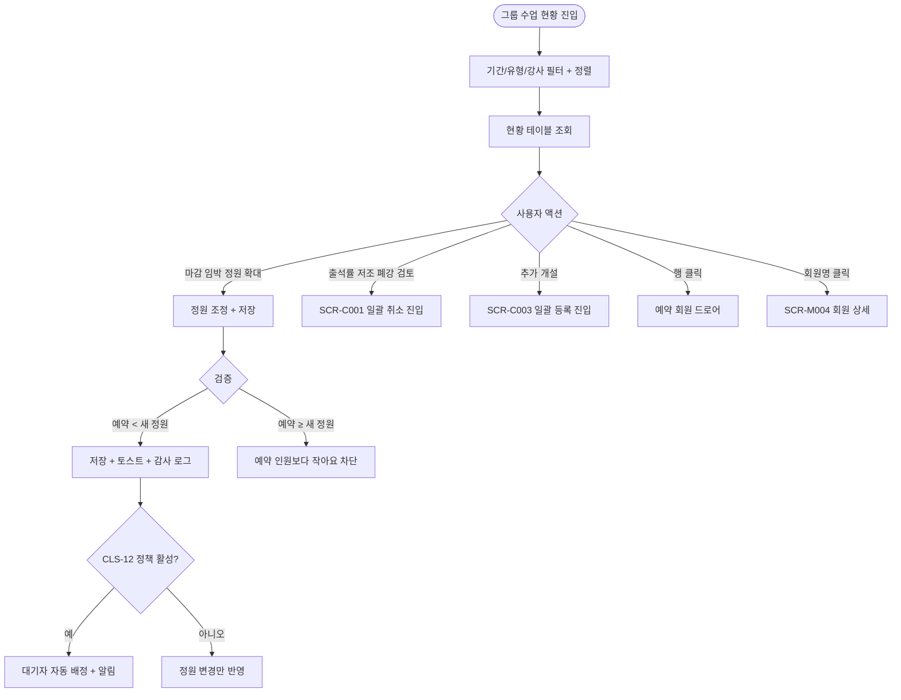
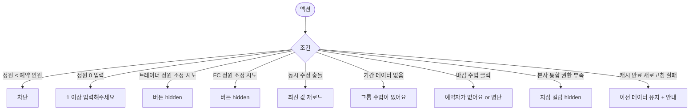

# SCR-C005 그룹 수업 현황 페이지

## 1. 화면 메타 정보

| 항목 | 값 |
|---|---|
| 작성일 | 2026-05-22 |
| 버전 | v1.0 |
| 상태 | 정합화 완료 |
| 도메인 | D04 수업관리 |
| 화면 ID | SCR-C005 |
| 화면명 | 그룹 수업 현황 |
| 화면 유형 | 현황판 (Dashboard / Report) |
| 라우트 (URL) | `/calendar/group-status` |
| 우선순위 | P1 |
| 기능코드 | CLS-05 |
| 계약코드 | CLS-05 |
| Lv1 코드 | CLS-05 |
| Lv2 / Lv3 세분화 | CLS-05-01 ~ CLS-05-08 (기간/유형/강사 필터, 현황 테이블, 정렬, 예약 회원 드로어, 마감 강조, 운영 액션) |
| 연계 화면 | SCR-C001 수업캘린더, SCR-C002 수업관리, SCR-C012 대기열관리, SCR-M004 회원 상세 |

## 2. 화면 개요와 목적

그룹 수업 현황 페이지는 그룹 수업별 예약 현황·출석률·잔여 자리·노쇼 누적을 한 화면에서 비교할 수 있는 현황판입니다. 매니저는 어떤 수업이 인기 있는지(마감 임박 다수), 어떤 수업이 폐강 후보인지(출석률 < 30% + 예약 4명 이하)를 한눈에 식별해 정원 확대·추가 개설·폐강 같은 운영 결정을 내립니다. 본 화면은 1:1 PT 수업이 아닌 GX·필라테스 같은 그룹 수업만 다루며, 정원 조정은 본 화면, 수업 취소는 SCR-C001로 분리되어 있습니다.

## 3. 진입 경로와 인접 화면

사이드바의 "수업관리 > 그룹 수업 현황"으로 진입합니다. 인접 화면은 SCR-C001 캘린더(폐강 검토 시 일괄 취소 진입), SCR-C003 시간표 일괄 등록(추가 개설 시), SCR-C012 대기열 관리(정원 확대 후속 처리), SCR-M004 회원 상세입니다.

## 4. 레이아웃과 UI 구성

페이지 헤더 아래에는 기간 필터(주간·월간·사용자 지정 토글, 기본은 이번 주), 수업 유형 멀티 필터(GX·스피닝·필라테스·매트필라·요가 등), 강사 드롭다운이 한 줄에 배치됩니다. 그 아래에는 정렬 토글(출석률 높은 순·잔여 자리 적은 순·예약 많은 순)이 있습니다.

본문은 현황 테이블이며 좌측부터 수업명, 유형, 강사, 요일·시간, 정원, 예약 수, 잔여 자리, 출석률(%), 노쇼 수, 잔여 자리 바(녹·주황·빨강) 컬럼이 배치됩니다. 행을 클릭하면 우측에 예약 회원 명단 드로어가 슬라이드 인하여 회원명·연락처·출석 상태를 보여줍니다. 회원명을 클릭하면 SCR-M004 회원 상세로 이동합니다.

## 5. 탭 구성과 탭별 동작

탭은 없습니다. 기간·유형·강사 필터와 정렬 토글의 조합만으로 현황을 탐색합니다.

## 6. 버튼·아이콘·링크 액션 전체 정의

기간·유형·강사 필터 변경은 즉시 테이블 재조회를 일으킵니다. 정렬 토글은 출석률 / 잔여 자리 / 예약 수 중 선택값으로 정렬을 변경합니다. 행의 [정원 조정] 버튼은 매니저+에게만 노출되며 정원 변경 입력 후 저장 시 예약 인원 < 새 정원이어야 통과합니다. 정원 조정 후 CLS-12 대기 관리 정책이 활성화된 경우 대기자 알림·배정 흐름이 후속 처리로 이어집니다.

[수업 취소] 액션은 본 화면에서 직접 실행하지 않고 SCR-C001 캘린더로 진입해 일괄 취소를 수행합니다. [추가 개설]은 SCR-C003 시간표 일괄 등록으로 진입합니다. 마감 수업 행 클릭 후 회원 명단 드로어에서 [대기열 신청 안내]를 통해 SCR-C012로 이동할 수 있습니다.

## 7. 호출되는 모달 동작

본 화면은 자체 호출 다이얼로그가 없으며 정원 조정은 행 내부 인라인 편집 또는 작은 확인 팝업 형태로 처리됩니다. 정원 축소가 예약 인원보다 작으면 차단되고, 정원 확대 후 대기 정책 활성 테넌트에서는 "대기 N명 자동 배정 완료" 토스트가 표시됩니다.

## 8. 토스트와 확인 팝업과 알럿

성공 토스트는 "정원을 변경했어요", "대기 N명 자동 배정 완료" 등입니다. 차단 안내는 "예약 인원보다 작아요 (현재 N명)" 같이 명확한 사유를 제시합니다. 데이터 캐시는 5분이며 [새로고침] 버튼으로 즉시 갱신할 수 있습니다.

## 9. 데이터 흐름과 외부 연동

API는 현황 조회 `GET /api/group-classes/status`, 예약 회원 조회 `GET /api/group-classes/:id/reservations`, 정원 조정 `PUT /api/group-classes/:id/capacity`입니다. 출석률은 출석 인원/예약 인원 × 100으로 계산되며 노쇼·취소는 분자에서 제외됩니다. 현황 카운트는 5분 캐시이며 본사 통합 모드에서는 지점 컬럼과 지점별 평균 출석률이 함께 표시됩니다.

정원 조정 시 SCR-097 감사 로그에 actor·class_id·before·after가 기록되며 CLS-12 대기열 정책 활성 시 알림이 자동 발송됩니다. SCR-D003 KPI 대시보드에 그룹 수업 KPI가 합산됩니다.

## 10. 화면 상태와 예외 처리

마감 강조는 잔여 0건 빨강 배지, 임박 강조는 잔여 1~2건 주황 배지, 출석률 저조는 30% 이하 노랑 강조, 노쇼 다발은 ≥ 3건 빨강 강조로 표시됩니다. 데이터 없음 상태는 "이 기간에 그룹 수업이 없어요"가 표시되고 기간 변경을 안내합니다.

예외로 정원 축소 시 예약 초과는 차단, 정원 0 입력은 "1 이상 입력해주세요"로 차단, 정원 100 초과 입력은 "1~99 사이로 입력해주세요"로 차단(템플릿 정원 정책 일관, DLG-C009), 트레이너의 정원 조정 시도는 버튼 숨김으로 처리됩니다. FC도 정원 조정 버튼이 숨겨지고 조회만 가능합니다. 본사 통합 모드 권한 부족 시 지점 컬럼이 숨겨집니다.

## 11. 권한별 처리

슈퍼관리자·본사 최고관리자·센터장·매니저는 정원 조정과 수업 취소 진입이 모두 가능합니다. 트레이너는 본인 담당 수업 현황만 조회 가능하며 정원 조정 버튼이 보이지 않습니다. FC·스태프는 전체 조회만 가능합니다. readonly는 접근 불가입니다.

## 12. 메인 흐름

## 13. 에러와 예외 흐름

## 14. 핵심 디자인 요청사항

잔여 자리 바는 정원 % 기준으로 색이 변화하는 시각적 인디케이터로 한 행의 마감 여부를 거시적으로 알 수 있게 합니다. 출석률 컬럼은 % 숫자와 미니 차트(혹은 색상 강도)가 함께 표시되어 강사별·시간대별 인기를 한눈에 비교할 수 있어야 합니다. 회원 명단 드로어는 우측에서 슬라이드 인하며 출석/노쇼/예정 상태가 색상 배지로 즉시 식별됩니다. 마감(빨강)·임박(주황)·여유(녹) 색상은 캘린더 SCR-C001과 동일 톤으로 통일됩니다.

## 15. 운영 정책 (이 화면에 연결된 부분)

본 화면은 그룹 수업(GX·필라테스 등)만 다루며 1:1 PT는 SCR-C001/C002에서 관리합니다. 두 트랙을 섞지 않습니다.

출석률 산식은 출석 인원 / 예약 인원 × 100이며 노쇼·취소는 분자에서 제외됩니다. 분모는 예약 인원이고 대기열은 제외됩니다. 잔여 자리 바 색상은 ≤0% 빨강, ≤20% 주황, 그 외 녹색이며 정원 0인 휴식 슬롯은 회색입니다.

정원 조정 권한은 매니저+로 한정되며 변경 이력은 모두 감사 로그에 기록됩니다. 정원 축소는 예약 인원 < 새 정원일 때만 가능하고, 정원 확대 후 대기열 후속 처리는 CLS-12 대기 관리 정책이 활성화된 경우에만 작동합니다. 정원 변경 사실은 운영자에게 표시되며 회원 알림·대기자 배정은 CLS-12 정책 연동 시에만 발생합니다.

본사 통합 모드는 슈퍼관리자·primary가 지점별 평균 출석률을 비교할 수 있게 합니다. 현황 데이터는 5분 캐시이고 실시간성이 필요하면 [새로고침]으로 즉시 갱신합니다. 노쇼 다발(기간 내 ≥ 3건)은 빨강 강조로 노쇼 패턴 식별을 돕습니다.
