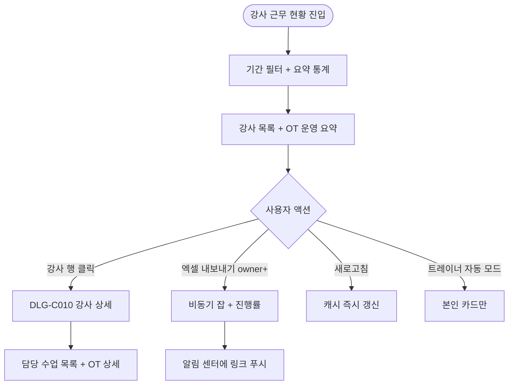

# SCR-C006 강사 근무 현황 페이지

## 1. 화면 메타 정보

| 항목 | 값 |
|---|---|
| 작성일 | 2026-05-22 |
| 버전 | v1.0 |
| 상태 | 정합화 완료 |
| 도메인 | D04 수업관리 |
| 화면 ID | SCR-C006 |
| 화면명 | 강사 근무 현황 |
| 화면 유형 | 현황판 + 인사·KPI 자료 |
| 라우트 (URL) | `/calendar/instructors` |
| 우선순위 | P1 |
| 기능코드 | CLS-06 |
| 계약코드 | CLS-06 |
| Lv1 코드 | CLS-06 |
| Lv2 / Lv3 세분화 | CLS-06-01 ~ CLS-06-08 (기간 필터, 요약 통계, 강사 목록, OT 운영 요약, 강사 상세, 색상 구분, 본인 조회, 엑셀 내보내기) |
| 연계 화면 | SCR-C001 수업캘린더, SCR-D003 KPI 대시보드, SCR-064 급여, STF-02 직원 상세 |
| 호출 다이얼로그 | DLG-C010 강사상세 |

## 2. 화면 개요와 목적

강사 근무 현황 페이지는 강사별 수업 배정 건수·근무 시간·OT 운영 현황(배정·1차·2차·거절·이월)을 한 화면에서 요약 비교하는 인사·KPI 자료 화면입니다. 센터장은 월간 인사 평가, 매니저는 OT 배정 재조정, 본사 슈퍼관리자는 트레이너별 OT 배정 합계와 SCR-D003 KPI의 1:1 매칭 검증, 트레이너는 본인 근무 기록 확인, 급여 정산(SCR-064) 자료 다운로드까지 본 화면 데이터로 처리됩니다.

본 화면은 조회 전용이며 데이터 변경은 SCR-C001 캘린더와 OT 관리 화면에서 수행됩니다.

## 3. 진입 경로와 인접 화면

사이드바의 "수업관리 > 강사 근무 현황"으로 진입합니다. 인접 화면은 SCR-C001 캘린더(재배정 시), SCR-D003 KPI(정합성 검증), SCR-064 급여, STF-02 직원 상세, 그리고 DLG-C010 강사 상세입니다.

## 4. 레이아웃과 UI 구성

페이지 헤더 아래에는 기간 필터(주간·월간·사용자 지정 토글, 기본 이번 주)와 [엑셀 내보내기] 버튼이 있습니다. 그 아래에 요약 통계 카드 3개(평균 근무 시간, 최다 수업 강사, 수업 없는 강사 수)가 가로로 배치됩니다.

본문은 강사 목록 카드/테이블입니다. 한 행에 강사명·역할(트레이너/GX 강사 등)·담당 수업 건수·총 근무 시간·수업 유형 분포(PT/GX/개인레슨/기타)·강습 세션 유형 분포(PT/필라테스/스트레칭/테라피)·출석 처리 완료율·강사별 색상 칩이 표시됩니다. 강사 행 우측에는 OT 운영 요약(O.T 배정 합계, OT1 완료/예정, OT2 완료/예정, OT 거절(거부+보류), OT 이월)이 압축 표시됩니다.

수업 없는 강사는 회색 처리되고 "수업 없음" 라벨이 붙습니다. 퇴사 강사는 기간 내 수업 1건 이상이면 "퇴사" 라벨과 함께 회색으로 표시되고 0건이면 미노출됩니다. 행 클릭 시 DLG-C010 강사 상세가 열립니다.

## 5. 탭 구성과 탭별 동작

탭은 없습니다. 기간 필터와 본사 통합 모드(슈퍼관리자·primary)에서만 노출되는 지점 컬럼 토글이 있습니다.

## 6. 버튼·아이콘·링크 액션 전체 정의

기간 필터 변경은 즉시 데이터 재조회를 일으킵니다. [엑셀 내보내기]는 owner 이상에게만 노출되며 비동기 잡으로 처리되어 완료 시 알림 센터에 다운로드 링크가 푸시됩니다. 강사 행 클릭은 DLG-C010 강사 상세를 엽니다. 트레이너 계정에서는 본인 카드만 노출되고 본인 모드가 자동 적용됩니다.

## 7. 호출되는 모달 동작

### 7-1. DLG-C010 강사 상세 다이얼로그
강사의 기간 내 담당 수업 목록, OT 1차/2차 상세 진행 상태, 기본 직원 정보(STF-02 연동)를 한 화면에서 보여줍니다. 본 화면은 조회 전용이며 직원 정보 변경은 STF-02에서, 수업 정보 변경은 SCR-C001/C002에서 합니다.

## 8. 토스트와 확인 팝업과 알럿

엑셀 다운로드 시작 토스트, 1시간 캐시 만료 후 새로고침 실패 토스트, 트레이너 권한일 때 본인 카드만 노출되는 안내가 있습니다. OT 데이터 미동기화 시 OT 영역에 안내 + [새로고침] 버튼이 표시됩니다.

## 9. 데이터 흐름과 외부 연동

API는 강사 근무 현황 조회 `GET /api/instructors/work-status`, 강사별 수업 목록 `GET /api/instructors/:id/lessons`, OT 상태 `GET /api/instructors/:id/ot-status`, 엑셀 내보내기 `GET /api/instructors/work-status/export`입니다. OT 데이터는 `[OT관리-강습]` Q/T/V열과 `[강습업무보고]` E/F/G열에서 매시간 동기화됩니다. 데이터는 1시간 캐시되며 [새로고침]으로 즉시 갱신할 수 있습니다.

본 화면 데이터는 SCR-D003 KPI 대시보드의 트레이너별 OT 배정 합계와 강습세션수의 원천이며 1:1로 매칭되어야 합니다. SCR-064 급여 정산에서는 본 화면의 근무 시간을 합산 원천으로 사용합니다. CLS-01 캘린더와 CLS-02 수업 관리에서 발생한 등록·출석 처리는 본 화면의 카운트에 즉시 반영됩니다.

## 10. 화면 상태와 예외 처리

기본 현황은 이번 주 전체 강사가 표시되며 수업 없는 강사는 회색, 퇴사 강사(수업 1건+)는 "퇴사" 라벨이 붙습니다. 본인 모드(트레이너)는 본인 카드만 표시됩니다. OT 데이터 미동기화 시 OT 영역에 안내가 표시되고 [새로고침]을 통해 재동기화를 시도합니다. 엑셀 다운로드 중에는 진행률 토스트가 떠 있습니다.

예외로 트레이너의 타 강사 조회 시도는 카드 숨김으로 차단, 수업 없는 강사 0건은 회색 + "수업 없음", 퇴사 강사 0건은 미노출, OT 데이터 미동기화는 영역 안내 + 재시도, 본사 통합 모드 권한 부족은 지점 컬럼 숨김, OT 산식 불일치는 툴팁 안내, 강사 0명은 "강사 정보가 없어요"가 표시됩니다.

## 11. 권한별 처리

슈퍼관리자·본사 최고관리자·센터장은 전체 조회·강사 상세·엑셀 내보내기가 가능합니다. 매니저는 조회·강사 상세만 가능합니다(엑셀은 owner+). 트레이너는 본인 근무 현황만 노출되며 본인 모드가 자동 적용됩니다. FC·스태프는 전체 조회만 가능합니다. readonly는 접근 불가입니다.

## 12. 메인 흐름



## 13. 에러와 예외 흐름

```mermaid
flowchart TD
    A([액션]) --> B{조건}
    B -->|트레이너 타 강사 조회| C[카드 hidden]
    B -->|수업 없는 강사| D[회색 + "수업 없음"]
    B -->|퇴사 강사 0건| E[미노출]
    B -->|OT 데이터 미동기화| F[안내 + 새로고침]
    B -->|엑셀 다운로드 실패| G[토스트 + 재시도]
    B -->|본사 통합 권한 부족| H[지점 컬럼 hidden]
    B -->|캐시 만료 새로고침 실패| I[이전 데이터 유지 + 안내]
    B -->|OT 산식 불일치| J[툴팁 안내]
    B -->|강사 0명| K["강사 정보가 없어요"]
```

## 14. 핵심 디자인 요청사항

강사별 색상 칩은 SCR-C001 캘린더와 동일한 색상 코드를 사용해 시각적 일관성을 유지합니다. OT 운영 요약은 6개 지표(배정·OT1 완료·OT2 완료·OT1 예정·OT2 예정·OT 거절·OT 이월)가 동시에 보여야 하므로 컴팩트한 미니 카드 형태로 정렬되어 부하 편중을 한눈에 비교할 수 있어야 합니다. 출석 처리 완료율 100% 미만 강사는 노랑 배지로 누락을 강조합니다.

## 15. 운영 정책 (이 화면에 연결된 부분)

OT 지표는 정규 PT 수업 완료율과 분리해 영업 파이프라인 지표로 표시합니다. 강습 세션 유형 4종(PT·필라테스·스트레칭·테라피)은 KPI 산출 기준이며 본 화면이 SCR-D003 KPI 대시보드의 강습세션수 원천입니다.

OT 등록 전환율은 본사 KPI 표준 "등록/OT 진행"을 따르며 OT 거절은 "거부+보류"를 함께 집계하고 툴팁에 명시합니다. OT 이월률은 "이월 건수 / OT배정 인원 × 100"으로 확정됩니다. OT 워크플로우는 배정 → 1차(Q열) → 2차(T열) → 등록(전환) 또는 거절·보류·이월(V열) 흐름입니다.

근무 시간은 수업 시작~종료 합산이며 휴식·이동 시간은 제외됩니다. OT 시간 포함/제외는 테넌트 정책에 따릅니다. 출석 처리 완료율은 처리한 출석/노쇼 건수 / 종료된 수업 건수 × 100이며 100% 미만은 노랑 강조됩니다.

트레이너는 본인 근무 현황만 볼 수 있고 엑셀 내보내기는 owner+로 한정되어 인사 정보 유출이 차단됩니다. 데이터는 1시간 캐시이며 OT 데이터는 매시간 동기화됩니다. 본사 통합 모드는 지점 컬럼과 지점별 평균을 추가로 제공합니다.

본 화면은 조회 전용이므로 변경 이력은 OT 관리 화면과 SCR-C001/C002에 기록되며 본 화면 자체에는 감사 로그가 발생하지 않습니다.
