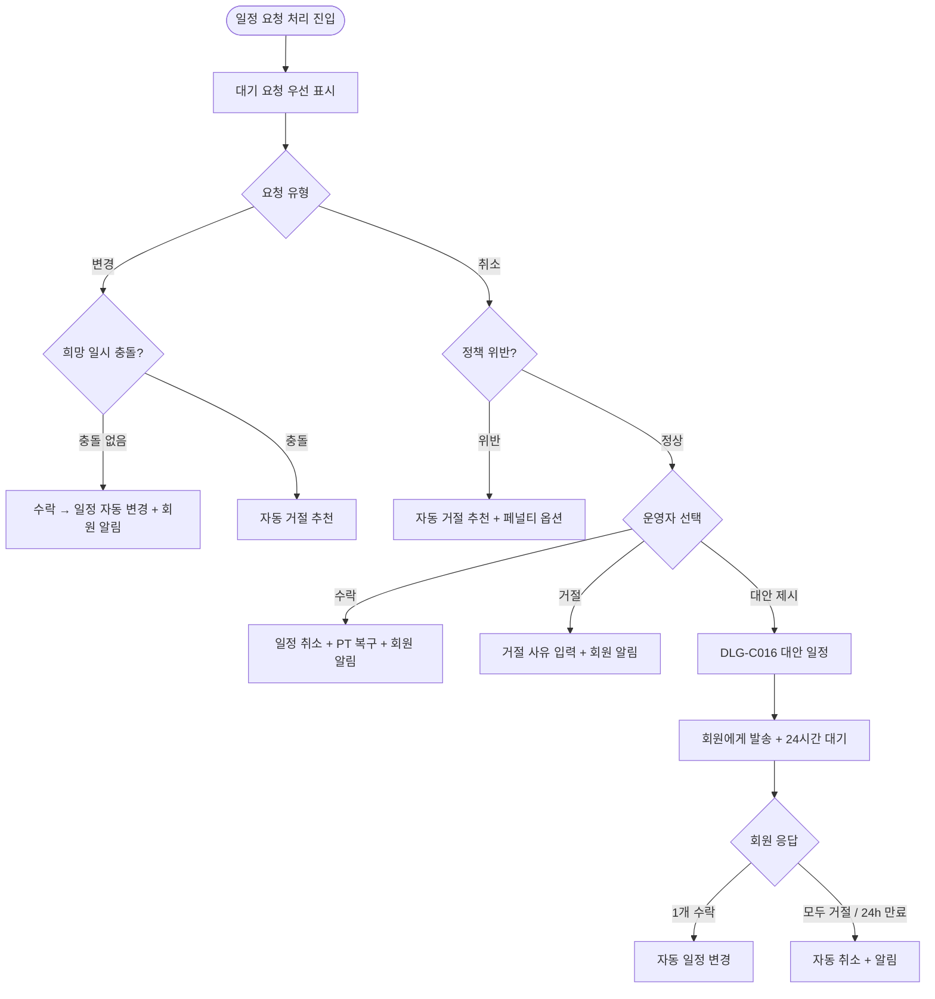
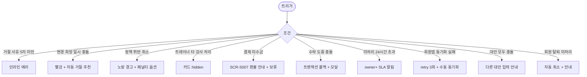

# SCR-C009 일정 요청 처리 페이지

## 1. 화면 메타 정보

| 항목 | 값 |
|---|---|
| 작성일 | 2026-05-22 |
| 버전 | v1.0 |
| 상태 | 정합화 완료 |
| 도메인 | D04 수업관리 |
| 화면 ID | SCR-C009 |
| 화면명 | 일정 요청 처리 |
| 화면 유형 | 작업 큐 (Queue) |
| 라우트 (URL) | `/schedule-requests` |
| 우선순위 | P1 |
| 기능코드 | CLS-09 |
| 계약코드 | CLS-09 |
| Lv1 코드 | CLS-09 |
| Lv2 / Lv3 세분화 | CLS-09-01 ~ CLS-09-07 (요청 목록, 필터, 수락 처리, 거절 처리, 대안 일정 제시, 미처리 알림, 권한 분기) |
| 연계 화면 | SCR-C001 수업캘린더, SCR-C002 수업관리, SCR-C008 페널티관리, SCR-M004 회원 상세, SCR-S007 환불 |
| 호출 다이얼로그 | DLG-C016 대안일정제시, DLG-C007 노쇼취소정책 |

## 2. 화면 개요와 목적

일정 요청 처리 페이지는 회원이 회원앱에서 보낸 수업 변경·취소 요청을 운영자가 검토하고 수락·거절·대안 제시를 결정하는 작업 큐입니다. 회원이 직접 수업을 다른 시간으로 옮기고 싶거나 취소하고 싶을 때 요청을 보내면, 본 화면에 대기 항목으로 쌓이고 매니저·트레이너가 일괄 처리합니다. 단순 취소 요청에 대해서는 DLG-C016 대안 일정 제시로 다른 시간·강사를 제안해 매출 보호와 회원 만족을 동시에 지킬 수 있습니다.

미처리 24시간 초과 시 owner+에게 SLA 알림이 자동 발송되어 응답 누락을 방지하고, 정책 위반(시작 2시간 전 이내 취소) 요청은 자동 거절 추천 + 페널티 부과 옵션으로 안내됩니다.

## 3. 진입 경로와 인접 화면

사이드바의 "수업관리 > 일정 요청 처리" 또는 대시보드 미처리 N건 배지 클릭으로 진입합니다. 인접 화면은 SCR-C001 캘린더(수락 시 자동 일정 변경), SCR-C002 수업관리, SCR-C008 페널티관리(정책 위반 거절 시), SCR-M004 회원 상세, SCR-S007 환불(결제 미수금 처리)입니다.

## 4. 레이아웃과 UI 구성

페이지 헤더 아래에는 요청 유형 필터(전체/변경/취소), 처리 상태 필터(전체/대기/처리 완료), 기간 필터가 있습니다. 상단에는 대기 N건 빨강 배지가 항상 표시되어 우선 처리해야 할 항목을 강조합니다.

본문은 요청 목록 테이블입니다. 컬럼은 요청 유형(변경/취소 배지)·회원명(클릭 시 SCR-M004)·연락처·원래 수업(수업명·일시·강사)·요청 내용(변경: 희망 일시 / 취소: 사유)·요청 일시·처리 상태(대기/수락/거절)·액션([수락]/[거절]/[대안])입니다.

처리 완료 행은 처리자·처리일시가 함께 표시되어 사후 추적이 가능합니다. 본사 통합 모드에서는 지점 컬럼이 추가됩니다.

## 5. 탭 구성과 탭별 동작

별도 탭은 없으며 요청 유형·처리 상태·기간 필터의 조합으로 작업 큐를 좁힙니다. 대기 상태 필터를 기본으로 시작해 미처리부터 빠르게 응대할 수 있게 합니다.

## 6. 버튼·아이콘·링크 액션 전체 정의

행의 [수락] 버튼은 변경 요청의 경우 희망 일시 충돌 검증 통과 시 수업 일정을 자동 변경하고 회원 알림을 발송합니다. 취소 요청의 경우 수업 일정 자동 취소 + PT 횟수 자동 복구 + 결제 미수금이면 환불 안내가 표시됩니다. [거절] 버튼은 거절 사유(필수 5자 이상) 입력 후 회원에게 거절 알림을 발송합니다. [대안] 버튼은 취소 요청에 한해 DLG-C016 대안 일정 제시 모달을 엽니다.

회원명 클릭은 SCR-M004로 이동하고, 처리자/처리일시 컬럼 hover 시 처리 이력 툴팁이 표시됩니다. 정책 위반(시작 2시간 전 이내 취소) 요청은 자동으로 노랑 경고 + "거절 추천" 라벨이 붙고 거절 시 페널티 부과 옵션이 함께 안내됩니다.

## 7. 호출되는 모달 동작

### 7-1. DLG-C016 대안 일정 제시 다이얼로그
취소 요청에 대해 최대 3개의 대안 일시 + 대안 강사 + 안내 메시지를 입력해 회원에게 발송합니다. 회원이 회원앱에서 1개 수락 시 자동 일정 변경되고 모두 거절 또는 24시간 미응답 시 자동 취소 처리됩니다.

### 7-2. DLG-C007 노쇼/취소 정책 다이얼로그
정책 안내용으로 본 화면에서는 정책 위반 판정 기준(시작 2시간 전 이내)을 참조합니다.

## 8. 토스트와 확인 팝업과 알럿

성공 토스트는 "요청을 수락했어요", "요청을 거절했어요", "대안 일정을 발송했어요"입니다. 충돌·정책 위반 토스트는 "강사 일정이 겹쳐요", "정책 위반 - 페널티 부과 옵션이 있어요"로 표시됩니다. 미처리 24시간 초과 시 owner+에게 SLA 알림이 자동 발송됩니다.

## 9. 데이터 흐름과 외부 연동

API는 요청 목록 `GET /api/schedule-requests`, 수락 `POST /api/schedule-requests/:id/accept`, 거절 `POST /api/schedule-requests/:id/reject`, 대안 제시 `POST /api/schedule-requests/:id/propose-alternative`입니다. 수락 시 CLS-01 캘린더에 자동 일정 변경, CLS-07 횟수 관리에 PT 횟수 복구(취소 수락), CLS-08 페널티에 자동 부과(정책 위반 거절) 신호가 발사됩니다.

회원앱 동기화 webhook으로 처리 결과·회원 응답이 즉시 양방향 동기화됩니다. 대안 응답 만료 잡(매분 실행)이 24시간 초과 미응답을 자동 취소 처리합니다. 미처리 SLA 잡(매시간)이 24시간 초과 미처리를 owner+에게 알림 발송합니다. 모든 처리는 SCR-097 감사 로그에 actor·request_id·result·reason으로 기록됩니다.

## 10. 화면 상태와 예외 처리

대기 요청 있음 상태에서는 상단 빨강 배지와 함께 대기 항목이 강조됩니다. 대기 0건 상태에서는 "처리할 요청이 없어요"가 표시됩니다. 충돌 감지 시 빨강 강조 + 자동 거절 추천이 표시되고, 정책 위반 시 노랑 경고 + 페널티 부과 옵션이 함께 표시됩니다. 대안 회원 응답 대기 상태는 "회원 응답 대기 중" 배지로 표시되고 24시간 만료 시 자동 취소 + 회색 배지로 전환됩니다.

예외로 거절 사유 미입력은 인라인 에러, 변경 희망 일시 충돌은 자동 거절 추천, 트레이너 타 강사 요청 처리 시도는 카드 숨김, 결제 미수금 수업 처리는 환불 화면 안내, 수락 도중 충돌 발생은 트랜잭션 롤백, 미처리 24시간 초과는 owner+ SLA 알림, 회원앱 응답 동기화 실패는 retry 3회 → 수동 동기화 안내, 권한 부족(FC)은 액션 숨김 + 조회만으로 처리됩니다.

## 11. 권한별 처리

슈퍼관리자·본사 최고관리자·센터장·매니저는 수락·거절·대안 제시를 모두 수행합니다. 트레이너는 본인 담당 수업 요청만 처리할 수 있습니다. FC·스태프는 조회만 가능하며 액션 버튼이 숨겨집니다. readonly는 접근 불가입니다.

## 12. 메인 흐름

## 13. 에러와 예외 흐름

## 14. 핵심 디자인 요청사항

대기 N건 빨강 배지는 화면 상단에서 가장 두드러져야 합니다. 요청 유형(변경/취소) 배지는 색상으로 구분되고, 정책 위반 노랑 경고는 행 좌측 인디케이터로 즉시 식별되어야 합니다. 대안 일정 제시 모달은 3개 대안을 카드 형태로 나란히 배치해 운영자가 다양한 옵션을 한 번에 입력할 수 있게 합니다. 회원 응답 대기 배지는 시간 카운트다운(예: "23시간 12분 남음")이 함께 표시되어 SLA 인식을 돕습니다.

## 15. 운영 정책 (이 화면에 연결된 부분)

수락 시 수업 일정이 즉시 변경 또는 취소되며 강사 캘린더에 자동 반영되고 PT 횟수가 자동 복구됩니다(취소 수락의 경우). 거절 시 거절 사유 입력은 필수(최소 5자)이고 회원에게 알림이 발송됩니다. 대안 일정 제시는 취소 요청에 한해 최대 3개까지 가능하며 회원 응답 시한은 24시간입니다.

수업 시작 전 변경/취소 가능 시간은 노쇼/취소 정책(DLG-C007)을 따르며 정책 위반(예: 시작 2시간 전 이내) 시 자동 거절 추천 + 페널티 부과 옵션이 안내됩니다. 트레이너는 본인 담당 수업 요청만 처리할 수 있습니다.

미처리 SLA는 24시간으로 정의되며 초과 시 owner+에게 자동 알림이 발송되어 응답 누락을 방지합니다. 수락 시 일정 변경·횟수 복구·알림 발송은 트랜잭션으로 묶여 일부 실패 시 롤백됩니다. 결제 미수금 수업 처리는 환불 화면(SCR-S007) 안내가 함께 표시되고 처리는 보류 옵션이 제공됩니다.

회원앱 동기화는 양방향이며 처리 결과·회원 응답이 즉시 반영됩니다. 이력은 영구 보관되어 분쟁 대응에 활용됩니다. 본사 통합 모드에서는 지점 컬럼이 추가로 노출됩니다. 모든 처리는 감사 로그에 기록되어 5초 안에 SCR-097에서 조회 가능합니다.
