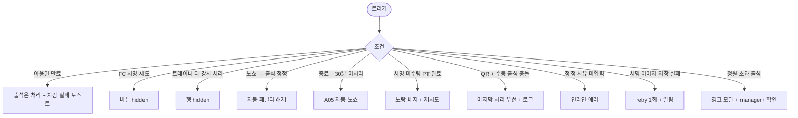

# SCR-C011 유효 수업 목록 페이지

## 1. 화면 메타 정보

| 항목 | 값 |
|---|---|
| 작성일 | 2026-05-22 |
| 버전 | v1.0 |
| 상태 | 정합화 완료 |
| 도메인 | D04 수업관리 |
| 화면 ID | SCR-C011 |
| 화면명 | 유효 수업 목록 |
| 화면 유형 | 당일 운영 + 출석/서명 |
| 라우트 (URL) | `/valid-lessons` |
| 우선순위 | P0 |
| 기능코드 | CLS-11 |
| 계약코드 | CLS-11 |
| Lv1 코드 | CLS-11 |
| Lv2 / Lv3 세분화 | CLS-11-01 ~ CLS-11-07 (날짜 필터, 수업 목록, 출석 처리, 서명 요청, 수업 기록, 노쇼 처리, 당일 요약) |
| 연계 화면 | SCR-C001 수업캘린더, SCR-C002 수업관리, SCR-C007 횟수관리, SCR-C008 페널티관리, SCR-M004 회원 상세 |
| 호출 다이얼로그 | DLG-C005 수업기록상세, DLG-C006 서명 |

## 2. 화면 개요와 목적

유효 수업 목록 페이지는 이용권이 유효하고 예약이 확정된 "오늘 진행 가능한 수업"만 모아 출석/노쇼/서명을 처리하는 당일 운영 화면입니다. 만료·취소·완료 수업은 제외되어 운영자가 당일 처리해야 할 수업에만 집중할 수 있습니다. 트레이너는 본인 담당 수업의 출석·서명을 처리하고, 프런트 매니저는 GX 단체 출석을 일괄 처리하며, FC는 PT 외 수업의 출석을 보조합니다.

종료 시간 + 30분 미처리 시 A05 자동 노쇼 크론이 자동 노쇼 처리 + 페널티 부과를 수행하여 운영 부담을 줄입니다. PT 수업은 회원 서명이 필수이며 미수령 시 노랑 배지로 강조됩니다.

## 3. 진입 경로와 인접 화면

사이드바의 "수업관리 > 유효 수업 목록" 또는 D04 도메인 탭 내비게이션의 "유효 수업 목록" 탭, `/valid-lessons` 직접 진입으로 들어옵니다. 인접 화면은 SCR-C001 캘린더, SCR-C002 수업관리, SCR-C007 횟수관리, SCR-C008 페널티관리, SCR-M004 회원 상세입니다.

## 4. 레이아웃과 UI 구성

페이지 헤더 아래에는 날짜 필터(오늘·이번 주·날짜 직접 선택, 기본 오늘)와 당일 요약 카드(처리 완료율 + 미처리 건수)가 있습니다. 본문은 수업 목록 테이블이며 컬럼은 수업명(클릭 시 DLG-C005)·수업 유형·강습 세션 유형·강사명·일시·장소·예약 회원명(클릭 시 SCR-M004)·연락처·잔여 횟수·출석 상태(미처리/출석/결석/노쇼)·액션([출석]/[서명]/[기록])입니다.

수업 시작 시간 경과 + 미처리 행은 주황 강조, 종료 시간 + 미처리는 빨강 강조(자동 노쇼 임박), 완료 + 서명 미수령은 노랑 배지로 표시됩니다. 본사 통합 모드에서는 지점 컬럼이 추가됩니다.

## 5. 탭 구성과 탭별 동작

D04 도메인 탭 내비게이션 안의 "유효 수업 목록" 탭이 활성화된 상태이며 본 화면 자체에는 별도 탭이 없습니다. 날짜 필터가 2차 분기 역할을 합니다.

## 6. 버튼·아이콘·링크 액션 전체 정의

날짜 필터 변경은 즉시 재조회됩니다. 각 행의 [출석] 버튼은 PT 횟수 자동 차감(CLS-07)을 트리거하고 출석 상태를 즉시 갱신합니다. [결석] / [노쇼] 버튼은 각각 상태를 변경하며 노쇼는 자동 페널티 부과(CLS-08)와 회원 알림을 함께 처리합니다. PT 수업의 [서명] 버튼은 DLG-C006 서명 패드를 열어 회원 디바이스 또는 태블릿에서 서명을 받고 암호화 저장합니다.

완료 행의 [기록] 버튼은 DLG-C005 수업 기록 상세를 엽니다. 매니저+는 정정 사유 입력 후 출석/노쇼를 다시 정정할 수 있고, 노쇼 → 출석 정정 시 자동 페널티가 자동 해제됩니다.

회원명 클릭은 SCR-M004로 이동합니다. FC는 출석 처리만 가능하고 서명 버튼이 보이지 않습니다.

## 7. 호출되는 모달 동작

### 7-1. DLG-C005 수업 기록 상세 다이얼로그
완료 수업의 출석·서명·메모·QR 체크인 로그를 통합 표시합니다. 분쟁 증빙으로 5년 이상 보관됩니다.

### 7-2. DLG-C006 서명 다이얼로그
PT 수업 종료 시 회원 서명을 받습니다. 태블릿 또는 회원 디바이스로 서명 패드가 표시되고, 저장 시 서명 이미지가 암호화되어 보관됩니다.

## 8. 토스트와 확인 팝업과 알럿

성공 토스트는 "출석을 처리했어요", "노쇼로 처리했어요", "서명을 저장했어요"입니다. 실패 토스트는 "이용권이 만료되어 차감에 실패했어요", "FC는 서명을 받을 수 없어요", "정원이 0인 수업이에요" 같이 사유를 명시합니다. 자동 노쇼 처리 후 토스트와 함께 페널티 자동 부과 알림이 표시됩니다. 노쇼 → 출석 정정 시 "자동 페널티가 해제됩니다" 토스트가 자동 안내됩니다.

## 9. 데이터 흐름과 외부 연동

API는 유효 수업 조회 `GET /api/lessons/valid`, 출석 처리 `POST /api/lessons/:id/attendance`, 서명 저장 `POST /api/lessons/:id/signature`, 기록 조회 `GET /api/lessons/:id/record`입니다. 출석 처리 webhook은 CLS-07 횟수 관리에 멱등성 키(booking_id 우선)와 함께 차감 신호를 보내고, 노쇼 처리는 CLS-08 페널티에 자동 부과 신호를 보냅니다. 자동 노쇼 크론(A05)은 종료 시간 + 30분 후 미처리를 자동 노쇼 처리합니다.

CLS-14 QR 체크인 webhook이 본 화면의 출석 상태를 실시간 갱신하고, 회원의 last_visit_at은 출석 처리 시 SCR-M004에 자동 반영됩니다. 서명 이미지는 암호화 후 클라우드에 저장되고, 모든 처리는 SCR-097 감사 로그에 기록됩니다. 회원앱 동기화도 즉시 일어납니다.

## 10. 화면 상태와 예외 처리

기본 상태는 오늘 유효 수업이 표시됩니다. 출석 미처리 강조는 시작 시간 경과 + 예정 상태 행에 주황 배지를, 종료 + 미처리는 빨강 강조를, 완료 + 서명 미수령은 노랑 배지를 붙입니다. 전체 처리 완료 시 "오늘 수업 처리가 완료되었어요" 메시지가 표시됩니다. 데이터 없음 상태는 "이 날짜에 유효 수업이 없어요"가 표시됩니다.

예외로 이용권 만료 회원 출석 처리는 출석 자체는 수행하되 차감 실패 토스트 + 운영자 횟수 조정 안내, FC 서명 시도는 버튼 숨김, 트레이너 타 강사 처리는 행 숨김, 노쇼 → 출석 정정 시 자동 페널티 해제, 종료 + 30분 자동 노쇼는 A05 크론 처리, 서명 미수령 PT 완료는 노란 배지 + DLG-C006 재시도, QR + 수동 출석 충돌은 마지막 처리 우선 + 로그 기록, 정정 사유 미입력은 인라인 에러, 서명 이미지 저장 실패는 retry 1회 → 실패 시 알림 처리됩니다.

## 11. 권한별 처리

슈퍼관리자·본사 최고관리자·센터장·매니저는 출석·서명·기록을 모두 처리합니다. 트레이너는 본인 담당 수업의 출석·서명·기록을 처리합니다. FC·스태프는 출석 처리만 가능하고 서명은 트레이너 권한입니다. readonly는 접근 불가입니다.

## 12. 메인 흐름

```mermaid
flowchart TD
    A([유효 수업 목록 진입]) --> B[오늘 날짜 기본]
    B --> C[수업 목록 조회]
    C --> D{사용자 액션}
    D -->|[출석]| E[PT 횟수 자동 차감 + 상태 갱신]
    D -->|[노쇼]| F[자동 페널티 부과 + 회원 알림]
    D -->|[서명] PT 수업| G[DLG-C006 서명 패드]
    D -->|[기록] 완료 행| H[DLG-C005 수업 기록]
    D -->|미처리 + 종료 시간 + 30분| I[A05 자동 노쇼]
    H --> J[매니저+ 정정]
    J --> K{노쇼 → 출석?}
    K -->|예| L[자동 페널티 해제 + 횟수 차감]
    K -->|아니오| M[정정 + 사유 기록]
```

## 13. 에러와 예외 흐름



## 14. 핵심 디자인 요청사항

당일 요약 카드는 처리 완료율(%)을 큰 숫자로 표시하고 미처리 건수를 함께 보여줘 운영자가 "오늘 마감"까지의 진척도를 한눈에 알 수 있어야 합니다. 출석 상태 배지는 미처리(회색)·출석(녹색)·결석(주황)·노쇼(빨강)로 색상을 강하게 구분하고 자동 노쇼 임박(종료 + 미처리)은 빨강 깜박임으로 강조됩니다. 서명 패드는 모바일·태블릿 모두에서 매끄럽게 동작해야 하며 저장 직전 미리보기로 운영자가 확인할 수 있게 합니다.

## 15. 운영 정책 (이 화면에 연결된 부분)

유효 수업 정의는 이용권 유효 + 예약 확정 + 수업 상태 = 예정/진행중이며 만료·취소·완료는 제외됩니다. 본 화면에서 처리된 출석/완료 이력은 강습 세션 유형별 수업수 검증에 사용되고 SCR-094 KPI의 강습세션수 원천이 됩니다.

출석 처리 시 PT 횟수가 자동 차감되며 멱등성 키(예약 기반은 booking_id, 예약 없는 수동 체크인은 member_id+lesson_id)로 중복 차감이 차단됩니다. 노쇼 처리는 자동 페널티 정책(CLS-08)에 연결되며 노쇼 → 출석 정정 시 자동 페널티가 자동 해제 + 횟수 자동 차감됩니다.

PT 수업 완료 후 서명은 필수이며 미수령 시 노랑 배지로 강조됩니다(테넌트 정책에 따라 GX는 선택). 서명 이미지는 암호화 저장 + 권한 검증 후 노출되며 5년 보관됩니다.

자동 노쇼 처리(A05)는 종료 시간 + 30분 후 미처리 시 자동 노쇼 + 페널티가 부과됩니다. QR 체크인(CLS-14)은 본 화면 출석 상태와 양방향 동기화되며 QR + 수동 출석 충돌은 마지막 처리 우선 + 로그 기록으로 처리됩니다.

회원 last_visit_at은 출석 처리 시 자동 갱신되어 SCR-M004 회원 상세에 반영됩니다. 본사 통합 모드에서는 지점 컬럼이 추가로 노출되며 권한 부족 시 숨겨집니다.
