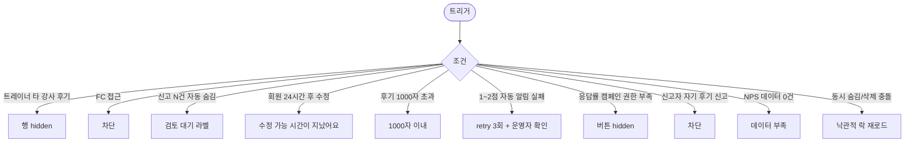

# SCR-C013 수업 평가/피드백 페이지

## 1. 화면 메타 정보

| 항목 | 값 |
|---|---|
| 작성일 | 2026-05-22 |
| 버전 | v1.0 |
| 상태 | 정합화 완료 |
| 도메인 | D04 수업관리 |
| 화면 ID | SCR-C013 |
| 화면명 | 수업 평가/피드백 |
| 화면 유형 | 현황 + 신고/검토 |
| 라우트 (URL) | `/lesson-feedback` |
| 우선순위 | P2 |
| 기능코드 | CLS-13 |
| 계약코드 | CLS-EXT-02 |
| Lv1 코드 | CLS-13 |
| Lv2 / Lv3 세분화 | CLS-13-01 ~ CLS-13-07 (필터, 평점 요약, 피드백 목록, 피드백 상세, NPS 집계, 신고 처리, 본인 조회) |
| 연계 화면 | SCR-C006 강사 근무, STF-02 직원 상세, SCR-D003 KPI, SCR-M004 회원 상세 |

## 2. 화면 개요와 목적

수업 평가/피드백 페이지는 수업 완료 후 회원이 회원앱에서 남긴 평점·후기를 운영자가 조회하고 강사별 NPS와 응답률을 한 화면에서 확인하는 화면입니다. 센터장은 월간 강사 평가 자료를, 매니저는 낮은 평점 강사 코칭 자료를 본 화면에서 추출하고, 부적절 후기는 신고 처리로 숨김·삭제 처리합니다. 강사 NPS는 본 화면 데이터로부터 자동 집계되어 STF-02 직원 상세에 반영됩니다.

낮은 평점(1~2점) 등록 시 owner+에게 즉시 알림이 발송되어 빠른 회원 응대를 돕고, 응답률 < 30%일 때는 마케팅 캠페인을 발송할 수 있습니다.

## 3. 진입 경로와 인접 화면

사이드바의 "수업관리 > 수업 평가/피드백"으로 진입합니다. 인접 화면은 SCR-C006 강사 근무, STF-02 직원 상세(NPS), SCR-D003 KPI 대시보드, SCR-M004 회원 상세입니다.

## 4. 레이아웃과 UI 구성

페이지 헤더 아래에는 필터 바(기간·강사·수업 유형·평점 다중 선택)가 있고, 그 아래에 평점 요약 카드 4개(전체 평균 평점 별점·강사별 평균 평점 랭킹 TOP5·평점 분포 막대 그래프·응답률)가 가로로 배치됩니다.

본문은 피드백 목록 테이블이며 컬럼은 회원명(익명 처리 시 *** 마스킹)·수업명(클릭 시 SCR-C002)·강사명(클릭 시 STF-02)·수업 일시·평점(별점 1~5)·후기 텍스트(미리보기)·등록 일시·신고 상태(정상/신고됨)입니다. 3점 이하 평점은 주황·빨강 강조됩니다. 행 클릭 시 후기 전문과 회원·수업·강사 정보, 신고/삭제 액션이 표시됩니다.

## 5. 탭 구성과 탭별 동작

탭은 없으며 필터 바 조합과 평점 다중 선택으로 목록을 좁힙니다.

## 6. 버튼·아이콘·링크 액션 전체 정의

필터 변경은 즉시 재조회를 일으킵니다. 행 클릭은 후기 상세 드로어를 엽니다. 매니저+는 부적절 후기를 [신고 처리] → [숨김] 또는 [삭제]할 수 있으며 삭제는 영구이며 감사 로그에 기록됩니다. 강사명 클릭은 STF-02 직원 상세로 이동하고 수업명 클릭은 SCR-C002로 이동합니다. 회원명 클릭은 익명이 아닐 때만 SCR-M004로 이동합니다.

응답률 < 30% 시 매니저+에게 [캠페인 발송] 버튼이 노출되어 응답률 향상 마케팅을 발송할 수 있습니다.

## 7. 호출되는 모달 동작

본 화면 자체에는 별도 모달이 없고, 신고/숨김/삭제는 행 상세 드로어 내부에서 처리됩니다.

## 8. 토스트와 확인 팝업과 알럿

성공 토스트는 "후기를 숨김 처리했어요", "후기를 삭제했어요"입니다. 신고 N건 자동 숨김 시 "검토 대기" 라벨이 표시됩니다. 낮은 평점(1~2점) 등록 시 owner+에게 즉시 알림이 자동 발송됩니다. 회원 자기 후기 신고 시도는 차단되고 안내가 표시됩니다.

## 9. 데이터 흐름과 외부 연동

API는 피드백 목록 `GET /api/lesson-feedback`, 요약 `GET /api/lesson-feedback/summary`, 신고 `POST /api/lesson-feedback/:id/report`, 숨김 `POST /api/lesson-feedback/:id/hide`입니다. NPS 자동 집계 잡(매일 04:00)이 STF-02 직원 상세 NPS를 갱신합니다. 낮은 평점 즉시 알림 잡은 1~2점 등록 시 owner+에게 NFR-19 알림을 발송합니다. 자동 숨김 잡은 신고 N건(예: 3건) 이상 시 자동 숨김 + 매니저 검토 알림을 발송합니다.

응답률 캠페인 잡은 매주 응답률 < 30% 회원에게 메시지를 발송합니다. 후기 수정 24시간 만료 잡은 매분 실행되어 회원 본인 수정·삭제 권한을 차단합니다. 모든 신고·숨김·삭제는 SCR-097 감사 로그에 기록되며 후기 데이터는 영구 보관(soft delete)됩니다.

## 10. 화면 상태와 예외 처리

피드백 없음 상태에서는 "피드백이 없어요"가 표시됩니다. 낮은 평점 강조 상태에서 3점 이하는 주황, 1~2점은 빨강으로 강조됩니다. 신고됨 배지는 빨강, 숨김 배지는 회색 + "숨김" 라벨로 표시됩니다. 익명 후기는 회원명 *** 마스킹으로 표시되며 신고/삭제 시에도 마스킹이 유지됩니다.

예외로 트레이너 타 강사 후기 조회는 행 숨김, FC 화면 접근은 차단 + 권한 안내, 신고 N건 자동 숨김은 "검토 대기" 라벨, 회원 후기 24시간 후 수정 시도는 "수정 가능 시간이 지났어요" 차단, 후기 1000자 초과는 입력 차단, 1~2점 자동 알림 실패는 retry 3회, 응답률 캠페인 발송 권한 부족은 버튼 숨김, 신고자 자기 후기 신고는 차단, NPS 산출 데이터 0건은 "데이터 부족" 안내가 표시됩니다.

## 11. 권한별 처리

슈퍼관리자·본사 최고관리자·센터장은 신고 처리·삭제(영구)가 가능합니다. 매니저는 신고 처리·숨김이 가능합니다. 트레이너는 본인 수업 피드백만 조회 가능(자기 평가 보호)합니다. FC·스태프는 접근 불가입니다. readonly는 접근 불가입니다.

## 12. 메인 흐름

```mermaid
flowchart TD
    A([수업 평가 피드백 진입]) --> B[필터 + 평점 요약]
    B --> C[피드백 목록 + 낮은 평점 강조]
    C --> D{사용자 액션}
    D -->|행 클릭| E[후기 전문 + 신고/삭제 액션]
    D -->|강사명 클릭| F[STF-02 직원 상세]
    D -->|수업명 클릭| G[SCR-C002 수업 관리]
    D -->|회원명 (익명 아님)| H[SCR-M004 회원 상세]
    D -->|캠페인 발송 manager+| I[응답률 < 30% 회원 메시지]
    E --> J{매니저+ 액션}
    J -->|숨김| K[일시적 숨김 + 감사 로그]
    J -->|삭제 (owner+)| L[영구 soft delete + 감사 로그]
    M[1~2점 등록] --> N[owner+ 즉시 알림]
    O[NPS 일일 집계] --> P[STF-02 NPS 갱신]
```

## 13. 에러와 예외 흐름



## 14. 핵심 디자인 요청사항

평점 요약 카드 4개는 동일 크기로 배치되어 한눈에 비교 가능해야 합니다. 별점 시각화는 노란 별과 빈 별의 대비가 명확해야 하며 평점 분포 막대 그래프는 1~5점이 색상 그라데이션으로 구분됩니다. 낮은 평점(3점 이하) 행은 행 좌측 인디케이터 색으로 즉시 식별되어야 하고, 익명 후기의 마스킹(***)은 일반 텍스트와 명확히 구분되는 회색 톤으로 표시됩니다. 신고됨 배지는 빨강 강조로 매니저 검토 우선순위를 알립니다.

## 15. 운영 정책 (이 화면에 연결된 부분)

강사 NPS는 본 화면의 평점 데이터로부터 자동 집계되어 STF-02 직원 상세에 반영됩니다. NPS 산식은 추천(9~10점, 5점 척도 환산 4.5+) - 비추천(0~6, 3점 이하) / 응답 수 × 100입니다. 평점은 별 1~5점(정수만, 0.5 단위 불가)이고 후기 텍스트는 최대 1000자이며 선택 입력입니다. 응답률 = 응답 수 / 완료 수업 수 × 100입니다.

트레이너는 본인 수업 피드백만 조회 가능(자기 평가 보호)하고, 매니저+가 신고 처리·숨김을, owner+가 영구 삭제(soft delete)를 수행합니다. 회원은 익명 후기 옵션을 선택할 수 있으며 익명 시 회원명 마스킹(***)이 유지되고 신고/삭제 시에도 마스킹은 보존됩니다.

자동 숨김 정책은 신고 N건(예: 3건) 이상 시 자동 숨김 + 매니저 검토 대기이고, 낮은 평점 자동 알림은 1~2점 등록 시 owner+에게 즉시 알림 발송입니다. 응답률 향상 캠페인은 응답률 < 30% 시 마케팅 발송 옵션으로 활성화됩니다.

회원 후기 수정·삭제는 24시간 이내에만 본인 수정·삭제 가능합니다. 데이터는 영구 보관(삭제는 soft delete)이며 회원 신고 누적 관리(다발 회원 식별 + 운영 정책 강화)는 정책 활성 시 작동합니다. 본사 통합 모드는 지점 컬럼 + 전 지점 합산을 제공합니다.

NPS 추이 그래프는 월간 단위로 표시되어 트렌드 분석이 가능합니다. 모든 신고·숨김·삭제는 감사 로그에 기록되어 5초 안에 SCR-097에서 조회 가능합니다.
