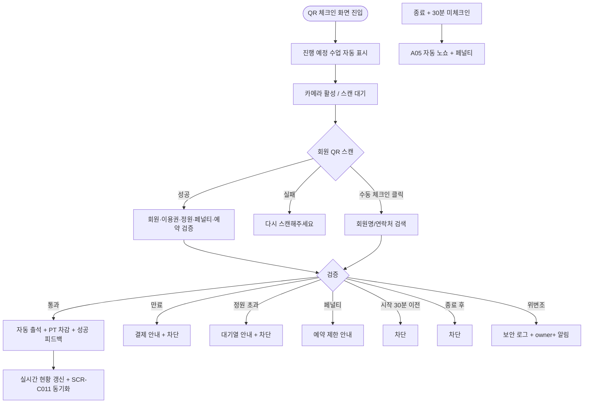

# SCR-C014 출석 QR 체크인 페이지

## 1. 화면 메타 정보

| 항목 | 값 |
|---|---|
| 작성일 | 2026-05-22 |
| 버전 | v1.0 |
| 상태 | 정합화 완료 |
| 도메인 | D04 수업관리 |
| 화면 ID | SCR-C014 |
| 화면명 | 출석 QR 체크인 |
| 화면 유형 | 셀프 체크인 / 키오스크 |
| 라우트 (URL) | `/qr-checkin` |
| 우선순위 | P0 |
| 기능코드 | CLS-14 |
| 계약코드 | CLS-14 |
| Lv1 코드 | CLS-14 |
| Lv2 / Lv3 세분화 | CLS-14-01 ~ CLS-14-08 (QR 스캔, 수업 선택, 출석 등록, 실시간 현황, 수동 체크인, 피드백, QR 관리, 노쇼 자동 처리) |
| 연계 화면 | SCR-C011 유효 수업, SCR-C007 횟수, SCR-C008 페널티, 회원앱 QR 화면 |

## 2. 화면 개요와 목적

출석 QR 체크인 페이지는 회원이 본인 QR 코드를 직접 스캔해 자동 출석 처리하는 셀프 체크인 화면입니다. 프런트 데스크 태블릿이나 셀프 키오스크에 설치해 강사·스태프의 수동 출석 부담을 크게 줄이며, 회원이 수업 시작 30분 전부터 종료 시점까지 본인 QR을 스캔하면 회원·이용권·정원·페널티 검증을 거쳐 자동 출석이 등록되고 PT 횟수도 자동 차감됩니다. 강사는 실시간 출석 현황 패널로 본인 수업의 체크인 카운트를 모니터링할 수 있습니다.

수업 종료 + 30분 미체크인 회원은 A05 자동 노쇼 크론으로 처리되며 자동 페널티가 부과됩니다. QR 코드는 회원별 고유값으로 7일마다 갱신되어 보안을 유지하고 위변조 시도는 감사 로그에 기록 + owner+ 보안 알림이 발송됩니다.

## 3. 진입 경로와 인접 화면

태블릿/키오스크 디바이스에서 `/qr-checkin`으로 직접 접속하거나 사이드바의 "수업관리 > QR 체크인"으로 진입합니다. 인접 화면은 SCR-C011 유효 수업(출석 자동 갱신), SCR-C007 횟수(자동 차감), SCR-C008 페널티(자동 노쇼), 회원앱 QR 화면입니다.

## 4. 레이아웃과 UI 구성

페이지 상단에는 수업 선택 영역이 있으며 현재 진행 중이거나 곧 시작할 수업(시작 30분 전 ~ 종료 시점)이 자동 노출됩니다. 카메라 활성 영역이 중앙에 크게 배치되어 회원의 QR 스캔을 받습니다. 우측에는 실시간 출석 현황 패널이 있어 총 예약 인원, 출석 완료 카운트, 미출석 잔여, 출석한 회원 목록(이름 + 체크인 시각)이 실시간으로 갱신됩니다.

스캔 영역 아래에는 [수동 체크인] 버튼이 있어 QR 인식 실패 시 회원명·연락처로 검색해 출석 처리할 수 있습니다. 키오스크 모드에서는 셀프 셸이 적용되어 운영자 메뉴가 가려지고 특정 수업이 고정 표시됩니다.

## 5. 탭 구성과 탭별 동작

탭은 없으며 수업 선택 드롭다운으로 화면 컨텍스트를 전환합니다. 수업 시작 30분 전부터 자동 노출되고 종료 시점에 자동 전환됩니다.

## 6. 버튼·아이콘·링크 액션 전체 정의

회원이 QR을 스캔하면 회원 활성 / 이용권 유효 / 페널티 미적용 / 예약 확정 / 정원 미초과 검증을 거쳐 자동 출석 등록 + PT 횟수 차감 + 성공 사운드·진동 + "회원명·수업명" 피드백이 표시됩니다. 검증 실패 시 차단 사유에 따라 안내 문구가 다르게 표시됩니다.

[수동 체크인] 버튼은 회원명/연락처 검색 후 선택 → 동일 검증 → 출석 처리합니다. FC/스태프/매니저+가 사용할 수 있고 트레이너는 본인 담당 수업만 가능합니다. [QR 갱신]은 매니저+가 회원별 QR을 즉시 갱신할 수 있는 관리 기능입니다.

키오스크 모드 토글은 운영자가 활성화하면 셀프 셸이 적용되어 회원이 외부 메뉴로 빠져나갈 수 없습니다.

## 7. 호출되는 모달 동작

본 화면에는 별도 모달이 없으며 모든 피드백(스캔 성공/실패, 검증 차단 안내)은 인라인 메시지 또는 토스트로 처리됩니다.

## 8. 토스트와 확인 팝업과 알럿

성공 안내는 "{회원명}님 출석 완료 - {수업명}" + 성공 사운드/진동입니다. 차단 안내는 "이용권이 만료되었습니다 - 결제 안내", "정원이 초과되었습니다 - 대기열 안내", "예약 제한 중입니다", "30분 전부터 가능합니다", "수업이 종료되었습니다", "유효하지 않은 QR입니다" 같이 명확한 사유를 제시합니다.

위변조 시도 감지 시 차단 + 감사 로그 + owner+ 보안 알림이 자동 발송됩니다. 카메라 권한 거부 시 "카메라 권한을 허용해주세요" + [수동 체크인] 안내가 표시됩니다. 키오스크 네트워크 단절 시 오프라인 큐잉이 활성화되어 복구 후 자동 동기화됩니다.

## 9. 데이터 흐름과 외부 연동

API는 QR 체크인 `POST /api/attendance/qr-checkin`, 수동 체크인 `POST /api/attendance/manual-checkin`, 실시간 현황 `GET /api/attendance/realtime/:lessonId`, QR 갱신 `POST /api/members/:id/qr-renew`입니다. 출석 처리는 CLS-07 횟수 관리에 멱등성 키(booking_id 우선, 예약 없는 수동 체크인은 member_id+lesson_id 조합)와 함께 차감 신호를 보냅니다.

자동 노쇼 크론(A05)은 종료 시간 + 30분 후 미체크인을 자동 노쇼 처리하고 CLS-08 페널티에 부과 신호를 보냅니다. QR 갱신 잡은 매일 자정 7일 경과 QR을 자동 갱신해 회원앱에 신규 QR을 표시합니다. CLS-11 유효 수업 목록의 출석 상태는 본 화면 webhook으로 실시간 갱신됩니다.

실시간 갱신은 WebSocket 또는 5초 폴링으로 처리되며 #16 IoT 키오스크와 연동되어 카드/태그 인식 옵션도 지원합니다. 모든 체크인·위변조 시도는 SCR-097 감사 로그에 actor·member_id·action·is_violation으로 기록됩니다.

## 10. 화면 상태와 예외 처리

대기 중 상태에서는 카메라가 활성화되고 스캔 가이드가 표시됩니다. 스캔 성공 시 회원명·수업명 + 성공 피드백, 스캔 실패 시 "다시 스캔해주세요" + 재시도 안내가 표시됩니다. 수업 없음 상태는 "예정된 수업이 없어요"가, 만석은 "정원이 초과되었습니다"가, 이용권 만료는 "이용권이 만료되었습니다" + 결제 안내가, 페널티는 "예약 제한 중입니다"가, 시작 전 30분 이전은 "30분 전부터 가능합니다"가, 종료 후는 "수업이 종료되었습니다"가, 카메라 권한 거부는 "카메라 권한을 허용해주세요"가, QR 위변조는 "유효하지 않은 QR입니다" + 보안 로그가 표시됩니다.

키오스크 모드 상태에서는 셀프 셸이 적용됩니다. 예외 케이스로 멱등성 중복 시도는 skip 처리되어 중복 차감이 방지되고, 예약 미확정 회원은 "예약 확인되지 않았습니다" + 운영자 확인 안내가, 회원 비활성/탈퇴는 "유효하지 않은 회원입니다" 차단이, 자동 노쇼 부과 후 정정은 CLS-02 출석 정정으로 자동 페널티 해제가, 수동 검색 0건은 "검색 결과가 없어요"가, 키오스크 네트워크 단절은 오프라인 큐잉 후 복구 시 동기화가 적용됩니다.

## 11. 권한별 처리

슈퍼관리자·본사 최고관리자·센터장은 QR 관리·수동 체크인·키오스크 모드 설정이 가능합니다. 매니저는 QR 관리·수동 체크인이 가능합니다. 트레이너는 담당 수업 QR 운영이 가능합니다. FC·스태프는 수동 체크인이 가능합니다. readonly는 접근 불가입니다.

회원 자신은 키오스크 모드에서 본인 QR을 스캔하는 것만 가능하며 운영자 메뉴에 접근할 수 없습니다.

## 12. 메인 흐름



## 13. 에러와 예외 흐름

```mermaid
flowchart TD
    A([스캔/처리]) --> B{조건}
    B -->|이용권 만료| C["이용권이 만료되었습니다" + 결제]
    B -->|정원 초과| D["정원이 초과되었습니다" + 대기열]
    B -->|페널티 적용| E["예약 제한 중입니다"]
    B -->|시작 30분 이전| F["30분 전부터 가능합니다"]
    B -->|종료 후| G["수업이 종료되었습니다"]
    B -->|QR 위변조| H[차단 + 보안 로그 + owner+ 알림]
    B -->|QR 만료 (7일)| I["회원앱에서 갱신해주세요"]
    B -->|카메라 권한 거부| J[수동 체크인 안내]
    B -->|멱등성 중복| K[skip + 안내]
    B -->|예약 미확정| L["예약 확인되지 않았습니다"]
    B -->|회원 비활성/탈퇴| M[차단]
    B -->|자동 노쇼 후 정정| N[자동 페널티 해제]
    B -->|네트워크 단절| O[오프라인 큐잉 + 복구 동기화]
```

## 14. 핵심 디자인 요청사항

카메라 스캔 영역은 화면 중앙에서 가장 두드러져야 하며 스캔 가이드선과 안내 문구로 회원이 본인 QR을 어디에 대야 하는지 즉시 알 수 있게 합니다. 성공 피드백은 큰 회원명 + 수업명 + 녹색 체크 아이콘 + 사운드·진동으로 명확한 성공 감각을 제공합니다. 실패 안내는 빨강 강조 + 큰 텍스트로 회원이 즉시 사유를 인지할 수 있게 합니다.

실시간 현황 패널은 우측에 고정되어 강사가 본인 수업의 출석 카운트를 한눈에 볼 수 있어야 합니다. 키오스크 모드에서는 운영자 메뉴가 숨겨지고 풀스크린 셸이 적용되어 회원이 다른 화면으로 빠져나갈 수 없게 합니다.

## 15. 운영 정책 (이 화면에 연결된 부분)

QR 코드는 회원별 고유값이며 7일마다 정기 갱신되어 보안을 유지합니다. 체크인 시간 윈도우는 수업 시작 30분 전부터 종료 시점까지이며 그 밖의 시간에는 차단됩니다.

출석 시 PT 이용권 횟수가 자동 차감되며 멱등성 키(예약 기반 출석은 booking_id, 예약 없는 수동 체크인은 member_id+lesson_id 조합)로 중복 차감이 차단됩니다. 정원 초과·이용권 만료·페널티 적용 중 회원은 체크인이 차단됩니다.

자동 노쇼 처리(A05)는 수업 종료 시점 + 30분 후 미체크인을 자동 노쇼 처리하고 자동 페널티(CLS-08)를 부과합니다. QR 위변조 시도는 감사 로그에 is_violation 플래그와 함께 기록되고 owner+에게 보안 알림이 즉시 발송됩니다.

키오스크 모드는 셀프 셸이 적용되어 외부 메뉴 접근이 차단됩니다. #16 IoT 연계로 키오스크 디바이스에 카드/태그 인식 옵션을 추가할 수 있습니다. 회원 검증 항목은 회원 활성 / 이용권 유효 / 페널티 미적용 / 예약 확정 / 정원 미초과의 5종이며 모두 통과해야 출석이 등록됩니다.

CLS-11 유효 수업 목록과 본 화면은 양방향 동기화되어 어떤 화면에서 출석이 처리되든 결과가 즉시 반영됩니다. 회원 last_visit_at은 출석 처리 시 SCR-M004에 자동 갱신됩니다. 본사 통합 모드에서 지점 간 QR은 호환되지 않으며 지점별 QR 관리가 분리됩니다.

서명 이미지 저장은 본 화면에서 처리되지 않고 SCR-C011 또는 CLS-02에서 DLG-C006으로 처리됩니다. 키오스크 네트워크 단절은 오프라인 큐잉으로 처리되며 복구 후 일괄 동기화됩니다.
