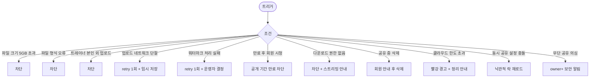

# SCR-C015 수업 녹화 관리 페이지

## 1. 화면 메타 정보

| 항목 | 값 |
|---|---|
| 작성일 | 2026-05-22 |
| 버전 | v1.0 |
| 상태 | 정합화 완료 |
| 도메인 | D04 수업관리 |
| 화면 ID | SCR-C015 |
| 화면명 | 수업 녹화 관리 |
| 화면 유형 | 미디어 라이브러리 + 공유 관리 |
| 라우트 (URL) | `/class-recording` |
| 우선순위 | P2 |
| 기능코드 | CLS-15 |
| 계약코드 | CLS-15 |
| Lv1 코드 | CLS-15 |
| Lv2 / Lv3 세분화 | CLS-15-01 ~ CLS-15-08 (녹화 파일 목록, 파일 업로드, 공유 설정, 미리보기, 다운로드, 파일 삭제, 자동 만료, 회원앱 연동) |
| 연계 화면 | SCR-C002 수업관리, SCR-C011 유효 수업, 회원앱 영상 화면, SCR-M004 회원 상세 |
| 호출 다이얼로그 | DLG-C005 수업기록상세 |

## 2. 화면 개요와 목적

수업 녹화 관리 페이지는 완료된 수업의 녹화 영상을 업로드해 회원에게 공유하고 공개 기간·다운로드 권한·워터마크를 제어하는 미디어 라이브러리 화면입니다. 트레이너는 본인 수업 녹화를 업로드한 뒤 담당 회원에게 공유해 복습 자료로 활용할 수 있고, GX 강사는 자세 시범 영상을 다수 회원에게 공유합니다. 공개 기간 만료 시 자동 비공개 + 회원 알림이 발송되며, 워터마크는 회원명을 영상에 오버레이해 무단 유포를 방지합니다.

다운로드 권한은 별도로 분리되어 트레이너가 토글로 ON할 때만 회원이 다운로드 가능하고, 다운로드 이력이 기록되어 보안 점검에 활용됩니다. 영상은 클라우드 스토리지에 저장되며 만료 90일 경과 시 영구 삭제 잡이 동작합니다.

## 3. 진입 경로와 인접 화면

사이드바의 "수업관리 > 수업 녹화 관리"로 진입합니다. 인접 화면은 SCR-C002 수업관리(연결 수업 선택), SCR-C011 유효 수업, 회원앱 영상 화면, SCR-M004 회원 상세입니다.

## 4. 레이아웃과 UI 구성

페이지 헤더 우측에는 [파일 업로드] 버튼과 검색 입력이 있습니다. 본문은 녹화 파일 목록 테이블이며 컬럼은 수업명·강사명·수업 일시·파일명·파일 크기·업로드 일시·공유 상태(공유 중/비공개/만료)·공유 대상(회원 수)·액션([재생]/[다운로드]/[공유 설정]/[삭제])입니다.

업로드 영역은 드래그&드롭 또는 파일 선택을 지원하며 진행률 바와 [취소] 버튼이 함께 표시됩니다. 공유 설정 드로어에서는 대상 회원 다중 선택, 공개 기간(무기한/특정 날짜까지), 다운로드 허용 토글, 워터마크 옵션을 설정합니다. 본사 통합 모드에서는 지점 컬럼이 추가됩니다.

## 5. 탭 구성과 탭별 동작

탭은 없으며 공유 상태 필터(공유 중/비공개/만료)와 검색 조합으로 목록을 좁힙니다.

## 6. 버튼·아이콘·링크 액션 전체 정의

[파일 업로드]는 드래그&드롭 또는 파일 선택을 받아 연결 완료 수업 선택 후 업로드를 시작합니다. 파일 크기 제한 5GB, 형식 mp4/mov/m4v 등을 위반하면 차단됩니다. 업로드 도중 네트워크 단절 시 1회 재시도 + 임시 저장으로 복구합니다.

행의 [재생] 버튼은 권한 검증 후 스트리밍 재생을 시작하고, [다운로드]는 다운로드 허용 영상에 한해 활성됩니다(이력 기록). [공유 설정]은 드로어를 열어 회원 다중 선택·공개 기간·다운로드 허용·워터마크 옵션을 변경합니다. [삭제]는 트레이너 본인 수업·매니저+에게 노출되며 공유 중 영상 삭제 시 회원 안내 발송 후 영구 삭제됩니다.

## 7. 호출되는 모달 동작

### 7-1. DLG-C005 수업 기록 상세 다이얼로그
완료 수업의 출석·서명·메모·QR 로그와 함께 녹화 영상 링크도 통합 표시됩니다. 본 화면의 녹화 파일은 DLG-C005에서 함께 조회할 수 있습니다.

## 8. 토스트와 확인 팝업과 알럿

성공 토스트는 "영상을 업로드했어요", "회원에게 공유했어요", "공개 기간이 만료되었어요"입니다. 실패 토스트는 "파일 크기가 5GB를 초과합니다", "지원하지 않는 형식입니다", "공개 기간이 만료되었습니다" 같이 사유를 명시합니다. 워터마크 처리 실패 시 retry 1회 후 운영자 결정 옵션이 제공됩니다. 클라우드 스토리지 한도 초과 시 빨강 경고 + 정리 안내가 표시됩니다.

## 9. 데이터 흐름과 외부 연동

API는 업로드 `POST /api/recordings/upload`, 목록 `GET /api/recordings`, 공유 설정 `POST /api/recordings/:id/share`, 삭제 `DELETE /api/recordings/:id`, 스트리밍 `GET /api/recordings/:id/stream`, 다운로드 `GET /api/recordings/:id/download`입니다.

업로드 잡은 클라우드 업로드 + 워터마크 처리 잡(회원별 워터마크 영상 생성)을 트리거합니다. 만료 자동 비공개 잡(매분)은 공개 기간 만료를 처리하고 회원에게 알림을 발송합니다. 만료 사전 알림 잡(매일 09:00)은 1일 전 사전 알림을 보냅니다. 만료 90일 영구 삭제 잡(매일 04:00)은 클라우드 스토리지에서 영구 삭제합니다.

다운로드 이력 잡은 [다운로드] 클릭 시 누가 언제 다운로드했는지 기록합니다. 무단 공유 패턴 감지 잡(매일)은 다운로드 이력을 분석해 의심 패턴을 owner+에게 알립니다. 모든 업로드·공유·삭제·다운로드는 SCR-097 감사 로그에 기록되고 회원앱은 webhook으로 즉시 동기화됩니다.

## 10. 화면 상태와 예외 처리

파일 없음 상태는 "업로드된 녹화 파일이 없어요"가 표시됩니다. 업로드 중은 진행률 바 + 추정 시간 + 취소 버튼, 워터마크 처리 중은 "처리 중..." 안내, 공유 중은 대상 회원 + 기간 표시, 비공개는 "공유 미설정", 만료 1일 전은 노란 경고, 만료는 "만료" 배지 + 회색, 스토리지 한도 초과는 빨강 경고가 표시됩니다.

예외로 파일 크기/형식 초과 차단, 트레이너 본인 외 업로드 시도 차단, 업로드 네트워크 단절 재시도 1회 + 임시 저장, 워터마크 처리 실패 retry 1회, 만료 후 회원 시청 시도 "공개 기간이 만료되었습니다" 차단, 다운로드 권한 없는 시도 차단 + 스트리밍 안내, 공유 중 영상 삭제 회원 안내 발송 후 삭제, 클라우드 한도 초과 정리 안내, 만료 90일 경과 영구 삭제 안내, 무단 공유 의심 보안 알림이 적용됩니다.

## 11. 권한별 처리

슈퍼관리자·본사 최고관리자·센터장·매니저는 전체 녹화 파일의 업로드·삭제·공유가 가능합니다. 트레이너는 본인 수업 녹화에 한해 업로드·삭제·공유가 가능합니다. FC·스태프는 접근 불가입니다. readonly는 접근 불가입니다. 회원은 회원앱에서만 본인에게 공유된 영상에 접근할 수 있습니다.

## 12. 메인 흐름

```mermaid
flowchart TD
    A([녹화 관리 진입]) --> B[목록 + 필터]
    B --> C{사용자 액션}
    C -->|파일 업로드| D[드래그&드롭 / 선택]
    D --> E[연결 완료 수업 선택]
    E --> F[클라우드 업로드 + 진행률 바]
    F --> G[워터마크 처리 잡]
    G --> H[공유 설정 드로어]
    H --> I[회원 다중 + 기간 + 다운로드 + 워터마크]
    I --> J[저장 + 회원앱 즉시 노출]
    C -->|[재생]| K[권한 검증 + 스트리밍]
    C -->|[다운로드]| L[권한 시 다운로드 + 이력]
    C -->|[삭제]| M{공유 중?}
    M -->|예| N[회원 안내 발송 후 영구 삭제]
    M -->|아니오| O[즉시 영구 삭제]
    P[공개 기간 만료] --> Q[자동 비공개 + 회원 알림]
    R[만료 90일 경과] --> S[클라우드 영구 삭제]
```

## 13. 에러와 예외 흐름



## 14. 핵심 디자인 요청사항

업로드 진행률 바는 큰 시각적 피드백 + 추정 시간 + 취소 버튼이 함께 표시되어 큰 파일 업로드 시 안정감을 줘야 합니다. 공유 상태 배지는 공유 중(녹색)·비공개(회색)·만료(빨강)로 색상이 명확히 구분됩니다. 만료 1일 전 노란 경고는 행 좌측 인디케이터로 표시되어 운영자가 갱신·정리를 결정할 수 있게 합니다. 공유 회원 다중 선택은 회원 검색 + 칩 형태로 보여줘 누구에게 공유했는지 한눈에 알 수 있게 합니다.

## 15. 운영 정책 (이 화면에 연결된 부분)

트레이너는 본인 수업 녹화만 업로드·공유 가능합니다. 영상은 스트리밍 방식으로 재생되며 다운로드는 별도 권한이 필요합니다. 워터마크는 회원명을 영상에 오버레이해 무단 유포를 방지하며 회원별 다른 워터마크가 적용됩니다.

파일 형식은 mp4/mov/m4v 등 테넌트별 정책이고 단일 파일 최대 5GB(테넌트별 조정 가능)입니다. 연결 수업은 완료 상태만 가능하며 공개 기간은 무기한 또는 특정 날짜까지로 설정합니다. 무기한도 90일 후 만료 알림 + 갱신 안내가 발송됩니다.

다운로드 권한은 트레이너 토글 ON 시에만 회원 다운로드 가능하며 누가 언제 다운로드했는지 이력이 기록됩니다(감사 로그). 만료 알림 정책은 만료 1일 전 사전 알림 + 만료 즉시 알림입니다. 만료 90일 경과 영상은 자동 영구 삭제됩니다(클라우드 비용 관리).

스트리밍 권한 검증은 매 요청마다 회원·기간·공유 상태를 검증하며 HTTPS + 토큰 기반 인증으로 보안을 유지합니다. GDPR/개인정보 보호를 위해 영상에 타 회원 얼굴 노출 시 모자이크 처리가 권장되며 운영자 책임 안내가 표시됩니다.

본사 통합 모드에서는 지점 컬럼 + 전 지점 합산이 제공됩니다. 재생 이력(회원별 재생 시간·횟수)은 정책에 따라 통계로 활용 가능합니다. 무단 공유 패턴 감지는 다운로드 이력 분석으로 의심 케이스를 자동 식별합니다.
