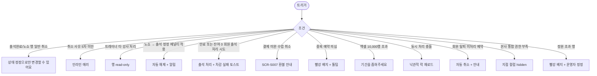

# SCR-C016 예약 목록 페이지

## 1. 화면 메타 정보

| 항목 | 값 |
|---|---|
| 작성일 | 2026-05-22 |
| 버전 | v1.0 |
| 상태 | 정합화 완료 |
| 도메인 | D04 수업관리 |
| 화면 ID | SCR-C016 |
| 화면명 | 예약 목록 |
| 화면 유형 | 예약 1건 단위 원장 |
| 라우트 (URL) | `/class-reservations` |
| 우선순위 | P0 |
| 기능코드 | RSV-01 |
| 계약코드 | RSV-01, RSV-02 |
| Lv1 코드 | RSV-01 |
| Lv2 / Lv3 세분화 | RSV-01-01 ~ RSV-01-08 (요약 카드, 필터 바, 검색, 예약 목록 테이블, 행 액션, 상태 정정, 엑셀 다운로드, 본사 통합 모드) |
| 연계 화면 | SCR-C001 수업캘린더, SCR-C002 수업관리, SCR-C005 그룹수업현황, SCR-C008 페널티관리, SCR-M004 회원 상세, SCR-S007 환불 |
| 호출 다이얼로그 | (없음 — 예약 취소·출석/노쇼 처리·상태 정정 모두 행 인라인 액션으로 처리) |

## 2. 화면 개요와 목적

예약 목록 페이지는 전체 수업 예약을 예약 1건 단위로 조회·검색·필터링하는 예약 원장 화면입니다. SCR-C001 캘린더는 시간 축 위에 수업을 시각화하고 SCR-C002 수업관리는 수업 1개를 한 행으로 보여주는 반면, 본 화면은 예약 1건 = 1행 단위로 표시되어 회원별·예약별 상세 검색과 정밀 관리가 가능합니다. 같은 수업에 회원 N명이 예약한 경우 회원 수만큼 행이 분해되어 표시됩니다.

FC는 "예약했나요?" 회원 문의 응대에 활용하고, 매니저는 일·주간 정산을 위해 상태별 카운트로 출석/노쇼/취소 비율을 분석합니다. 본사 슈퍼관리자는 통합 모드로 전 지점 비교를, 분기 정산자는 엑셀 다운로드로 정산 자료를 추출합니다. 매니저 권한자는 출석완료/노쇼 행에 대해 상태 정정 권한이 있으며 노쇼 → 출석 정정 시 자동 페널티 자동 해제 + 횟수 자동 차감이 일어납니다.

## 3. 진입 경로와 인접 화면

사이드바의 "수업관리 > 예약 목록"으로 진입합니다. 대시보드의 "오늘 예약 수", "노쇼 누적", "취소 누적" 같은 지표 카드를 누르면 해당 필터가 자동 적용된 상태로 진입합니다. 인접 화면은 SCR-C001 캘린더, SCR-C002 수업관리, SCR-C005 그룹수업현황, SCR-C008 페널티관리, SCR-M004 회원 상세, SCR-S007 환불입니다.

## 4. 레이아웃과 UI 구성

페이지 헤더 아래에는 요약 카드 5개(전체 예약·예약 완료·출석 완료·취소/노쇼·대기)가 가로로 배치됩니다. 각 카드를 누르면 해당 상태로 자동 필터링됩니다. 카드 아래에는 필터 바(기간 - 수업일 기본 / 예약일 전환 가능, 수업 드롭다운, 강사 드롭다운, 상태 5종 단일 토글, 본사 통합 모드에서만 노출되는 지점 드롭다운)와 검색 입력(회원명/연락처, 디바운스 300ms, 하이픈 제거 후 비교)이 있습니다.

본문은 예약 목록 테이블이며 컬럼은 예약일시·수업일시·수업명·수업 유형·강습 세션 유형(PT·필라테스·스트레칭·테라피)·강사·회원명·연락처·지점(본사 통합 모드만)·상태 배지·취소 사유(취소 시)·처리자/처리일시입니다. 회원명 클릭은 SCR-M004로, 수업명 클릭은 SCR-C002로 이동합니다.

행 우측 액션은 [회원 상세]·[수업 상세]·[예약 취소]·[출석 처리]·[노쇼 처리]가 권한에 따라 노출됩니다. 출석완료/노쇼 행은 일반 [취소] 버튼이 숨겨지고 매니저+의 [상태 정정]만 노출되어 데이터 무결성이 보장됩니다. 화면 하단에는 페이지네이션과 [엑셀 다운로드] 버튼이 고정 배치됩니다.

## 5. 탭 구성과 탭별 동작

탭은 없으며 요약 카드 클릭 + 상태 5종 토글 + 필터 조합으로 목록을 좁힙니다. 기간 필터는 기본 수업일 기준이며 예약일 기준으로 전환할 수 있습니다.

## 6. 버튼·아이콘·링크 액션 전체 정의

요약 카드 5개는 각각 해당 상태로 자동 필터링됩니다. 검색 입력은 디바운스 300ms로 동작하며 연락처는 하이픈 제거 후 비교되어 010-1234-5678과 01012345678이 동일하게 처리됩니다.

행의 [예약 취소] 버튼은 사유 입력(필수 5자 이상) 후 처리되며 PT 횟수 자동 복구 + 회원 알림이 발송됩니다. [출석 처리]는 PT 횟수 자동 차감(booking_id 멱등성 키)을 트리거하고, [노쇼 처리]는 자동 페널티 부과(CLS-08) + 회원 알림을 처리합니다. 출석완료/노쇼 행에서는 일반 취소가 차단되고 매니저+에게 [상태 정정] 버튼만 노출됩니다.

[엑셀 다운로드]는 현재 필터·검색 적용된 결과만 다운로드하며 최대 10,000행으로 제한됩니다. 파일명 규칙은 `예약목록_{지점}_{기간}_{시각}.xlsx`입니다.

회원명 클릭은 SCR-M004로 이동하고 수업명 클릭은 SCR-C002로 이동합니다. 중복 예약 의심(동일 회원 동일 수업) 행에는 빨강 배지와 툴팁이 표시되어 운영자가 정정을 검토할 수 있게 합니다.

## 7. 호출되는 모달 동작

본 화면은 별도 호출 다이얼로그가 없으며 예약 취소는 사유 입력 + 확인 팝업, 상태 정정은 정정 사유 입력 모달로 처리됩니다.

## 8. 토스트와 확인 팝업과 알럿

성공 토스트는 "예약을 취소했어요", "출석을 처리했어요", "노쇼로 처리했어요", "상태를 정정했어요"입니다. 실패 토스트는 "상태 정정으로만 변경할 수 있어요"(출석완료/노쇼 행 일반 취소 시도), "이용권이 만료되어 차감에 실패했어요", "결제가 진행 중인 수업이에요"(결제 미완 취소 시) 같이 사유를 명시합니다. 노쇼 → 출석 정정 시 "자동 페널티가 해제됩니다" 토스트가 자동 안내됩니다.

엑셀 10,000행 초과 시 "기간을 좁혀주세요" 차단 안내가 표시됩니다.

## 9. 데이터 흐름과 외부 연동

API는 예약 목록 `GET /api/lesson-bookings`, 상세 `GET /api/lesson-bookings/:id`, 취소 `POST /api/lesson-bookings/:id/cancel`, 출석 `POST /api/lesson-bookings/:id/attendance`, 노쇼 `POST /api/lesson-bookings/:id/noshow`, 엑셀 `GET /api/lesson-bookings/export`, 히스토리 `GET /api/lesson-bookings/:id/history`입니다.

출석 처리는 CLS-07 횟수 관리에 booking_id 멱등성 키와 함께 차감 신호를 보내고(예약 없는 수동 체크인은 CLS-07 기준 member_id+lesson_id 사용), 취소는 PT 횟수 자동 복구 + 결제 환불 안내(SCR-S007), 노쇼는 자동 페널티 부과(CLS-08) webhook을 트리거합니다. 노쇼 → 출석 정정 webhook은 자동 페널티 자동 해제 + 횟수 차감을 처리합니다.

중복 예약 감지 잡(매분)이 동일 회원·동일 수업 중복을 식별해 경고 배지를 부여합니다. 회원 탈퇴 webhook은 미처리 예약을 자동 취소 처리하고 회원 알림을 발송합니다. 출석 처리 시 회원 last_visit_at이 SCR-M004에 자동 갱신됩니다. 모든 취소·출석·노쇼·정정은 SCR-097 감사 로그에 actor·booking_id·before·after·reason으로 기록되어 영구 보관됩니다.

## 10. 화면 상태와 예외 처리

로딩 중에는 행 스켈레톤이 표시되고 정상 표시에는 12개 컬럼 테이블이 렌더됩니다. 검색 결과 없음은 "조건에 맞는 예약이 없어요" + [필터 초기화]가 표시됩니다. 중복 의심 행은 빨강 배지 + 툴팁으로 표시됩니다. 출석완료/노쇼 행은 일반 [취소]가 숨겨지고 [상태 정정]만 노출됩니다.

예외로 출석완료/노쇼 행 일반 취소 시도는 "상태 정정으로만 변경할 수 있어요" 차단, 취소 사유 미입력은 인라인 에러, 트레이너의 타 강사 처리 시도는 행 read-only, 노쇼 → 출석 정정 시 자동 페널티 해제, PT 차감 실패(이용권 만료)는 출석은 처리 + 차감 실패 토스트 + 운영자 조정 안내, 결제 미완 수업 취소는 SCR-S007 환불 안내, 중복 예약 의심은 빨강 배지 + 정정 권장, 권한 부족은 액션 숨김, 엑셀 10,000행 초과는 기간 축소 안내, 동시 처리 충돌은 낙관적 락 재로드, 회원 탈퇴 후 미처리 예약은 자동 취소, 본사 통합 권한 부족은 지점 컬럼 숨김이 적용됩니다.

## 11. 권한별 처리

superAdmin·primary는 전체 지점 예약을 조회·취소·출석·노쇼·다운로드·정정 모두 수행합니다. Owner(지점장)은 권한 범위 내에서 동일 액션을 수행합니다. 매니저는 소속 지점 예약에 한해 동일 액션을 수행하며 상태 정정 권한이 있습니다. 트레이너는 본인 담당 수업 예약의 출석·노쇼·회원 상세 이동만 가능합니다. FC·스태프는 소속 지점 예약을 조회하고 예약 취소 접수·회원 상세 이동만 가능합니다. readonly는 조회만 가능합니다.

권한이 부족한 액션은 1차로 버튼이 숨겨지고, 2차로 백엔드 403 응답이 권한 안내 토스트로 안내되며 모든 차단은 감사 로그에 기록됩니다.

## 12. 메인 흐름

```mermaid
flowchart TD
    A([예약 목록 진입]) --> B[요약 카드 + 필터 + 검색]
    B --> C[예약 목록 조회 12 컬럼]
    C --> D{사용자 액션}
    D -->|회원명 클릭| E[SCR-M004]
    D -->|수업명 클릭| F[SCR-C002]
    D -->|[예약 취소]| G[사유 5자+ 입력]
    D -->|[출석 처리]| H[PT 횟수 자동 차감]
    D -->|[노쇼 처리]| I[자동 페널티 + 알림]
    D -->|[상태 정정] manager+| J[정정 사유 입력]
    D -->|[엑셀 다운로드]| K[현재 필터 + 10,000행 한도]
    G --> L[PT 횟수 복구 + 회원 알림 + 결제 환불 안내]
    J --> M{노쇼 → 출석?}
    M -->|예| N[자동 페널티 해제 + 횟수 차감]
    M -->|아니오| O[정정 + 사유 기록]
```

## 13. 에러와 예외 흐름



## 14. 핵심 디자인 요청사항

요약 카드 5개는 동일 크기 + 큰 숫자 + 클릭 가능함을 알리는 호버 효과로 운영자가 한눈에 비율을 비교할 수 있어야 합니다. 상태 배지는 예약완료(파랑)·출석완료(녹색)·취소(회색)·노쇼(빨강)·대기(주황)로 색상이 명확히 구분됩니다. 중복 의심 배지는 행 좌측에 빨강 인디케이터로 표시되어 운영자가 정정을 즉시 검토할 수 있게 합니다.

출석완료/노쇼 행에서 일반 [취소] 버튼이 보이지 않는 것은 데이터 무결성 보호 정책이므로, 그 자리에 [상태 정정] 버튼이 권한자에게만 노출되어야 합니다. 처리자/처리일시 컬럼은 hover 시 처리 이력 툴팁이 나타나 사후 추적성을 보장합니다.

## 15. 운영 정책 (이 화면에 연결된 부분)

기준 행은 예약 1건이며 수업 1개에 여러 회원 예약 시 회원 수만큼 행을 표시합니다. 예약 원천은 lesson_bookings 또는 동등한 예약 원장 테이블입니다. 기간 필터는 기본 수업 시작일시 기준이며 예약일 기준으로 전환 가능합니다.

연락처 검색은 숫자만 남긴 값으로 비교해 010-1234-5678과 01012345678을 동일하게 처리합니다. 본사 통합 모드에서는 모든 지점 예약을 표시하고 지점 컬럼이 필수 노출되며 단일 지점 권한자는 자기 지점만 조회됩니다.

예약 상태는 예약완료·출석완료·취소·노쇼·대기 5종 기본 사용입니다. 예약 취소는 사유 텍스트 최소 5자가 필수이며 출석완료/노쇼 행은 일반 취소가 불가하고 매니저+의 상태 정정으로만 변경됩니다. 동일 회원 동일 수업 중복 예약은 정상 행 1건 외 중복 의심 건에 경고 배지가 부여됩니다.

출석 처리 → PT 횟수 자동 차감은 booking_id를 멱등성 키로 사용합니다. 예약 없는 수동 체크인은 CLS-07 기준에 따라 member_id+lesson_id 조합으로 처리됩니다. 취소 → PT 횟수 자동 복구 + 결제 환불 안내, 노쇼 → 자동 페널티 부과, 상태 정정(노쇼 → 출석) → 자동 페널티 자동 해제 + 횟수 차감이 모두 자동 흐름입니다.

상태 정정 권한은 매니저+로 한정되며 사유 필수입니다. 트레이너는 본인 담당 수업만 처리 가능하고 FC는 조회 + 예약 취소 접수만 가능합니다. 검색 디바운스 300ms, 엑셀 다운로드 한도 10,000행은 부하 분산과 데이터 유출 통제 정책입니다.

회원 탈퇴 webhook은 자동 예약 취소 + 안내를 처리하고 동시 처리 충돌은 낙관적 락으로 처리됩니다. 회원 마지막 방문일(last_visit_at)은 출석 처리 시 SCR-M004에 자동 갱신됩니다. 모든 취소·출석·노쇼·정정 이력은 처리자·처리일시 포함 영구 보관(분쟁 대응)이며 5초 안에 SCR-097 감사 로그에서 조회 가능합니다.
