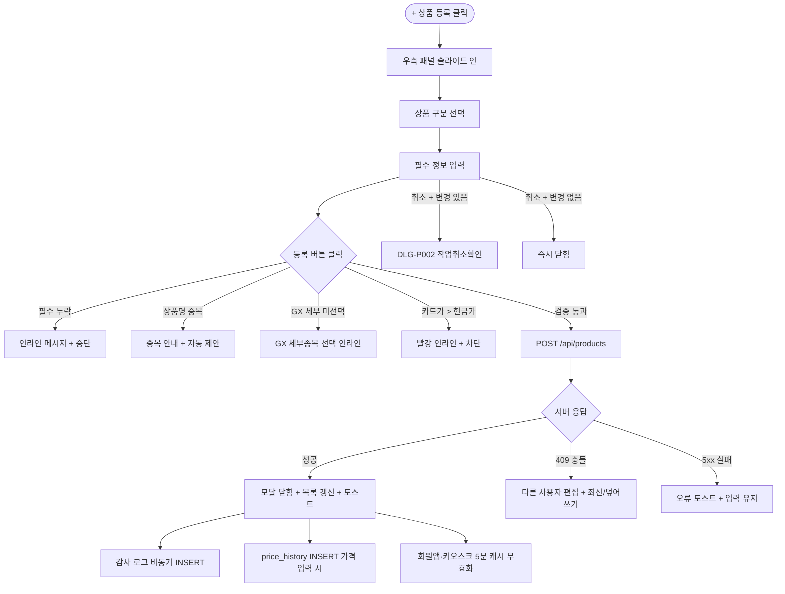

# DLG-P001 상품 등록 모달

## 1. 다이얼로그 메타 정보

이 문서는 상품 등록 모달에 대한 자기완결형 요구사항 정의서입니다. 다른 문서를 함께 보지 않아도 이 문서 한 장만으로 모달의 모든 입력, 모든 검증, 모든 권한, 모든 예외 처리, 그리고 이 다이얼로그를 지탱하는 운영 정책까지 전부 이해하고 구현할 수 있도록 작성합니다.

| 항목 | 값 |
|---|---|
| 작성일 | 2026-05-22 |
| 버전 | v1.0 |
| 상태 | 최신 통합본 반영 (정합화 완료) |
| 도메인 | D05 상품관리 |
| 다이얼로그 ID | DLG-P001 상품등록모달 |
| 다이얼로그명 | 상품 빠른 등록 모달 |
| 다이얼로그 유형 | 우측 슬라이드 패널 (Slide-In Panel) / 단독 화면 |
| 라우트 (URL) | SCR-P001 상품관리 내부 패널 또는 `/products/new` 직접 경로 |
| 우선순위 | P0 (출시 필수) |
| 기능코드 | PRD-01, PRD-EXT-01 |
| 계약코드 | PRD-01, PRD-EXT-01 |
| 호출 화면 | SCR-P001 상품관리, SCR-P002 상품등록수정 |
| 호출 트리거 | SCR-P001 헤더의 "+ 상품 등록" 버튼 클릭, `/products/new` 직접 URL 진입 |

## 2. 다이얼로그 개요와 목적

상품 등록 모달은 상품 목록 화면(SCR-P001)을 벗어나지 않고 빠르게 새 상품을 등록할 수 있는 모달형 패널입니다. SCR-P001에서는 우측 슬라이드 패널로 열리고, 직접 경로(`/products/new`)에서는 동일한 등록 폼이 단독 화면으로 표시됩니다. 등록 버튼을 누르면 Supabase `products` 테이블에 실제 상품 원장이 생성되고 목록이 갱신됩니다.

이 모달은 가장 일반적인 신규 상품 등록 흐름을 담당하며, 회원권·PT·GX·락커·실물 상품의 네 가지 상품 구분 중 하나를 선택하고 필수 정보를 입력하면 즉시 저장됩니다. 더 상세한 옵션(요일·시간·옵션·패키지·이미지·지점 운영 정책)은 SCR-P002 상품 등록/수정 화면의 책임이고, 이 모달은 빠른 진입을 위한 최소 입력 폼 역할입니다.

## 3. 호출 트리거와 진입 경로

SCR-P001 상품 관리 화면에서 헤더 우측의 "+ 상품 등록" 버튼을 클릭하면 우측에서 슬라이드 인으로 열립니다. 상품 편집 권한이 있는 계정에서만 버튼이 표시되며, 권한이 없는 계정에서는 버튼 자체가 숨겨져 모달 호출이 불가능합니다.

직접 URL 경로(`/products/new`)로 진입하면 동일한 폼이 단독 화면으로 표시됩니다. 외부 도구나 북마크로 공유받은 등록 화면 링크에서 사용됩니다.

본사 슈퍼관리자가 통합 모드에서 등록을 시도하면 "지점을 먼저 선택해주세요" 안내가 표시되고 지점 선택 드롭다운이 강조됩니다.

## 4. 레이아웃과 UI 구성

가장 위에는 모달 헤더가 있고 "상품 등록"이라는 제목과 우측 닫기(X) 버튼이 표시됩니다.

헤더 아래에는 상품 구분 라디오 버튼이 있습니다. 레슨·이용·락커·판매 네 가지 중 하나를 선택하며, 선택에 따라 하위 입력이 동적으로 변경됩니다.

상품 구분 아래에는 기본 정보 입력 영역이 있습니다. 항목과 필수 여부는 다음과 같습니다.

| 항목 | 필수 여부 | 설명 |
|------|-----------|------|
| 상품 구분 | 필수 | 레슨 / 이용 / 락커 / 판매 중 선택 |
| 상품명 | 필수 | 동일 지점 + 동일 대분류 내 중복 불가, 1~50자 |
| 현금가 | 필수 | 0보다 큰 숫자, 천 단위 콤마 자동 표시 |
| 카드가 | 선택 | 미입력 시 현금가와 동일 저장, 현금가 이상은 차단 |
| 상품그룹 | 선택 | SCR-P001 분류 관리 탭에서 등록한 활성 그룹 중 선택 |
| 이용 기간 | 조건부 | 기간제 상품 선택 시 표시 (일 단위) |
| 이용 횟수 | 조건부 | 횟수제 상품 선택 시 표시 |
| GX 세부종목 | 조건부 | 레슨 > GX 선택 시 6종 중 필수 |
| 요일·시간 | 선택 | 이용 가능 요일과 시작/종료 시간 |
| 주요 옵션 | 선택 | 시설 이용·예약 가능·양도·키오스크 판매·회원 직접 휴회 |
| 활성 상태 | 선택 | 기본값: 활성 |

폼 가장 아래에는 액션 버튼이 있습니다. 좌측에 "취소" 버튼, 우측에 "등록" 버튼이 배치됩니다.

상품 구분이 GX인 경우 GX 세부종목 드롭다운이 표시되며 요가·필라테스·스피닝·줌바·에어로빅·GX 기타 6종 중 필수 선택입니다. 미선택 시 등록 버튼이 비활성화됩니다.

## 5. 입력 검증과 저장 규칙

입력 검증은 다음과 같이 처리됩니다.

상품명은 비어 있으면 "상품명을 입력해주세요" 인라인 메시지가 표시되고 등록 버튼이 비활성화됩니다. 입력 후 포커스 아웃 시점에 비동기 중복 검증이 트리거되며, 동일 지점 + 동일 대분류에서 중복이 감지되면 "이미 등록된 상품명입니다" 메시지와 자동 제안(원본명 + " (2)")이 안내됩니다.

현금가는 0 이하 또는 빈 값이면 "0보다 큰 금액을 입력해주세요" 인라인 차단입니다.

카드가는 미입력 시 현금가와 동일하게 저장됩니다. 카드가가 현금가보다 작으면 노랑 경고(카드 결제 우대), 카드가가 현금가보다 크면 빨강 인라인 + 저장 차단입니다.

상품그룹은 SCR-P001 분류 관리 탭에서 등록한 활성 그룹만 드롭다운에 표시됩니다. 비활성 그룹은 회색으로 표시되며 선택 시 "비활성 그룹은 신규 등록에 사용할 수 없습니다" 안내가 표시됩니다.

GX 세부종목은 상품 구분이 레슨이고 대분류가 GX일 때 6종(요가·필라테스·스피닝·줌바·에어로빅·GX 기타) 중 필수입니다. 미선택 시 등록 버튼이 비활성화되고 "GX 세부종목을 선택해 주세요" 안내가 표시됩니다.

저장 규칙은 Supabase 매핑 표를 따릅니다.

| 항목 | 저장 위치 | 설명 |
|------|----------|------|
| 지점 | `products.branchId` | 현재 선택된 지점 기준 |
| 상품명 | `products.name` | 동일 지점 + 동일 대분류에서 중복 차단 |
| 구분 | `products.category`, `products.productType` | 레슨=PT/GX/LESSON, 이용=MEMBERSHIP, 락커=PRODUCT/RENTAL, 판매=PRODUCT/GENERAL |
| 상품그룹 | `products.productGroupId` | 선택한 `product_groups.id` 저장, 자동 추론 없음 |
| 가격 | `price`, `cashPrice`, `cardPrice` | `price`는 현금가 기준 |
| 기간/횟수 | `duration`, `sessions`, `totalCount` | 조건부 입력값에 따라 저장 |
| 옵션 | `usage_restrictions` JSON 및 boolean 컬럼 | 요일·시간·시설·예약·휴회·양도·키오스크 |

가격 변경이 있으면 `price_history`에 자동 INSERT 되며, 등록 이벤트는 감사 로그(SCR-097)에 비동기 기록됩니다.

## 6. 주요 UX 흐름

1. 사용자가 SCR-P001에서 "+ 상품 등록" 버튼을 클릭하면 우측 패널이 슬라이드 인으로 열립니다.
2. 상품 구분 라디오를 선택하면 관련 입력 항목이 동적으로 표시됩니다.
3. 상품명·현금가 등 필수 항목을 입력합니다. 상품그룹과 이미지·요일·시간·옵션은 선택입니다.
4. "등록" 버튼을 클릭합니다.
   - 필수 입력 누락 시 인라인 메시지 표시 후 중단됩니다.
   - 동일 이름의 상품이 존재하면 중복 안내와 자동 제안이 표시되고 중단됩니다.
   - 정상 등록 시 Supabase INSERT가 성공하면 모달 또는 패널이 닫히고 목록이 갱신되며 완료 토스트가 표시됩니다.
   - 저장 실패 시 입력값이 유지되고 오류 토스트가 표시됩니다.
5. "취소" 버튼 또는 모달 외부 클릭 시 변경 사항이 있으면 DLG-P002 작업취소확인이 호출되고, 없으면 즉시 닫힙니다.

## 7. 화면 상태와 예외 처리

기본 표시 상태에서는 빈 폼이 렌더링되고 등록 버튼이 비활성 상태(필수 입력 미완)입니다.

입력/수정 중 상태에서는 필수값 누락·형식 오류·권한 제한을 인라인 메시지로 즉시 표시합니다.

저장 중 상태에서는 등록 버튼이 로딩 스피너로 전환되고 모든 입력이 비활성화되어 더블클릭이 차단됩니다.

저장 실패 상태에서는 빨강 토스트가 뜨고 입력값은 그대로 유지되어 운영자가 수정 후 다시 시도할 수 있습니다.

권한 부족 상태에서는 모달 자체가 호출되지 않습니다. SCR-P001에서 버튼이 숨겨지므로 모달 진입 자체가 차단되며, 직접 URL로 진입한 경우 읽기 전용 모드로 표시됩니다.

본사 통합 모드 + 등록 시도 상태에서는 "지점을 먼저 선택해주세요" 안내가 표시되고 지점 선택 드롭다운이 강조됩니다.

예외 케이스별 처리는 다음과 같습니다. 상품명 중복은 인라인 메시지 + 자동 제안 + 저장 차단입니다. 현금가 0 이하는 인라인 "0보다 큰 금액" + 저장 차단, 카드가 > 현금가는 인라인 "카드가는 현금가 이상일 수 없어요" + 저장 차단입니다. GX 세부종목 미선택은 빨강 인라인 + 6종 드롭다운 강조 + 저장 차단, 비활성 그룹 선택 시도는 "비활성 그룹은 신규 등록 불가" 안내가 표시됩니다. 동시 수정 충돌은 낙관적 락(`updated_at` 비교)으로 감지되어 "다른 사용자가 동시에 편집했어요" 안내와 함께 최신 정보 보기 또는 덮어쓰기를 선택합니다. 변경 사항이 있는 상태에서 닫기는 DLG-P002 작업취소확인을 호출합니다. 본사 통합 모드 + 등록 시도는 "지점을 먼저 선택해주세요" + 지점 선택 강조입니다.

## 8. 권한별 처리

상품 편집 권한이 있는 계정(슈퍼관리자·센터장·매니저·상품 편집 권한자)에서만 SCR-P001의 "+ 상품 등록" 버튼이 표시되어 모달 진입이 가능합니다. 일반 직원·FC·트레이너·readonly에서는 버튼 자체가 숨겨지고 직접 URL 진입 시 읽기 전용 또는 접근 제한 화면이 표시됩니다.

권한이 부족한 경우 모달 진입이 차단되며, 직접 URL 우회로 모달까지 도달한 경우 백엔드 응답이 403으로 처리되어 "권한이 없어요" 토스트가 표시됩니다. 모든 권한 차단 이벤트는 감사 로그에 기록됩니다.

## 9. 메인 흐름

## 10. 운영 정책 (이 다이얼로그에 연결된 부분)

상품명 중복 차단 정책은 동일 지점 + 동일 대분류에서 중복이 발견되면 자동 제안(원본명 + " (2)")이 안내된다는 것입니다. 1~50자, 특수문자 일부 허용, 이모지 차단입니다.

GX 세부종목 필수 정책은 `category=GX` 상품에 6종 중 하나를 반드시 선택해야 한다는 것입니다. 시스템 고정 6종(요가·필라테스·스피닝·줌바·에어로빅·GX 기타) 외 추가는 슈퍼관리자만 시스템 코드로 가능합니다.

카드가 정책은 미입력 시 현금가와 동일하게 저장되고, 카드가 < 현금가는 허용(노랑 경고), 카드가 > 현금가는 차단입니다.

상품그룹 정책은 사용자 명시 선택을 그대로 저장한다는 것입니다. 자동 추론으로 고정하지 않으며 비활성 그룹은 신규 등록 시 선택이 차단됩니다.

지점 컨텍스트 정책은 본사 통합 모드에서 지점을 먼저 선택해야 등록이 가능하다는 것입니다. 통합 모드에서 등록 시도는 차단됩니다.

빠른 등록 vs 상세 등록 분리 정책은 이 모달이 최소 필수 입력만 받는 빠른 등록을 담당하고, 더 상세한 옵션(지점 운영 정책·요일·시간·옵션·패키지·이미지)은 SCR-P002 상품 등록/수정 화면이 담당한다는 것입니다. 빠른 등록 후 수정 모드에서 상세 옵션을 추가할 수 있습니다.

작업 취소 보호 정책은 변경 사항이 있는 상태에서 닫기 시 DLG-P002 작업취소확인이 호출되어 의도하지 않은 손실을 방지한다는 것입니다.

권한 정책은 상품 편집 권한이 있는 계정(슈퍼관리자·센터장·매니저·상품 편집 권한자)만 모달에 진입 가능하다는 것입니다.

저장 트랜잭션 정책은 상품 등록과 가격 이력 INSERT가 같은 트랜잭션 안에서 일어나 가격 변경과 이력 기록이 항상 일관되게 처리됩니다.

감사 로그 정책은 등록 이벤트가 SCR-097에 비동기로 INSERT 된다는 것입니다. `actor_id, product_id, action='CREATE', after`가 기록됩니다.

회원앱·키오스크 동기화 정책은 등록 후 5분 이내에 캐시가 무효화되어 회원앱과 키오스크에서 새 상품이 노출된다는 것입니다.

이상의 모든 정책은 이 다이얼로그를 구현하고 운영하는 사람이 별도 문서 없이 이 한 장만 보면 이해할 수 있도록 풀어 적었습니다.
