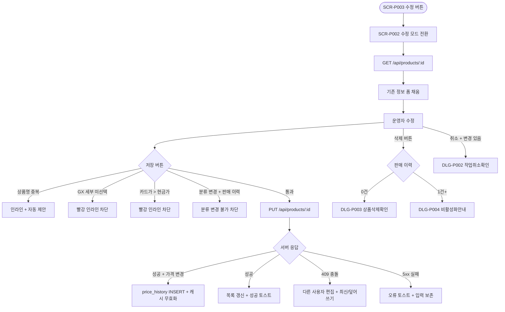

# DLG-P002 상품 수정 모달

## 1. 다이얼로그 메타 정보

이 문서는 상품 수정 모달에 대한 자기완결형 요구사항 정의서입니다.

| 항목 | 값 |
|---|---|
| 작성일 | 2026-05-22 |
| 버전 | v1.0 |
| 상태 | 최신 통합본 반영 (정합화 완료) |
| 도메인 | D05 상품관리 |
| 다이얼로그 ID | DLG-P002 상품수정모달 |
| 다이얼로그명 | 상품 수정 모달 |
| 다이얼로그 유형 | 우측 슬라이드 패널 (Slide-In Panel) / 단독 화면 |
| 우선순위 | P0 (출시 필수) |
| 기능코드 | PRD-EXT-01 |
| 계약코드 | PRD-EXT-01 |
| 호출 화면 | SCR-P001 상품관리, SCR-P003 상품상세패널, SCR-P002 상품등록수정 |
| 호출 트리거 | SCR-P003 상세 패널의 "수정" 버튼, `/products/edit/:id` 직접 URL |

## 2. 다이얼로그 개요와 목적

상품 수정 모달은 기존 상품의 정보를 수정하는 모달형 패널입니다. SCR-P003 상품 상세 패널에서 "수정" 버튼을 누르거나 `/products/edit/:id` 직접 경로로 진입하면 SCR-P002 상품 등록/수정 화면이 수정 모드로 열리며, 그 안의 모든 입력이 기존 값으로 채워진 상태로 표시됩니다. DLG-P001 상품등록모달과 동일한 폼 구조를 사용하지만 수정 대상 상품의 ID와 기존 값이 미리 로드된다는 점이 다릅니다.

이 모달은 가격 변경(인상·인하), 옵션 추가(홀딩·양도·키오스크 노출 변경), 운영 정책 구분 변경, 이미지 갱신, 패키지 구성 수정 같은 모든 수정 작업의 단일 진입점 역할을 합니다. 가격이 변경되면 `price_history`에 자동 기록되고, 카탈로그·키오스크·결제 화면이 5분 캐시 무효화로 즉시 갱신됩니다.

## 3. 호출 트리거와 진입 경로

SCR-P003 상품 상세 패널의 액션 영역에서 "수정" 버튼을 클릭하면 호출됩니다. 이 버튼은 상품 편집 권한이 있는 계정에서만 보이며 권한이 없는 계정에서는 숨겨집니다.

`/products/edit/:id` 직접 URL로 진입하면 그 ID의 상품 수정 모드가 단독 화면으로 표시됩니다. 외부 도구나 북마크에서 공유받은 수정 화면 링크에 사용됩니다.

`GET /api/products/:id`로 기존 정보를 로드한 후 폼이 채워진 상태로 표시되며, 수정 모드 헤더가 "상품 수정" + 활성/비활성 배지로 표시되어 등록 모드와 시각적으로 구분됩니다.

## 4. 레이아웃과 UI 구성

레이아웃은 DLG-P001 상품등록모달과 동일하지만 헤더가 "상품 수정"이고 활성/비활성 배지가 함께 표시됩니다. 모든 입력 필드는 기존 값이 채워진 상태로 렌더링됩니다.

저장 버튼은 "저장"으로 표시되며, 좌측에 빨강 톤의 "삭제" 버튼이 추가로 노출됩니다. 일반 직원이나 매니저(삭제 권한 없음)에게는 삭제 버튼이 숨겨집니다.

폼 내부 구조는 SCR-P002 상품 등록/수정 페이지 문서를 따르며, 상품 구분·기본 정보·지점 운영 정책·요일·시간·옵션·패키지·이미지의 7개 영역으로 구성됩니다. 자세한 입력 항목과 검증은 SCR-P002 문서에서 자기완결로 정의되며, 이 모달은 그 화면이 수정 모드로 임베드된 형태입니다.

수정 모드에서는 판매 이력이 있는 상품의 대분류(category) 변경이 차단되며 시도 시 "판매 이력이 있는 상품은 분류 변경이 불가능합니다" 안내가 표시됩니다.

## 5. 입력 검증과 저장 규칙

상품명 변경 시 동일 지점 + 동일 대분류 중복 검증이 비동기로 실행됩니다. 중복 발견 시 인라인 메시지와 자동 제안이 안내됩니다.

가격 변경 시 카드가 검증(카드가 ≤ 현금가) 규칙이 적용됩니다.

GX 세부종목, 기간·횟수, 요일·시간, 옵션, 패키지 검증은 DLG-P001 상품등록모달과 동일한 규칙입니다.

저장 시 `PUT /api/products/:id`가 호출되어 UPDATE 처리됩니다. 가격이 변경되면 `price_history`에 INSERT가 자동으로 일어나고, 메인 저장과 같은 트랜잭션 안에서 처리됩니다.

동시 수정 충돌은 낙관적 락(`updated_at` 비교)으로 감지되며 다른 사용자가 먼저 저장했으면 "다른 사용자가 동시에 편집했어요" 안내와 함께 최신 정보 보기 또는 덮어쓰기를 선택합니다.

이미지·패키지 매핑은 분리 저장 트랜잭션으로 메인 저장 후 비동기로 처리됩니다. 메인 저장만 성공해도 수정 완료로 간주되며 부가 처리 실패 시 부분 성공 토스트가 표시됩니다.

## 6. 주요 UX 흐름

1. 운영자가 SCR-P003 상세 패널의 "수정" 버튼을 클릭하면 SCR-P002 폼이 수정 모드로 전환됩니다.
2. 기존 정보가 모든 필드에 채워진 상태로 표시되고 헤더가 "상품 수정" + 활성/비활성 배지로 표시됩니다.
3. 필요한 항목을 수정합니다. dirty 감지가 자동으로 일어나며 변경 사항이 있는 입력은 시각적으로 강조될 수 있습니다.
4. "저장" 버튼을 클릭합니다.
   - 검증 실패 시 인라인 메시지 표시 후 중단됩니다.
   - 검증 통과 시 `PUT /api/products/:id`가 호출되고 가격 변경 시 `price_history` INSERT가 트랜잭션 안에서 일어납니다.
   - 성공 시 모달이 닫히고 SCR-P001 목록이 갱신되며 "상품이 수정되었어요" 토스트가 표시됩니다.
5. "취소" 또는 닫기(X) 클릭 시 변경 사항이 있으면 DLG-P002 작업취소확인이 호출됩니다.
6. "삭제" 버튼은 누적 판매 이력에 따라 DLG-P003 상품삭제확인 또는 DLG-P004 비활성화안내로 분기됩니다.

## 7. 화면 상태와 예외 처리

수정 모드 상태는 기존 정보가 채워진 폼으로 헤더가 "상품 수정", 저장 버튼이 "저장"으로 표시됩니다.

저장 중 상태는 저장 버튼이 로딩 상태로 전환되고 모든 입력이 비활성화됩니다.

동시 수정 충돌 상태는 다른 사용자가 먼저 저장한 경우로 "다른 사용자가 동시에 편집했어요" + 최신 정보 보기/덮어쓰기 선택지가 표시됩니다.

분류 변경 차단 상태는 판매 이력이 있는 상품의 대분류 변경 시도 시 차단 메시지가 표시되는 상태입니다.

권한 부족 상태는 직접 URL 진입 시 입력이 모두 비활성화되고 저장·삭제 버튼이 숨겨지는 읽기 전용 모드입니다.

예외 케이스별 처리는 DLG-P001 상품등록모달과 유사하며, 추가로 수정 모드 특유의 예외가 있습니다. 분류 변경 + 판매 이력 있음은 "분류 변경 불가" + 차단입니다. 동시 수정 충돌(409)은 낙관적 락으로 감지되어 "다른 사용자 편집" + 최신/덮어쓰기 선택지가 제공됩니다. 변경 사항 + 닫기는 DLG-P002 작업취소확인이 호출됩니다. 권한 없음 + 직접 URL은 읽기 전용 모드 + 저장·삭제 버튼 숨김입니다.

## 8. 권한별 처리

상품 편집 권한이 있는 계정(슈퍼관리자·센터장·매니저·상품 편집 권한자)만 모달 진입이 가능합니다. 일반 직원·FC·readonly에서는 SCR-P003의 수정 버튼이 숨겨지고 직접 URL 진입 시 읽기 전용 모드가 표시됩니다.

삭제 권한은 슈퍼관리자·센터장에 한정되어 매니저는 수정만 가능하고 삭제 버튼이 보이지 않습니다.

본사 정의 상품의 지점 수정 시도는 차단되며 "본사 정의 상품은 지점에서 수정할 수 없습니다" 안내가 표시됩니다(향후 정책에 따라 일부 필드만 허용).

## 9. 메인 흐름

## 10. 운영 정책 (이 다이얼로그에 연결된 부분)

수정 모드 진입 정책은 SCR-P003 상세 패널의 "수정" 버튼 또는 `/products/edit/:id` 직접 URL이며 상품 편집 권한이 있는 계정만 가능합니다.

가격 변경 자동 기록 정책은 가격이 변경되면 `price_history`에 자동 INSERT 되고 메인 저장과 같은 트랜잭션 안에서 처리되어 가격 변경과 이력 기록이 항상 일관됩니다.

분류 변경 차단 정책은 판매 이력이 있는 상품의 대분류 변경을 차단하여 분류 정합성을 보호합니다.

동시 수정 충돌 정책은 낙관적 락(`updated_at` 비교)으로 감지되며 운영자가 최신 정보 보기 또는 덮어쓰기를 선택할 수 있습니다.

회원앱·키오스크 동기화 정책은 수정 후 5분 캐시 무효화로 모든 채널에 즉시 반영된다는 것입니다. 가격·옵션·이미지 변경 시 카탈로그·결제 화면이 자동 갱신됩니다.

분리 저장 트랜잭션 정책은 이미지·패키지·할인 매핑이 메인 저장 후 비동기로 처리되어 메인 저장만 성공해도 수정 완료로 간주된다는 것입니다.

감사 로그 정책은 수정 이벤트가 SCR-097에 비동기로 INSERT 된다는 것입니다. `actor_id, product_id, action='UPDATE', before, after`가 기록됩니다.

이상의 모든 정책은 이 다이얼로그를 구현하고 운영하는 사람이 별도 문서 없이 이 한 장만 보면 이해할 수 있도록 풀어 적었습니다.
