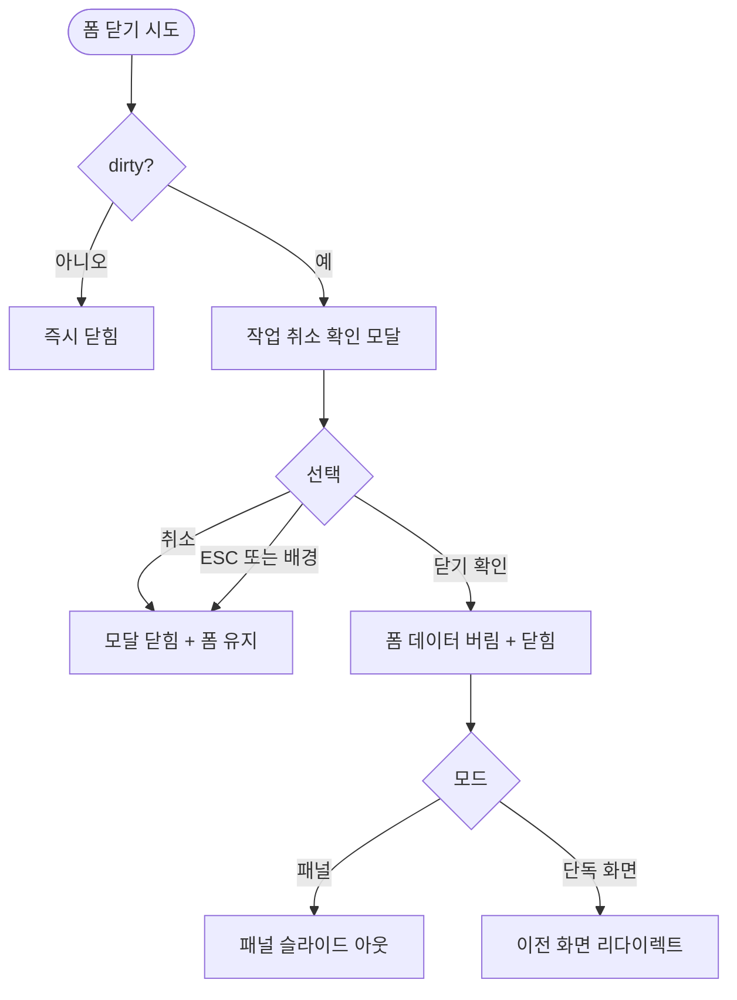

# DLG-P002 작업 취소 확인 모달

## 1. 다이얼로그 메타 정보

이 문서는 작업 취소 확인 모달에 대한 자기완결형 요구사항 정의서입니다.

| 항목 | 값 |
|---|---|
| 작성일 | 2026-05-22 |
| 버전 | v1.0 |
| 상태 | 최신 통합본 반영 (정합화 완료) |
| 도메인 | D05 상품관리 |
| 다이얼로그 ID | DLG-P002 작업취소확인 |
| 다이얼로그명 | 작업 취소 확인 |
| 다이얼로그 유형 | 중앙 알림 모달 (Center Alert Modal) |
| 우선순위 | P0 (출시 필수 - 운영 안전성) |
| 기능코드 | PRD-EXT-01 |
| 계약코드 | PRD-EXT-01 |
| 호출 화면 | SCR-P002 상품등록수정, SCR-P001 상품관리 (패널 모드) |
| 호출 트리거 | 변경 사항이 있는 상태에서 닫기·취소·다른 행 클릭·외부 영역 클릭 |

## 2. 다이얼로그 개요와 목적

작업 취소 확인 모달은 사용자가 폼에 입력한 변경 사항이 있는 상태에서 폼을 닫으려고 할 때 의도하지 않은 손실을 방지하기 위한 안전 장치입니다. 변경 사항이 없으면 모달이 호출되지 않고 즉시 닫히지만, 입력값이 한 개라도 dirty 상태이면 모달이 한 번 떠서 "정말 닫으시겠어요?"를 묻습니다.

이 모달은 작은 차단형 안내이며 운영자의 실수를 방지하는 핵심 가드 역할을 합니다. 모든 입력 폼(상품 등록·수정·이미지 업로드·패키지 구성·할인 등록·시즌 등록 등)에서 동일한 동작 패턴으로 사용됩니다.

## 3. 호출 트리거와 진입 경로

호출 트리거는 다음 네 가지 상황입니다.

1. 폼에 변경 사항이 있는 상태에서 "취소" 버튼 클릭
2. 패널 모드에서 닫기(X) 버튼 클릭
3. 모달 외부 영역 클릭(배경 클릭으로 닫기 시도)
4. SCR-P001에서 패널이 수정 모드로 열린 상태에서 다른 상품 행 클릭

ESC 키도 같은 트리거로 동작합니다.

dirty 비교는 초기 로드값과 현재값의 deep equal로 판정됩니다. 사용자가 값을 입력했다가 동일한 값으로 되돌리면 dirty가 아닌 것으로 간주되어 모달이 호출되지 않습니다.

## 4. 레이아웃과 UI 구성

모달은 화면 중앙에 작은 크기로 표시되며 배경은 어둡게 처리됩니다.

모달 상단에는 "변경 사항이 저장되지 않았어요"라는 제목이 표시되고, 본문에는 "정말 닫으시겠어요? 입력하신 내용이 모두 사라집니다"라는 안내가 들어갑니다.

하단에는 두 개의 버튼이 있습니다. 좌측은 "취소" 버튼(작업 취소 모달을 닫고 폼으로 복귀), 우측은 "닫기" 또는 "확인" 버튼(폼을 변경 사항을 버리고 닫음)입니다. 위험한 행동인 "닫기"가 우측에 위치하고 좌측 취소가 기본 포커스를 받아 ESC 키로 빠르게 폼 복귀가 가능합니다.

## 5. 입력 검증과 저장 규칙

이 모달은 입력이 없는 단순 확인 모달이므로 검증 규칙이 없습니다. 확인 또는 취소 두 선택지만 받습니다.

확인을 누르면 부모 폼의 입력 데이터를 모두 버리고 폼이 닫힙니다. 패널 모드에서는 패널이 슬라이드 아웃되고, 단독 화면 모드에서는 이전 화면(SCR-P001)으로 리다이렉트됩니다.

취소를 누르면 모달만 사라지고 폼은 그대로 유지됩니다. 입력값은 그대로 보존됩니다.

ESC 키 또는 배경 클릭은 취소와 동일한 동작입니다.

## 6. 주요 UX 흐름

1. 사용자가 폼에 값을 입력한 상태에서 닫기·취소·외부 클릭 시도
2. 시스템이 dirty 상태를 감지하고 작업 취소 확인 모달을 호출
3. 사용자가 "취소"를 선택하면 모달이 닫히고 폼이 그대로 유지됨
4. 사용자가 "닫기"를 선택하면 폼의 변경 사항이 버려지고 폼이 닫힘 또는 이전 화면으로 복귀
5. 새 폼 진입 시에는 깨끗한 상태로 시작

## 7. 화면 상태와 예외 처리

모달이 호출된 상태는 폼이 어둡게 처리되고 모달이 중앙에 떠 있는 상태입니다. 폼의 입력은 비활성화되어 모달에서 선택이 나올 때까지 추가 입력이 불가능합니다.

dirty 미감지 상태(변경 사항 없음)에서는 모달이 호출되지 않고 즉시 폼이 닫힙니다.

다른 행 클릭 + 조회 모드(SCR-P003 상세 패널)는 변경 사항이 없는 조회 모드이므로 확인 없이 즉시 전환되며 이 모달은 호출되지 않습니다.

저장 직전에 닫기 시도는 dirty 상태로 판정되어 모달이 호출되며, 저장 진행 중에는 닫기 자체가 비활성화됩니다.

예외 케이스별 처리는 다음과 같습니다. dirty 미감지 시에는 즉시 닫힘으로 처리됩니다. 모달 도중 외부 클릭은 모달 자체가 닫히지 않도록 처리됩니다(모달 안에서만 선택 가능). 저장 진행 중 닫기 시도는 저장 완료까지 차단됩니다.

## 8. 권한별 처리

이 모달은 모든 권한자에게 동일하게 표시됩니다. 권한과 무관하게 폼 입력이 있으면 호출됩니다.

## 9. 메인 흐름

## 10. 운영 정책 (이 다이얼로그에 연결된 부분)

dirty 감지 정책은 입력값 한 개라도 초기 로드값과 다르면 dirty로 판정한다는 것입니다. deep equal 비교이므로 사용자가 입력했다가 동일 값으로 되돌리면 dirty가 아닌 것으로 간주됩니다.

확인 시 데이터 버림 정책은 사용자가 명시적으로 "닫기"를 선택해야만 변경 사항이 버려진다는 것입니다. 우발적 닫기를 방지하기 위해 ESC와 배경 클릭은 취소와 동일하게 처리됩니다.

조회 모드 예외 정책은 SCR-P003 상품 상세 패널 같은 조회 모드에서는 변경 사항이 없으므로 이 모달이 호출되지 않고 즉시 전환된다는 것입니다.

저장 진행 중 차단 정책은 저장 API 호출 중에는 닫기 자체가 비활성화되어 트랜잭션이 중간에 끊기지 않도록 합니다.

표준 패턴 정책은 모든 입력 폼(상품 등록·수정·이미지·패키지·할인·시즌)에서 동일한 모달 패턴을 사용한다는 것입니다. 운영자가 어느 화면에서든 같은 안전 장치를 경험할 수 있도록 일관성을 유지합니다.

UX 안전성 정책은 위험한 행동인 "닫기"가 우측에 배치되고 좌측 취소가 기본 포커스를 받아 ESC 키로 빠르게 폼 복귀가 가능하다는 것입니다. 운영자의 실수를 시각적으로 방지합니다.

이상의 모든 정책은 이 다이얼로그를 구현하고 운영하는 사람이 별도 문서 없이 이 한 장만 보면 이해할 수 있도록 풀어 적었습니다.
