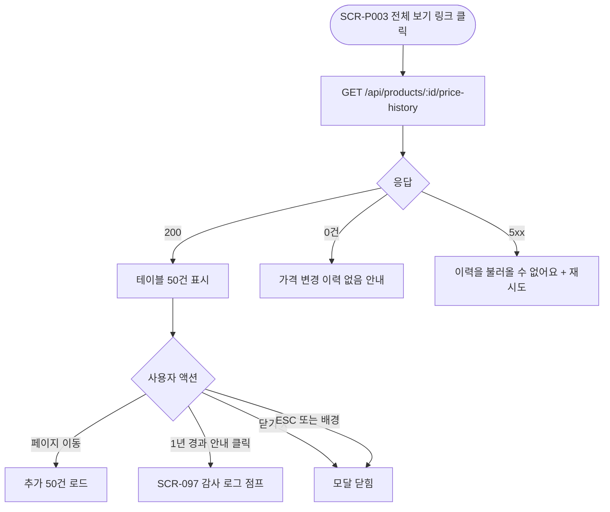

# DLG-P003 가격 이력 모달

## 1. 다이얼로그 메타 정보

이 문서는 가격 이력 모달에 대한 자기완결형 요구사항 정의서입니다.

| 항목 | 값 |
|---|---|
| 작성일 | 2026-05-22 |
| 버전 | v1.0 |
| 상태 | 최신 통합본 반영 (정합화 완료) |
| 도메인 | D05 상품관리 |
| 다이얼로그 ID | DLG-P003 가격이력 |
| 다이얼로그명 | 가격 이력 모달 |
| 다이얼로그 유형 | 중앙 모달 (Center Modal) - 조회 전용 |
| 우선순위 | P1 (출시 권장) |
| 기능코드 | PRD-EXT-01, PRD-EXT-02 |
| 계약코드 | PRD-EXT-01, PRD-EXT-02 |
| 호출 화면 | SCR-P003 상품상세패널, SCR-P002 상품등록수정 |
| 호출 트리거 | SCR-P003 상세 패널의 "가격 변경 이력" 섹션 펼침 또는 "전체 보기" 링크, SCR-P002 수정 모드의 가격 이력 보기 |

## 2. 다이얼로그 개요와 목적

가격 이력 모달은 특정 상품의 가격 변경 이력을 시간순으로 표시하는 조회 전용 모달입니다. SCR-P003 상품 상세 패널에서 가격 변경 이력 섹션은 최근 5건만 인라인으로 표시되고, 5건을 초과하는 전체 이력을 확인하려면 이 모달을 통해 페이지네이션으로 조회합니다.

이 모달은 가격 인상이나 인하의 빈도와 폭, 변경자, 변경 시점을 추적하는 운영 의사결정 지원 도구이며, 1년 경과 이력은 SCR-097 감사 로그에서 조회하도록 안내됩니다.

## 3. 호출 트리거와 진입 경로

SCR-P003 상품 상세 패널에서 "가격 변경 이력" 섹션의 "전체 보기" 링크를 클릭하면 호출됩니다. 가격 이력이 0건일 때는 링크가 비활성화되어 모달 호출이 차단됩니다.

SCR-P002 상품 등록/수정 화면의 수정 모드에서도 동일한 가격 이력 보기 액션이 가능합니다.

권한이 있는 계정만 호출 가능하며 일반 직원은 변경자 정보가 마스킹된 상태로 조회됩니다.

## 4. 레이아웃과 UI 구성

모달은 중앙 정렬된 컨테이너(최대 폭 약 700px)이며 다음 영역들로 구성됩니다.

가장 위에는 모달 헤더가 있고 "가격 변경 이력 - {상품명}"이라는 제목과 닫기(X) 버튼이 표시됩니다.

헤더 아래에는 가격 이력 테이블이 있습니다. 컬럼은 좌측부터 변경 일시(YYYY-MM-DD HH:mm), 변경 전 현금가, 변경 후 현금가, 변경 전 카드가, 변경 후 카드가, 변경자, 변경 사유(있을 경우)의 7개 컬럼입니다.

각 행은 시간순 내림차순(최신 위)으로 표시되며, 가격 상승은 빨강 화살표(▲), 하락은 녹색 화살표(▼)로 방향성을 알립니다. 변경자가 탈퇴 직원이면 "(탈퇴 직원)"으로 마스킹됩니다.

테이블 아래에는 페이지네이션이 있고 50건씩 페이지를 넘기는 컨트롤(이전·다음·페이지 번호)이 제공됩니다.

페이지 가장 아래에는 안내 메시지가 있습니다. "1년 경과 이력은 감사 로그(SCR-097)에서 조회 가능합니다"라는 회색 톤 안내가 표시됩니다.

## 5. 입력 검증과 저장 규칙

이 모달은 조회 전용이므로 입력 검증과 저장 규칙이 없습니다.

데이터는 `GET /api/products/:id/price-history`로 조회되며 페이지네이션 파라미터(page, pageSize=50)가 함께 전달됩니다.

## 6. 주요 UX 흐름

1. 운영자가 SCR-P003 상세 패널의 "전체 보기" 링크를 클릭하면 모달이 중앙에 표시됩니다.
2. 가격 변경 이력이 시간순(최신 위) 50건씩 페이지네이션으로 표시됩니다.
3. 페이지네이션 컨트롤로 추가 이력을 탐색할 수 있습니다.
4. 1년 경과 이력 안내가 있으면 SCR-097 감사 로그로 점프할 수 있는 링크가 제공됩니다.
5. 닫기(X) 또는 ESC 키 또는 배경 클릭으로 모달이 닫힙니다.

## 7. 화면 상태와 예외 처리

로딩 중 상태에서는 테이블 자리에 스켈레톤이 표시됩니다.

정상 조회 상태는 가격 이력이 1건 이상 표시되는 상태입니다.

빈 상태는 가격 이력이 0건일 때로, SCR-P003에서 "전체 보기" 링크가 비활성화되어 모달 호출 자체가 차단됩니다.

50건 초과 상태는 페이지네이션이 활성화되어 이전·다음 페이지로 탐색하는 상태입니다.

1년 경과 안내 상태는 모달 하단에 SCR-097 감사 로그 점프 안내가 표시되는 상태입니다.

예외 케이스별 처리는 다음과 같습니다. 가격 이력 0건은 SCR-P003에서 모달 호출이 차단됩니다. 50건 초과는 페이지네이션으로 처리됩니다. 변경자가 탈퇴 직원이면 "(탈퇴 직원)"으로 마스킹됩니다. 데이터 로딩 실패는 "이력을 불러올 수 없어요" + 재시도 버튼이 표시됩니다. 일반 직원 권한일 때는 변경자 정보가 마스킹됩니다.

## 8. 권한별 처리

슈퍼관리자·센터장·매니저·상품 편집 권한자는 변경자 정보가 모두 표시됩니다.

일반 직원은 가격 이력을 조회할 수 있지만 변경자가 마스킹된 상태(예: "***매니저")로 표시됩니다.

FC와 readonly는 모달 진입이 차단됩니다.

## 9. 메인 흐름

## 10. 운영 정책 (이 다이얼로그에 연결된 부분)

가격 이력 표시 형식 정책은 `2026-04-15 14:23 / 100,000원 → 110,000원 / 김매니저` 형식이며 시간순 내림차순으로 표시됩니다.

가격 이력 페이지네이션 정책은 50건씩 페이지를 넘기며, 1년 경과 이력은 SCR-097 감사 로그에서 조회한다는 것입니다.

탈퇴 직원 마스킹 정책은 변경자가 탈퇴한 경우 "(탈퇴 직원)"으로 마스킹되어 표시한다는 것입니다.

권한별 정보 노출 정책은 일반 직원에게 변경자 정보를 마스킹한다는 것입니다.

가격 상승/하락 시각화 정책은 가격 상승은 빨강 화살표(▲), 하락은 녹색 화살표(▼)로 방향성을 시각적으로 알린다는 것입니다.

조회 전용 정책은 이 모달이 변경 작업을 일으키지 않으며 조회만 가능하다는 것입니다. 가격을 변경하려면 SCR-P002 상품 등록/수정 화면을 사용해야 합니다.

이상의 모든 정책은 이 다이얼로그를 구현하고 운영하는 사람이 별도 문서 없이 이 한 장만 보면 이해할 수 있도록 풀어 적었습니다.
