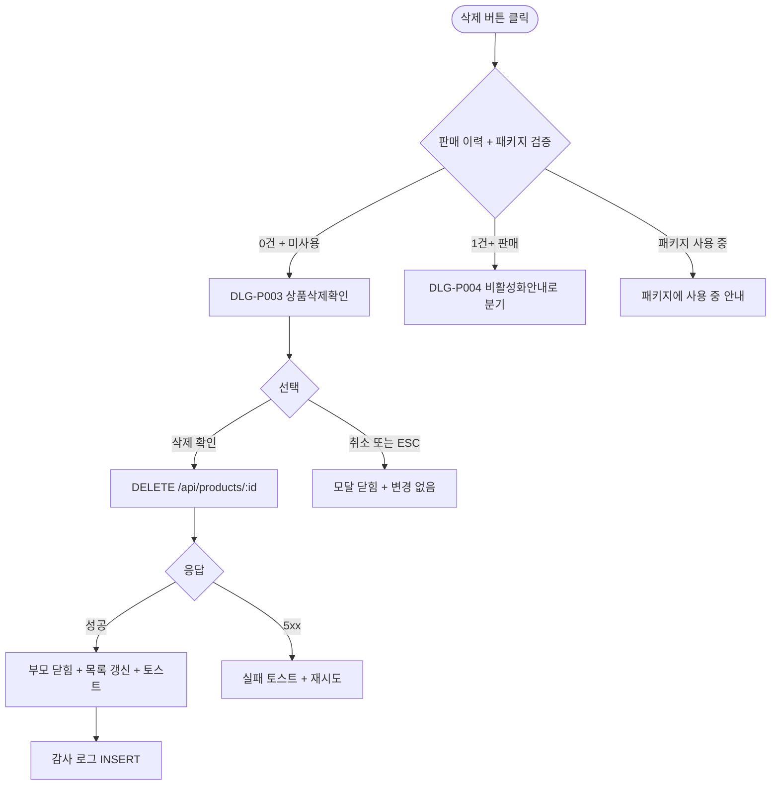

# DLG-P003 상품 삭제 확인 모달

## 1. 다이얼로그 메타 정보

| 항목 | 값 |
|---|---|
| 작성일 | 2026-05-22 |
| 버전 | v1.0 |
| 상태 | 최신 통합본 반영 (정합화 완료) |
| 도메인 | D05 상품관리 |
| 다이얼로그 ID | DLG-P003 상품삭제확인 |
| 다이얼로그명 | 상품 삭제 확인 |
| 다이얼로그 유형 | 중앙 알림 모달 (Danger Confirmation) |
| 우선순위 | P0 (출시 필수) |
| 기능코드 | PRD-EXT-01, PRD-EXT-02 |
| 계약코드 | PRD-EXT-01, PRD-EXT-02 |
| 호출 화면 | SCR-P002 상품등록수정, SCR-P003 상품상세패널 |
| 호출 트리거 | 수정 모드 또는 상세 패널에서 "삭제" 버튼 클릭 + 누적 판매 이력 0건 |

## 2. 다이얼로그 개요와 목적

상품 삭제 확인 모달은 누적 판매 이력이 0건인 상품을 완전 삭제하기 전에 최종 확인을 받는 안전 모달입니다. 판매 이력이 있는 상품은 이 모달이 아닌 DLG-P004 비활성화안내가 호출되어 미사용 전환으로 분기되므로, 이 모달은 신규 등록 후 한 번도 팔리지 않은 상품의 완전 삭제 흐름에만 사용됩니다.

이 모달은 운영자의 의도하지 않은 삭제를 방지하는 핵심 가드 역할을 하며, 확인 시 Supabase `products` 테이블에서 DELETE가 일어나고 감사 로그에 기록됩니다. 패키지 구성 상품으로 사용 중인 경우 별도 분기로 "패키지 분리 후 삭제" 안내가 표시됩니다.

## 3. 호출 트리거와 진입 경로

SCR-P003 상품 상세 패널의 "삭제" 버튼 또는 SCR-P002 상품 등록/수정 화면의 수정 모드 "삭제" 버튼을 누른 직후 시스템이 누적 판매 이력을 확인합니다. 판매 이력이 0건이고 패키지 구성 상품으로 사용 중이지 않으면 이 모달이 호출됩니다.

판매 이력이 1건 이상이면 DLG-P004 비활성화안내로 분기되고, 패키지 구성 상품으로 사용 중이면 "패키지 {개수}개에서 사용 중입니다" 안내가 별도로 표시됩니다.

권한이 없는 계정에서는 삭제 버튼이 보이지 않아 모달 호출 자체가 차단됩니다.

## 4. 레이아웃과 UI 구성

모달은 화면 중앙의 작은 크기로 표시되며 배경은 어둡게 처리됩니다.

모달 상단에는 "상품을 삭제하시겠어요?"라는 빨강 톤 제목과 위험 아이콘이 함께 표시됩니다.

본문에는 대상 상품명과 함께 "이 상품은 판매 이력이 없어 완전 삭제됩니다. 삭제하면 복구할 수 없습니다"라는 안내가 들어갑니다.

하단에는 두 개의 버튼이 있습니다. 좌측은 "취소" 버튼(모달 닫힘 + 변경 없음), 우측은 "삭제" 버튼(빨강 톤, 실제 DELETE 실행)입니다. 위험한 행동인 "삭제"가 우측에 위치하고 좌측 취소가 기본 포커스를 받습니다.

## 5. 입력 검증과 저장 규칙

이 모달은 추가 입력이 없는 단순 확인 모달입니다. 확인 또는 취소 두 선택지만 받습니다.

"삭제" 버튼 클릭 시 `DELETE /api/products/:id`가 호출되고 Supabase에서 실제 DELETE가 일어납니다. 응답 성공 시 모달이 닫히고 부모 화면(SCR-P003 패널 또는 SCR-P002 수정)이 자동으로 닫히면서 SCR-P001 목록이 갱신되고 "삭제되었습니다" 토스트가 표시됩니다.

감사 로그에는 `actor_id, product_id, action='DELETE', before`가 INSERT 됩니다.

"취소" 버튼 또는 ESC 또는 배경 클릭은 모달을 닫고 변경 없이 부모 화면으로 복귀합니다.

## 6. 주요 UX 흐름

1. 운영자가 상세 패널 또는 수정 모드에서 삭제 버튼을 클릭
2. 시스템이 누적 판매 이력 + 패키지 사용 여부 확인
3. 판매 이력 0건 + 패키지 미사용이면 이 모달 호출
4. 운영자가 "삭제" 선택 → DELETE API 호출 → 성공 시 부모 닫힘 + 목록 갱신 + 토스트
5. 운영자가 "취소" 선택 → 모달 닫힘 + 변경 없음

## 7. 화면 상태와 예외 처리

기본 표시 상태는 모달이 중앙에 표시되어 운영자의 선택을 기다리는 상태입니다.

삭제 진행 중 상태는 "삭제" 버튼이 로딩 스피너로 전환되고 모든 버튼이 비활성화된 상태입니다.

삭제 실패 상태는 5xx 응답이나 권한 부족(403) 시 모달이 닫히지 않고 빨강 토스트와 함께 안내가 표시되며 재시도가 가능합니다.

예외 케이스별 처리는 다음과 같습니다. 판매 이력 발견(다른 사용자가 동시에 결제한 경우)은 모달이 닫히고 DLG-P004 비활성화안내로 자동 전환됩니다. 패키지 사용 중 발견은 "패키지에 사용 중입니다" 안내가 표시되고 삭제가 차단됩니다. 권한 없음은 모달 호출 자체가 차단되거나 백엔드 응답 403으로 "권한이 없어요" 토스트가 표시됩니다.

## 8. 권한별 처리

삭제 권한이 있는 슈퍼관리자·Owner(지점장)·상품 편집 권한자만 부모 화면에서 삭제 버튼이 보이므로 모달 호출이 가능합니다. 매니저와 일반 직원은 삭제 버튼이 보이지 않습니다.

## 9. 메인 흐름

## 10. 운영 정책 (이 다이얼로그에 연결된 부분)

판매 이력 보호 정책은 판매 이력 0건일 때만 완전 삭제가 가능하다는 것입니다. 1건 이상은 DLG-P004 비활성화안내로 분기되어 미사용 전환으로 처리됩니다.

패키지 보호 정책은 패키지 구성 상품으로 사용 중인 상품의 삭제를 차단하고 패키지 분리 후에만 삭제 가능하다는 것입니다.

복구 불가 안내 정책은 완전 삭제는 복구할 수 없음을 모달 본문에서 명시적으로 안내한다는 것입니다.

UX 안전성 정책은 위험한 "삭제" 버튼이 우측에 빨강 톤으로 배치되고 좌측 "취소"가 기본 포커스를 받아 ESC로 빠르게 취소 가능합니다.

감사 로그 정책은 모든 삭제 이벤트가 SCR-097에 `actor_id, product_id, action='DELETE', before`로 INSERT 된다는 것입니다.

권한 정책은 슈퍼관리자·Owner(지점장)·상품 편집 권한자만 모달 진입이 가능합니다.

이상의 모든 정책은 이 다이얼로그를 구현하고 운영하는 사람이 별도 문서 없이 이 한 장만 보면 이해할 수 있도록 풀어 적었습니다.
