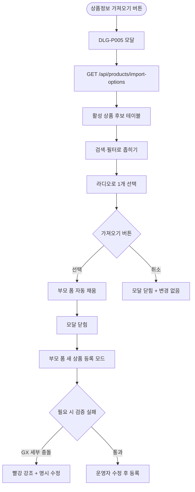

# DLG-P005 상품 가져오기 모달

## 1. 다이얼로그 메타 정보

| 항목 | 값 |
|---|---|
| 작성일 | 2026-05-22 |
| 버전 | v1.0 |
| 상태 | 최신 통합본 반영 (정합화 완료) |
| 도메인 | D05 상품관리 |
| 다이얼로그 ID | DLG-P005 상품가져오기 |
| 다이얼로그명 | 상품 정보 가져오기 모달 |
| 다이얼로그 유형 | 중앙 모달 (Search + Selection) |
| 우선순위 | P1 (출시 권장) |
| 기능코드 | PRD-EXT-01 |
| 계약코드 | PRD-EXT-01 |
| 호출 화면 | SCR-P002 상품등록수정 |
| 호출 트리거 | SCR-P002의 "상품정보 가져오기" 버튼 클릭 |

## 2. 다이얼로그 개요와 목적

상품 가져오기 모달은 기존 활성 상품의 정보를 폼에 자동으로 채워 일부만 변경한 뒤 새 상품으로 저장하는 라인업 빠른 확장 도구입니다. 헬스 1개월 회원권을 기준으로 3개월·6개월·12개월 회원권을 차례로 만들 때나, 기존 PT 패키지를 복제해 회원 수·기간만 다른 변형 상품을 만들 때 효율적인 진입점이 됩니다.

이 모달은 정보를 가져오기만 하고 실제 저장은 부모 화면(SCR-P002)에서 폼 채워진 상태로 다시 운영자가 검토·수정해 새 상품으로 등록합니다. 가져오기 후의 폼은 항상 "새 상품 등록 모드"로 동작하므로 ID는 새로 발급되고 가격 이력은 새 상품 기준으로 시작됩니다.

## 3. 호출 트리거와 진입 경로

SCR-P002 상품 등록/수정 화면(주로 등록 모드)에서 "상품정보 가져오기" 버튼을 클릭하면 호출됩니다. 수정 모드에서도 호출 가능하지만 가져오기 후에는 자동으로 새 상품 등록 모드로 전환됩니다.

권한이 있는 상품 편집 권한 보유자만 모달 진입이 가능합니다.

## 4. 레이아웃과 UI 구성

모달은 중앙 정렬된 컨테이너(최대 폭 약 800px)이며 위에서 아래로 다음 영역들로 구성됩니다.

모달 헤더에는 "상품 정보 가져오기" 제목과 닫기(X) 버튼이 표시됩니다.

본문 상단에는 검색·필터 영역이 있습니다. 검색창(상품명, 300ms 디바운스), 카테고리 필터(MEMBERSHIP/LESSON_PASS/LOCKER/WEAR/GENERAL), 상품 구분 필터(레슨/이용/락커/운동복/일반)가 가로로 배치됩니다.

검색 영역 아래에는 활성 상품 목록 테이블이 있습니다. 컬럼은 좌측부터 선택 라디오, 상품명, 대분류, 종목, 현금가, 카드가, 기간, 횟수, 등록일의 9개 컬럼입니다. 한 번에 1개 상품만 선택할 수 있습니다.

테이블 아래에는 페이지네이션이 있고 일반 동작(20/50/100, 이전·다음, 총 건수)을 제공합니다.

가장 아래에는 액션 버튼이 있습니다. 좌측 "취소" 버튼, 우측 "가져오기" 버튼이 배치되며, 선택된 상품이 없으면 "가져오기" 버튼이 비활성입니다.

## 5. 입력 검증과 저장 규칙

이 모달은 정보를 부모 폼에 전달만 하므로 직접 저장하지 않습니다. "가져오기" 버튼 클릭 시 선택된 상품의 모든 정보가 부모 폼(SCR-P002)에 자동 채움되고 모달이 닫힙니다.

가져오기 후 부모 폼은 새 상품 등록 모드로 동작하며, 운영자가 일부 값을 수정한 뒤 "등록" 버튼으로 저장하면 새 ID로 INSERT 됩니다. 가격 이력은 새 상품 기준으로 시작됩니다.

가져온 후 일부 옵션이 충돌하거나 빈값이면 부모 폼에서 빨강 강조로 사용자 명시 수정이 요구됩니다. 예를 들어 가져온 상품이 GX인데 세부종목이 빈값인 레거시 데이터인 경우 부모 폼에서 GX 세부종목 미선택 인라인이 자동으로 표시됩니다.

후보 목록 조회는 `GET /api/products/import-options`로 처리됩니다.

## 6. 주요 UX 흐름

1. SCR-P002에서 "상품정보 가져오기" 버튼 클릭으로 모달 호출
2. 검색·필터로 가져올 상품 후보 좁히기
3. 라디오로 1개 상품 선택
4. "가져오기" 버튼 클릭 → 부모 폼에 모든 정보 자동 채움 + 모달 닫힘
5. 부모 폼은 새 상품 등록 모드로 동작, 일부 값 수정 후 "등록"
6. "취소" 또는 ESC로 닫기

## 7. 화면 상태와 예외 처리

로딩 중 상태는 테이블 자리에 스켈레톤이 표시됩니다.

정상 목록 상태는 활성 상품 후보가 표시된 상태입니다.

검색 결과 없음 상태는 "검색 결과가 없습니다" 안내 + 필터 초기화 옵션입니다.

선택 안 됨 상태는 가져오기 버튼이 비활성인 상태입니다.

선택 완료 상태는 가져오기 버튼이 활성화된 상태입니다.

예외 케이스별 처리는 다음과 같습니다. 검색 결과 0건은 "검색 결과가 없습니다" + [필터 초기화]입니다. 가져오기 후 GX 세부종목 충돌은 부모 폼에서 빨강 강조 + 명시 수정 요구입니다. 데이터 로딩 실패는 "후보를 불러올 수 없어요" + 재시도입니다. 비활성 상품은 후보 목록에서 자동 제외됩니다.

## 8. 권한별 처리

상품 편집 권한이 있는 슈퍼관리자·센터장·매니저·상품 편집 권한자만 모달 진입이 가능합니다.

## 9. 메인 흐름

## 10. 운영 정책 (이 다이얼로그에 연결된 부분)

가져오기 후 새 상품 저장 정책은 자동 채움된 정보를 일부 변경해도 ID가 새로 발급되며 가격 이력이 새 상품 기준으로 시작된다는 것입니다. 이는 라인업 빠른 확장 도구로서의 본질을 유지하기 위한 정책입니다.

활성 상품만 후보 노출 정책은 비활성 상품은 후보 목록에서 자동 제외되어 단종 상품으로 복제되는 것을 방지합니다.

명시 수정 요구 정책은 가져온 정보가 충돌하거나 빈값이면 부모 폼에서 빨강 강조로 사용자 명시 수정을 요구한다는 것입니다.

빠른 라인업 확장 정책은 헬스 1/3/6/12개월 같은 시리즈 상품을 빠르게 만들 수 있도록 설계되었다는 것입니다. 옵션 일관성이 유지되어 운영자가 같은 정책을 반복 입력하지 않아도 됩니다.

권한 정책은 상품 편집 권한이 있는 계정만 모달 진입과 가져오기가 가능합니다.

이상의 모든 정책은 이 다이얼로그를 구현하고 운영하는 사람이 별도 문서 없이 이 한 장만 보면 이해할 수 있도록 풀어 적었습니다.
