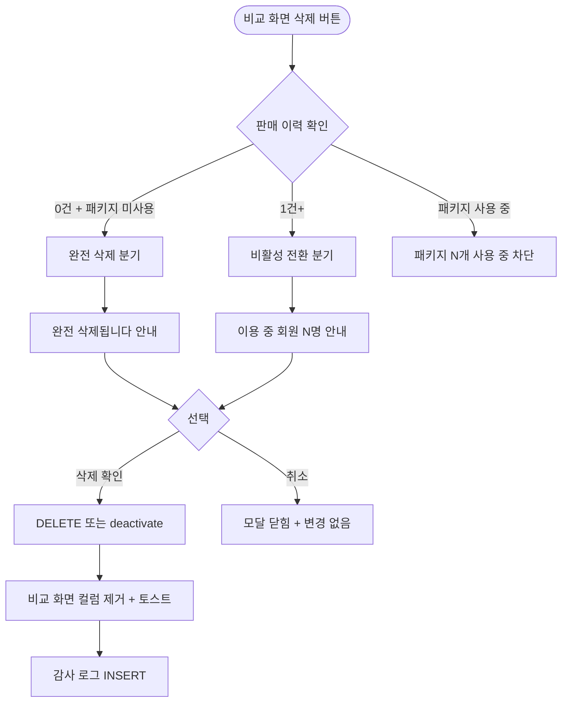

# DLG-P006 상품 삭제 확인 모달 (비교/일반 진입)

## 1. 다이얼로그 메타 정보

| 항목 | 값 |
|---|---|
| 작성일 | 2026-05-22 |
| 버전 | v1.0 |
| 상태 | 최신 통합본 반영 (정합화 완료) |
| 도메인 | D05 상품관리 |
| 다이얼로그 ID | DLG-P006 상품삭제확인 |
| 다이얼로그명 | 상품 삭제 확인 (비교 화면 진입용) |
| 다이얼로그 유형 | 중앙 알림 모달 (Danger Confirmation) |
| 우선순위 | P1 (출시 권장) |
| 기능코드 | PRD-06 |
| 계약코드 | PRD-06 |
| 호출 화면 | SCR-P006 상품비교 |
| 호출 트리거 | SCR-P006 비교 화면에서 특정 상품의 삭제 버튼 클릭 |

## 2. 다이얼로그 개요와 목적

상품 삭제 확인 모달(비교 진입용)은 SCR-P006 상품 비교 화면에서 비교 중인 상품을 시스템에서 완전 삭제하거나 비활성 전환할 때 호출되는 안전 모달입니다. DLG-P003 상품삭제확인과 동일한 동작을 하지만 비교 화면에서 호출된다는 점이 다릅니다. 누적 판매 이력에 따라 완전 삭제 또는 비활성 전환으로 자동 분기됩니다.

비교 화면에서 삭제하면 해당 컬럼이 자동으로 제거되고 "삭제됨" 토스트가 표시되며, 부모 SCR-P006 비교 화면이 갱신됩니다.

## 3. 호출 트리거와 진입 경로

SCR-P006 상품 비교 화면의 각 상품 컬럼 하단 액션 영역에서 "삭제" 버튼을 클릭하면 호출됩니다. 권한이 있는 슈퍼관리자·센터장·상품 편집 권한자에게만 삭제 버튼이 보이므로 모달 호출이 가능합니다.

매니저와 일반 직원은 비교·결제 점프·공유만 가능하고 삭제는 불가능하므로 버튼 자체가 숨겨집니다.

## 4. 레이아웃과 UI 구성

DLG-P003 상품삭제확인과 동일한 레이아웃입니다. 누적 판매 이력에 따라 다음 두 가지 분기 안내 중 하나가 표시됩니다.

판매 이력 0건 분기: "상품을 삭제하시겠어요? 이 상품은 판매 이력이 없어 완전 삭제됩니다." 빨강 톤 제목과 위험 아이콘.

판매 이력 1건 이상 분기: "이용 중 회원이 있어요. 현재 이용 중 회원 {인원수}명이 있어 완전 삭제는 불가능합니다. 미사용 상태로 전환할까요?" 주황 톤 제목.

좌측 "취소" 버튼과 우측 "삭제" 또는 "미사용 전환" 버튼이 배치됩니다.

## 5. 입력 검증과 저장 규칙

판매 이력 0건이면 `DELETE /api/products/:id`로 완전 삭제, 1건 이상이면 `POST /api/products/:id/deactivate`로 비활성 전환됩니다.

성공 시 부모 SCR-P006 비교 화면에서 해당 컬럼이 자동으로 제거되고 "삭제됨" 또는 "비활성으로 전환됨" 토스트가 표시됩니다.

감사 로그(SCR-097)에 자동 INSERT 됩니다.

## 6. 주요 UX 흐름

1. SCR-P006 비교 화면의 컬럼 액션에서 삭제 버튼 클릭
2. 시스템이 판매 이력 + 패키지 사용 여부 확인
3. 분기 안내가 포함된 모달 호출
4. "삭제" 또는 "미사용 전환" 선택 → API 호출 → 부모 화면에서 컬럼 자동 제거
5. "취소" 선택 → 모달 닫힘 + 변경 없음

## 7. 화면 상태와 예외 처리

기본 표시 상태에서는 판매 이력 분기 안내가 표시됩니다.

진행 중 상태에서는 액션 버튼이 로딩 스피너로 전환됩니다.

실패 상태에서는 빨강 토스트와 함께 재시도 안내가 표시됩니다.

예외 케이스별 처리는 패키지 사용 중 시 "패키지 N개에서 사용 중" 안내 + 차단, 권한 없음 + 직접 호출 시 403 응답으로 차단, 비활성 상품 대상 삭제 시 정상 처리(완전 삭제 또는 안내)입니다.

## 8. 권한별 처리

슈퍼관리자·센터장·상품 편집 권한자만 모달 진입과 삭제가 가능합니다. 매니저는 비활성 전환만 가능하며 비교 화면에서는 일반적으로 삭제 액션이 노출되지 않습니다.

## 9. 메인 흐름

## 10. 운영 정책 (이 다이얼로그에 연결된 부분)

비교 화면 진입 정책은 SCR-P006 상품 비교 화면에서 호출되며 DLG-P003 상품삭제확인과 동일한 분기 로직을 따른다는 것입니다.

판매 이력 분기 정책은 0건이면 완전 삭제, 1건 이상이면 비활성 전환으로 자동 분기된다는 것입니다.

비교 화면 컬럼 제거 정책은 삭제 성공 시 부모 비교 화면에서 해당 컬럼이 자동으로 제거되고 자동 하이라이트가 재계산된다는 것입니다.

권한 정책은 슈퍼관리자·센터장·상품 편집 권한자만 모달 진입이 가능하다는 것입니다.

감사 로그 정책은 삭제 또는 비활성 전환 이벤트가 SCR-097에 INSERT 된다는 것입니다.

이상의 모든 정책은 이 다이얼로그를 구현하고 운영하는 사람이 별도 문서 없이 이 한 장만 보면 이해할 수 있도록 풀어 적었습니다.
