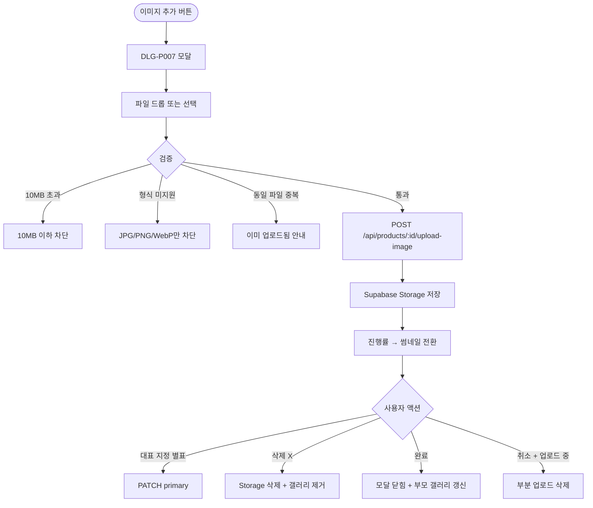

# DLG-P007 상품 이미지 업로드 모달

## 1. 다이얼로그 메타 정보

| 항목 | 값 |
|---|---|
| 작성일 | 2026-05-22 |
| 버전 | v1.0 |
| 상태 | 최신 통합본 반영 (정합화 완료) |
| 도메인 | D05 상품관리 |
| 다이얼로그 ID | DLG-P007 상품이미지업로드 |
| 다이얼로그명 | 상품 이미지 업로드 모달 |
| 다이얼로그 유형 | 중앙 모달 (File Upload) |
| 우선순위 | P1 (출시 권장) |
| 기능코드 | PRD-EXT-01, PRD-05 |
| 계약코드 | PRD-EXT-01, PRD-05 |
| 호출 화면 | SCR-P002 상품등록수정, DLG-P011 카탈로그편집 |
| 호출 트리거 | SCR-P002의 이미지 추가 버튼, DLG-P011의 이미지 첨부 액션 |

## 2. 다이얼로그 개요와 목적

상품 이미지 업로드 모달은 상품 마스터에 노출용 이미지를 첨부하는 모달입니다. 카탈로그·회원앱·키오스크에 표시될 대표 이미지와 갤러리 이미지를 다중 업로드하며, JPG/PNG/WebP 형식의 10MB 이하 파일만 허용됩니다. Supabase Storage의 `products/{branchId}/{productId}/` 경로에 저장됩니다.

이 모달은 상품 등록/수정 화면(SCR-P002)에서 이미지 추가 버튼을 누르거나 카탈로그 편집(DLG-P011)에서 카탈로그 전용 이미지 첨부 시 호출됩니다.

## 3. 호출 트리거와 진입 경로

SCR-P002 상품 등록/수정 화면의 이미지 갤러리 영역에서 "이미지 추가" 버튼(점선 박스 + "+")을 클릭하면 호출됩니다. DLG-P011 카탈로그편집의 이미지 첨부 액션에서도 호출되며, 이 경우 카탈로그 전용 이미지로 저장됩니다.

상품 편집 권한이 있는 계정만 진입 가능합니다.

## 4. 레이아웃과 UI 구성

모달은 중앙 정렬된 컨테이너(최대 폭 약 600px)이며 다음 영역들로 구성됩니다.

모달 헤더에는 "상품 이미지 업로드" 제목과 닫기(X) 버튼이 표시됩니다.

본문 상단에는 파일 드롭 영역이 있습니다. 큰 점선 박스 안에 "이미지를 끌어다 놓거나 클릭하여 선택" 안내와 클립 아이콘이 표시되며, 드래그 앤 드롭 또는 클릭으로 파일 선택 다이얼로그를 호출합니다. 다중 선택이 가능합니다.

드롭 영역 아래에는 업로드 진행 영역이 있습니다. 업로드 중인 파일마다 파일명·진행률 바·취소 버튼이 표시되며, 완료된 파일은 썸네일로 전환됩니다.

업로드 완료된 이미지는 갤러리 형태로 표시되고 각 썸네일에는 대표 지정 별표와 삭제 X 아이콘이 있어 클릭으로 대표 변경 또는 제거가 가능합니다.

본문 하단에는 안내 메시지가 있습니다. "JPG, PNG, WebP 형식, 각 파일 10MB 이하"라는 회색 톤 안내가 표시됩니다.

가장 아래에는 액션 버튼이 있습니다. 좌측 "취소" 버튼, 우측 "완료" 버튼이 배치됩니다.

## 5. 입력 검증과 저장 규칙

파일 형식 검증은 JPG/PNG/WebP만 허용되며 그 외 형식(PDF·GIF·BMP 등)은 "JPG/PNG/WebP만 가능합니다" 안내와 함께 차단됩니다.

파일 용량 검증은 10MB 이하만 허용되며 초과 시 "10MB 이하 이미지를 올려주세요" + 압축 안내가 표시됩니다.

업로드는 `POST /api/products/:id/upload-image`로 처리되어 Supabase Storage의 `products/{branchId}/{productId}/` 경로에 저장됩니다. 응답에 파일 URL이 포함되어 갤러리에 즉시 추가됩니다.

대표 이미지 변경은 `PATCH /api/products/:id/images/:imageId/primary`로 처리됩니다.

업로드 중 네트워크 오류는 자동 재시도 1회가 시도되고 그래도 실패하면 사용자 액션을 기다립니다. 진행 중 업로드를 취소하면 부분 업로드 파일은 삭제됩니다.

업로드 완료 후 "완료" 버튼을 누르면 모달이 닫히고 부모 폼(SCR-P002 또는 DLG-P011)의 갤러리가 갱신됩니다.

## 6. 주요 UX 흐름

1. SCR-P002 또는 DLG-P011의 이미지 추가 버튼 클릭으로 모달 호출
2. 드래그 앤 드롭 또는 파일 선택으로 다중 이미지 선택
3. 각 파일 형식·용량 검증 후 업로드 시작
4. 업로드 진행률이 실시간으로 표시되며 완료된 파일은 썸네일로 전환
5. 썸네일에서 대표 이미지 지정 또는 삭제
6. "완료" 클릭 → 모달 닫힘 + 부모 갤러리 갱신
7. "취소" 또는 ESC로 닫기 (업로드 중 취소 시 부분 업로드 파일 삭제)

## 7. 화면 상태와 예외 처리

대기 상태는 파일 드롭 영역만 표시되어 사용자 입력을 기다리는 상태입니다.

업로드 중 상태는 파일별 진행률 바가 실시간으로 채워지는 상태입니다.

업로드 완료 상태는 모든 파일이 썸네일로 표시된 상태입니다.

업로드 실패 상태는 빨강 인라인 메시지와 함께 재시도 옵션이 표시된 상태입니다.

예외 케이스별 처리는 다음과 같습니다. 10MB 초과 파일은 인라인 차단 + 압축 안내입니다. JPG/PNG/WebP 외 형식은 인라인 차단 + 형식 변환 안내입니다. 동일 파일 중복 업로드는 자동 감지되어 "동일 파일이 이미 업로드되었습니다" 안내가 표시됩니다. 네트워크 오류는 자동 재시도 1회 후 사용자 대기, 업로드 중 취소는 부분 업로드 파일 삭제, 권한 없음은 모달 진입 자체 차단입니다.

## 8. 권한별 처리

상품 편집 권한이 있는 슈퍼관리자·Owner(지점장)·매니저·상품 편집 권한자만 모달 진입과 업로드가 가능합니다.

## 9. 메인 흐름

## 10. 운영 정책 (이 다이얼로그에 연결된 부분)

파일 형식 정책은 JPG/PNG/WebP만 허용된다는 것입니다. GIF·PDF·BMP 같은 형식은 차단되며 형식 변환 안내가 제공됩니다.

파일 용량 정책은 각 파일 10MB 이하만 허용되며 초과 시 압축 안내가 제공된다는 것입니다.

다중 업로드 정책은 한 번에 여러 파일을 업로드할 수 있고, 첫 번째 업로드 이미지가 기본 대표 이미지가 되어 운영자가 변경 가능합니다.

Storage 경로 정책은 `products/{branchId}/{productId}/` 경로로 저장되어 지점별·상품별로 정리된다는 것입니다.

대표 이미지 정책은 카탈로그·회원앱·키오스크에서 우선 표시되는 이미지가 별표로 지정된다는 것입니다. 다른 이미지로 변경 가능합니다.

카탈로그 전용 이미지 우선 정책은 DLG-P011 카탈로그 편집에서 별도 첨부한 이미지가 있으면 상품 등록 시 이미지보다 우선 표시된다는 것입니다.

업로드 중 취소 정책은 부분 업로드 파일이 자동으로 삭제되어 Storage 정합성이 유지된다는 것입니다.

자동 재시도 정책은 네트워크 오류 시 1회 자동 재시도되고 그래도 실패하면 사용자 액션을 기다린다는 것입니다.

권한 정책은 상품 편집 권한이 있는 계정만 모달 진입과 업로드가 가능하다는 것입니다.

이상의 모든 정책은 이 다이얼로그를 구현하고 운영하는 사람이 별도 문서 없이 이 한 장만 보면 이해할 수 있도록 풀어 적었습니다.
