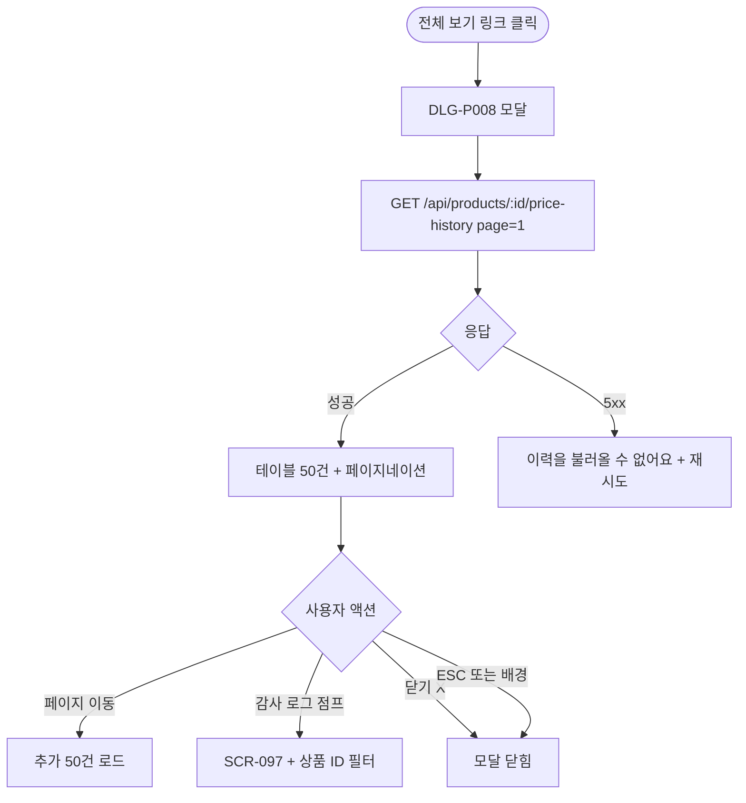

# DLG-P008 가격 이력 조회 모달

## 1. 다이얼로그 메타 정보

| 항목 | 값 |
|---|---|
| 작성일 | 2026-05-22 |
| 버전 | v1.0 |
| 상태 | 최신 통합본 반영 (정합화 완료) |
| 도메인 | D05 상품관리 |
| 다이얼로그 ID | DLG-P008 가격이력조회 |
| 다이얼로그명 | 가격 이력 조회 모달 |
| 다이얼로그 유형 | 중앙 모달 (Read-Only Table + Pagination) |
| 우선순위 | P1 (출시 권장) |
| 기능코드 | PRD-EXT-02 |
| 계약코드 | PRD-EXT-02 |
| 호출 화면 | SCR-P003 상품상세패널 |
| 호출 트리거 | SCR-P003의 "가격 변경 이력" 섹션의 "전체 보기" 링크 |

## 2. 다이얼로그 개요와 목적

가격 이력 조회 모달은 특정 상품의 전체 가격 변경 이력을 페이지네이션으로 조회하는 조회 전용 모달입니다. SCR-P003 상품 상세 패널에서는 최근 5건만 인라인으로 표시되고, 전체 이력은 이 모달에서 50건씩 페이지를 넘기며 확인합니다.

이 모달은 가격 변동 추세 분석, 가격 인상·인하 빈도 점검, 사후 감사 추적에 활용되며, 1년 경과 이력은 SCR-097 감사 로그에서 조회됩니다.

## 3. 호출 트리거와 진입 경로

SCR-P003 상품 상세 패널의 "가격 변경 이력" 섹션에서 "전체 보기" 링크를 클릭하면 호출됩니다. 가격 이력이 0건이면 링크가 비활성화되어 모달 호출이 차단됩니다.

권한이 있는 운영자만 호출 가능하며 일반 직원은 변경자 정보가 마스킹된 상태로 조회됩니다.

## 4. 레이아웃과 UI 구성

모달은 중앙 정렬된 컨테이너(최대 폭 약 800px)이며 다음 영역들로 구성됩니다.

모달 헤더에는 "가격 변경 이력 - {상품명}" 제목과 닫기(X) 버튼이 표시됩니다.

본문에는 가격 이력 테이블이 있습니다. 컬럼은 변경 일시(YYYY-MM-DD HH:mm), 변경 전 현금가, 변경 후 현금가, 변경 전 카드가, 변경 후 카드가, 변경자, 변경 사유의 7개 컬럼입니다. 시간순 내림차순(최신 위)으로 50건씩 페이지네이션됩니다.

가격 상승은 빨강 화살표(▲), 하락은 녹색 화살표(▼)로 방향성이 시각화되고, 변경자가 탈퇴 직원이면 "(탈퇴 직원)"으로 마스킹됩니다.

테이블 아래에는 페이지네이션 컨트롤(이전·다음·페이지 번호 직접 입력·총 건수)이 있습니다.

가장 아래에는 1년 경과 안내가 있습니다. "1년 경과 이력은 감사 로그(SCR-097)에서 조회 가능합니다" + 감사 로그 점프 링크가 표시됩니다.

## 5. 입력 검증과 저장 규칙

이 모달은 조회 전용이므로 입력 검증과 저장 규칙이 없습니다.

데이터는 `GET /api/products/:id/price-history?page=N&pageSize=50`으로 페이지네이션 파라미터와 함께 조회됩니다.

## 6. 주요 UX 흐름

1. SCR-P003 가격 변경 이력 섹션의 "전체 보기" 링크 클릭으로 모달 호출
2. GET API로 첫 50건 로드 + 테이블 표시
3. 페이지네이션으로 추가 이력 탐색
4. 1년 경과 안내의 감사 로그 점프 링크로 SCR-097 이동(상품 ID 필터 자동 적용)
5. 닫기(X) 또는 ESC 또는 배경 클릭으로 닫기

## 7. 화면 상태와 예외 처리

로딩 중 상태는 테이블 자리에 스켈레톤이 표시됩니다.

정상 조회 상태는 가격 이력 50건이 표시되고 페이지네이션이 활성화된 상태입니다.

빈 상태는 가격 이력이 0건일 때이지만 모달 호출 자체가 차단되므로 일반적으로 발생하지 않습니다.

50건 이하 상태는 페이지네이션 컨트롤이 비활성화된 상태입니다.

데이터 로딩 실패 상태는 "이력을 불러올 수 없어요" + 재시도 버튼이 표시됩니다.

예외 케이스별 처리는 50건 초과 페이지네이션 정상 처리, 변경자 탈퇴 시 "(탈퇴 직원)" 마스킹, 일반 직원 권한 시 변경자 마스킹, 데이터 로딩 실패 시 재시도 옵션입니다.

## 8. 권한별 처리

슈퍼관리자·Owner(지점장)·매니저·상품 편집 권한자는 변경자 정보를 모두 볼 수 있습니다.

일반 직원은 가격 이력을 조회할 수 있지만 변경자가 마스킹된 상태로 표시됩니다.

FC와 readonly는 모달 진입이 차단됩니다.

## 9. 메인 흐름

## 10. 운영 정책 (이 다이얼로그에 연결된 부분)

페이지네이션 정책은 50건씩 페이지를 넘기며 1년 경과 이력은 감사 로그에서 조회된다는 것입니다.

가격 이력 표시 형식 정책은 변경 일시·변경 전·변경 후·변경자·변경 사유를 한 행에 표시하며 시간순 내림차순 정렬입니다.

탈퇴 직원 마스킹 정책은 변경자가 탈퇴한 경우 "(탈퇴 직원)"으로 마스킹됩니다.

권한별 정보 노출 정책은 일반 직원에게 변경자 정보를 마스킹합니다.

가격 상승/하락 시각화 정책은 가격 상승은 빨강 화살표(▲), 하락은 녹색 화살표(▼)로 방향성을 알립니다.

조회 전용 정책은 이 모달이 변경 작업을 일으키지 않는다는 것입니다. 가격을 변경하려면 SCR-P002를 사용합니다.

이상의 모든 정책은 이 다이얼로그를 구현하고 운영하는 사람이 별도 문서 없이 이 한 장만 보면 이해할 수 있도록 풀어 적었습니다.
