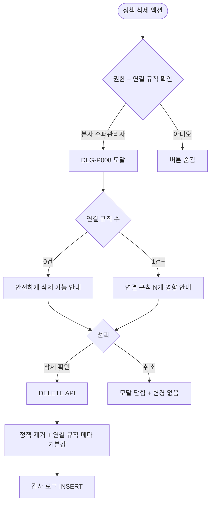

# DLG-P008 할인 정책 삭제 확인 모달

## 1. 다이얼로그 메타 정보

| 항목 | 값 |
|---|---|
| 작성일 | 2026-05-22 |
| 버전 | v1.0 |
| 상태 | 최신 통합본 반영 (정합화 완료) |
| 도메인 | D05 상품관리 |
| 다이얼로그 ID | DLG-P008 할인정책삭제확인 |
| 다이얼로그명 | 할인 정책 삭제 확인 |
| 다이얼로그 유형 | 중앙 알림 모달 (Danger Confirmation) |
| 우선순위 | P2 (출시 권장) |
| 기능코드 | PRD-04 |
| 계약코드 | PRD-04 |
| 호출 화면 | SCR-P004 할인설정 |
| 호출 트리거 | SCR-P004의 정책 그룹 삭제 액션 |

## 2. 다이얼로그 개요와 목적

할인 정책 삭제 확인 모달은 DLG-P007 할인정책추가수정으로 등록한 정책 메타(정책 그룹·세부 카테고리·중복 규칙)를 삭제하기 전에 최종 확인을 받는 안전 모달입니다. 연결된 할인 규칙이 있으면 삭제가 차단되며 강제 해체 또는 정책 변경 후 삭제를 권장합니다.

이 모달은 본사 슈퍼관리자가 마케팅 정책 체계를 정리할 때 사용되며, 정책 메타 삭제는 모든 연결된 할인 규칙에 영향을 주므로 신중히 처리됩니다.

## 3. 호출 트리거와 진입 경로

SCR-P004 할인 설정 페이지의 정책 그룹 삭제 액션을 클릭하면 호출됩니다. 본사 슈퍼관리자에게만 진입 가능합니다.

## 4. 레이아웃과 UI 구성

모달은 화면 중앙의 작은 크기로 표시됩니다.

모달 상단에는 "할인 정책을 삭제하시겠어요?" 빨강 톤 제목과 위험 아이콘이 표시됩니다.

본문에는 대상 정책명과 함께 분기 안내가 표시됩니다. 연결된 할인 규칙 수에 따라 분기됩니다.

연결 규칙 0건 분기: "이 정책은 연결된 할인 규칙이 없어 안전하게 삭제할 수 있습니다."

연결 규칙 1건 이상 분기: "이 정책에 연결된 할인 규칙 {개수}개가 있습니다. 정책을 삭제하면 연결 규칙들의 정책 메타가 기본값으로 변경됩니다. 정말 진행하시겠어요?"

하단에는 좌측 "취소" 버튼과 우측 "삭제" 버튼이 배치됩니다.

## 5. 입력 검증과 저장 규칙

연결 규칙 1건 이상이어도 강제 삭제는 가능하지만 모든 연결 규칙의 정책 메타가 기본값으로 자동 변경되어 영향을 미칩니다.

삭제는 백엔드 API로 처리되어 정책 메타가 시스템에서 제거되고 감사 로그에 INSERT 됩니다.

## 6. 주요 UX 흐름

1. SCR-P004에서 정책 그룹 삭제 액션 클릭
2. 시스템이 연결된 할인 규칙 수 확인
3. 분기 안내 모달 호출
4. 운영자가 "삭제" 선택 → API 호출 → 모달 닫힘 + 부모 갱신
5. 연결 규칙 있을 때 강제 삭제 시 모든 연결 규칙의 메타가 기본값으로 변경됨
6. "취소" 선택 → 모달 닫힘 + 변경 없음

## 7. 화면 상태와 예외 처리

기본 표시 상태는 연결 규칙 수 분기 안내가 표시됩니다.

진행 중 상태는 액션 버튼이 로딩 스피너로 전환됩니다.

본사 정의 정책 + 지점 삭제 시도는 차단됩니다.

실패 상태는 빨강 토스트 + 재시도 안내입니다.

예외 케이스별 처리는 연결 규칙 영향 안내, 본사 정의 정책 지점 삭제 차단, 동시 삭제 충돌 낙관적 락 처리입니다.

## 8. 권한별 처리

본사 슈퍼관리자(primary)와 시스템 슈퍼관리자(superAdmin)만 모달 진입과 삭제가 가능합니다.

## 9. 메인 흐름

## 10. 운영 정책 (이 다이얼로그에 연결된 부분)

연결 규칙 영향 안내 정책은 정책 메타 삭제 시 모든 연결 규칙에 영향을 미친다는 사실을 운영자에게 명시적으로 알린다는 것입니다.

강제 삭제 시 기본값 자동 변경 정책은 연결 규칙들의 정책 메타가 자동으로 기본값으로 변경되어 운영 정합성이 유지된다는 것입니다.

본사 정의 정책 보호 정책은 본사 정의 정책의 지점 삭제를 차단하여 마케팅 전략 일관성을 보호합니다.

권한 정책은 본사 슈퍼관리자만 모달 진입과 삭제가 가능하다는 것입니다.

감사 로그 정책은 정책 메타 삭제 이벤트가 SCR-097에 INSERT 된다는 것입니다.

이상의 모든 정책은 이 다이얼로그를 구현하고 운영하는 사람이 별도 문서 없이 이 한 장만 보면 이해할 수 있도록 풀어 적었습니다.
