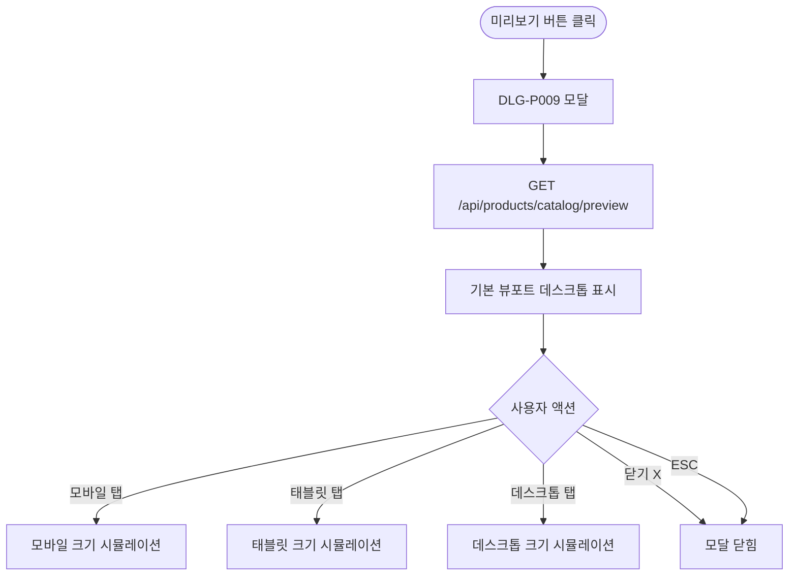

# DLG-P009 카탈로그 미리보기 모달

## 1. 다이얼로그 메타 정보

| 항목 | 값 |
|---|---|
| 작성일 | 2026-05-22 |
| 버전 | v1.0 |
| 상태 | 최신 통합본 반영 (정합화 완료) |
| 도메인 | D05 상품관리 |
| 다이얼로그 ID | DLG-P009 카탈로그미리보기 |
| 다이얼로그명 | 카탈로그 미리보기 모달 |
| 다이얼로그 유형 | 중앙 모달 (Preview Modal) |
| 우선순위 | P1 (출시 권장) |
| 기능코드 | PRD-05 |
| 계약코드 | PRD-05 |
| 호출 화면 | SCR-P005 상품카탈로그, SCR-P003 상품상세패널 |
| 호출 트리거 | SCR-P005의 "카탈로그 미리보기" 버튼, SCR-P003의 "카탈로그 미리보기" 액션 |

## 2. 다이얼로그 개요와 목적

카탈로그 미리보기 모달은 카탈로그 편집 또는 설정 후의 고객 노출 화면을 사전 시뮬레이션하는 조회 모달입니다. 어드민 헤더와 내비게이션이 모두 숨겨진 카탈로그 전용 레이아웃이 모달 안에 표시되며, 모바일·태블릿·데스크톱 뷰포트 전환으로 각 디바이스에서의 모양을 확인할 수 있습니다. 외부 공유 모드와 동일한 가격 마스킹 정책이 적용됩니다.

이 모달은 카탈로그 설정·편집을 적용하기 전에 결과를 확인하거나, 회원에게 보여줄 형태를 사전 검증할 때 사용됩니다.

## 3. 호출 트리거와 진입 경로

SCR-P005 상품 카탈로그 페이지의 헤더에서 "카탈로그 미리보기" 버튼을 클릭하면 호출됩니다. SCR-P003 상품 상세 패널의 "카탈로그 미리보기" 액션에서는 그 상품 단독 미리보기로 호출됩니다.

권한과 관계없이 모든 운영자가 진입 가능합니다.

## 4. 레이아웃과 UI 구성

모달은 큰 크기(거의 풀스크린에 가까운 사이즈)이며 다음 영역들로 구성됩니다.

모달 헤더에는 "카탈로그 미리보기" 제목, 뷰포트 전환 탭(모바일/태블릿/데스크톱), 닫기(X) 버튼이 가로로 배치됩니다.

본문에는 선택된 뷰포트 크기로 카탈로그 화면이 시뮬레이션됩니다. 어드민 헤더와 내비게이션은 모두 숨겨지고 카탈로그 전용 레이아웃(카드 그리드)만 표시됩니다. 시즌 특가 진행 중 상품은 자동 강조가 그대로 적용되어 회원 노출 형태와 동일하게 보입니다.

뷰포트 전환 탭은 데스크톱(전체 폭), 태블릿(약 768~1024px), 모바일(약 360~480px)의 3종이며 클릭 시 즉시 본문 폭이 변경됩니다.

## 5. 입력 검증과 저장 규칙

이 모달은 조회 전용이므로 입력 검증과 저장 규칙이 없습니다.

데이터는 `GET /api/products/catalog/preview`로 조회됩니다. 미리보기 모드는 가격 마스킹 정책(외부 공유 모드와 동일)이 적용될 수 있습니다.

## 6. 주요 UX 흐름

1. SCR-P005 헤더에서 "카탈로그 미리보기" 버튼 클릭으로 모달 호출
2. 기본 뷰포트(데스크톱)로 카탈로그 시뮬레이션 표시
3. 뷰포트 전환 탭으로 모바일·태블릿 모양 확인
4. 닫기(X) 또는 ESC로 모달 종료

## 7. 화면 상태와 예외 처리

로딩 중 상태는 카탈로그 시뮬레이션 영역에 스켈레톤이 표시됩니다.

정상 미리보기 상태는 선택된 뷰포트 크기로 카탈로그가 표시됩니다.

빈 상태는 활성 상품이 0개일 때로 "표시할 상품이 없습니다" 안내가 시뮬레이션 안에 표시됩니다.

데이터 로딩 실패 상태는 "미리보기를 불러올 수 없어요" + 재시도 버튼입니다.

예외 케이스별 처리는 시즌 특가 자동 강조 적용, 비활성·카탈로그 노출 OFF 상품 자동 제외, 가격 마스킹 정책 적용입니다.

## 8. 권한별 처리

모든 운영자(슈퍼관리자·Owner(지점장)·매니저·일반 직원·FC·readonly)가 모달 진입과 미리보기가 가능합니다. 가격 마스킹은 외부 공유 모드 정책에 따릅니다.

## 9. 메인 흐름

## 10. 운영 정책 (이 다이얼로그에 연결된 부분)

뷰포트 전환 정책은 모바일·태블릿·데스크톱의 3종을 즉시 전환 가능하여 각 디바이스 노출 형태를 검증할 수 있다는 것입니다.

어드민 UI 숨김 정책은 카탈로그 전용 레이아웃만 표시되어 회원이 실제로 보는 화면과 동일한 형태로 미리보기가 가능하다는 것입니다.

시즌 특가 자동 강조 정책은 미리보기에서도 시즌 가격 진행 중 상품에 자동 강조가 그대로 적용된다는 것입니다.

비활성·노출 OFF 자동 제외 정책은 비활성 상품과 카탈로그 노출 OFF 상품이 미리보기에서도 자동 제외되어 실제 회원 노출과 일치한다는 것입니다.

조회 전용 정책은 이 모달이 변경 작업을 일으키지 않으며 미리보기만 가능하다는 것입니다.

권한 무관 진입 정책은 모든 운영자가 모달 진입이 가능하다는 것입니다.

이상의 모든 정책은 이 다이얼로그를 구현하고 운영하는 사람이 별도 문서 없이 이 한 장만 보면 이해할 수 있도록 풀어 적었습니다.
