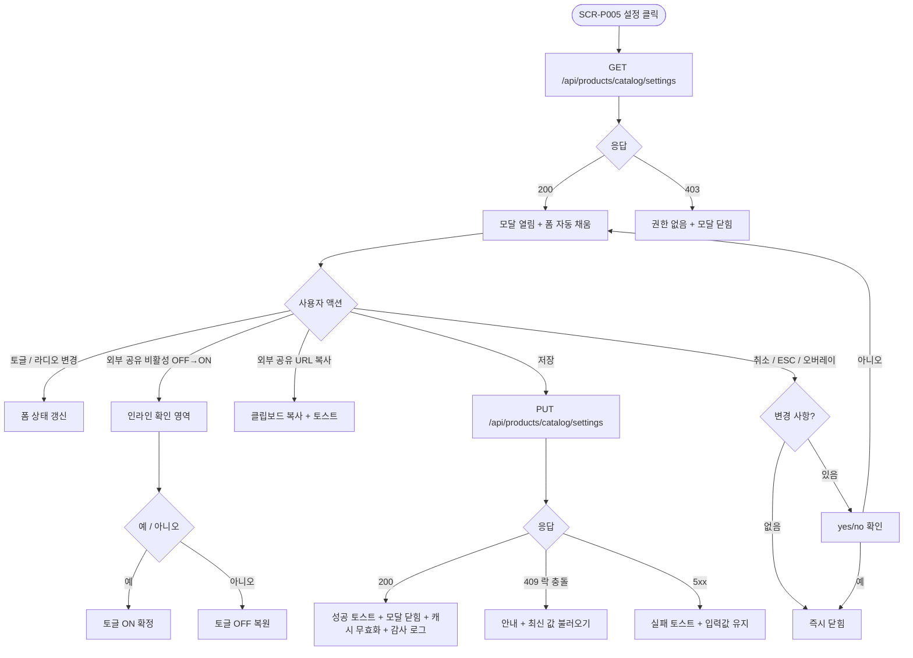

# DLG-P010 카탈로그 설정 다이얼로그

## 1. 다이얼로그 메타 정보

이 문서는 카탈로그 설정 다이얼로그에 대한 자기완결형 요구사항 정의서입니다. 다른 문서를 함께 보지 않아도 이 문서 한 장만으로 모달 안의 모든 영역, 모든 입력 필드, 모든 권한, 모든 예외 처리, 운영 정책까지 전부 이해하고 구현할 수 있도록 작성합니다.

| 항목 | 값 |
|---|---|
| 작성일 | 2026-05-22 |
| 버전 | v1.0 |
| 상태 | 최신 통합본 반영 (정합화 완료) |
| 도메인 | D05 상품관리 |
| 다이얼로그 ID | DLG-P010 |
| 다이얼로그명 | 카탈로그 표시 옵션 설정 |
| 유형 | 입력·저장 모달 (낙관적 락) |
| 부모 화면 | SCR-P005 상품 카탈로그 |
| 기능코드 | PRD-05 (상품 카탈로그) |
| 우선순위 | P1 (카탈로그 운영 핵심) |

## 2. 다이얼로그 개요와 목적

카탈로그 설정 다이얼로그는 상품 카탈로그(SCR-P005)에 표시할 정보 항목, 정렬 순서, 그리드 컬럼 수, 색상 테마, 헤더 노출 옵션, 외부 공유 비활성 토글을 한 번에 변경하는 모달입니다. 센터의 운영 정책과 브랜드 방침에 따라 가격 표시 여부, 기간·횟수 노출 여부, 강조 배지 사용 여부 같은 옵션을 운영자가 직접 조정할 수 있도록 합니다. 저장 시 카탈로그 본문이 즉시 갱신되고 회원앱·키오스크의 5분 캐시가 무효화되며, 변경 내역은 SCR-097 감사 로그에 비동기로 INSERT됩니다.

이 모달의 핵심 책임은 "카탈로그의 외형 정책"을 한 화면에서 통합 관리하는 것입니다. 노출 항목 토글로 가격을 숨기는 센터, 그리드 컬럼 4로 빽빽한 카탈로그를 운영하는 센터, 다크 테마로 프리미엄 인상을 주는 센터, 외부 공유 비활성 토글로 캠페인 종료 후 노출만 끄는 본사 등 다양한 운영 시나리오를 한 모달에서 지원합니다. 변경 사항은 카탈로그뿐만 아니라 회원앱·키오스크에도 5분 안에 자동 동기화되고, SCR-P005의 [지금 동기화]로 즉시 무효화도 가능합니다. 동시 편집은 낙관적 락(`updated_at` 비교)으로 안전하게 처리되어 두 운영자의 충돌 변경이 무의미하게 덮어쓰지 않도록 보장합니다.

## 3. 호출 트리거와 진입 경로

이 다이얼로그는 SCR-P005 상품 카탈로그 페이지 헤더의 [설정] 버튼을 눌렀을 때 호출됩니다. 권한은 매니저 이상에 한정되며, FC·트레이너·스태프·프런트·일반 직원·readonly에게는 [설정] 버튼이 화면에 표시되지 않거나 비활성화되어 있어 이 모달이 호출되지 않습니다.

다이얼로그를 열면 백엔드에서 현재 적용된 설정 값과 `updated_at` 토큰을 함께 받아 와 폼이 자동으로 채워진 상태로 표시됩니다. 폼 입력 도중 다른 운영자가 같은 설정을 저장하면 낙관적 락이 작동해 후행 저장이 거부되며, 사용자는 모달을 닫고 다시 열어 최신 값을 불러와야 합니다.

## 4. 레이아웃과 UI 구성

다이얼로그는 화면 중앙에 떠 있는 표준 사이즈의 모달이며, 어두운 오버레이가 어드민 화면 위에 깔리고 모달 내부가 강조됩니다.

모달 상단 헤더에는 좌측에 "카탈로그 표시 옵션 설정"이라는 타이틀이 표시되고, 우측 끝에 X 아이콘이 작게 배치됩니다. 헤더 아래에는 모달 본문이 세로 스크롤 영역으로 펼쳐집니다.

본문 최상단에는 노출 항목 토글 그룹이 가로 6~7개로 배치됩니다. 가격 표시 여부, 기간·횟수 표시 여부, 혜택 표시 여부, 태그 표시 여부, 이미지 표시 여부, 배지(시즌 할인·일반 할인·패키지·GX 세부종목) 표시 여부의 토글이 각각 ON/OFF로 동작합니다. 토글 옆에는 해당 옵션의 설명 문구가 작은 글씨로 따라붙어 운영자가 즉시 의미를 파악할 수 있게 합니다.

노출 항목 그룹 아래에는 정렬 순서 라디오 그룹이 배치됩니다. "인기순(누적 판매) / 가격 낮은순 / 가격 높은순 / 최신순 / 수동 정렬"의 5개 옵션 중 하나를 선택합니다. 수동 정렬을 선택하면 DLG-P011 카탈로그 편집에서 드래그한 순서가 그대로 적용되며, 자동 정렬 옵션을 선택한 상태에서 DLG-P011에서 드래그하면 수동 정렬로 자동 전환된다는 안내가 라디오 옆에 표시됩니다.

정렬 그룹 아래에는 그리드 컬럼 수 라디오 그룹이 있습니다. 데스크톱 기준 "2 / 3 / 4" 컬럼 중 하나를 선택합니다. 태블릿·모바일에서는 컬럼이 자동으로 한 단계씩 축소된다는 안내가 함께 표시됩니다.

그리드 컬럼 아래에는 색상 테마 라디오 그룹이 있습니다. "기본 / 라이트 / 다크 / 브랜드 컬러"의 네 옵션 중 하나를 선택하며, 각 옵션은 작은 컬러 칩과 라벨이 함께 표시됩니다. 브랜드 컬러를 선택하면 센터 설정의 브랜드 색상이 카탈로그에 자동 적용됩니다.

색상 테마 아래에는 헤더 노출 옵션 토글 그룹이 있습니다. 센터 로고 표시·연락처 표시·운영시간 표시의 토글 세 개로 카탈로그 상단 헤더에 어떤 정보를 노출할지 선택합니다. 로고는 센터 설정의 로고 이미지를 자동으로 가져옵니다.

헤더 노출 옵션 아래에는 외부 공유 비활성 토글이 한 개의 큰 스위치로 배치됩니다. 토글이 OFF이면 외부 공유 URL(`/catalog/public/{branchId}/{token}`)이 정상 동작하고, ON이면 외부 사용자 접근이 401로 차단됩니다. 토글을 ON으로 바꾸는 순간 모달 안에 "외부 사용자 접근이 차단됩니다. 진행하시겠어요?"라는 확인 안내가 한 번 뜹니다. 토글 옆에는 현재 외부 공유 URL이 텍스트로 노출되어 클립보드 복사 아이콘과 함께 배치됩니다.

모달 하단에는 [취소] / [저장] 버튼이 우측 정렬로 배치됩니다. [저장]은 primary 톤, [취소]는 secondary 톤입니다.

## 5. 버튼·아이콘·링크 액션 전체 정의

본문의 모든 토글과 라디오는 즉시 폼 상태가 변경되어 미리보기 영역(있으면)에 반영됩니다. 별도의 "적용" 버튼 없이 [저장] 시점에 한 번에 백엔드로 전송됩니다.

외부 공유 URL 옆의 클립보드 복사 아이콘은 클릭으로 외부 공유 URL을 클립보드에 복사합니다. 복사 성공 시 "링크가 복사되었어요" 토스트가 표시되고, 클립보드 API 권한이 없으면 "수동 복사" 안내와 함께 링크 텍스트가 강조되어 사용자가 직접 선택·복사할 수 있게 합니다.

[저장] 버튼은 폼 전체 값을 `PUT /api/products/catalog/settings`로 전송합니다. 요청 본문에 현재 `updated_at` 토큰이 함께 들어가 낙관적 락 검증이 이루어집니다. 검증 통과 시 응답으로 새 `updated_at`이 내려오며 모달이 닫히고 SCR-P005 본문이 즉시 갱신되며, 회원앱·키오스크의 5분 캐시 무효화 이벤트가 자동 발송됩니다. 변경 내역은 SCR-097 감사 로그에 비동기 INSERT됩니다.

[취소] 버튼은 변경 사항을 폐기하고 모달을 닫습니다. 입력 도중 [취소], ESC, 또는 모달 외부 오버레이 클릭으로 닫으려고 할 때 변경 사항이 있으면 "변경 사항이 사라집니다. 닫으시겠습니까?"라는 yes/no 확인이 한 번 표시됩니다. 변경 사항이 없으면 별도 확인 없이 즉시 닫힙니다.

X 아이콘은 [취소]와 동일하게 동작합니다.

모든 버튼은 클릭 후 응답이 돌아오기 전까지 자동으로 비활성화되어 더블클릭에 의한 중복 저장이 차단됩니다.

## 6. 호출되는 모달 동작

이 모달 자체가 자식 모달이므로 내부에서 다른 자식 모달을 호출하는 케이스는 없습니다. 외부 공유 비활성 토글 변경 시 표시되는 안내는 별도 모달이 아니라 인라인 확인 영역으로 표시됩니다.

[취소] 시 변경 사항 폐기 확인 yes/no도 별도 모달이 아니라 모달 내부의 작은 확인 영역으로 표시되어 운영자의 시선이 모달 밖으로 분산되지 않도록 합니다.

## 7. 토스트와 확인 팝업과 알럿

성공 토스트는 우측 상단에 녹색 계열로 5초 동안 표시됩니다. "카탈로그 설정이 저장되었어요"가 기본 문구이며, 외부 공유 비활성 토글이 OFF→ON으로 바뀌었으면 "외부 공유가 비활성화되었어요"가 추가 토스트로 함께 표시될 수 있습니다.

실패 토스트는 빨강 계열로 표시되며 "설정을 저장하지 못했어요"와 함께 "다시 시도" 보조 액션이 따라옵니다. 네트워크 오류는 1회 자동 재시도 후 사용자 액션을 기다립니다.

낙관적 락 충돌이 발생하면 별도의 모달 안내가 표시됩니다. "다른 사용자가 먼저 저장했어요. 최신 값을 불러올까요?"라는 메시지와 함께 [최신 값 불러오기] / [취소] 버튼이 표시되고, [최신 값 불러오기]를 누르면 모달이 새 데이터를 fetch 해 폼을 갱신합니다.

확인 팝업은 두 종류입니다. 첫 번째는 외부 공유 비활성 토글을 OFF→ON으로 바꾸는 순간의 yes/no 확인이며, 두 번째는 입력 도중 [취소]/ESC/오버레이 클릭으로 닫으려고 할 때의 "변경 사항이 사라집니다. 닫으시겠습니까?" 확인입니다.

알럿은 권한 없는 계정의 우회 호출 시에만 발생하며, 백엔드가 403을 반환하면서 "권한이 없어요" 토스트가 표시되고 모달이 자동으로 닫힙니다.

## 8. 데이터 흐름과 외부 연동

모달 열림 시 `GET /api/products/catalog/settings`가 호출되어 현재 설정 값과 `updated_at` 토큰을 받아 옵니다. 응답에는 노출 항목 토글 6~7개의 ON/OFF, 정렬 순서, 그리드 컬럼 수, 색상 테마, 헤더 노출 옵션 세 개, 외부 공유 비활성 토글, 외부 공유 URL이 포함됩니다.

[저장] 시 `PUT /api/products/catalog/settings`로 전송됩니다. 본문에 `updated_at`이 함께 들어가 낙관적 락 검증이 이루어지며, 검증 실패 시 409 응답이 반환됩니다.

저장 성공 시 백엔드에서 다음 작업이 자동으로 일어납니다. 첫째, 카탈로그 본문 조회 API의 응답이 새 설정으로 갱신됩니다. 둘째, 회원앱과 키오스크의 5분 캐시 무효화 이벤트가 메시지 큐로 발송됩니다. 셋째, SCR-097 감사 로그에 `actor_id`, `branch_id`, `action`(SET_SETTINGS), `before`(이전 설정 JSON), `after`(새 설정 JSON), `timestamp`가 INSERT됩니다. 감사 로그 INSERT는 응답이 사용자에게 돌아간 후 5초 안에 보장됩니다.

외부 공유 비활성 토글이 OFF→ON으로 바뀌었으면 외부 공유 URL의 토큰이 즉시 401 응답 모드로 전환되어, 진행 중인 외부 사용자 세션은 다음 요청부터 차단됩니다. 토큰 자체는 보존되어 비활성 토글을 다시 OFF로 돌리면 같은 URL로 노출이 복원됩니다.

색상 테마 변경은 카탈로그 본문에 즉시 적용되며 추가 동기화 작업 없이 SCR-P005의 다음 렌더부터 새 테마가 보입니다.

## 9. 화면 상태와 예외 처리

이 다이얼로그가 가질 수 있는 상태는 다음과 같습니다.

로딩 중 상태는 모달 열림 직후 현재 설정을 fetch 하는 짧은 순간이며, 토글·라디오 자리에 스켈레톤이 표시됩니다.

기본 입력 상태는 폼이 자동으로 채워진 후의 일반 상태입니다. 사용자가 토글·라디오를 변경할 수 있고 [저장]·[취소] 버튼이 활성화되어 있습니다.

저장 중 상태는 [저장] 클릭 후 백엔드 응답을 기다리는 동안입니다. [저장]·[취소] 버튼이 모두 비활성화되고 로딩 스피너가 [저장] 자리에 표시됩니다.

저장 성공 상태는 응답 200 후 모달이 닫히기 직전의 짧은 순간입니다. 성공 토스트가 우측 상단에 표시되며 모달이 부드럽게 닫힙니다.

저장 실패 상태는 5xx, 409, 422 응답 후 모달이 열린 상태에서 실패 토스트가 표시되는 상태입니다. 입력값은 그대로 유지되어 사용자가 수정 후 재시도할 수 있습니다.

외부 공유 비활성 확인 상태는 토글을 OFF→ON으로 바꾸는 순간 모달 내부에 인라인 확인 영역이 표시되는 상태이며, [예]를 누르면 토글이 확정되고 [아니오]를 누르면 토글이 OFF로 복원됩니다.

예외 케이스별 처리는 다음과 같이 정의됩니다.

낙관적 락 충돌(409)이 발생하면 별도 안내 영역이 표시되고 [최신 값 불러오기] / [취소]를 선택합니다.

네트워크 오류는 1회 자동 재시도 후 사용자 액션을 기다립니다.

권한 없는 계정의 우회 호출(403)은 모달이 자동으로 닫히고 "권한이 없어요" 토스트가 표시됩니다.

클립보드 API 권한이 없는 브라우저에서는 외부 공유 URL 복사 시 "수동 복사" 안내가 표시됩니다.

색상 테마 "브랜드 컬러" 선택 시 센터 설정에 브랜드 컬러가 등록되어 있지 않으면 자동으로 "기본" 테마로 폴백되며 안내 토스트가 표시됩니다.

그리드 컬럼 4 선택 시 모바일에서는 자동으로 1~2 컬럼으로 축소된다는 안내가 라디오 옆에 작은 글씨로 항상 표시되어 운영자가 의도하지 않은 결과를 막을 수 있습니다.

수동 정렬을 선택한 상태에서 [저장]을 누른 후 DLG-P011에서 드래그하지 않으면 카탈로그가 이전 마지막 수동 정렬 순서를 유지합니다.

외부 공유 URL이 아직 발급되지 않은 상태에서 비활성 토글을 ON으로 바꾸려고 하면 토글이 회색으로 비활성화되고 "외부 공유 URL을 먼저 발급해 주세요" 안내가 표시됩니다.

## 10. 권한별 처리

이 다이얼로그는 매니저 이상 권한에 한정됩니다.

슈퍼관리자, 본사 최고관리자, Owner(지점장), 매니저는 모든 토글과 라디오를 자유롭게 변경하고 저장할 수 있습니다.

Owner(지점장) / manager / 상품 편집 권한을 별도 부여받은 fc·trainer·staff은 매니저와 동일한 권한을 가집니다.

FC, 트레이너, 스태프, 프런트, 일반 직원은 SCR-P005에서 [설정] 버튼이 보이지 않으므로 이 모달이 호출되지 않습니다. 만약 직접 URL로 우회 호출하려고 하면 백엔드가 403을 반환하며 모달이 자동으로 닫힙니다.

readonly는 SCR-P005 진입 자체가 차단되어 이 모달에 접근할 수 없습니다.

외부 공유 비활성 토글은 매니저·Owner(지점장)·슈퍼관리자만 변경할 수 있으며, 권한이 없는 매니저(테넌트 설정에 따라 다름)는 이 토글이 회색 비활성으로 표시됩니다.

모든 권한 차단 이벤트는 SCR-097 감사 로그에 기록되어 사후 추적이 가능합니다.

## 11. 메인 흐름

## 12. 핵심 디자인 요청사항

모달의 토글과 라디오는 그룹별로 시각적으로 분리되어 운영자가 어떤 옵션이 같은 묶음인지 즉시 파악할 수 있어야 합니다. 노출 항목 그룹·정렬 그룹·그리드 컬럼 그룹·색상 테마 그룹·헤더 노출 그룹·외부 공유 그룹의 6개 섹션이 각자 작은 헤더 라벨과 함께 명확히 구분됩니다.

토글은 ON/OFF 상태가 색상과 위치로 동시에 인식되도록 디자인되어야 합니다. ON은 강조 색상, OFF는 회색으로 통일됩니다.

색상 테마 라디오는 작은 컬러 칩이 라벨과 함께 표시되어 운영자가 어떤 톤이 적용되는지 미리보기 없이도 짐작할 수 있어야 합니다.

외부 공유 비활성 토글은 다른 토글보다 큰 스위치 형태로 배치되어 "이 토글은 외부 사용자에게 영향을 준다"는 시각적 가중치를 줍니다. 토글 옆 외부 공유 URL은 monospace 폰트로 표시되고 클립보드 복사 아이콘이 우측에 작게 따라붙습니다.

[저장] 버튼은 큼직한 primary 톤, [취소]는 secondary 톤으로 우선순위가 명확합니다.

낙관적 락 충돌 안내 영역은 모달 본문 상단에 빨강 톤 배너로 표시되어 사용자가 즉시 인식하도록 합니다.

진행 스피너와 스켈레톤 로딩은 모달 내부에서 동일한 톤으로 통일되어 어느 영역이 로딩 중인지 직관적으로 파악되어야 합니다.

## 13. 운영 정책 (이 다이얼로그에 연결된 부분)

카탈로그 표시 옵션은 센터의 운영 정책에 따라 자유롭게 조정되어야 하므로 모든 옵션이 토글·라디오로 제공됩니다. 단, 정합성을 위해 일부 옵션은 시스템 정책상 강제됩니다. GX 세부종목 배지는 운영 정책상 GX 상품에 필수로 표시되어야 하므로 배지 토글을 OFF로 해도 GX 세부종목 배지는 항상 표시됩니다.

대분류 색상은 SCR-P001 상품 관리와 동일한 색상 코드를 사용해 브랜드 일관성을 유지하며, 이 색상은 색상 테마 라디오와 별개로 항상 적용됩니다.

정렬 순서 5종(인기순·가격 낮은순·가격 높은순·최신순·수동 정렬)은 운영자의 카탈로그 운영 방식에 직접 영향을 줍니다. 인기순은 누적 판매량 기준 자동 정렬이며 매일 04:00 배치로 갱신됩니다. 수동 정렬은 DLG-P011에서 드래그한 순서를 그대로 따르며, 자동 정렬 옵션을 선택한 상태에서 DLG-P011에서 드래그하면 자동으로 수동 정렬로 전환되고 토스트 안내가 표시됩니다.

그리드 컬럼 정책은 데스크톱 2/3/4, 태블릿 자동 2/3, 모바일 자동 1/2로 responsive 폴백됩니다. 컬럼 4를 선택해도 모바일에서는 카드 가독성을 위해 자동으로 축소됩니다.

외부 공유 비활성 토글은 캠페인 종료 후 노출만 끄고 토큰은 보존하기 위한 정책 도구입니다. 토글을 ON으로 바꾸는 즉시 외부 사용자 접근이 401로 차단되며, 다시 OFF로 돌리면 같은 URL로 노출이 복원됩니다. 토큰 자체는 영구이며 발급 후 만료되지 않습니다.

회원앱·키오스크 동기화 정책은 5분 캐시 무효화입니다. 저장 시 자동으로 메시지 큐 이벤트가 발송되어 회원앱·키오스크의 다음 요청부터 새 설정이 반영되며, 즉시 갱신이 필요하면 SCR-P005의 [지금 동기화]를 사용합니다.

낙관적 락 정책은 두 운영자의 동시 저장을 안전하게 처리하기 위한 정책입니다. 저장 시 `updated_at`을 비교해 후행 요청을 409로 거부하고, 사용자에게 [최신 값 불러오기]로 새 데이터를 받아 다시 저장하도록 안내합니다.

감사 로그 정책은 모든 설정 변경을 5초 안에 SCR-097에서 조회 가능한 비동기 INSERT입니다. 기록되는 필드는 `actor_id`, `branch_id`, `action`(SET_SETTINGS), `before`, `after`, `timestamp`이며 이는 운영 행위의 추적성을 보장하기 위한 정책입니다.

권한 정책은 매니저 이상으로 제한되어 카탈로그의 시각 정책이 운영자 실수로 잘못 바뀌는 것을 막습니다. 외부 공유 비활성 토글은 매니저 이상 중에서도 테넌트 설정에 따라 별도 권한 분기가 가능합니다.

이상의 정책은 이 모달을 구현하고 운영하는 사람이 별도 문서 없이 이 한 장만 보면 이해할 수 있도록 풀어 적었습니다. 정책이 바뀌면 이 문서가 함께 갱신되어야 하며, 코드 변경과 정책 변경은 항상 짝지어 진행됩니다.
