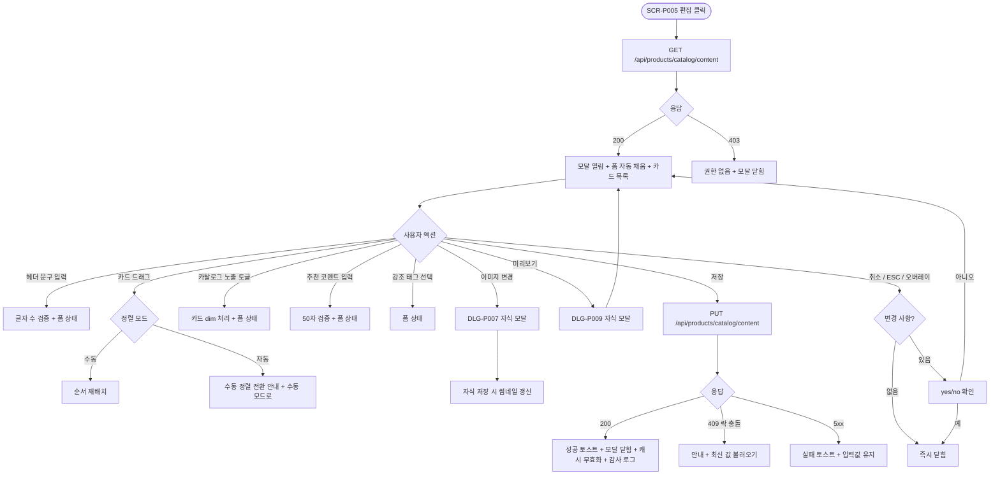

# DLG-P011 카탈로그 편집 다이얼로그

## 1. 다이얼로그 메타 정보

이 문서는 카탈로그 편집 다이얼로그에 대한 자기완결형 요구사항 정의서입니다. 다른 문서를 함께 보지 않아도 이 문서 한 장만으로 모달 안의 모든 영역, 모든 입력 필드, 모든 권한, 모든 예외 처리, 운영 정책까지 전부 이해하고 구현할 수 있도록 작성합니다.

| 항목 | 값 |
|---|---|
| 작성일 | 2026-05-22 |
| 버전 | v1.0 |
| 상태 | 최신 통합본 반영 (정합화 완료) |
| 도메인 | D05 상품관리 |
| 다이얼로그 ID | DLG-P011 |
| 다이얼로그명 | 카탈로그 편집 (헤더 문구·카드 순서·코멘트·이미지) |
| 유형 | 입력·드래그·저장 모달 (낙관적 락) |
| 부모 화면 | SCR-P005 상품 카탈로그 |
| 호출 자식 모달 | DLG-P007 상품 이미지 업로드, DLG-P009 카탈로그 미리보기 (보조) |
| 기능코드 | PRD-05 (상품 카탈로그) |
| 우선순위 | P1 (마케팅 운영 핵심) |

## 2. 다이얼로그 개요와 목적

카탈로그 편집 다이얼로그는 카탈로그(SCR-P005)에 노출되는 헤더 문구, 카드별 추천 코멘트, 카드 순서, 카드별 카탈로그 노출 ON/OFF, 카드별 이미지를 한 번에 편집하는 모달입니다. 본사 마케팅이 시즌 캠페인에 맞춰 카탈로그 헤더 문구를 "여름맞이 특가 이벤트"로 바꾸고, 카드별로 "FC 추천 1순위", "신년 이벤트" 같은 추천 코멘트를 붙여 회원에게 매력적으로 노출되도록 합니다. 카드 순서는 드래그 앤 드롭으로 재배치할 수 있으며, 자동 정렬(DLG-P010) 모드에서 드래그하면 수동 정렬 모드로 자동 전환되고 안내가 표시됩니다.

이 모달의 핵심 책임은 "카탈로그의 콘텐츠와 순서"를 운영자가 직접 큐레이션할 수 있도록 하는 것입니다. 활성 상품 중 카탈로그 노출 OFF로 숨길 상품, 카드 하단에 붙일 50자 추천 코멘트, 인기·추천·신규 같은 강조 태그, 카드 우측에 표시할 이미지를 모달 한 화면에서 통합 관리합니다. 저장 시 카탈로그 본문이 즉시 갱신되고 회원앱·키오스크 5분 캐시가 무효화되며, 변경 내역은 SCR-097 감사 로그에 비동기로 INSERT됩니다. 동시 편집은 낙관적 락(`updated_at` 비교)으로 안전하게 처리되어 두 운영자의 충돌 변경이 무의미하게 덮어쓰지 않도록 보장합니다.

## 3. 호출 트리거와 진입 경로

이 다이얼로그는 SCR-P005 상품 카탈로그 페이지 헤더의 [편집] 버튼을 눌렀을 때 호출됩니다. 권한은 매니저 이상에 한정되며 테넌트 설정에 따라 매니저는 편집 가능 또는 설정만 가능 두 가지로 분기됩니다. 기본값은 매니저도 편집 가능입니다.

다이얼로그를 열면 백엔드에서 현재 적용된 카탈로그 콘텐츠와 `updated_at` 토큰을 함께 받아 폼이 자동으로 채워진 상태로 표시됩니다. 폼 입력 도중 다른 운영자가 같은 카탈로그를 저장하면 낙관적 락이 작동해 후행 저장이 거부됩니다.

## 4. 레이아웃과 UI 구성

다이얼로그는 화면 중앙에 떠 있는 큰 사이즈의 모달이며, 모달 본문 영역이 다른 모달보다 넓게 펼쳐져 카드 목록을 충분히 보여 줍니다.

모달 상단 헤더에는 좌측에 "카탈로그 편집"이라는 타이틀이 표시되고, 우측에 [미리보기] 보조 버튼(DLG-P009 호출)과 X 아이콘이 배치됩니다.

본문 최상단에는 카탈로그 헤더 문구 편집 영역이 있습니다. 제목 입력(1~50자, 필수 아님)과 부제목 입력(1~100자, 필수 아님)이 세로로 배치되며, 각 입력 우측에 현재 글자 수와 최대 글자 수가 작게 표시됩니다("23 / 50" 같은 형태). 한글·영문·숫자·이모지가 모두 허용되며 50자 또는 100자를 초과하면 인라인 차단됩니다. 헤더 문구가 모두 비어 있으면 카탈로그에서 헤더 영역 자체가 숨겨집니다.

헤더 문구 아래에는 카드 목록이 세로로 펼쳐집니다. 카드 목록은 DLG-P010의 정렬 순서를 그대로 따라 표시되며, 수동 정렬 모드에서는 사용자가 드래그로 직접 순서를 바꿀 수 있습니다. 자동 정렬 모드에서 드래그하면 "수동 정렬로 전환됩니다"라는 안내가 한 번 표시되고 자동으로 수동 정렬 모드로 전환됩니다.

각 카드 행은 좌측에 드래그 핸들 아이콘, 그 옆에 작은 카드 썸네일 이미지, 중앙에 상품명·대분류 배지·현재 가격 요약, 우측에 편집 컨트롤이 배치됩니다. 편집 컨트롤은 다음 네 가지입니다.

첫 번째는 카탈로그 노출 ON/OFF 토글입니다. ON이면 카탈로그에 노출되고 OFF면 활성 상품이라도 카탈로그에서만 숨겨집니다. 키오스크와 결제 화면에서는 OFF여도 정상 노출됩니다.

두 번째는 추천 코멘트 입력(1~50자)입니다. 카드 하단에 작은 글씨로 표시되는 마케팅 문구로, 비어 있으면 카드 하단에 코멘트 영역이 표시되지 않습니다. 글자 수 카운트가 입력 우측에 작게 표시됩니다.

세 번째는 강조 태그 선택입니다. "없음 / 인기 / 추천 / 신규"의 4개 옵션 중 하나를 라디오 또는 드롭다운으로 선택하며, "없음"이 아닌 경우 카드 상단에 강조 태그 배지가 표시됩니다.

네 번째는 이미지 변경 버튼입니다. 누르면 DLG-P007 상품 이미지 업로드가 자식 모달로 호출되어 카탈로그 전용 이미지를 변경할 수 있습니다. 카탈로그 전용 이미지가 있으면 카드 썸네일에 우선 표시되고, 없으면 상품 등록(PRD-EXT-01) 이미지가 fallback으로 사용되며, 둘 다 없으면 대분류 아이콘 placeholder가 표시됩니다.

카드 목록 하단에는 페이지네이션이 없으며 무한 스크롤로 모든 활성 상품이 표시됩니다. 활성 상품이 많은 센터에서는 모달 본문이 스크롤 가능하도록 충분한 세로 영역이 확보됩니다.

모달 하단에는 [취소] / [저장] 버튼이 우측 정렬로 배치됩니다. [저장]은 primary 톤, [취소]는 secondary 톤입니다.

## 5. 버튼·아이콘·링크 액션 전체 정의

헤더의 [미리보기] 보조 버튼은 DLG-P009 카탈로그 미리보기를 자식 모달로 호출합니다. 호출 시 현재 모달 안의 임시 편집 상태가 그대로 전달되어, 운영자가 저장 전에 결과를 사전 검증할 수 있습니다. 미리보기는 읽기 전용이므로 데이터 변경이 일어나지 않고, 미리보기를 닫으면 편집 모달로 자동 복귀합니다.

카드 행의 드래그 핸들은 마우스 드래그로 카드 순서를 변경합니다. 자동 정렬 모드에서 드래그하면 "수동 정렬로 전환됩니다"라는 안내 토스트가 한 번 표시되고 자동으로 수동 정렬 모드로 전환됩니다. 드래그 결과는 모달 내부 메모리에만 보관되며 [저장] 시 백엔드로 전송됩니다.

카탈로그 노출 ON/OFF 토글은 즉시 폼 상태를 변경합니다. OFF로 바꾸면 카드 행이 회색으로 dim 처리되어 시각적으로 "이 카드는 카탈로그에서 숨겨짐"이 한눈에 들어옵니다.

추천 코멘트 입력은 디바운스 없이 즉시 폼 상태에 반영되며, 50자 초과 시 인라인 차단됩니다.

강조 태그 선택은 드롭다운 또는 라디오로 동작하며 선택 즉시 폼 상태에 반영됩니다.

이미지 변경 버튼은 DLG-P007 상품 이미지 업로드 자식 모달을 호출합니다. DLG-P007에서 이미지를 업로드·저장하면 카탈로그 전용 이미지 URL이 모달 내부 폼에 즉시 반영되고 카드 썸네일이 갱신됩니다. DLG-P007에서 [취소]를 누르면 카탈로그 전용 이미지는 변경되지 않습니다.

[저장] 버튼은 폼 전체 값을 `PUT /api/products/catalog/content`로 전송합니다. 요청 본문에 현재 `updated_at` 토큰이 함께 들어가 낙관적 락 검증이 이루어집니다. 검증 통과 시 응답으로 새 `updated_at`이 내려오며 모달이 닫히고 SCR-P005 본문이 즉시 갱신되며, 회원앱·키오스크 5분 캐시 무효화 이벤트가 자동 발송됩니다.

[취소] 버튼은 변경 사항을 폐기하고 모달을 닫습니다. 입력 도중 [취소], ESC, 또는 모달 외부 오버레이 클릭으로 닫으려고 할 때 변경 사항이 있으면 "변경 사항이 사라집니다. 닫으시겠습니까?"라는 yes/no 확인이 한 번 표시됩니다.

X 아이콘은 [취소]와 동일하게 동작합니다.

모든 버튼은 클릭 후 응답이 돌아오기 전까지 자동으로 비활성화되어 더블클릭에 의한 중복 저장이 차단됩니다.

## 6. 호출되는 모달 동작

이 모달에서 호출되는 자식 모달은 두 가지입니다.

### 6-1. DLG-P007 상품 이미지 업로드

카드 행의 이미지 변경 버튼을 눌렀을 때 호출됩니다. DLG-P007 안에서 운영자는 이미지 파일을 업로드하거나 기존 이미지를 변경하거나 삭제할 수 있습니다. 업로드된 이미지는 카탈로그 전용 이미지로 저장되며 상품 등록 이미지와는 별개의 슬롯입니다. DLG-P007에서 [저장]을 누르면 카탈로그 편집 모달 안의 카드 썸네일이 즉시 갱신되고, [취소]를 누르면 카드 썸네일이 변경되지 않습니다. DLG-P007 자체는 자식 모달이므로 카탈로그 편집 모달은 잠시 백그라운드에 숨겨졌다가 DLG-P007이 닫히면 자동 복원됩니다.

### 6-2. DLG-P009 카탈로그 미리보기 (보조)

헤더의 [미리보기] 보조 버튼으로 호출됩니다. 현재 편집 중인 임시 상태가 그대로 미리보기에 반영되어 운영자가 결과를 사전 검증할 수 있습니다. 미리보기는 읽기 전용이며 닫으면 카탈로그 편집 모달이 자동 복귀합니다.

[취소] 시 변경 사항 폐기 확인 yes/no는 별도 모달이 아니라 모달 내부 작은 확인 영역으로 표시됩니다.

## 7. 토스트와 확인 팝업과 알럿

성공 토스트는 우측 상단에 녹색 계열로 5초 동안 표시됩니다. "카탈로그가 편집되었어요"가 기본 문구이며, 자동 정렬 모드에서 드래그한 경우 별도 토스트로 "수동 정렬로 전환되었어요"가 함께 표시됩니다.

실패 토스트는 빨강 계열로 표시되며 "카탈로그 편집을 저장하지 못했어요"와 함께 "다시 시도" 보조 액션이 따라옵니다.

낙관적 락 충돌이 발생하면 별도 안내 영역이 표시됩니다. "다른 사용자가 먼저 저장했어요. 최신 값을 불러올까요?"라는 메시지와 함께 [최신 값 불러오기] / [취소] 버튼이 표시되고, [최신 값 불러오기]를 누르면 모달이 새 데이터를 fetch 해 폼을 갱신합니다.

확인 팝업은 두 종류입니다. 첫 번째는 자동 정렬 모드에서 드래그할 때 한 번 표시되는 "수동 정렬로 전환됩니다" 안내(yes/no가 아닌 단순 안내). 두 번째는 입력 도중 [취소]/ESC/오버레이 클릭으로 닫으려고 할 때의 yes/no 확인입니다.

알럿은 권한 없는 계정의 우회 호출 시에만 발생하며, 백엔드가 403을 반환하면서 "권한이 없어요" 토스트가 표시되고 모달이 자동으로 닫힙니다.

## 8. 데이터 흐름과 외부 연동

모달 열림 시 `GET /api/products/catalog/content`가 호출되어 현재 카탈로그 콘텐츠와 `updated_at` 토큰을 받아 옵니다. 응답에는 헤더 제목·부제목, 카드 배열(상품 ID·카탈로그 노출 ON/OFF·추천 코멘트·강조 태그·카탈로그 전용 이미지 URL), 현재 정렬 모드(자동·수동), 자동 정렬 종류가 포함됩니다.

[저장] 시 `PUT /api/products/catalog/content`로 전송됩니다. 본문에 `updated_at`이 함께 들어가 낙관적 락 검증이 이루어지며, 검증 실패 시 409 응답이 반환됩니다.

이미지 변경은 DLG-P007 자식 모달에서 처리됩니다. DLG-P007이 자체적으로 `POST /api/products/:id/catalog-image`를 호출해 카탈로그 전용 이미지 URL을 저장하고, 응답으로 받은 URL이 카탈로그 편집 모달의 폼에 반영됩니다.

저장 성공 시 백엔드에서 다음 작업이 자동으로 일어납니다. 첫째, 카탈로그 본문 조회 API의 응답이 새 콘텐츠로 갱신됩니다. 둘째, 회원앱과 키오스크의 5분 캐시 무효화 이벤트가 발송됩니다. 셋째, SCR-097 감사 로그에 `actor_id`, `branch_id`, `action`(EDIT_CONTENT), `before`(이전 콘텐츠 JSON), `after`(새 콘텐츠 JSON), `timestamp`가 INSERT됩니다.

자동 정렬에서 수동 정렬로 전환된 경우 DLG-P010 설정의 정렬 모드도 함께 "수동 정렬"로 변경됩니다. 이는 두 모달의 상태 정합성을 위한 정책입니다.

## 9. 화면 상태와 예외 처리

이 다이얼로그가 가질 수 있는 상태는 다음과 같습니다.

로딩 중 상태는 모달 열림 직후 카탈로그 콘텐츠를 fetch 하는 짧은 순간이며, 헤더 입력·카드 목록 자리에 스켈레톤이 표시됩니다.

기본 입력 상태는 폼이 자동으로 채워진 후의 일반 상태이며 모든 컨트롤이 활성화되어 있습니다.

드래그 중 상태는 카드 드래그 핸들을 마우스로 잡은 동안이며, 카드가 마우스 위치를 따라 부드럽게 이동하고 다른 카드가 자리를 비켜 줍니다.

수동 정렬 전환 안내 상태는 자동 정렬 모드에서 드래그를 시작한 순간이며, 모달 본문 상단에 안내 토스트가 한 번 표시된 후 사라집니다.

저장 중 상태는 [저장] 클릭 후 응답을 기다리는 동안이며, 모든 버튼이 비활성화되고 [저장] 자리에 로딩 스피너가 표시됩니다.

저장 성공 상태는 응답 200 후 모달이 닫히기 직전의 짧은 순간입니다.

저장 실패 상태는 5xx, 409, 422 응답 후 모달이 열린 상태에서 실패 토스트가 표시되는 상태이며, 입력값은 그대로 유지됩니다.

자식 모달 활성 상태는 DLG-P007 또는 DLG-P009가 자식으로 열려 있을 때이며, 카탈로그 편집 모달은 잠시 백그라운드로 밀려나고 자식 모달이 위에 겹쳐집니다.

예외 케이스별 처리는 다음과 같이 정의됩니다.

낙관적 락 충돌(409)이 발생하면 별도 안내 영역이 표시되고 [최신 값 불러오기] / [취소]를 선택합니다.

헤더 제목 50자, 부제목 100자, 추천 코멘트 50자 초과 시 인라인 차단이 적용되며 [저장] 버튼이 비활성화됩니다.

자동 정렬 모드에서 드래그하면 자동으로 수동 정렬 모드로 전환되고 안내가 한 번 표시됩니다. 운영자가 의도하지 않은 경우 [취소]로 모달을 닫으면 모드 전환도 폐기됩니다.

카드 카탈로그 노출 OFF 토글된 카드는 카드 행이 회색으로 dim 처리되어 시각적으로 구분됩니다.

이미지 업로드 도중 DLG-P007에서 5xx가 발생하면 카탈로그 편집 모달의 카드 썸네일이 변경되지 않으며 DLG-P007 안에서 실패 안내가 표시됩니다.

권한 없는 계정의 우회 호출(403)은 모달이 자동으로 닫히고 "권한이 없어요" 토스트가 표시됩니다.

활성 상품이 0개인 센터에서 모달을 열면 카드 목록 자리에 "편집할 상품이 없습니다" 안내가 표시되며 헤더 문구만 편집 가능합니다.

## 10. 권한별 처리

이 다이얼로그는 매니저 이상 권한에 한정됩니다. 테넌트 설정에 따라 매니저는 편집 가능 또는 설정만 가능으로 분기되며 기본값은 매니저도 편집 가능입니다.

슈퍼관리자, 본사 최고관리자, Owner(지점장)은 모든 편집을 자유롭게 수행할 수 있습니다.

매니저는 테넌트 정책에 따라 편집 가능 또는 차단됩니다. 차단된 경우 SCR-P005에서 [편집] 버튼이 보이지 않으므로 모달이 호출되지 않습니다.

Owner(지점장) / manager / 상품 편집 권한을 별도 부여받은 fc·trainer·staff은 매니저와 동일한 권한을 가집니다.

FC, 트레이너, 스태프, 프런트, 일반 직원은 SCR-P005에서 [편집] 버튼이 보이지 않아 모달이 호출되지 않습니다.

readonly는 SCR-P005 진입 자체가 차단되어 이 모달에 접근할 수 없습니다.

모든 권한 차단 이벤트는 SCR-097 감사 로그에 기록되어 사후 추적이 가능합니다.

## 11. 메인 흐름

## 12. 핵심 디자인 요청사항

모달 본문은 다른 모달보다 넓은 사이즈로 디자인되어 카드 목록과 편집 컨트롤이 한 줄에 모두 들어갈 수 있어야 합니다. 카드 행은 충분한 세로 간격을 가져 드래그가 어색하지 않게 합니다.

드래그 핸들 아이콘은 인식하기 쉬운 형태로 카드 행 좌측에 배치되며, 호버 시 커서가 grab으로 변하고 드래그 중에는 grabbing으로 변합니다.

카탈로그 노출 OFF 토글된 카드는 전체 행이 회색으로 dim 처리되어 시각적 우선순위가 명확히 낮아져야 합니다. 동시에 dim 상태에서도 모든 편집 컨트롤은 활성화되어 있어 운영자가 OFF 상태인 카드의 코멘트나 이미지를 미리 준비해 둘 수 있습니다.

추천 코멘트 입력 우측의 글자 수 카운트는 50자에 가까워질수록 색상이 진해져 시각적 경고를 줍니다("45 / 50"부터 노랑 톤).

강조 태그 드롭다운은 선택된 태그가 작은 컬러 칩과 함께 표시되어 카탈로그에 어떻게 노출될지 미리 짐작할 수 있게 합니다.

이미지 변경 버튼은 카드 썸네일 위에 호버 시 표시되는 작은 오버레이 또는 명확한 보조 버튼으로 디자인되어 카드 영역을 가리지 않습니다.

자동 정렬에서 수동 정렬 전환 안내는 부드러운 슬라이드 인 토스트로 표시되어 사용자가 모드 전환을 즉시 인식하도록 합니다.

[저장] 버튼은 큼직한 primary 톤, [취소]는 secondary 톤으로 우선순위가 명확합니다. 헤더의 [미리보기] 보조 버튼은 outline 톤으로 차별화되어 "이건 저장 전 검증 도구"임이 보입니다.

낙관적 락 충돌 안내는 모달 본문 상단에 빨강 톤 배너로 표시되어 사용자가 즉시 인식하도록 합니다.

## 13. 운영 정책 (이 다이얼로그에 연결된 부분)

카탈로그 편집은 콘텐츠 큐레이션 도구입니다. 운영자가 직접 카드 순서·코멘트·태그·이미지를 변경해 마케팅 효과를 극대화할 수 있으며, 변경 결과는 회원앱·키오스크에 5분 안에 자동 동기화됩니다.

헤더 문구 정책은 제목 1~50자, 부제목 1~100자입니다. 한글·영문·숫자·이모지가 모두 허용되며 글자 수 초과 시 인라인 차단됩니다. 헤더 문구가 모두 비어 있으면 카탈로그 헤더 영역 자체가 숨겨져 깔끔한 카드 그리드만 노출됩니다.

추천 코멘트 정책은 카드별 1~50자 선택 입력입니다. 카드 하단에 작은 글씨로 표시되어 회원이 카드를 볼 때 마케팅 문구가 자연스럽게 눈에 들어오도록 하며, 비어 있으면 카드 하단 코멘트 영역이 표시되지 않습니다.

강조 태그 정책은 "인기 / 추천 / 신규"의 3종으로 고정됩니다. 카드 상단에 강조 색상 배지로 표시되며 회원의 시선을 끄는 역할을 합니다.

카탈로그 노출 OFF 토글은 활성 상품을 카탈로그에서만 숨기는 정책입니다. OFF로 바꿔도 키오스크·결제 화면에서는 정상 노출되어 결제가 가능하며, 이는 카탈로그가 "회원 안내용 디스플레이" 정체성을 유지하기 위한 정책입니다.

카드 순서 드래그 정책은 자동 정렬 모드에서 드래그하면 수동 정렬 모드로 자동 전환되는 것입니다. 이는 운영자의 의도(특정 카드를 위로 올리고 싶음)를 즉시 반영하기 위한 정책이며, 모드 전환 시 DLG-P010 설정의 정렬 모드도 함께 수동으로 변경됩니다.

이미지 정책은 카탈로그 전용 이미지가 상품 등록 이미지보다 우선 적용되는 것입니다. 카탈로그에서만 특별한 이미지를 노출하고 싶을 때 DLG-P007로 카탈로그 전용 이미지를 업로드하면 됩니다. 둘 다 없으면 대분류 아이콘 placeholder가 표시됩니다.

회원앱·키오스크 동기화 정책은 5분 캐시 무효화입니다. 저장 시 자동으로 메시지 큐 이벤트가 발송되어 회원앱·키오스크의 다음 요청부터 새 콘텐츠가 반영되며, 즉시 갱신이 필요하면 SCR-P005의 [지금 동기화]를 사용합니다.

낙관적 락 정책은 두 운영자의 동시 편집을 안전하게 처리하기 위한 정책입니다. 저장 시 `updated_at`을 비교해 후행 요청을 409로 거부하고, 사용자에게 [최신 값 불러오기]로 새 데이터를 받아 다시 편집하도록 안내합니다. 이는 카드 순서·코멘트·이미지 같은 마케팅 콘텐츠가 무의미하게 덮어쓰지 않도록 보장하기 위한 정책입니다.

감사 로그 정책은 모든 편집 변경을 5초 안에 SCR-097에서 조회 가능한 비동기 INSERT입니다. 기록되는 필드는 `actor_id`, `branch_id`, `action`(EDIT_CONTENT), `before`, `after`, `timestamp`이며 이는 운영 행위의 추적성을 보장하기 위한 정책입니다.

권한 정책은 매니저 이상으로 제한되어 카탈로그 콘텐츠가 운영자 실수로 잘못 편집되는 것을 막습니다. 테넌트 설정에 따라 매니저의 편집 권한이 차단될 수 있어, 본사 마케팅 정책에 따라 편집 권한을 Owner(지점장) 이상으로 제한할 수도 있습니다.

이상의 정책은 이 모달을 구현하고 운영하는 사람이 별도 문서 없이 이 한 장만 보면 이해할 수 있도록 풀어 적었습니다. 정책이 바뀌면 이 문서가 함께 갱신되어야 하며, 코드 변경과 정책 변경은 항상 짝지어 진행됩니다.
