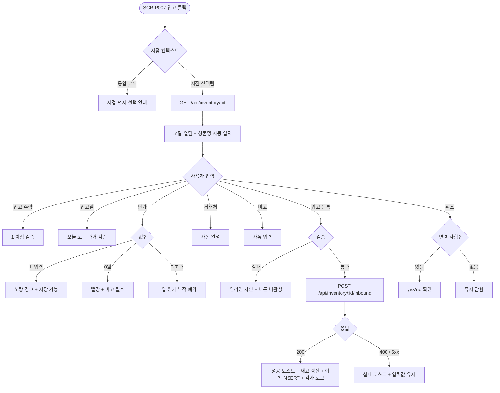

# DLG-P012 입고 등록 다이얼로그

## 1. 다이얼로그 메타 정보

이 문서는 입고 등록 다이얼로그에 대한 자기완결형 요구사항 정의서입니다. 다른 문서를 함께 보지 않아도 이 문서 한 장만으로 모달 안의 모든 영역, 모든 입력 필드, 모든 권한, 모든 예외 처리, 운영 정책까지 전부 이해하고 구현할 수 있도록 작성합니다.

| 항목 | 값 |
|---|---|
| 작성일 | 2026-05-22 |
| 버전 | v1.0 |
| 상태 | 최신 통합본 반영 (정합화 완료) |
| 도메인 | D05 상품관리 |
| 다이얼로그 ID | DLG-P012 |
| 다이얼로그명 | 입고 등록 |
| 유형 | 입력·저장 모달 (재고 증가) |
| 부모 화면 | SCR-P007 재고 관리 |
| 기능코드 | PRD-07 (재고 관리) |
| 우선순위 | P1 (재고 운영 핵심) |

## 2. 다이얼로그 개요와 목적

입고 등록 다이얼로그는 실물 상품(category=PRODUCT, productType=GENERAL)의 입고 수량을 시스템에 기록하는 모달입니다. 거래처에서 운동복 100벌이 입고되면 매니저가 SCR-P007 재고 관리 행의 [입고] 버튼을 눌러 이 모달을 띄우고, 입고 수량·날짜·단가·거래처·비고를 입력해 저장합니다. 저장 시 현재 재고가 입고 수량만큼 즉시 증가하고, 단가가 입력되었으면 매입 원가가 누적되어 SCR-S004 매출통계의 마진율 분석에 반영되며, 입출고 이력에 자동으로 기록됩니다. 거래처가 입력되면 거래처별 매입 통계에도 집계됩니다.

이 모달의 핵심 책임은 "실물 상품의 입고를 빠짐없이 추적 가능한 형태로 기록"하는 것입니다. 단가가 입력되지 않으면 매입 원가 누적이 불가능하므로 노랑 경고가 표시되고, 단가가 0원이면 비고 입력이 필수로 강제되어 무료 입고의 사유를 운영자가 기록하도록 합니다. 모든 입고는 처리자·시간·사유와 함께 SCR-097 감사 로그에 자동 INSERT되어 사후 추적이 가능합니다.

## 3. 호출 트리거와 진입 경로

이 다이얼로그는 SCR-P007 재고 관리 페이지의 행 액션에서 [입고] 버튼을 눌렀을 때 호출됩니다. 권한은 매니저·재고 관리 권한 보유 직원·센터장·슈퍼관리자에 한정되며, 일반 직원에게는 [입고] 버튼이 화면에 표시되지 않습니다.

본사 통합 모드에서는 입고가 지점 단위로 처리되어야 하므로 통합 모드에서 [입고]를 누르면 "지점을 먼저 선택해 주세요"라는 안내가 표시되고 모달이 호출되지 않습니다.

다이얼로그를 열면 대상 상품명이 자동으로 입력된 상태로 폼이 표시됩니다. 상품명은 변경할 수 없으며, 다른 상품의 입고는 SCR-P007 목록에서 다른 행의 [입고]를 다시 눌러 새 모달을 열어야 합니다.

## 4. 레이아웃과 UI 구성

다이얼로그는 화면 중앙에 떠 있는 표준 사이즈의 모달이며, 어두운 오버레이가 어드민 화면 위에 깔립니다.

모달 상단 헤더에는 좌측에 "입고 등록"이라는 타이틀과 그 옆에 대상 상품명이 작게 표시되어 운영자가 어느 상품을 입고 등록하는지 즉시 확인할 수 있도록 합니다. 우측 끝에는 X 아이콘이 배치됩니다.

모달 본문은 세로로 정렬된 입력 폼입니다. 입력 필드는 다음 순서로 배치됩니다.

상품명 표시 행은 자동 입력된 readonly 상자입니다. 변경 불가능하며 회색 톤으로 표시되어 다른 입력 필드와 시각적으로 구분됩니다.

입고 수량 입력은 숫자 입력으로 1 이상의 정수만 허용됩니다. 0 또는 음수, 소수, 비숫자 입력 시 인라인 차단되며 라벨 옆에 "필수" 표시가 빨강으로 작게 붙습니다.

입고일 입력은 날짜 피커로 기본값이 오늘 날짜입니다. 미래 날짜는 차단되며 사용자가 직접 변경하면 그 날짜로 저장됩니다.

단가 입력은 숫자 입력(원 단위)으로 선택 입력입니다. 입력하지 않으면 매입 원가 누적이 불가능하다는 노랑 경고가 인라인으로 표시됩니다. 0원을 입력하면 빨강 인라인 경고와 함께 비고 필수가 강제되고, 0보다 큰 정상 값을 입력하면 매입 원가가 자동으로 누적됩니다.

거래처 입력은 텍스트 자유 입력(선택)입니다. 거래처별 매입 통계를 위해 입력이 권장되지만 필수는 아닙니다. 운영자 오타로 거래처 통계가 흩어지는 것을 막기 위해 자동 완성이 적용되어 기존 거래처가 후보로 제안됩니다.

비고 입력은 textarea(선택)입니다. 단가가 0원이거나 운영자가 별도 메모를 남기고 싶을 때 사용합니다. 단가 0원일 때는 비고가 필수로 강제됩니다.

모달 하단에는 [취소] / [입고 등록] 버튼이 우측 정렬로 배치됩니다. [입고 등록]은 primary 톤, [취소]는 secondary 톤입니다.

## 5. 버튼·아이콘·링크 액션 전체 정의

입력 필드의 모든 변경은 즉시 폼 상태에 반영되며, 별도 적용 버튼 없이 [입고 등록] 시점에 한 번에 백엔드로 전송됩니다.

거래처 자동 완성은 입력 도중 300ms 디바운스 후 기존 거래처 후보가 드롭다운으로 표시됩니다. 사용자가 후보를 선택하면 거래처가 자동 입력되고, 후보가 없으면 신규 거래처로 저장됩니다.

[입고 등록] 버튼은 폼 전체 값을 `POST /api/inventory/:id/inbound`로 전송합니다. 검증 통과 시 응답으로 새 현재 재고가 내려오며 모달이 닫히고 SCR-P007 행이 즉시 갱신되며 성공 토스트가 표시됩니다. 변경 내역은 SCR-097 감사 로그에 비동기 INSERT됩니다.

[취소] 버튼은 변경 사항을 폐기하고 모달을 닫습니다. 입력 도중 [취소], ESC, 또는 모달 외부 오버레이 클릭으로 닫으려고 할 때 변경 사항이 있으면 "변경 사항이 사라집니다. 닫으시겠습니까?"라는 yes/no 확인이 한 번 표시됩니다.

X 아이콘은 [취소]와 동일하게 동작합니다.

모든 버튼은 클릭 후 응답이 돌아오기 전까지 자동으로 비활성화되어 더블클릭에 의한 중복 입고가 차단됩니다.

## 6. 호출되는 모달 동작

이 모달은 자식 모달을 호출하지 않습니다. [취소] 시 변경 사항 폐기 확인 yes/no는 별도 모달이 아닌 모달 내부 작은 확인 영역으로 표시됩니다.

## 7. 토스트와 확인 팝업과 알럿

성공 토스트는 우측 상단에 녹색 계열로 5초 동안 표시됩니다. "입고가 등록되었어요" 기본 문구이며, 입고 결과로 안전 재고 미달이 해소된 경우 추가 토스트 "안전 재고 이상으로 회복되었어요"가 함께 표시됩니다.

실패 토스트는 빨강 계열로 표시되며 "입고를 등록하지 못했어요"와 함께 "다시 시도" 보조 액션이 따라옵니다. 네트워크 오류는 1회 자동 재시도 후 사용자 액션을 기다립니다.

인라인 검증 메시지는 입고 수량 0 이하, 입고일 미래, 단가 0원 + 비고 미입력, 단가 미입력(노랑 경고)에 사용됩니다. 검증 실패 시 [입고 등록] 버튼이 비활성화됩니다.

확인 팝업은 입력 도중 [취소]/ESC/오버레이 클릭으로 닫으려고 할 때의 yes/no 확인입니다. 변경 사항이 없으면 즉시 닫힙니다.

알럿은 권한 없는 계정의 우회 호출 시에만 발생하며, 백엔드 403 응답과 함께 "권한이 없어요" 토스트가 표시되고 모달이 자동으로 닫힙니다.

## 8. 데이터 흐름과 외부 연동

모달 열림 시 `GET /api/inventory/:id`로 대상 상품의 현재 재고와 정보를 fetch 합니다. 응답에는 상품명, 현재 재고, 안전 재고, 카테고리가 포함되며 폼의 상품명 행에 표시됩니다.

거래처 자동 완성은 `GET /api/inventory/suppliers?q=`로 기존 거래처 후보를 조회합니다.

[입고 등록] 시 `POST /api/inventory/:id/inbound`로 전송됩니다. 본문에 입고 수량·입고일·단가·거래처·비고가 들어가며, 응답으로 새 현재 재고, 누적 매입 원가, 입출고 이력 ID가 내려옵니다.

저장 성공 시 백엔드에서 다음 작업이 자동으로 일어납니다. 첫째, 입출고 이력 테이블에 INSERT됩니다(구분: 입고, 수량 +N, 잔량: 갱신 후, 단가, 거래처, 처리자, 시간, 비고). 둘째, 단가가 입력되었으면 매입 원가가 가중 평균 방식으로 갱신됩니다(SCR-S004 마진율 분석에 반영). 셋째, 거래처가 입력되었으면 거래처별 매입 통계에 누적됩니다. 넷째, SCR-097 감사 로그에 `actor_id`, `product_id`, `branch_id`, `action`(INBOUND), `quantity`, `before`(이전 재고), `after`(새 재고), `unit_price`, `supplier`, `reason`(비고), `timestamp`가 INSERT됩니다.

부족 알림 해소 이벤트는 입고 후 현재 재고가 안전 재고 이상이 되었으면 자동으로 발송되어 NFR-19 알림 센터에서 "안전 재고 회복" 안내가 표시됩니다.

본사 통합 모드에서는 입고가 지점 컨텍스트 필수이므로, 통합 모드에서 직접 API 호출이 들어오면 400 응답이 반환됩니다.

## 9. 화면 상태와 예외 처리

이 다이얼로그가 가질 수 있는 상태는 다음과 같습니다.

로딩 중 상태는 모달 열림 직후 상품 정보 fetch 짧은 순간이며 상품명 자리에 스켈레톤이 표시됩니다.

기본 입력 상태는 폼이 자동 채워진 후 일반 상태이며 모든 입력이 활성화되어 있습니다.

검증 실패 상태는 입고 수량 0 이하, 입고일 미래, 단가 0원 + 비고 미입력 등 검증이 실패한 상태이며 [입고 등록] 버튼이 비활성화됩니다.

단가 미입력 경고 상태는 단가가 비어 있는 상태로, 노랑 경고가 인라인으로 표시되지만 [입고 등록]은 활성화되어 매입 원가 누적 없이 저장이 가능합니다.

저장 중 상태는 [입고 등록] 클릭 후 응답을 기다리는 동안이며 모든 버튼이 비활성화되고 [입고 등록] 자리에 로딩 스피너가 표시됩니다.

저장 성공 상태는 응답 200 후 모달이 닫히기 직전의 짧은 순간입니다.

저장 실패 상태는 5xx, 400, 422 응답 후 모달이 열린 상태에서 실패 토스트가 표시되는 상태이며 입력값은 유지됩니다.

예외 케이스별 처리는 다음과 같이 정의됩니다.

입고 수량 0 이하·비숫자·소수 입력은 인라인 차단됩니다.

입고일 미래 입력은 "입고일은 오늘 또는 과거여야 해요" 인라인 차단됩니다.

단가 미입력은 노랑 경고와 함께 저장 가능합니다. 매입 원가 누적이 안 된다는 점이 안내됩니다.

단가 0원 입력은 빨강 인라인 경고 + 비고 필수입니다. 무료 입고의 사유를 비고에 입력해야 [입고 등록] 활성화됩니다.

거래처 미입력은 "미지정" 그룹으로 거래처별 매입 통계에 집계됩니다.

거래처 자유 입력에 오타가 있으면 자동 완성으로 정규화를 권장합니다.

본사 통합 모드 + 입고 시도는 "지점을 먼저 선택해 주세요" 안내가 표시되어 모달이 호출되지 않습니다.

권한 없는 계정의 우회 호출은 모달이 자동으로 닫히고 "권한이 없어요" 토스트가 표시됩니다.

네트워크 오류는 1회 자동 재시도 후 사용자 액션을 기다립니다.

상품 비활성 + 재고 보유 상태에서도 입고 등록은 정상 동작합니다. 신규 판매만 차단되며 재고 관리는 정상이라는 운영 정책 때문입니다.

## 10. 권한별 처리

이 다이얼로그는 매니저 이상 또는 재고 관리 권한 보유 직원에 한정됩니다.

슈퍼관리자, 본사 최고관리자, 센터장, 매니저는 입고 등록을 자유롭게 수행할 수 있습니다.

재고 관리 권한 보유 직원도 입고 등록이 가능합니다.

FC, 트레이너, 스태프, 프런트, 일반 직원은 SCR-P007에서 [입고] 버튼이 보이지 않아 모달이 호출되지 않습니다.

readonly는 SCR-P007 진입 자체가 차단되어 이 모달에 접근할 수 없습니다.

본사 통합 모드 + 본사 권한자는 입고 시 지점 컨텍스트 선택이 필수이며, 지점을 선택하지 않은 상태에서는 모달이 호출되지 않습니다.

모든 권한 차단 이벤트는 SCR-097 감사 로그에 기록되어 사후 추적이 가능합니다.

## 11. 메인 흐름

## 12. 핵심 디자인 요청사항

상품명 readonly 표시 박스는 다른 입력 필드와 시각적으로 명확히 구분되어 운영자가 "이 필드는 변경 불가"임을 즉시 인식해야 합니다. 회색 톤 배경과 lock 아이콘이 함께 표시되면 좋습니다.

입고 수량 입력은 큰 숫자 입력 박스로 표시되어 운영자가 빠르게 숫자만 입력할 수 있게 합니다. 우측에 "개" 같은 단위가 작게 표시됩니다.

날짜 피커는 표준 캘린더 위젯이며 오늘 날짜가 강조 색상으로 표시되고 미래 날짜는 회색으로 비활성화됩니다.

단가 입력 우측에는 "원" 단위가 표시되고, 입력 도중 천 단위 콤마가 자동으로 들어갑니다. 단가 0원·미입력의 경고는 입력 박스 바로 아래 인라인 메시지로 표시되어 사용자의 시선이 자연스럽게 안내로 이어집니다.

거래처 자동 완성 드롭다운은 입력 박스 바로 아래에 부드럽게 슬라이드 인 되어 사용자의 입력을 방해하지 않습니다.

비고 textarea는 3~4줄 정도의 적당한 세로 영역으로 표시되어 한 줄짜리 메모부터 상세 사유까지 자연스럽게 입력할 수 있게 합니다.

[입고 등록] 버튼은 큼직한 primary 톤, [취소]는 secondary 톤으로 우선순위가 명확합니다. 검증 실패 또는 저장 중에는 [입고 등록]이 비활성화되어 시각적으로 회색 처리됩니다.

## 13. 운영 정책 (이 다이얼로그에 연결된 부분)

입고 등록은 실물 상품의 재고 변동을 시스템에 빠짐없이 기록하기 위한 도구입니다. 모든 입고는 처리자·시간·수량·단가·거래처·사유와 함께 입출고 이력에 자동 INSERT되어 사후 추적이 가능합니다.

단가 입력 정책은 선택이지만 입력 시 매입 원가 추적이 가능해진다는 점에서 권장됩니다. 단가가 입력되면 가중 평균 방식으로 매입 원가가 누적되어 SCR-S004 매출통계의 마진율 분석(판매가 - 평균 매입가) / 판매가에 활용됩니다.

단가 0원 정책은 무료 입고(샘플·증정 등)의 사유를 비고에 필수로 기록하도록 강제하는 정책입니다. 이는 무료 입고가 매입 원가에 잘못 누적되거나 회계상 누락되는 것을 막기 위한 안전 장치입니다.

거래처 정책은 자유 텍스트 입력 + 자동 완성입니다. 거래처별 매입 통계를 위해 입력이 권장되며, 운영자 오타로 통계가 흩어지지 않도록 기존 거래처 후보가 자동 완성 드롭다운으로 제안됩니다. 입력하지 않으면 "미지정" 그룹으로 집계됩니다.

본사·지점 컨텍스트 정책은 입고가 지점 단위로 처리된다는 점입니다. 통합 모드에서는 어느 지점에 입고할지 모호하므로 지점 선택이 필수이며, 통합 모드 + 직접 호출은 백엔드 400으로 거부됩니다.

자동 알림 정책은 입고 후 현재 재고가 안전 재고 이상이 되면 NFR-19 알림 센터로 "안전 재고 회복" 안내가 자동 발송된다는 것입니다.

감사 로그 정책은 모든 입고를 5초 안에 SCR-097에서 조회 가능한 비동기 INSERT입니다. 기록되는 필드는 `actor_id`, `product_id`, `branch_id`, `action`(INBOUND), `quantity`, `before`, `after`, `unit_price`, `supplier`, `reason`, `timestamp`이며 이는 재고 운영 행위의 추적성을 보장하기 위한 정책입니다.

권한 정책은 매니저·재고 관리 권한 보유 직원·센터장·슈퍼관리자에 한정됩니다. 일반 직원의 직접 입고를 차단해 재고 변동이 운영자 실수로 잘못 기록되는 것을 막습니다.

상품 비활성 + 재고 보유 정책은 신규 판매는 차단되지만 재고 관리는 정상 동작한다는 것입니다. 비활성 상품에도 입고 등록이 가능하며, 이는 운영자가 비활성 상품의 재고를 정리하기 위해 필요한 정책입니다.

이상의 정책은 이 모달을 구현하고 운영하는 사람이 별도 문서 없이 이 한 장만 보면 이해할 수 있도록 풀어 적었습니다.
