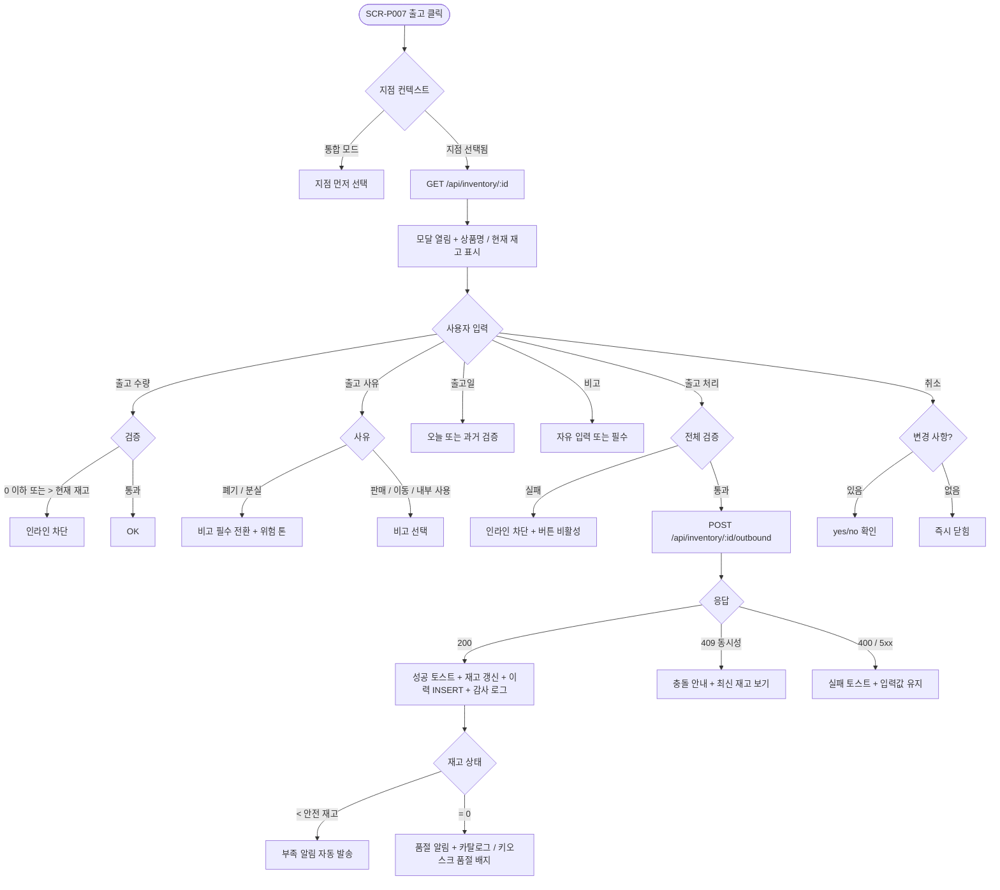

# DLG-P013 출고 등록 다이얼로그

## 1. 다이얼로그 메타 정보

이 문서는 출고 등록 다이얼로그에 대한 자기완결형 요구사항 정의서입니다. 다른 문서를 함께 보지 않아도 이 문서 한 장만으로 모달 안의 모든 영역, 모든 입력 필드, 모든 권한, 모든 예외 처리, 운영 정책까지 전부 이해하고 구현할 수 있도록 작성합니다.

| 항목 | 값 |
|---|---|
| 작성일 | 2026-05-22 |
| 버전 | v1.0 |
| 상태 | 최신 통합본 반영 (정합화 완료) |
| 도메인 | D05 상품관리 |
| 다이얼로그 ID | DLG-P013 |
| 다이얼로그명 | 출고 등록 |
| 유형 | 입력·저장 모달 (재고 차감) |
| 부모 화면 | SCR-P007 재고 관리 |
| 기능코드 | PRD-07 (재고 관리) |
| 우선순위 | P1 (재고 운영 핵심) |

## 2. 다이얼로그 개요와 목적

출고 등록 다이얼로그는 실물 상품의 출고 수량을 시스템에 기록하는 모달입니다. 유통기한 초과 보충제 폐기, 다른 지점으로 이동, 내부 직원 사용, 분실·파손 등 POS 판매가 아닌 모든 수기 출고가 이 모달을 통해 처리됩니다. 매니저가 SCR-P007 재고 관리 행의 [출고] 버튼을 눌러 모달을 띄우고, 출고 수량·사유·출고일·비고를 입력해 저장하면 현재 재고가 출고 수량만큼 즉시 차감되고 입출고 이력에 기록됩니다.

이 모달의 핵심 책임은 "재고 변동의 사유와 흐름을 명확히 추적 가능한 형태로 기록"하는 것입니다. 폐기·분실 사유는 비고 입력이 필수로 강제되어 운영자가 손실 사유를 빠짐없이 남기도록 하고, 출고 수량이 현재 재고를 초과하면 인라인 차단되어 재고 음수를 방지합니다. POS 판매로 인한 자동 차감은 SCR-S003 결제 완료 이벤트에서 자동 처리되므로 이 모달과 별개입니다. 모든 수기 출고는 처리자·시간·사유와 함께 SCR-097 감사 로그에 자동 INSERT됩니다.

## 3. 호출 트리거와 진입 경로

이 다이얼로그는 SCR-P007 재고 관리 페이지의 행 액션에서 [출고] 버튼을 눌렀을 때 호출됩니다. 권한은 매니저·재고 관리 권한 보유 직원·센터장·슈퍼관리자에 한정됩니다. 일반 직원은 POS 판매를 통한 자동 차감만 가능하며 수기 출고는 차단됩니다.

본사 통합 모드에서는 출고가 지점 단위로 처리되어야 하므로 통합 모드에서 [출고]를 누르면 "지점을 먼저 선택해 주세요" 안내가 표시되고 모달이 호출되지 않습니다.

다이얼로그를 열면 대상 상품명과 현재 재고가 자동 표시된 상태로 폼이 시작됩니다. 상품명과 현재 재고는 readonly이며, 출고 수량은 현재 재고 이하로만 입력 가능합니다.

## 4. 레이아웃과 UI 구성

다이얼로그는 화면 중앙에 떠 있는 표준 사이즈의 모달입니다.

모달 상단 헤더에는 좌측에 "출고 등록"이라는 타이틀과 그 옆에 대상 상품명이 작게 표시됩니다. 우측 끝에는 X 아이콘이 배치됩니다.

본문 최상단에는 상품명 readonly 표시와 현재 재고 readonly 표시가 가로로 배치됩니다. 현재 재고는 "현재 47개" 같은 형태로 큰 글씨로 표시되어 운영자가 한눈에 출고 가능 한도를 파악할 수 있도록 합니다.

상품명·현재 재고 아래에는 출고 수량 입력이 있습니다. 숫자 입력으로 1 이상 ~ 현재 재고 이하의 정수만 허용됩니다. 0 또는 음수, 소수, 현재 재고 초과 입력 시 인라인 차단됩니다. 입력 옆에 "/현재 47개" 같은 형태로 한도가 작게 표시되어 운영자가 즉시 알 수 있습니다.

출고 수량 아래에는 출고 사유 라디오 또는 드롭다운이 있습니다. "판매 / 폐기 / 이동 / 내부 사용 / 분실" 5종 중 하나를 선택합니다. 미선택 시 [출고 처리] 버튼이 비활성화됩니다. 폐기 또는 분실을 선택하면 비고 입력이 필수로 전환되고 라벨 옆에 "필수" 표시가 빨강으로 작게 붙습니다.

출고 사유 아래에는 출고일 입력이 있습니다. 날짜 피커이며 기본값이 오늘 날짜입니다. 미래 날짜는 차단되며 사용자가 직접 변경하면 그 날짜로 저장됩니다.

출고일 아래에는 비고 입력 textarea가 있습니다. 출고 사유가 폐기 또는 분실이면 필수, 판매·이동·내부 사용이면 선택입니다. 사유가 "이동"인 경우 이동 대상 지점을 비고에 명시하도록 placeholder가 동적으로 변경됩니다("이동 대상 지점을 적어 주세요" 등).

모달 하단에는 [취소] / [출고 처리] 버튼이 우측 정렬로 배치됩니다. [출고 처리]는 primary 톤이지만 폐기·분실 사유에서는 위험 액션 톤(주황·빨강 계열)으로 강조되어 운영자에게 시각적 경고를 줍니다.

## 5. 버튼·아이콘·링크 액션 전체 정의

출고 수량 입력은 즉시 폼 상태에 반영되며, 현재 재고 초과 시 인라인 차단됩니다.

출고 사유 라디오는 즉시 선택이 적용되며, 폐기·분실 선택 시 비고 입력 라벨 옆에 "필수" 표시가 동적으로 추가됩니다.

날짜 피커는 기본값이 오늘이며 미래 날짜 선택은 비활성화됩니다.

[출고 처리] 버튼은 폼 전체 값을 `POST /api/inventory/:id/outbound`로 전송합니다. 검증 통과 시 응답으로 새 현재 재고가 내려오며 모달이 닫히고 SCR-P007 행이 즉시 갱신됩니다. 변경 내역은 SCR-097 감사 로그에 비동기 INSERT됩니다. 출고 후 현재 재고가 안전 재고 미달 또는 0이 되면 부족·품절 알림이 자동 발송됩니다.

[취소] 버튼은 변경 사항을 폐기하고 모달을 닫습니다. 입력 도중 닫으려고 할 때 변경 사항이 있으면 yes/no 확인이 표시됩니다.

X 아이콘은 [취소]와 동일하게 동작합니다.

모든 버튼은 클릭 후 응답이 돌아오기 전까지 자동으로 비활성화되어 더블클릭에 의한 중복 출고가 차단됩니다.

## 6. 호출되는 모달 동작

이 모달은 자식 모달을 호출하지 않습니다. [취소] 시 변경 사항 폐기 확인 yes/no는 별도 모달이 아닌 모달 내부 작은 확인 영역으로 표시됩니다.

## 7. 토스트와 확인 팝업과 알럿

성공 토스트는 우측 상단에 녹색 계열로 5초 동안 표시됩니다. "출고가 처리되었어요"가 기본 문구이며, 출고 후 안전 재고 미달이 되었으면 추가 토스트 "안전 재고 미달입니다. 발주를 검토해 주세요"가 함께 표시되고, 재고 0이 되면 "품절되었습니다"가 표시됩니다.

실패 토스트는 빨강 계열로 표시되며 "출고를 처리하지 못했어요"와 함께 "다시 시도" 보조 액션이 따라옵니다.

인라인 검증 메시지는 출고 수량 0 이하, 출고 수량 > 현재 재고, 출고 사유 미선택, 폐기·분실 + 비고 미입력에 사용됩니다. 검증 실패 시 [출고 처리] 버튼이 비활성화됩니다.

확인 팝업은 폐기·분실 사유 + 큰 수량(10개 이상)에서 한 번 추가 안내되는 "정말 폐기 처리하시겠어요?" yes/no가 표시됩니다(테넌트 정책에 따라 적용). 입력 도중 [취소]/ESC/오버레이 클릭으로 닫으려고 할 때의 변경 사항 폐기 yes/no도 동일하게 동작합니다.

알럿은 권한 없는 계정의 우회 호출 시 백엔드 403 응답과 함께 "권한이 없어요" 토스트가 표시되고 모달이 자동으로 닫힙니다. 동시성 충돌(다른 직원이 같은 상품의 출고를 동시 처리한 경우)은 "다른 직원이 동시에 출고를 처리했어요" 모달과 함께 [최신 재고 보기] 액션이 제공됩니다.

## 8. 데이터 흐름과 외부 연동

모달 열림 시 `GET /api/inventory/:id`로 대상 상품의 현재 재고와 정보를 fetch 합니다.

[출고 처리] 시 `POST /api/inventory/:id/outbound`로 전송됩니다. 본문에 출고 수량·사유·출고일·비고가 들어가며, 응답으로 새 현재 재고와 입출고 이력 ID가 내려옵니다.

저장 성공 시 백엔드에서 다음 작업이 자동으로 일어납니다. 첫째, 입출고 이력 테이블에 INSERT됩니다(구분: 출고, 수량 -N, 잔량: 갱신 후, 사유, 처리자, 시간, 비고). 둘째, SCR-097 감사 로그에 `actor_id`, `product_id`, `branch_id`, `action`(OUTBOUND), `quantity`, `before`, `after`, `outbound_reason`, `reason`(비고), `timestamp`가 INSERT됩니다. 셋째, 출고 후 현재 재고 < 안전 재고이면 NFR-19 알림 센터로 부족 알림이 발송되며 동일 상품 24시간 1회로 스팸이 방지됩니다. 넷째, 재고 0 도달 시 즉시 품절 알림이 발송되고 카탈로그(PRD-05)·키오스크에 "품절" 배지가 자동 표시됩니다.

동시성 충돌은 비관적 락 또는 낙관적 락으로 처리됩니다. POS 자동 차감과 수기 출고가 동시에 발생하면 후행 요청은 409 또는 재시도 응답이 반환되어 race condition으로 인한 재고 음수가 방지됩니다.

본사 통합 모드에서는 출고가 지점 컨텍스트 필수이므로 통합 모드 + 직접 호출은 400 응답이 반환됩니다.

## 9. 화면 상태와 예외 처리

이 다이얼로그가 가질 수 있는 상태는 다음과 같습니다.

로딩 중 상태는 모달 열림 직후 상품 정보 fetch 짧은 순간이며 상품명·현재 재고 자리에 스켈레톤이 표시됩니다.

기본 입력 상태는 폼이 자동 채워진 후 일반 상태입니다.

검증 실패 상태는 출고 수량 초과·사유 미선택·폐기/분실 + 비고 미입력 등 검증이 실패한 상태이며 [출고 처리] 버튼이 비활성화됩니다.

위험 액션 상태는 폐기·분실 사유가 선택된 상태로, [출고 처리] 버튼이 위험 톤(주황·빨강)으로 변경되어 운영자에게 시각적 경고를 줍니다.

저장 중 상태는 [출고 처리] 클릭 후 응답을 기다리는 동안이며 모든 버튼이 비활성화되고 [출고 처리] 자리에 로딩 스피너가 표시됩니다.

저장 성공 상태는 응답 200 후 모달이 닫히기 직전의 짧은 순간입니다.

저장 실패 상태는 5xx, 400, 409, 422 응답 후 모달이 열린 상태에서 실패 토스트가 표시되는 상태이며 입력값은 유지됩니다.

동시성 충돌 상태는 409 응답 후 모달이 열려 있는 상태이며 [최신 재고 보기] 액션과 함께 안내가 표시됩니다.

예외 케이스별 처리는 다음과 같이 정의됩니다.

출고 수량 0 이하·비숫자·소수 입력은 인라인 차단됩니다.

출고 수량 > 현재 재고는 "현재 재고 {N}개를 초과할 수 없어요" 인라인 차단됩니다.

출고 사유 미선택은 "사유를 선택해 주세요" 인라인 차단됩니다.

폐기·분실 사유 + 비고 미입력은 "비고를 입력해 주세요" 인라인 차단됩니다.

출고일 미래는 "출고일은 오늘 또는 과거여야 해요" 인라인 차단됩니다.

POS 자동 차감과 동시성 충돌은 비관적 락 또는 409 응답으로 처리되어 재고 음수가 방지됩니다.

본사 통합 모드 + 출고 시도는 "지점을 먼저 선택해 주세요" 안내가 표시되어 모달이 호출되지 않습니다.

권한 없는 계정의 우회 호출은 모달이 자동으로 닫히고 "권한이 없어요" 토스트가 표시됩니다.

네트워크 오류는 1회 자동 재시도 후 사용자 액션을 기다립니다.

## 10. 권한별 처리

이 다이얼로그는 매니저 이상 또는 재고 관리 권한 보유 직원에 한정됩니다.

슈퍼관리자, 본사 최고관리자, 센터장, 매니저는 출고 등록을 자유롭게 수행할 수 있습니다.

재고 관리 권한 보유 직원도 출고 등록이 가능합니다.

FC, 트레이너, 스태프, 프런트, 일반 직원은 SCR-P007에서 [출고] 버튼이 보이지 않아 모달이 호출되지 않습니다. POS 판매를 통한 자동 차감은 별개로 정상 동작합니다.

readonly는 SCR-P007 진입 자체가 차단되어 이 모달에 접근할 수 없습니다.

본사 통합 모드 + 본사 권한자는 출고 시 지점 컨텍스트 선택이 필수이며, 지점을 선택하지 않은 상태에서는 모달이 호출되지 않습니다.

폐기·분실 사유는 일부 테넌트에서 owner 이상 권한으로 추가 제한될 수 있습니다. 그 경우 매니저에게는 사유 라디오에서 폐기·분실 옵션이 회색 비활성으로 표시됩니다.

모든 권한 차단 이벤트는 SCR-097 감사 로그에 기록됩니다.

## 11. 메인 흐름

## 12. 핵심 디자인 요청사항

현재 재고 표시는 큰 글씨로 폼 상단에 강조되어 운영자가 출고 한도를 즉시 파악할 수 있어야 합니다. 안전 재고 미달인 경우 노랑·주황 톤, 재고 0인 경우 빨강 톤으로 색상이 동적으로 변경됩니다.

출고 수량 입력 우측에는 "/현재 47개" 같은 한도 안내가 작게 따라붙어 사용자가 입력 도중 한도를 잊지 않도록 합니다.

출고 사유 라디오는 5개 옵션이 한 줄에 가로 정렬되며, 폐기·분실 옵션 옆에는 작은 위험 아이콘이 표시되어 시각적 경고를 줍니다.

폐기·분실 사유 선택 시 [출고 처리] 버튼 색상이 primary에서 위험 톤(주황·빨강)으로 변경되어 운영자가 클릭 직전에 한 번 더 신중해질 수 있게 합니다.

비고 textarea는 사유에 따라 placeholder가 동적으로 변경됩니다. 이동 사유 시 "이동 대상 지점을 적어 주세요", 폐기 시 "폐기 사유를 자세히 적어 주세요", 분실 시 "분실 경위를 적어 주세요" 등으로 운영자의 입력을 유도합니다.

[출고 처리] 버튼은 검증 통과 시 활성화되고 실패 시 회색 처리되어 사용자가 어떤 입력이 부족한지 인라인 메시지로 안내됩니다.

## 13. 운영 정책 (이 다이얼로그에 연결된 부분)

출고 사유 정책은 5종(판매·폐기·이동·내부 사용·분실)으로 고정됩니다. 사유별로 통계가 별도 집계되어 SCR-S004 매출통계와 운영 리포트에서 폐기율·분실률 같은 손실 KPI 분석에 활용됩니다.

폐기·분실 비고 필수 정책은 손실 사유를 빠짐없이 기록하기 위한 안전 장치입니다. 단순 클릭만으로 폐기가 처리되어 사유 추적이 어려워지는 것을 막기 위한 정책입니다.

재고 음수 차단 정책은 현재 재고 - 출고 수량 ≥ 0이 필수입니다. 음수 결과는 백엔드에서도 422로 차단되며 클라이언트 인라인 검증과 이중으로 보호됩니다.

POS 자동 차감과의 동시성 정책은 비관적 락 또는 낙관적 락으로 처리됩니다. SCR-S003 결제 완료 이벤트의 자동 차감과 이 모달의 수기 출고가 동시에 발생하는 race condition을 막아 재고 음수와 결제 트랜잭션 롤백을 방지합니다.

부족·품절 알림 정책은 출고 후 현재 재고 < 안전 재고 시 NFR-19 알림 센터로 자동 발송되고, 동일 상품 24시간 1회로 스팸을 방지합니다. 재고 0 도달 시에는 즉시 품절 알림이 발송되고 카탈로그·키오스크에 "품절" 배지가 자동 표시됩니다.

본사·지점 컨텍스트 정책은 입고와 동일하게 지점 단위로 처리됩니다. 통합 모드에서 어느 지점에 출고할지 모호하므로 지점 선택이 필수입니다.

이력 보존 정책은 최근 1년 즉시 조회, 1년 경과 SCR-097 감사 로그 이관입니다. 이는 DLG-P015 입출고 이력 다이얼로그와 동일한 정책입니다.

감사 로그 정책은 모든 출고를 5초 안에 SCR-097에서 조회 가능한 비동기 INSERT입니다. 기록되는 필드는 `actor_id`, `product_id`, `branch_id`, `action`(OUTBOUND), `quantity`, `before`, `after`, `outbound_reason`, `reason`(비고), `timestamp`이며 이는 손실 사유 추적성을 보장하기 위한 정책입니다.

권한 정책은 매니저·재고 관리 권한 보유 직원·센터장·슈퍼관리자에 한정됩니다. 일반 직원의 수기 출고는 차단되고 POS 자동 차감만 허용되어 임의의 재고 변동을 막습니다.

상품 비활성 + 재고 보유 정책은 출고가 정상 동작한다는 것입니다. 비활성 상품의 잔여 재고를 정리하기 위해 "이동" 사유 등으로 출고가 가능합니다.

이상의 정책은 이 모달을 구현하고 운영하는 사람이 별도 문서 없이 이 한 장만 보면 이해할 수 있도록 풀어 적었습니다.
