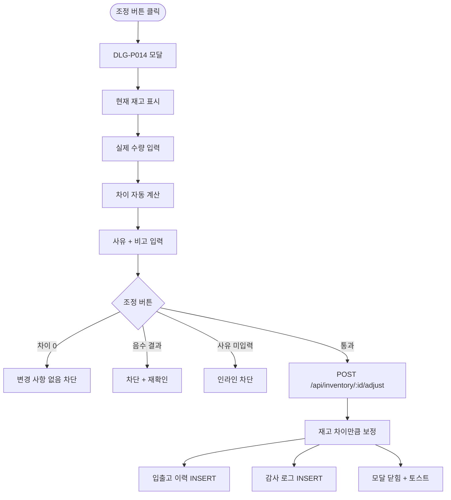

# DLG-P014 재고 조정 모달

## 1. 다이얼로그 메타 정보

| 항목 | 값 |
|---|---|
| 작성일 | 2026-05-22 |
| 버전 | v1.0 |
| 상태 | 최신 통합본 반영 (정합화 완료) |
| 도메인 | D05 상품관리 |
| 다이얼로그 ID | DLG-P014 재고조정 |
| 다이얼로그명 | 재고 조정 모달 |
| 다이얼로그 유형 | 중앙 모달 (Form Modal) |
| 우선순위 | P1 (출시 권장) |
| 기능코드 | PRD-07 |
| 계약코드 | PRD-07 |
| 호출 화면 | SCR-P007 재고관리 |
| 호출 트리거 | SCR-P007 행의 [조정] 버튼 클릭 |

## 2. 다이얼로그 개요와 목적

재고 조정 모달은 실사 후 시스템 재고와 실제 재고 사이의 차이를 보정하는 모달입니다. 실제 수량을 입력하면 시스템 수량과의 차이가 자동으로 계산되어 양수는 추가·음수는 감소로 적용되며, 사유 입력이 필수입니다. 분기별 실사·이동·분실·파손 같은 운영 이벤트를 시스템 재고에 반영하는 핵심 도구입니다.

이 모달은 재고 정합성을 유지하는 안전 장치이며, 모든 조정 이력은 처리자·시간·사유와 함께 감사 로그(SCR-097)에 기록됩니다.

## 3. 호출 트리거와 진입 경로

SCR-P007 재고 관리 화면의 행 액션 영역에서 [조정] 버튼을 클릭하면 호출됩니다. 권한이 있는 슈퍼관리자·센터장·매니저·재고 관리 권한자에게만 버튼이 보이므로 모달 호출이 가능합니다.

## 4. 레이아웃과 UI 구성

모달은 중앙 정렬된 컨테이너이며 다음 영역들로 구성됩니다.

모달 헤더에는 "재고 조정 - {상품명}" 제목과 닫기(X) 버튼이 표시됩니다.

본문에는 현재 시스템 재고 수량이 큰 글씨로 표시되고 그 아래에 입력 폼이 있습니다.

| 입력 항목 | 필수 여부 | 설명 |
|------|------|------|
| 실제 수량 | 필수 | 실사 후 확인된 실제 수량 |
| 차이 (자동 계산) | - | 실제 수량 - 시스템 수량, 양수는 +N, 음수는 -N |
| 사유 | 필수 | 텍스트 입력 (실사/분실/파손/이동/내부 사용/기타) |
| 조정일 | 선택 | 기본 오늘 |
| 비고 | 선택 | textarea |

차이가 자동 계산되어 시각화됩니다. 양수면 녹색(+N), 음수면 빨강(-N)으로 표시됩니다.

가장 아래에는 "취소" 버튼과 "조정" 버튼이 배치됩니다.

## 5. 입력 검증과 저장 규칙

실제 수량 입력 검증:
- 차이가 0이면 "변경 사항이 없어요" + 저장 차단입니다.
- 결과가 음수가 되도록 입력하면(실제 수량이 음수) 차단됩니다.
- 0 미만 음수 입력은 차단됩니다.

사유 입력은 필수이며 빈값은 인라인 "사유 입력 필수" + 저장 차단입니다.

저장 시 `POST /api/inventory/:id/adjust`가 호출되어 차이만큼 재고가 자동 보정되고 입출고 이력에 INSERT 됩니다. 감사 로그에 `actor_id, product_id, type='ADJUST', quantity=차이, before, after, reason`이 기록됩니다.

동시 조정 충돌은 비관적 락으로 처리되어 race condition이 방지됩니다.

## 6. 주요 UX 흐름

1. SCR-P007 행에서 [조정] 버튼 클릭
2. 모달 호출 + 현재 재고 수량 표시
3. 실사 후 실제 수량 입력 → 차이 자동 계산 시각화
4. 사유 선택 또는 입력
5. (선택) 조정일·비고 입력
6. "조정" 클릭 → 검증 → POST 호출 → 모달 닫힘 + 재고 갱신 + 이력 INSERT
7. "취소" 또는 ESC로 닫기

## 7. 화면 상태와 예외 처리

기본 표시 상태는 현재 재고가 표시되고 실제 수량 입력 대기 상태입니다.

조정 진행 중 상태는 "조정" 버튼이 로딩 스피너로 전환됩니다.

차이 자동 계산 상태는 실제 수량 입력 시 차이가 시각화된 상태입니다.

저장 실패 상태는 빨강 토스트 + 입력 보존입니다.

예외 케이스별 처리는 차이 0 차단, 음수 결과 차단, 사유 미입력 차단, 본사 통합 모드 + 등록 시도 "지점을 먼저 선택해주세요" 차단, 동시 조정 race condition 비관적 락 처리, 권한 없음 모달 진입 차단입니다.

## 8. 권한별 처리

슈퍼관리자·센터장·매니저·재고 관리 권한자만 모달 진입과 조정이 가능합니다. 일반 직원과 readonly는 진입 자체가 차단됩니다.

## 9. 메인 흐름

## 10. 운영 정책 (이 다이얼로그에 연결된 부분)

재고 조정 사유 필수 정책은 모든 재고 조정에 사유 입력이 필수이며 감사 로그에 기록된다는 것입니다. 운영 안정성을 위한 정책입니다.

차이 자동 계산 정책은 실제 수량 - 시스템 수량으로 자동 계산되며 양수는 추가·음수는 감소로 적용됩니다. 0이면 변경 없음으로 차단됩니다.

음수 차단 정책은 결과가 0 미만이 되도록 입력하면 차단되어 재고가 음수가 되는 것을 방지합니다.

동시성 락 정책은 비관적 락으로 race condition을 방지하여 같은 상품에 대한 동시 조정이 충돌 없이 처리된다는 것입니다.

본사 통합 모드 차단 정책은 본사 통합 모드에서 조정 시도 시 지점을 먼저 선택해야 진행 가능합니다.

감사 로그 정책은 모든 조정 이벤트가 SCR-097에 `actor_id, product_id, type='ADJUST', quantity=차이, before, after, reason`으로 INSERT 된다는 것입니다.

권한 정책은 슈퍼관리자·센터장·매니저·재고 관리 권한자만 모달 진입이 가능합니다.

이상의 모든 정책은 이 다이얼로그를 구현하고 운영하는 사람이 별도 문서 없이 이 한 장만 보면 이해할 수 있도록 풀어 적었습니다.
