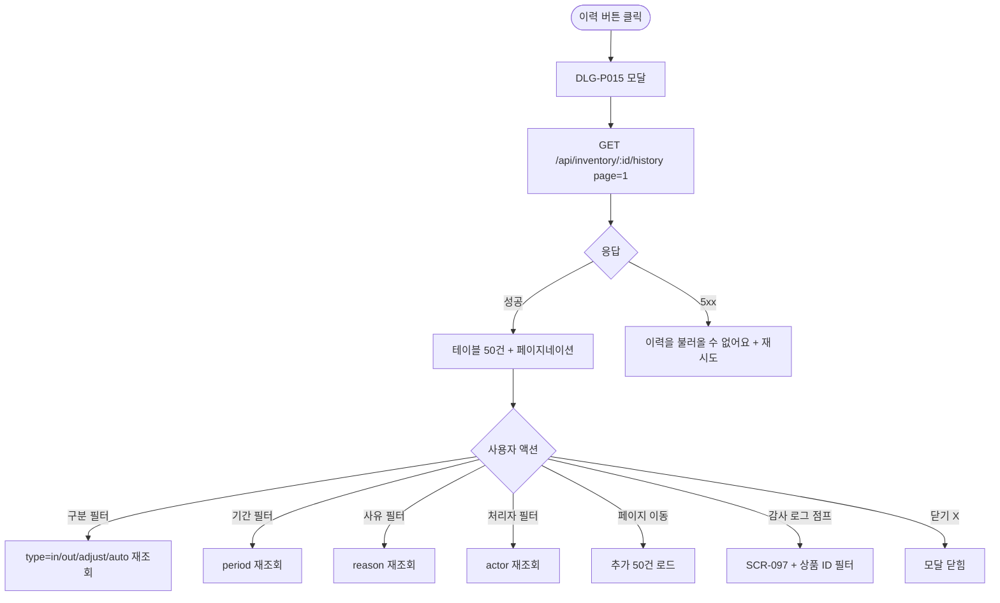

# DLG-P015 입출고 이력 모달

## 1. 다이얼로그 메타 정보

| 항목 | 값 |
|---|---|
| 작성일 | 2026-05-22 |
| 버전 | v1.0 |
| 상태 | 최신 통합본 반영 (정합화 완료) |
| 도메인 | D05 상품관리 |
| 다이얼로그 ID | DLG-P015 입출고이력 |
| 다이얼로그명 | 입출고 이력 모달 |
| 다이얼로그 유형 | 중앙 모달 (Read-Only Table + Pagination) |
| 우선순위 | P1 (출시 권장) |
| 기능코드 | PRD-07 |
| 계약코드 | PRD-07 |
| 호출 화면 | SCR-P007 재고관리 |
| 호출 트리거 | SCR-P007 행의 [이력] 버튼 클릭 |

## 2. 다이얼로그 개요와 목적

입출고 이력 모달은 특정 실물 상품의 입고·출고·조정·자동 차감 이력을 시간순으로 표시하는 조회 전용 모달입니다. 매입 원가 마진 분석, 폐기/분실 정기 리포트, 사후 감사 추적에 활용됩니다.

이 모달은 페이지네이션으로 50건씩 탐색하며 1년 경과 이력은 SCR-097 감사 로그에서 조회됩니다. 운영자가 어떤 직원이 언제 무엇을 처리했는지 추적할 수 있는 핵심 도구입니다.

## 3. 호출 트리거와 진입 경로

SCR-P007 재고 관리 화면의 행 액션 영역에서 [이력] 버튼을 클릭하면 호출됩니다. 권한과 무관하게 모든 운영자가 진입 가능합니다(일반 직원도 조회 가능).

## 4. 레이아웃과 UI 구성

모달은 중앙 정렬된 컨테이너(최대 폭 약 900px)이며 다음 영역들로 구성됩니다.

모달 헤더에는 "입출고 이력 - {상품명}" 제목과 닫기(X) 버튼이 표시됩니다.

본문 상단에는 필터 영역이 있습니다. 구분 필터(전체/입고/출고/조정/자동 차감), 기간 필터(전체/최근 7일/30일/90일/사용자 지정), 사유 필터, 처리자 필터가 가로로 배치됩니다.

필터 아래에는 이력 테이블이 있습니다. 컬럼은 좌측부터 일시(YYYY-MM-DD HH:mm), 구분(입고/출고/조정/자동 차감), 수량(+N/-N), 사유, 단가(입고 시), 처리자, 잔량의 7개 컬럼입니다.

구분 컬럼의 입고는 녹색 + 화살표(↑), 출고는 파랑 + 화살표(↓), 조정은 보라 + 변경 아이콘, 자동 차감은 회색 + POS 아이콘으로 시각적으로 구분됩니다.

수량은 양수(+N) 또는 음수(-N)으로 표시되며 색상도 함께 적용됩니다(+ 녹색, - 빨강).

테이블 아래에는 페이지네이션이 있고 50건씩 페이지를 넘기는 컨트롤(이전·다음·페이지 번호·총 건수)이 제공됩니다.

가장 아래에는 1년 경과 안내가 있습니다. "1년 경과 이력은 감사 로그(SCR-097)에서 조회 가능합니다" + 감사 로그 점프 링크가 표시됩니다.

## 5. 입력 검증과 저장 규칙

이 모달은 조회 전용이므로 입력 검증과 저장 규칙이 없습니다.

데이터는 `GET /api/inventory/:id/history?page=N&pageSize=50&type=&period=&reason=&actor=`로 조회됩니다.

## 6. 주요 UX 흐름

1. SCR-P007 행에서 [이력] 버튼 클릭으로 모달 호출
2. GET API로 첫 50건 로드 + 테이블 표시
3. 필터(구분·기간·사유·처리자)로 좁히기
4. 페이지네이션으로 추가 이력 탐색
5. 1년 경과 안내의 감사 로그 점프로 SCR-097 이동
6. 닫기(X) 또는 ESC로 모달 종료

## 7. 화면 상태와 예외 처리

로딩 중 상태는 테이블 자리에 스켈레톤이 표시됩니다.

정상 조회 상태는 이력 50건이 표시되고 페이지네이션이 활성화된 상태입니다.

빈 상태는 이력이 0건일 때로 "입출고 이력이 없습니다" 안내가 표시됩니다.

1만 건 초과 상태는 페이지네이션 또는 기간 필터로 처리됩니다.

데이터 로딩 실패 상태는 "이력을 불러올 수 없어요" + 재시도 버튼입니다.

예외 케이스별 처리는 1만 건 초과 페이지네이션·기간 필터, 처리자 탈퇴 시 "(탈퇴 직원)" 마스킹, 데이터 로딩 실패 시 재시도 옵션, 다른 사용자가 동시에 입출고 진행 중이면 5초 캐시 + [새로고침] 버튼 표시입니다.

## 8. 권한별 처리

모든 운영자(슈퍼관리자·센터장·매니저·재고 관리 권한자·일반 직원·readonly)가 모달 진입과 이력 조회가 가능합니다.

## 9. 메인 흐름

## 10. 운영 정책 (이 다이얼로그에 연결된 부분)

페이지네이션 정책은 50건씩 페이지를 넘기며 1만 건 초과는 페이지네이션 또는 기간 필터로 처리한다는 것입니다.

이력 보존 정책은 최근 1년은 즉시 조회이며 1년 경과는 SCR-097 감사 로그에서 조회된다는 것입니다.

탈퇴 직원 마스킹 정책은 처리자가 탈퇴한 경우 "(탈퇴 직원)"으로 마스킹됩니다.

구분 시각화 정책은 입고는 녹색, 출고는 파랑, 조정은 보라, 자동 차감은 회색으로 시각적으로 구분됩니다.

수량 시각화 정책은 양수는 녹색 + 화살표(↑), 음수는 빨강 + 화살표(↓)로 방향성을 알립니다.

조회 권한 정책은 모든 운영자가 이력 조회가 가능하다는 것입니다. 일반 직원도 접근 가능합니다.

조회 전용 정책은 이 모달이 변경 작업을 일으키지 않으며 조회만 가능하다는 것입니다.

이상의 모든 정책은 이 다이얼로그를 구현하고 운영하는 사람이 별도 문서 없이 이 한 장만 보면 이해할 수 있도록 풀어 적었습니다.
