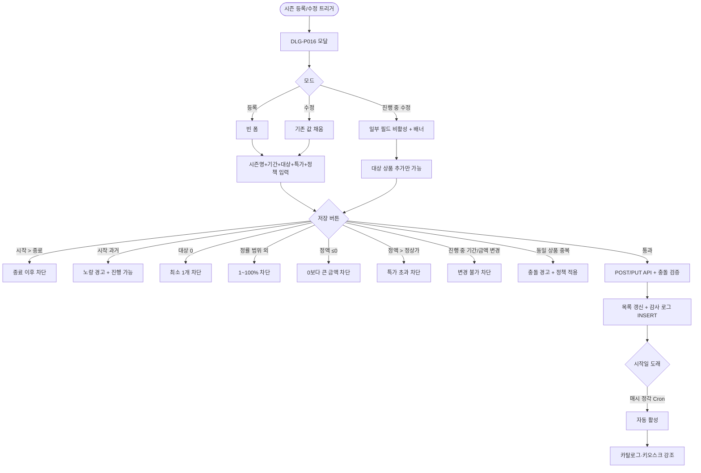

# DLG-P016 시즌 가격 등록/수정 모달

## 1. 다이얼로그 메타 정보

| 항목 | 값 |
|---|---|
| 작성일 | 2026-05-22 |
| 버전 | v1.0 |
| 상태 | 최신 통합본 반영 (정합화 완료) |
| 도메인 | D05 상품관리 |
| 다이얼로그 ID | DLG-P016 시즌가격등록수정 |
| 다이얼로그명 | 시즌 가격 등록/수정 모달 |
| 다이얼로그 유형 | 중앙 모달 (Form Modal) |
| 우선순위 | P1 (출시 권장) |
| 기능코드 | PRD-08 |
| 계약코드 | PRD-08 |
| 호출 화면 | SCR-P008 시즌가격관리 |
| 호출 트리거 | SCR-P008의 "시즌 특가 등록" 버튼 또는 행의 수정 액션 |

## 2. 다이얼로그 개요와 목적

시즌 가격 등록/수정 모달은 시즌 특별 가격을 등록·수정하는 폼 모달입니다. 시즌명, 기간(시작일~종료일), 대상 상품(다중 선택 또는 카테고리 일괄), 특가 유형(정액/정률), 특가 값, 중복 정책, 자동 활성 토글, 비고를 입력합니다. 시작일 도래 시 자동 활성, 종료일 23:59 자동 비활성으로 운영됩니다.

진행 중 시즌 수정 시에는 대상 상품 추가만 허용되고 기간·금액 변경은 차단되어 운영 혼선이 방지됩니다.

## 3. 호출 트리거와 진입 경로

SCR-P008 시즌 가격 관리 페이지의 "시즌 특가 등록" 버튼을 클릭하면 등록 모드로, 목록 행의 수정 아이콘을 클릭하면 수정 모드로 호출됩니다.

권한이 있는 슈퍼관리자·Owner(지점장)·매니저·상품 편집 권한자만 모달 진입이 가능합니다.

## 4. 레이아웃과 UI 구성

모달은 중앙 정렬된 컨테이너(최대 폭 약 800px)이며 다음 영역들로 구성됩니다.

모달 헤더에는 "시즌 특가 등록" 또는 "시즌 특가 수정" 제목과 닫기(X) 버튼이 표시됩니다. 진행 중 시즌 수정 시에는 "진행 중 시즌입니다. 대상 상품 추가만 가능합니다" 안내 배너가 추가로 표시됩니다.

본문에는 입력 폼이 있습니다.

| 입력 항목 | 필수 여부 | 설명 |
|------|------|------|
| 시즌명 | 필수 | 텍스트 1~30자, 중복 허용(의미 있음) |
| 시작일 ~ 종료일 | 필수 | 날짜 범위 |
| 대상 상품 | 필수 | 다중 선택 또는 카테고리 일괄 |
| 특가 유형 | 필수 | 정액 / 정률 라디오 |
| 특가 값 | 필수 | 금액(원) 또는 비율(%) |
| 중복 정책 | 필수 | 일반 할인과 중복 허용 / 단독 / 큰 것만 |
| 자동 활성 토글 | 필수 | ON/OFF |
| 비고 | 선택 | textarea |

진행 중 시즌 수정 시에는 시작일·종료일·특가 유형·특가 값 입력 필드가 비활성화되어 변경이 차단됩니다. 대상 상품 추가만 가능합니다.

가장 아래에는 "취소" 버튼과 "저장" 버튼이 배치됩니다.

## 5. 입력 검증과 저장 규칙

시작일 > 종료일은 "종료일은 시작일 이후여야 해요" + 저장 차단입니다.

시작일이 과거이면 노랑 경고 "즉시 활성됩니다" + 저장 가능(소급 적용 의도)입니다. 시작일 = 종료일(당일 특가)은 허용되어 당일 23:59에 종료됩니다.

대상 상품 0개는 "최소 1개 상품을 선택해주세요" + 저장 차단입니다. 카테고리 일괄 선택 + 비활성 상품 포함은 비활성 상품이 자동 제외되고 안내가 표시됩니다.

동일 상품 중복 시즌이 감지되면 충돌 경고가 표시되고 중복 정책 토글에 따라 처리됩니다.

정률 0~100 초과/이하는 "1~100% 사이" + 차단, 정액 0 이하는 "0보다 큰 금액" + 차단, 정액 > 정상가는 "특가가 정상가를 초과합니다" + 차단입니다.

진행 중 시즌 기간 변경 시도는 "진행 중 시즌은 기간 변경 불가" + 차단, 금액 변경 시도는 "금액 변경 불가" + 차단입니다.

저장 시 등록은 `POST /api/seasonal-prices`, 수정은 `PUT /api/seasonal-prices/:id`가 호출됩니다. 충돌 검증은 `POST /api/seasonal-prices/conflicts`로 사전 확인됩니다.

모든 등록·수정 이벤트는 SCR-097 감사 로그에 INSERT 됩니다.

## 6. 주요 UX 흐름

1. SCR-P008에서 "시즌 특가 등록" 버튼 또는 수정 아이콘 클릭
2. DLG-P016 모달 호출 (등록 모드 또는 수정 모드)
3. 시즌명·기간·대상 상품·특가·중복 정책 입력
4. 진행 중 시즌 수정 시에는 일부 필드 비활성
5. "저장" 클릭 → 충돌 검증 + 입력 검증 → POST/PUT → 모달 닫힘 + 목록 갱신
6. "취소" 또는 ESC로 닫기 (변경 사항 있으면 DLG-P002 작업취소확인 호출 가능)

## 7. 화면 상태와 예외 처리

등록 모드 상태는 빈 폼이 표시되고 저장 버튼이 "등록"으로 표시됩니다.

수정 모드 상태는 기존 정보가 채워진 폼으로 저장 버튼이 "저장"입니다.

진행 중 시즌 수정 모드 상태는 일부 필드가 비활성화되고 "진행 중 시즌입니다" 안내 배너가 표시됩니다.

저장 중 상태는 저장 버튼이 로딩 스피너로 전환됩니다.

저장 실패 상태는 빨강 토스트 + 입력 보존입니다.

예외 케이스별 처리는 시작 > 종료 차단, 시작 과거 경고, 대상 상품 0개 차단, 카테고리 일괄 + 비활성 자동 제외, 동일 상품 중복 시즌 충돌 경고, 정률 범위 외 차단, 정액 음수 차단, 정액 > 정상가 차단, 진행 중 변경 차단, 시즌명 중복 허용, 본사 정의 시즌 + 지점 수정 차단입니다.

## 8. 권한별 처리

슈퍼관리자(superAdmin)·본사 최고관리자(primary)·Owner(지점장)·상품 편집 권한자는 등록·수정·삭제 모두 가능합니다.

매니저(manager)는 등록·수정은 가능하지만 삭제는 차단됩니다.

일반 직원과 readonly는 모달 진입 자체가 차단됩니다.

본사 정의 시즌은 본사 슈퍼관리자만 수정 가능하며 지점에서는 차단됩니다.

## 9. 메인 흐름

## 10. 운영 정책 (이 다이얼로그에 연결된 부분)

자동 활성/비활성 정책은 매시 정각 Cron 배치로 처리되며 시작일 도래 시 자동 활성, 종료일 23:59 자동 비활성입니다. 자동 활성 토글 OFF여도 자동 비활성은 작동합니다.

시즌명 정책은 1~30자, 동일 지점 내 중복이 허용된다는 것입니다(의미 있는 중복 가능).

대상 상품 정책은 다중 선택 또는 카테고리(MEMBERSHIP/LESSON_PASS/LOCKER/WEAR/GENERAL) 일괄이며 비활성 상품은 자동 제외됩니다.

진행 중 시즌 수정 제한 정책은 진행 중 시즌은 대상 상품 추가만 가능하고 기간·금액 변경은 차단되어 운영 혼선이 방지된다는 것입니다.

동일 상품 중복 시즌 정책은 충돌 경고를 표시하며 기본 정책이 마지막 등록 우선입니다. 정책 토글로 큰 할인 우선 또는 명시 우선순위가 가능합니다.

중복 정책 토글 정책은 일반 할인(PRD-04)과의 결합 방식이 중복 허용·단독·큰 것만의 3종이라는 것입니다.

정액 > 정상가 차단 정책은 음수 결제를 방지하기 위해 특가가 정상가를 초과하지 못하도록 합니다.

본사 정의 시즌 수정 차단 정책은 본사 슈퍼관리자가 정의한 시즌은 지점에서 수정할 수 없으며 본사에서만 수정 가능하다는 것입니다.

감사 로그 정책은 등록·수정 이벤트가 SCR-097에 INSERT 된다는 것입니다.

권한 정책은 슈퍼관리자·Owner(지점장)·상품 편집 권한자는 등록·수정·삭제, 매니저는 등록·수정(삭제 제외), 일반 직원은 진입 차단입니다.

이상의 모든 정책은 이 다이얼로그를 구현하고 운영하는 사람이 별도 문서 없이 이 한 장만 보면 이해할 수 있도록 풀어 적었습니다.
