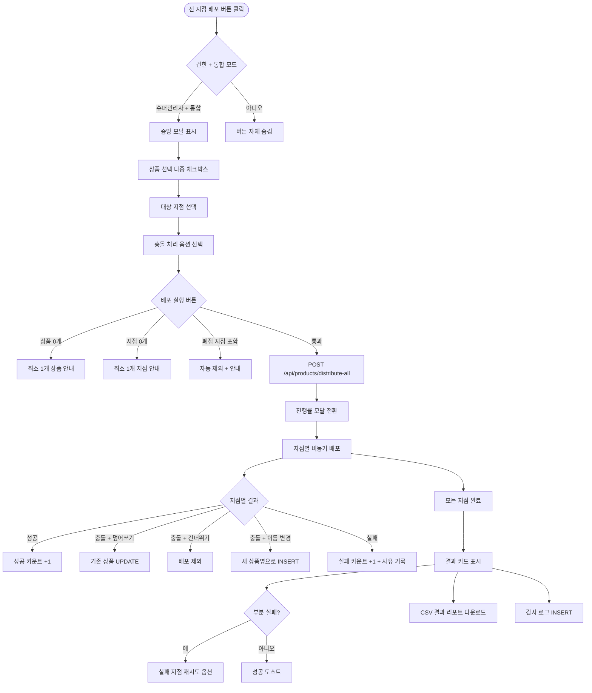

# DLG-P017 전 지점 배포 모달

## 1. 다이얼로그 메타 정보

이 문서는 전 지점 배포 모달에 대한 자기완결형 요구사항 정의서입니다. 다른 문서를 함께 보지 않아도 이 문서 한 장만으로 모달의 모든 입력, 모든 검증, 모든 권한, 모든 예외 처리, 그리고 이 다이얼로그를 지탱하는 운영 정책까지 전부 이해하고 구현할 수 있도록 작성합니다.

| 항목 | 값 |
|---|---|
| 작성일 | 2026-05-22 |
| 버전 | v1.0 |
| 상태 | 최신 통합본 반영 (정합화 완료) |
| 도메인 | D05 상품관리 |
| 다이얼로그 ID | DLG-P017 전지점배포 |
| 다이얼로그명 | 전 지점 배포 모달 |
| 다이얼로그 유형 | 중앙 모달 (Center Modal) + 진행률 표시 |
| 우선순위 | P0 (출시 필수 - 본사 운영) |
| 기능코드 | PRD-01 |
| 계약코드 | PRD-01 |
| 호출 화면 | SCR-P001 상품관리 |
| 호출 트리거 | SCR-P001 헤더의 "전 지점 배포" 버튼 클릭 (슈퍼관리자만) |

## 2. 다이얼로그 개요와 목적

전 지점 배포 모달은 본사 슈퍼관리자가 본사 표준 상품을 모든 지점(예: 200개 매장)에 일괄 복제하는 도구입니다. 본사 더미 지점에서 상품을 정의한 다음 이 모달로 대상 상품과 대상 지점을 선택해 일괄 배포하면, 모든 지점에 동일한 가격·정책으로 상품이 복제되고 지점별 차등 가격은 배포 후 개별 수정으로 처리됩니다.

이 모달은 본사 운영의 핵심 도구이며, 신규 표준 상품 출시, 시즌 라인업 정비, 가격 정책 통합 같은 대규모 운영 변경 시 사용됩니다. 모든 배포 이벤트는 감사 로그(SCR-097)에 `actor·source_branch·target_branches·product_count·result_summary`로 기록되어 사후 추적이 가능하며, 일부 지점에서 배포가 실패한 경우 실패 지점만 재시도하는 기능과 결과 리포트 CSV 다운로드를 제공합니다.

## 3. 호출 트리거와 진입 경로

SCR-P001 상품 관리 화면에서 헤더 우측의 "전 지점 배포" 버튼을 클릭하면 중앙 모달로 열립니다. 이 버튼은 superAdmin와 primary에게만 보이고 다른 권한자에게는 숨겨집니다.

본사 통합 모드에서만 호출 가능하며, 일반 지점 모드에서는 버튼이 비활성화됩니다.

## 4. 레이아웃과 UI 구성

모달은 중앙 정렬된 큰 컨테이너(최대 폭 약 1000px)이며 위에서 아래로 다음 영역들로 구성됩니다.

가장 위에는 모달 헤더가 있고 "전 지점 배포"라는 제목과 우측 닫기(X) 버튼이 표시됩니다.

헤더 아래에는 상품 선택 영역이 있습니다. 다중 선택 가능한 체크박스 목록으로 본사 표준 상품이 표시되며, 검색창과 카테고리 필터(MEMBERSHIP/LESSON_PASS/LOCKER/WEAR/GENERAL)로 좁힐 수 있습니다. 선택된 상품 수가 상단에 "선택된 상품 N개"로 표시됩니다.

상품 선택 아래에는 대상 지점 선택 영역이 있습니다. 본사가 관리하는 모든 지점(예: 200개)이 체크박스 목록으로 표시되며 "전체 선택" 토글, 지역별 그룹 필터(예: 서울·부산·대구·…), 검색창이 제공됩니다. 폐점 지점은 회색 처리되고 선택이 불가능합니다.

지점 선택 아래에는 충돌 처리 옵션이 있습니다. 대상 지점에 동일 상품명 + 동일 대분류 상품이 이미 존재하는 경우의 처리 방식을 선택합니다. 세 가지 옵션이 있습니다.

- **덮어쓰기**: 기존 상품의 가격·정책을 본사 표준으로 덮어씌웁니다.
- **건너뛰기**: 기존 상품이 있는 지점은 배포에서 제외됩니다.
- **이름 자동 변경**: 새 상품명(원본명 + " (본사 배포)")로 별도 등록됩니다.

전체 일괄 또는 지점별 선택이 가능합니다.

가장 아래에는 액션 버튼이 있습니다. 좌측에 "취소" 버튼, 우측에 "배포 실행" 버튼이 배치됩니다.

배포 실행 후에는 모달이 진행률 모달로 전환됩니다. 큰 진행 바와 함께 성공·실패 지점 카운트가 실시간으로 업데이트되며, 모든 지점이 완료되면 결과 카드가 표시됩니다. 결과 카드에는 성공 N개 / 실패 M개와 함께 실패 사유별 분류 + 실패 지점 목록 + 실패 지점만 재시도 버튼 + 결과 리포트 CSV 다운로드 링크가 제공됩니다.

## 5. 입력 검증과 저장 규칙

상품 선택은 최소 1개 이상이어야 하며 0개 선택 시 "최소 1개 상품을 선택해주세요" 안내와 배포 실행 버튼 비활성입니다.

대상 지점 선택은 최소 1개 이상이어야 하며 0개 선택 시 "최소 1개 지점을 선택해주세요" 안내와 배포 실행 버튼 비활성입니다.

충돌 처리 옵션은 기본값이 "건너뛰기"이며 운영자가 명시적으로 선택해야 의미가 있는 일괄 또는 지점별 처리가 적용됩니다.

배포 실행은 비동기 작업으로 처리됩니다. 응답이 작업 ID이고 진행률은 폴링 또는 WebSocket으로 수신되어 진행률 모달에 실시간 반영됩니다.

각 지점별 배포는 별도 트랜잭션으로 실행되어 한 지점 실패가 다른 지점에 영향을 주지 않습니다. 실패 지점은 결과 리포트에 사유별로 분류되어 표시됩니다.

배포 결과는 감사 로그(SCR-097)에 `actor·source_branch·target_branches·product_count·result_summary`로 INSERT 됩니다. 부분 성공도 부분 성공으로 기록됩니다.

## 6. 주요 UX 흐름

1. 슈퍼관리자가 SCR-P001 헤더의 "전 지점 배포" 버튼을 클릭하면 모달이 중앙에 표시됩니다.
2. 상품 선택 영역에서 배포할 상품 1개 이상을 체크박스로 선택합니다.
3. 대상 지점 선택 영역에서 배포할 지점 1개 이상을 선택합니다. 폐점 지점은 자동 제외됩니다.
4. 충돌 처리 옵션을 일괄 또는 지점별로 선택합니다.
5. "배포 실행" 버튼을 클릭합니다.
6. 모달이 진행률 모달로 전환되어 실시간 진행률, 성공·실패 지점 카운트가 표시됩니다.
7. 모든 지점이 완료되면 결과 카드가 표시되어 성공 N / 실패 M, 실패 사유별 분류, 실패 지점 재시도, 결과 리포트 CSV 다운로드가 제공됩니다.
8. "취소" 버튼은 배포 실행 전에만 동작하며 모달을 닫고 아무 변경도 일어나지 않습니다. 배포 진행 중에는 취소가 차단되거나 별도 "진행 중 취소" 옵션이 제공될 수 있습니다.

## 7. 화면 상태와 예외 처리

기본 표시 상태는 상품 0개·지점 0개 선택으로 배포 실행 버튼이 비활성입니다.

입력 중 상태는 상품·지점·충돌 옵션을 선택하는 중이며 모든 선택이 충족되면 배포 실행 버튼이 활성화됩니다.

배포 진행 중 상태는 진행률 모달로 전환된 상태로 실시간 진행률과 성공·실패 카운트가 표시됩니다.

배포 완료 상태는 결과 카드가 표시된 상태로 성공·실패 분류와 재시도·CSV 다운로드 옵션이 제공됩니다.

부분 실패 상태는 일부 지점 배포가 실패한 상태로 실패 지점만 재시도 버튼이 활성화됩니다.

권한 부족 상태에서는 모달 자체가 호출되지 않으며 SCR-P001에서 버튼이 숨겨집니다.

예외 케이스별 처리는 다음과 같습니다. 상품 0개 선택 또는 지점 0개 선택은 인라인 안내 + 배포 실행 비활성입니다. 폐점 지점은 자동 제외 + 안내 메시지가 표시됩니다. 대상 지점에 동일 상품명 + 동일 대분류 존재 시에는 충돌 처리 옵션(덮어쓰기·건너뛰기·이름 자동 변경)에 따라 처리됩니다. 일부 지점 배포 실패 시에는 결과 카드의 실패 지점 목록 + 실패 사유 + 재시도 옵션이 제공됩니다. 전체 배포 실패는 빨강 토스트와 함께 트랜잭션 롤백 안내가 표시되며 재시도가 가능합니다. 배포 진행 중 네트워크 끊김은 자동 재시도 또는 폴링 재개로 처리되며 진행률이 복원됩니다. 권한 없음 + 직접 URL 우회 진입은 백엔드 응답 403으로 차단됩니다.

## 8. 권한별 처리

superAdmin와 primary에게만 SCR-P001의 "전 지점 배포" 버튼이 표시되어 모달 진입이 가능합니다. Owner(지점장)·매니저·일반 직원·FC·트레이너·readonly에게는 버튼 자체가 숨겨지고 직접 URL 우회 진입도 차단됩니다.

본사 통합 모드에서만 호출 가능하며 일반 지점 모드에서는 버튼이 비활성화됩니다. 슈퍼관리자가 일반 지점 모드에 있어도 통합 모드로 전환 후에만 호출이 가능합니다.

모든 권한 차단 이벤트는 감사 로그에 기록됩니다.

## 9. 메인 흐름

## 10. 운영 정책 (이 다이얼로그에 연결된 부분)

전 지점 배포 권한 정책은 superAdmin와 primary만 가능하다는 것입니다. 다른 권한자에게는 버튼이 보이지 않고 우회 접근도 차단됩니다.

본사 통합 모드 필수 정책은 일반 지점 모드에서는 호출 불가능하며 통합 모드 전환 후에만 가능하다는 것입니다.

상품·지점 최소 1개 정책은 0개 선택 시 배포 실행이 비활성화되어 의미 없는 배포가 차단된다는 것입니다.

폐점 지점 자동 제외 정책은 선택 가능하더라도 자동으로 배포 대상에서 제외되어 잘못된 지점에 상품이 배포되지 않도록 합니다.

충돌 처리 옵션 정책은 대상 지점에 동일 상품명 + 동일 대분류 상품이 이미 존재하는 경우 덮어쓰기·건너뛰기·이름 자동 변경의 3종 중 운영자가 선택하도록 합니다. 기본값은 안전한 "건너뛰기"입니다.

일괄 또는 지점별 선택 정책은 충돌 처리 옵션을 모든 지점에 일괄 적용하거나 지점별로 다르게 적용할 수 있도록 합니다.

부분 실패 처리 정책은 한 지점의 실패가 다른 지점에 영향을 주지 않도록 각 지점별 별도 트랜잭션으로 처리한다는 것입니다.

재시도 정책은 실패 지점만 재시도가 가능하여 운영자가 같은 일을 다시 처음부터 하지 않도록 합니다.

결과 리포트 CSV 정책은 성공·실패 지점 + 실패 사유 + 충돌 처리 결과를 CSV로 다운로드 가능하여 사후 추적과 외부 분석이 가능합니다.

비동기 진행률 정책은 배포 작업이 비동기로 처리되어 모달이 닫혀도 백그라운드에서 계속 실행되며, 완료 시 알림 센터(NFR-19)로 결과가 푸시됩니다.

지점별 차등 가격 처리 정책은 본사 표준 가격으로 일괄 배포하고 지점별 차등 가격은 배포 후 개별 수정으로 처리한다는 것입니다.

감사 로그 정책은 모든 배포 이벤트가 `actor·source_branch·target_branches·product_count·result_summary`로 SCR-097에 기록된다는 것입니다. 부분 성공도 부분 성공으로 기록됩니다.

본사 정의 상품 동기화 정책은 배포된 상품은 전 지점 공통 마스터로 등록되어 향후 본사 표준 가격 변경 시 다시 배포 모달로 일괄 갱신이 가능합니다.

이상의 모든 정책은 이 다이얼로그를 구현하고 운영하는 사람이 별도 문서 없이 이 한 장만 보면 이해할 수 있도록 풀어 적었습니다.
