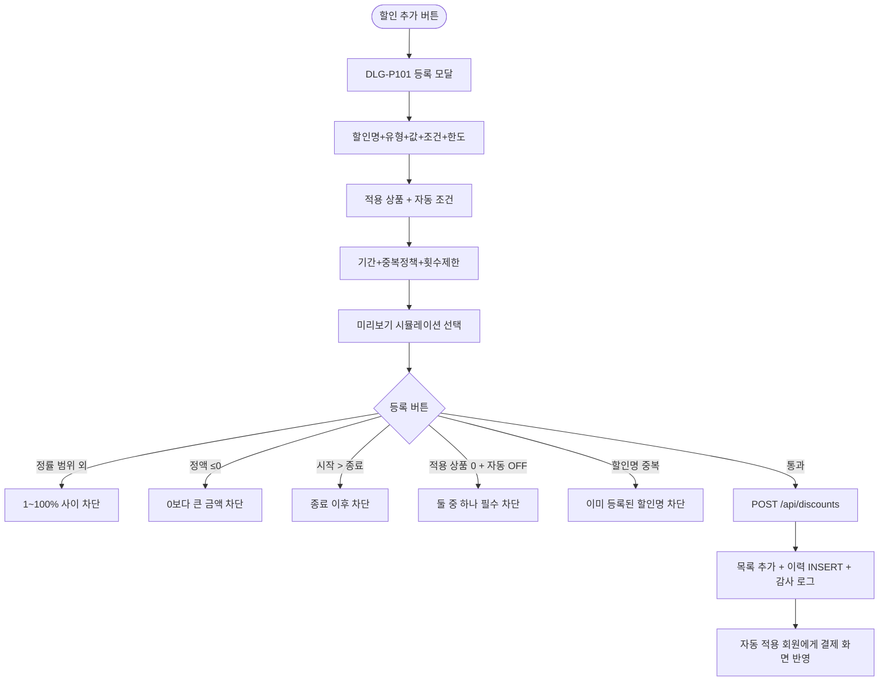

# DLG-P101 할인 규칙 등록 모달

## 1. 다이얼로그 메타 정보

| 항목 | 값 |
|---|---|
| 작성일 | 2026-05-22 |
| 버전 | v1.0 |
| 상태 | 최신 통합본 반영 (정합화 완료) |
| 도메인 | D05 상품관리 |
| 다이얼로그 ID | DLG-P101 할인규칙등록 |
| 다이얼로그명 | 할인 규칙 등록 모달 |
| 다이얼로그 유형 | 중앙 모달 (Form Modal) |
| 우선순위 | P0 (출시 필수) |
| 기능코드 | PRD-04 |
| 계약코드 | PRD-04 |
| 호출 화면 | SCR-P004 할인설정 |
| 호출 트리거 | SCR-P004의 "할인 추가" 버튼 클릭 |

## 2. 다이얼로그 개요와 목적

할인 규칙 등록 모달은 새로운 할인 정책을 등록하는 폼 모달입니다. 정률(%) 또는 정액(원), 최소 계약 기간 조건, 최대 할인 한도, 적용 상품, 자동 적용 조건(회원 등급/세그먼트), 적용 기간, 중복 정책, 적용 횟수 제한을 입력하여 결제 화면(SCR-S003)에서 자동 또는 수동으로 적용될 할인 정책을 만듭니다.

이 모달은 캠페인 운영의 시작점이며, 등록 즉시 변경 이력 타임라인과 감사 로그(SCR-097)에 INSERT 됩니다. 모달 내부에 적용 상품 1개 선택 후 미리보기 시뮬레이션 기능이 포함되어 운영자가 등록 전에 결과를 확인할 수 있습니다.

## 3. 호출 트리거와 진입 경로

SCR-P004 할인 설정 페이지의 "할인 추가" 버튼을 클릭하면 호출됩니다. 권한이 있는 슈퍼관리자·Owner(지점장)·매니저·관리자 권한 보유자에게만 버튼이 보이므로 모달 호출이 가능합니다.

## 4. 레이아웃과 UI 구성

모달은 중앙 정렬된 컨테이너(최대 폭 약 700px)이며 다음 영역들로 구성됩니다.

모달 헤더에는 "할인 규칙 등록"이라는 제목과 닫기(X) 버튼이 표시됩니다.

본문에는 입력 폼이 위에서 아래로 배치됩니다.

| 입력 항목 | 필수 여부 | 설명 |
|------|------|------|
| 할인명 | 필수 | 텍스트 1~30자, 동일 지점 내 중복 불가 |
| 유형 | 필수 | 정률(%) / 정액(원) 라디오 |
| 값 | 필수 | 정률은 1~100, 정액은 0 초과 금액 |
| 조건 (최소 계약) | 선택 | 일 단위 |
| 한도 (최대 할인) | 선택 | 정률만, 원 단위 |
| 적용 상품 | 조건부 | 다중 선택 또는 "전체 상품" 토글 |
| 자동 적용 조건 | 조건부 | 회원 등급 / 세그먼트 (다중) |
| 활성 토글 | 필수 | ON/OFF |
| 적용 기간 | 필수 | 시작일 ~ 종료일 |
| 중복 적용 정책 | 필수 | 시즌 가격 중복 허용 / 단독 / 큰 것만 |
| 적용 횟수 제한 | 필수 | 1회성 / 무제한 |
| 비고 | 선택 | textarea |

자동 적용 조건이 다중 선택일 때(예: VIP + 90일 미방문 세그먼트)는 AND/OR 토글로 조합 정책을 명시합니다.

폼 우측 또는 하단에는 미리보기 영역이 있습니다. 적용 상품 1개 선택 후 미리보기 버튼을 누르면 "100,000원 → 90,000원" 같은 시뮬레이션 결과가 즉시 표시됩니다.

가장 아래에는 "취소" 버튼과 "등록" 버튼이 배치됩니다.

## 5. 입력 검증과 저장 규칙

할인명은 1~30자, 동일 지점 내 중복 검증이 비동기로 실행됩니다. 중복 시 "이미 등록된 할인명입니다" + 저장 차단입니다.

정률 값은 1~100 범위이며 0 이하 또는 100 초과는 "1~100% 사이로 입력해주세요" + 저장 차단입니다.

정액 값은 0 초과이며 0 이하는 "0보다 큰 금액을 입력해주세요" + 저장 차단입니다.

정률 + 한도는 한도가 정률에만 적용 가능하므로 정액 선택 시 한도 필드가 자동 비활성화됩니다.

적용 기간 시작일 > 종료일은 "종료일은 시작일 이후여야 해요" + 저장 차단입니다.

적용 상품 0개 + 자동 적용 OFF는 "적용 상품 또는 자동 적용 조건 중 하나는 필수" + 저장 차단입니다.

저장 시 `POST /api/discounts`가 호출되어 INSERT 되고, 변경 이력 타임라인과 감사 로그(SCR-097)에 자동 INSERT 됩니다.

## 6. 주요 UX 흐름

1. SCR-P004에서 "할인 추가" 버튼 클릭으로 모달 호출
2. 할인명·유형·값·조건·한도 입력
3. 적용 상품 선택 또는 자동 적용 조건 설정
4. 활성 토글, 적용 기간, 중복 정책, 적용 횟수 제한 선택
5. (선택) 미리보기로 시뮬레이션 확인
6. "등록" 클릭 → 검증 후 저장 → 모달 닫힘 + 목록 갱신 + 이력 INSERT
7. "취소" 또는 ESC로 닫기

## 7. 화면 상태와 예외 처리

입력 중 상태는 모든 필수 입력이 채워지지 않은 상태로 등록 버튼이 비활성입니다.

저장 중 상태는 등록 버튼이 로딩 상태로 전환되고 입력이 비활성화됩니다.

저장 실패 상태는 빨강 토스트와 입력값 보존입니다.

예외 케이스별 처리는 정률 0 또는 100 초과, 정액 0 이하, 정액 + 한도 입력(한도 비활성), 시작 > 종료, 적용 상품 0 + 자동 OFF, 할인명 중복, 자동 + 수동 동시 선택(자동만 적용), 할인 후 가격 0 이하 안내, 세그먼트 0명 노랑 경고, 권한 없음 + 직접 URL 진입 차단입니다.

## 8. 권한별 처리

슈퍼관리자·Owner(지점장)·관리자 권한·매니저가 모달 진입과 등록이 가능합니다. 일반 직원과 readonly는 진입 자체가 차단됩니다.

## 9. 메인 흐름

## 10. 운영 정책 (이 다이얼로그에 연결된 부분)

할인명 중복 정책은 동일 지점 내 중복이 차단된다는 것입니다. 1~30자, 한글·영문·숫자·일부 특수문자가 허용됩니다.

정률 검증 정책은 1~100% 범위만 허용입니다.

정액 검증 정책은 0보다 큰 금액만 허용입니다.

한도 정책은 정률 할인에만 적용 가능하며 정액 선택 시 한도 필드가 자동 비활성화됩니다.

적용 상품 정책은 다중 선택 또는 "전체 상품" 토글입니다. "전체 상품"은 카테고리 필터로 좁히기가 가능합니다.

자동 적용 조건 정책은 회원 등급(VIP/Gold/Silver/일반)과 세그먼트(MBR-EXT-04 연계)를 다중 선택할 수 있으며 AND/OR 조합을 명시합니다.

중복 적용 정책은 시즌 가격(PRD-08)과의 결합 방식이 중복 허용·단독·큰 것만의 3종이라는 것입니다.

적용 횟수 제한 정책은 1회성(회원당 1회)과 무제한 중 하나로, 1회성은 회원 ID + 할인 ID로 결제 시점에 중복 차단됩니다.

미리보기 시뮬레이션 정책은 적용 상품 1개 선택 후 즉시 가격 시뮬레이션이 제공된다는 것입니다.

감사 로그 정책은 등록 이벤트가 SCR-097에 `actor_id, discount_id, action='CREATE', after`로 INSERT 된다는 것입니다.

이상의 모든 정책은 이 다이얼로그를 구현하고 운영하는 사람이 별도 문서 없이 이 한 장만 보면 이해할 수 있도록 풀어 적었습니다.
