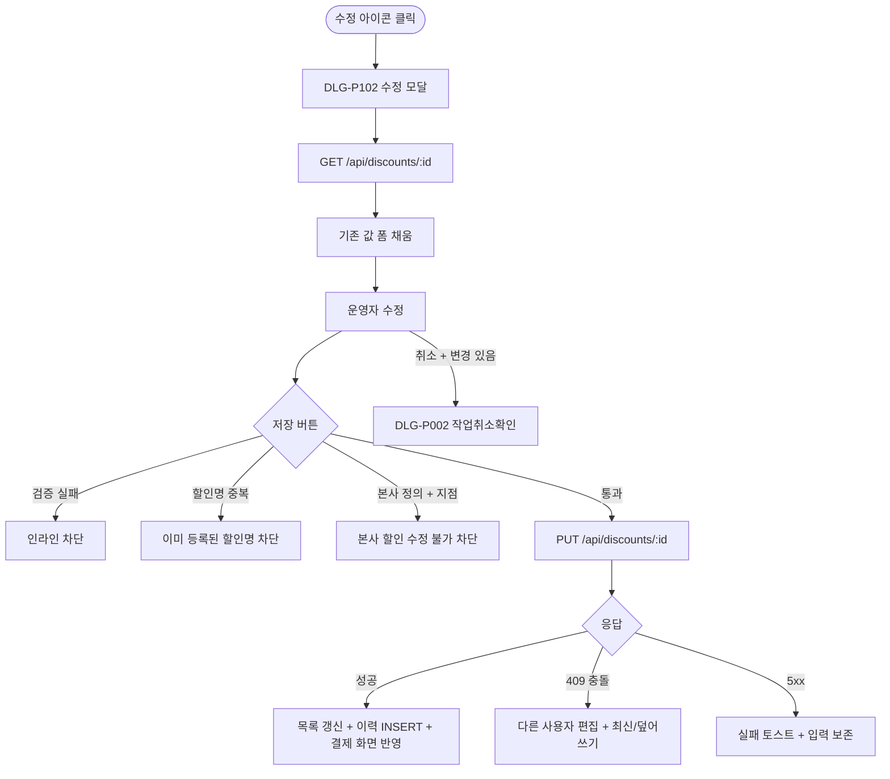

# DLG-P102 할인 규칙 수정 모달

## 1. 다이얼로그 메타 정보

| 항목 | 값 |
|---|---|
| 작성일 | 2026-05-22 |
| 버전 | v1.0 |
| 상태 | 최신 통합본 반영 (정합화 완료) |
| 도메인 | D05 상품관리 |
| 다이얼로그 ID | DLG-P102 할인규칙수정 |
| 다이얼로그명 | 할인 규칙 수정 모달 |
| 다이얼로그 유형 | 중앙 모달 (Form Modal) |
| 우선순위 | P0 (출시 필수) |
| 기능코드 | PRD-04 |
| 계약코드 | PRD-04 |
| 호출 화면 | SCR-P004 할인설정 |
| 호출 트리거 | SCR-P004 목록 행의 수정 아이콘 클릭 |

## 2. 다이얼로그 개요와 목적

할인 규칙 수정 모달은 기존 할인 정책의 정보를 수정하는 폼 모달입니다. DLG-P101 할인규칙등록과 동일한 폼 구조를 가지지만 기존 값이 미리 채워진 상태로 표시되며 저장 시 UPDATE 처리됩니다. 가격 정책 변경, 적용 기간 연장, 자동 적용 조건 추가/제거, 비활성 토글 같은 모든 수정 작업의 단일 진입점입니다.

이 모달은 수정 즉시 결제 화면(SCR-S003)에 반영되어 자동 적용 회원에게 영향을 주며, 변경 이력 타임라인과 감사 로그(SCR-097)에 INSERT 됩니다. 동시 수정 충돌은 낙관적 락(`updated_at` 비교)으로 감지됩니다.

## 3. 호출 트리거와 진입 경로

SCR-P004 할인 설정 페이지의 목록 행 호버 시 나타나는 수정 아이콘을 클릭하면 호출됩니다. 권한이 있는 슈퍼관리자·Owner(지점장)·매니저·관리자 권한 보유자에게만 아이콘이 보이므로 모달 호출이 가능합니다.

본사 정의 할인을 지점에서 수정 시도하면 "본사 정의 할인은 수정 불가" + 차단입니다.

## 4. 레이아웃과 UI 구성

레이아웃은 DLG-P101 할인규칙등록과 동일하지만 헤더가 "할인 규칙 수정"이고 모든 입력이 기존 값으로 채워진 상태입니다. 저장 버튼은 "저장"으로 표시됩니다.

폼 내부 구조는 다음과 같습니다.

| 입력 항목 | 필수 여부 | 설명 |
|------|------|------|
| 할인명 | 필수 | 텍스트 1~30자 |
| 유형 | 필수 | 정률 / 정액 (변경 시 한도 필드 자동 토글) |
| 값 | 필수 | 검증 동일 |
| 조건 (최소 계약) | 선택 | 일 단위 |
| 한도 (최대 할인) | 선택 | 정률만 |
| 적용 상품 | 조건부 | 다중 선택 또는 전체 |
| 자동 적용 조건 | 조건부 | 등급 / 세그먼트 (다중) |
| 활성 토글 | 필수 | ON/OFF |
| 적용 기간 | 필수 | 시작일 ~ 종료일 |
| 중복 정책 | 필수 | 시즌 가격과의 결합 정책 |
| 적용 횟수 제한 | 필수 | 1회성 / 무제한 |
| 비고 | 선택 | textarea |

수정 모드에서는 dirty 감지가 자동으로 일어나며 변경 사항이 있는 입력은 시각적으로 강조될 수 있습니다.

## 5. 입력 검증과 저장 규칙

검증 규칙은 DLG-P101 할인규칙등록과 동일합니다. 정률 1~100, 정액 0 초과, 시작일 < 종료일, 적용 상품 0 + 자동 OFF 차단, 할인명 중복 차단입니다.

저장 시 `PUT /api/discounts/:id`가 호출되어 UPDATE 처리되고 변경 이력 타임라인과 감사 로그에 INSERT 됩니다.

동시 수정 충돌은 낙관적 락(`updated_at` 비교)으로 감지되며 "다른 사용자가 먼저 저장했어요" + 최신 정보 보기/덮어쓰기 선택지가 제공됩니다.

적용 횟수 제한이 1회성에서 무제한으로 변경되면 이미 적용 완료된 회원의 사용 카운트는 그대로 유지되고, 무제한에서 1회성으로 변경되면 이미 사용한 회원은 재사용 차단됩니다.

활성 토글 변경 시 결제 화면에 즉시 반영되어 자동 적용 회원에게 영향을 줍니다.

## 6. 주요 UX 흐름

1. SCR-P004 목록 행에서 수정 아이콘 클릭
2. DLG-P102 모달 호출 + 기존 값 채워진 폼 표시
3. 운영자가 필요한 항목 수정
4. (선택) 미리보기로 시뮬레이션 확인
5. "저장" 클릭 → 검증 → PUT 호출 → 모달 닫힘 + 목록 갱신 + 이력 INSERT
6. 동시 수정 충돌 시 최신 정보 보기 또는 덮어쓰기 선택
7. "취소" 또는 ESC로 닫기 (변경 사항 있으면 DLG-P002 작업취소확인)

## 7. 화면 상태와 예외 처리

수정 모드 상태는 기존 정보가 채워진 폼으로 dirty 감지가 활성화된 상태입니다.

저장 중 상태는 저장 버튼이 로딩 상태로 전환됩니다.

동시 수정 충돌 상태는 다른 사용자가 먼저 저장한 경우로 "다른 사용자 편집" 안내가 표시됩니다.

본사 정의 할인 수정 시도는 "본사 정의 할인은 수정 불가" + 차단입니다.

예외 케이스별 처리는 DLG-P101와 유사하며 추가로 수정 모드 특유의 예외가 있습니다. 동시 수정 충돌(409)은 "다른 사용자 편집" + 최신 정보 보기/덮어쓰기 선택지가 제공됩니다. 본사 정의 할인 + 지점 수정 시도는 차단되며, 적용 횟수 제한 변경은 이미 적용 완료된 회원에게 영향이 있을 수 있어 안내가 추가로 표시됩니다.

## 8. 권한별 처리

슈퍼관리자·Owner(지점장)·관리자 권한·매니저가 모달 진입과 수정이 가능합니다. 일반 직원은 수정 아이콘이 보이지 않아 모달 진입 자체가 차단됩니다.

본사 정의 할인은 본사 슈퍼관리자만 수정 가능하며 지점에서는 차단됩니다.

## 9. 메인 흐름

## 10. 운영 정책 (이 다이얼로그에 연결된 부분)

수정 즉시 반영 정책은 활성 토글·가격·기간 변경이 결제 화면에 즉시 반영되어 자동 적용 회원에게 영향을 준다는 것입니다.

동시 수정 충돌 정책은 낙관적 락으로 감지되며 운영자가 최신 정보 보기 또는 덮어쓰기를 선택할 수 있습니다.

본사 정의 할인 수정 차단 정책은 본사 슈퍼관리자가 정의한 할인은 지점에서 수정할 수 없으며 본사에서만 수정 가능하다는 것입니다.

적용 횟수 제한 변경 영향 정책은 1회성에서 무제한으로 변경 시 이미 적용된 회원의 사용 카운트가 유지되고, 무제한에서 1회성으로 변경 시 이미 사용한 회원은 재사용이 차단된다는 것입니다.

감사 로그 정책은 수정 이벤트가 SCR-097에 `actor_id, discount_id, action='UPDATE', before, after`로 INSERT 된다는 것입니다.

권한 정책은 슈퍼관리자·Owner(지점장)·관리자 권한·매니저가 모달 진입과 수정이 가능합니다.

이상의 모든 정책은 이 다이얼로그를 구현하고 운영하는 사람이 별도 문서 없이 이 한 장만 보면 이해할 수 있도록 풀어 적었습니다.
