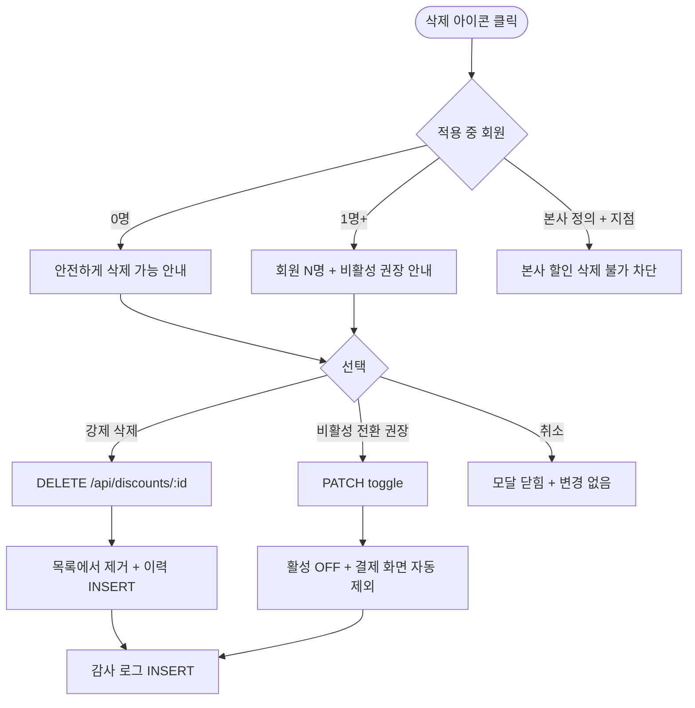

# DLG-P103 할인 규칙 삭제 확인 모달

## 1. 다이얼로그 메타 정보

| 항목 | 값 |
|---|---|
| 작성일 | 2026-05-22 |
| 버전 | v1.0 |
| 상태 | 최신 통합본 반영 (정합화 완료) |
| 도메인 | D05 상품관리 |
| 다이얼로그 ID | DLG-P103 할인규칙삭제확인 |
| 다이얼로그명 | 할인 규칙 삭제 확인 |
| 다이얼로그 유형 | 중앙 알림 모달 (Danger Confirmation) |
| 우선순위 | P0 (출시 필수) |
| 기능코드 | PRD-04 |
| 계약코드 | PRD-04 |
| 호출 화면 | SCR-P004 할인설정 |
| 호출 트리거 | SCR-P004 목록 행의 삭제 아이콘 클릭 |

## 2. 다이얼로그 개요와 목적

할인 규칙 삭제 확인 모달은 등록된 할인 정책을 삭제하기 전에 최종 확인을 받는 안전 모달입니다. 현재 적용 중인 회원이 있는 할인은 삭제 대신 비활성 전환이 권장되며, 강제 삭제 시에도 이미 적용 완료된 결제는 영향 없이 가격이 유지됩니다.

이 모달은 캠페인 정리 시점에 사용되며 적용 중 회원이 있는지에 따라 분기 처리됩니다. 본사 정의 할인의 지점 삭제 시도는 차단됩니다.

## 3. 호출 트리거와 진입 경로

SCR-P004 할인 설정 페이지의 목록 행 호버 시 나타나는 삭제 아이콘을 클릭하면 호출됩니다. 권한이 있는 슈퍼관리자·센터장·관리자 권한 보유자에게만 아이콘이 보이므로 모달 호출이 가능합니다. 매니저는 삭제 권한이 없어 아이콘 자체가 숨겨집니다.

## 4. 레이아웃과 UI 구성

모달은 화면 중앙의 작은 크기로 표시되며 다음 영역들로 구성됩니다.

모달 상단에는 "할인 규칙을 삭제하시겠어요?" 빨강 톤 제목과 위험 아이콘이 표시됩니다.

본문에는 대상 할인명과 함께 분기 안내가 표시됩니다. 적용 중 회원 수에 따라 두 가지 분기가 있습니다.

적용 중 회원 0명 분기: "이 할인은 적용 중인 회원이 없어 안전하게 삭제할 수 있습니다."

적용 중 회원 1명 이상 분기: "현재 적용 중인 회원 {인원수}명이 있습니다. 강제 삭제 시 이미 적용된 결제는 가격이 그대로 유지됩니다. 비활성 전환을 권장합니다."

하단에는 좌측 "취소" 버튼, 우측에 "비활성 전환" 또는 "강제 삭제" 버튼이 배치됩니다. 적용 중 회원이 있는 경우 "비활성 전환"이 기본 강조되고 "강제 삭제"가 보조 옵션으로 표시됩니다.

## 5. 입력 검증과 저장 규칙

이 모달은 추가 입력이 없는 단순 확인 모달입니다.

"강제 삭제" 클릭 시 `DELETE /api/discounts/:id`가 호출되어 할인 정책이 시스템에서 제거됩니다. 이미 적용 완료된 결제는 가격이 유지됩니다.

"비활성 전환" 클릭 시 `PATCH /api/discounts/:id/toggle`로 활성 토글이 OFF로 변경되어 결제 화면에서 자동 제외됩니다.

성공 시 부모 SCR-P004 목록에서 해당 행이 제거 또는 회색 처리되고 변경 이력 타임라인과 감사 로그(SCR-097)에 INSERT 됩니다.

## 6. 주요 UX 흐름

1. SCR-P004 목록 행에서 삭제 아이콘 클릭
2. 시스템이 적용 중 회원 수 확인
3. 분기 안내가 포함된 모달 호출
4. 적용 중 회원 0명 → "강제 삭제" 선택 가능
5. 적용 중 회원 1명 이상 → "비활성 전환" 권장 + "강제 삭제" 보조 옵션
6. 선택 후 API 호출 → 부모 목록 갱신 + 이력 INSERT
7. "취소" 선택 → 모달 닫힘 + 변경 없음

## 7. 화면 상태와 예외 처리

기본 표시 상태에서는 적용 중 회원 수 분기 안내가 표시됩니다.

진행 중 상태에서는 액션 버튼이 로딩 스피너로 전환됩니다.

본사 정의 할인 삭제 시도는 "본사 정의 할인은 지점에서 삭제 불가" + 차단입니다.

실패 상태는 빨강 토스트와 함께 재시도 안내가 표시됩니다.

예외 케이스별 처리는 다음과 같습니다. 1회성 적용 회원이 이미 사용한 할인 삭제는 가능하지만 이미 사용한 매핑은 유지됩니다. 본사 정의 할인 + 지점 삭제 시도는 차단됩니다. 동시 삭제 충돌은 낙관적 락으로 처리됩니다.

## 8. 권한별 처리

슈퍼관리자·센터장·관리자 권한 보유자가 모달 진입과 삭제가 가능합니다. 매니저는 삭제 권한이 없어 아이콘 자체가 숨겨집니다. 본사 정의 할인은 본사 슈퍼관리자만 삭제 가능합니다.

## 9. 메인 흐름

## 10. 운영 정책 (이 다이얼로그에 연결된 부분)

적용 중 회원 보호 정책은 적용 중 회원이 있는 할인은 비활성 전환이 권장되고 강제 삭제 시에도 이미 적용된 결제는 영향 없이 가격이 유지된다는 것입니다.

본사 정의 할인 삭제 차단 정책은 본사 슈퍼관리자가 정의한 할인은 지점에서 삭제할 수 없으며 본사에서만 삭제 가능하다는 것입니다.

비활성 vs 삭제 정책은 적용 중 회원이 있는 할인은 삭제 대신 비활성을 권장하여 운영 안정성을 유지한다는 것입니다.

권한 정책은 슈퍼관리자·센터장·관리자 권한 보유자만 모달 진입과 삭제가 가능하다는 것입니다.

감사 로그 정책은 삭제 또는 비활성 전환 이벤트가 SCR-097에 `actor_id, discount_id, action='DELETE' 또는 'DEACTIVATE', before`로 INSERT 된다는 것입니다.

이상의 모든 정책은 이 다이얼로그를 구현하고 운영하는 사람이 별도 문서 없이 이 한 장만 보면 이해할 수 있도록 풀어 적었습니다.
